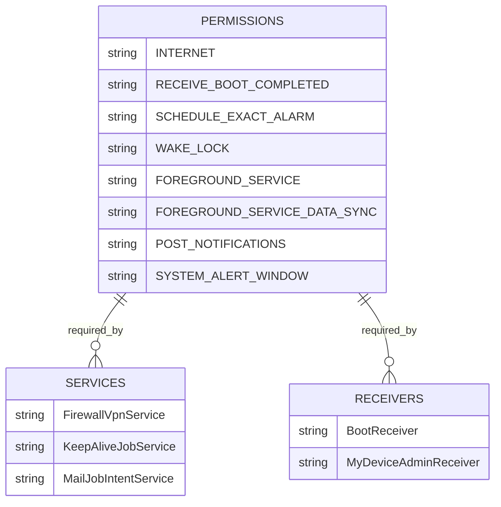
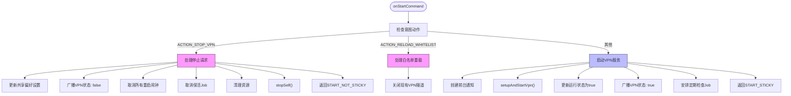
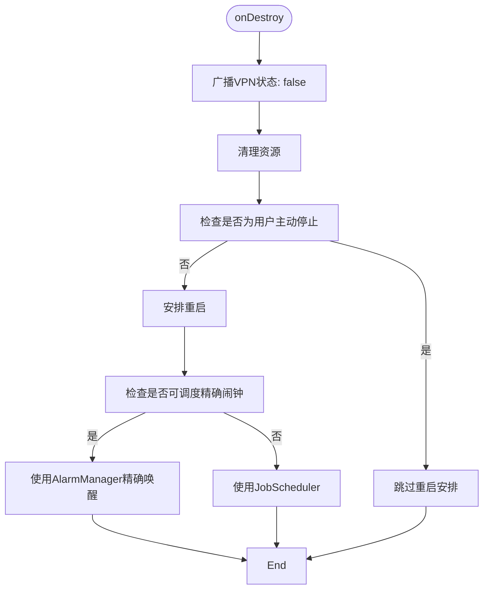
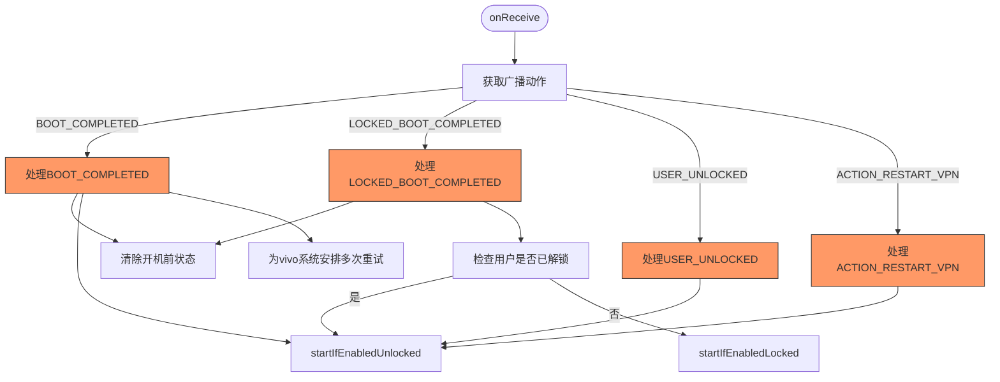
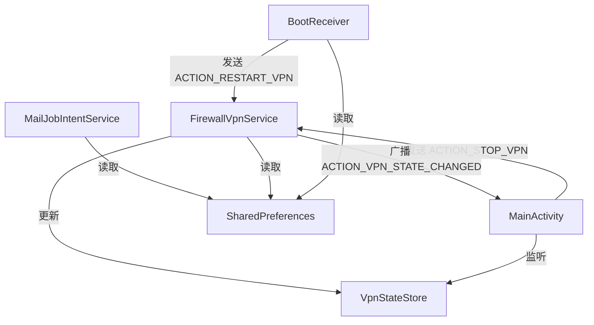

# API参考

<cite>
**Referenced Files in This Document**   
- [FirewallVpnService.kt](file://app/src/main/java/com/example/phonenet/FirewallVpnService.kt)
- [BootReceiver.kt](file://app/src/main/java/com/example/phonenet/BootReceiver.kt)
- [MailJobIntentService.kt](file://app/src/main/java/com/example/phonenet/mail/MailJobIntentService.kt)
- [AndroidManifest.xml](file://app/src/main/AndroidManifest.xml)
- [VpnStateStore.kt](file://app/src/main/java/com/example/phonenet/VpnStateStore.kt)
</cite>

## 目录
1. [简介](#简介)
2. [核心组件](#核心组件)
3. [应用级API声明](#应用级api声明)
4. [详细组件分析](#详细组件分析)
5. [依赖分析](#依赖分析)

## 简介
本文档为stopnet应用的API参考文档，旨在详细说明应用的核心服务、广播接收器、后台任务及AndroidManifest.xml中的声明。文档覆盖了`FirewallVpnService`、`BootReceiver`和`MailJobIntentService`等关键组件的公开API、生命周期逻辑和使用方法，为开发者提供全面的技术参考。

## 核心组件
stopnet应用的核心功能由三个主要组件构成：`FirewallVpnService`负责网络流量过滤和VPN管理，`BootReceiver`处理系统启动和用户解锁事件以确保服务自启，`MailJobIntentService`则用于异步发送状态邮件。这些组件通过广播和共享偏好设置协同工作，形成一个完整的网络管控系统。

**Section sources**
- [FirewallVpnService.kt](file://app/src/main/java/com/example/phonenet/FirewallVpnService.kt)
- [BootReceiver.kt](file://app/src/main/java/com/example/phonenet/BootReceiver.kt)
- [MailJobIntentService.kt](file://app/src/main/java/com/example/phonenet/mail/MailJobIntentService.kt)

## 应用级API声明
`AndroidManifest.xml`文件声明了应用所需的权限、服务和广播接收器，是应用级API的重要组成部分。

**Diagram sources**
- [AndroidManifest.xml](file://app/src/main/AndroidManifest.xml)

**Section sources**
- [AndroidManifest.xml](file://app/src/main/AndroidManifest.xml)

## 详细组件分析

### FirewallVpnService分析
`FirewallVpnService`是应用的核心服务，继承自`VpnService`，负责建立和管理VPN连接，实现应用级防火墙功能。

#### 公开常量与广播意图
`FirewallVpnService`定义了三个公开的广播动作常量，用于服务状态通信：

- **ACTION_VPN_STATE_CHANGED**: 用于广播VPN服务状态变化。广播意图包含`EXTRA_VPN_STATE`布尔值，表示当前VPN是否正在运行。
- **ACTION_STOP_VPN**: 用于显式停止VPN服务。当服务接收到此意图时，会立即清理资源并终止自身。
- **ACTION_RELOAD_WHITELIST**: 用于重载白名单配置。服务会关闭现有VPN隧道并根据新的白名单规则重建。

这些常量允许应用的其他组件（如UI）通过发送或接收广播来控制和监听VPN状态。

**Section sources**
- [FirewallVpnService.kt](file://app/src/main/java/com/example/phonenet/FirewallVpnService.kt#L18-L22)

#### 生命周期方法分析
`FirewallVpnService`的生命周期方法实现了复杂的服务控制逻辑。

##### onStartCommand方法
`onStartCommand`方法是服务启动的入口点，其内部逻辑如下：
1. **处理停止请求**：如果收到`ACTION_STOP_VPN`意图，服务会更新共享偏好设置中的状态，广播`ACTION_VPN_STATE_CHANGED`（状态为false），取消所有已安排的重启闹钟和保活Job，清理资源并调用`stopSelf()`终止服务。
2. **处理白名单重载**：如果收到`ACTION_RELOAD_WHITELIST`意图，服务会关闭现有VPN隧道，为后续重建做准备。
3. **启动VPN服务**：服务会创建前台通知，调用`setupAndStartVpn()`建立新的VPN连接，更新运行状态，并安排定期检查的Job以保证服务持续运行。

该方法返回`START_STICKY`，确保在内存不足服务被杀死后，系统会尝试重新创建服务。

**Diagram sources**
- [FirewallVpnService.kt](file://app/src/main/java/com/example/phonenet/FirewallVpnService.kt#L28-L127)

**Section sources**
- [FirewallVpnService.kt](file://app/src/main/java/com/example/phonenet/FirewallVpnService.kt#L28-L127)

##### onDestroy方法
`onDestroy`方法在服务被销毁前调用，其主要逻辑是：
1. 广播`ACTION_VPN_STATE_CHANGED`（状态为false），通知UI更新。
2. 清理工作线程和VPN接口资源。
3. 根据服务停止的原因决定是否安排重启：
   - 如果是用户主动停止（通过`ACTION_STOP_VPN`），则不安排重启。
   - 如果是意外终止（如系统杀死），则通过`AlarmManager`或`JobScheduler`安排重启，确保服务的持续性。

**Diagram sources**
- [FirewallVpnService.kt](file://app/src/main/java/com/example/phonenet/FirewallVpnService.kt#L129-L184)

**Section sources**
- [FirewallVpnService.kt](file://app/src/main/java/com/example/phonenet/FirewallVpnService.kt#L129-L184)

### BootReceiver分析
`BootReceiver`是一个广播接收器，负责监听系统启动和用户解锁事件，确保`FirewallVpnService`能够在设备启动后自动运行。

#### 监听的广播动作
`BootReceiver`通过`intent-filter`监听以下广播动作：
- **BOOT_COMPLETED**: 设备完成启动时触发。
- **LOCKED_BOOT_COMPLETED**: 设备在锁定状态下完成启动时触发（适用于加密设备）。
- **USER_UNLOCKED**: 用户解锁设备时触发。
- **ACTION_RESTART_VPN**: 自定义的重启VPN请求，用于服务保活。

#### 触发条件与逻辑
- **BOOT_COMPLETED**: 收到此广播后，`BootReceiver`会清除之前的运行状态标记，调用`startIfEnabledUnlocked`尝试启动服务，并为vivo等特殊系统安排多次重试。
- **LOCKED_BOOT_COMPLETED**: 在设备锁定启动时，如果用户已解锁，则调用`startIfEnabledUnlocked`；否则调用`startIfEnabledLocked`，尝试在锁定状态下启动服务。
- **USER_UNLOCKED**: 用户解锁设备后，立即调用`startIfEnabledUnlocked`启动服务。
- **ACTION_RESTART_VPN**: 接收到此自定义广播时，直接调用`startIfEnabledUnlocked`尝试重启服务。

**Diagram sources**
- [BootReceiver.kt](file://app/src/main/java/com/example/phonenet/BootReceiver.kt#L14-L50)

**Section sources**
- [BootReceiver.kt](file://app/src/main/java/com/example/phonenet/BootReceiver.kt#L14-L50)

### MailJobIntentService分析
`MailJobIntentService`是一个`JobIntentService`，用于在后台异步发送邮件，通常用于发送应用状态报告。

#### 邮件发送流程
该服务通过`onHandleWork`方法接收包含邮件配置的`Intent`，并执行发送逻辑：
1. **读取SMTP配置**：从共享偏好设置中读取SMTP服务器地址、端口、用户名、密码等配置。它会同时检查普通存储和设备保护存储，确保在设备锁定时也能获取配置。
2. **解析Intent参数**：从传入的`Intent`中获取收件人地址、邮件主题和正文。
3. **发送邮件**：使用`javax.mail`库构建邮件并发送。支持SSL和STARTTLS加密。

服务通过`enqueue`静态方法提供了一个便捷的接口，外部组件可以调用此方法来安排邮件发送任务。

**Section sources**
- [MailJobIntentService.kt](file://app/src/main/java/com/example/phonenet/mail/MailJobIntentService.kt#L28-L91)

## 依赖分析
各组件之间通过广播、共享偏好设置和直接调用进行通信，形成了一个松耦合但功能完整的系统。

**Diagram sources**
- [FirewallVpnService.kt](file://app/src/main/java/com/example/phonenet/FirewallVpnService.kt)
- [BootReceiver.kt](file://app/src/main/java/com/example/phonenet/BootReceiver.kt)
- [MailJobIntentService.kt](file://app/src/main/java/com/example/phonenet/mail/MailJobIntentService.kt)
- [VpnStateStore.kt](file://app/src/main/java/com/example/phonenet/VpnStateStore.kt)

**Section sources**
- [FirewallVpnService.kt](file://app/src/main/java/com/example/phonenet/FirewallVpnService.kt)
- [BootReceiver.kt](file://app/src/main/java/com/example/phonenet/BootReceiver.kt)
- [MailJobIntentService.kt](file://app/src/main/java/com/example/phonenet/mail/MailJobIntentService.kt)
- [VpnStateStore.kt](file://app/src/main/java/com/example/phonenet/VpnStateStore.kt)