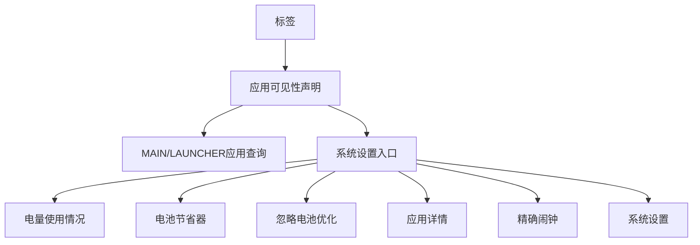
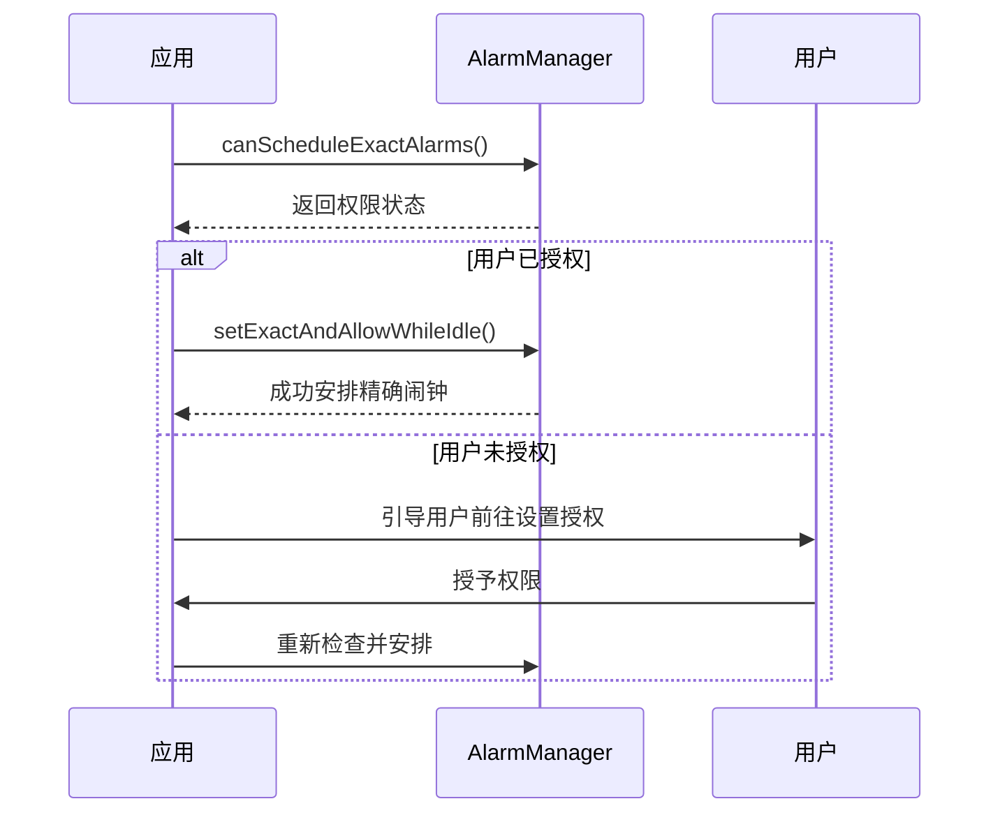
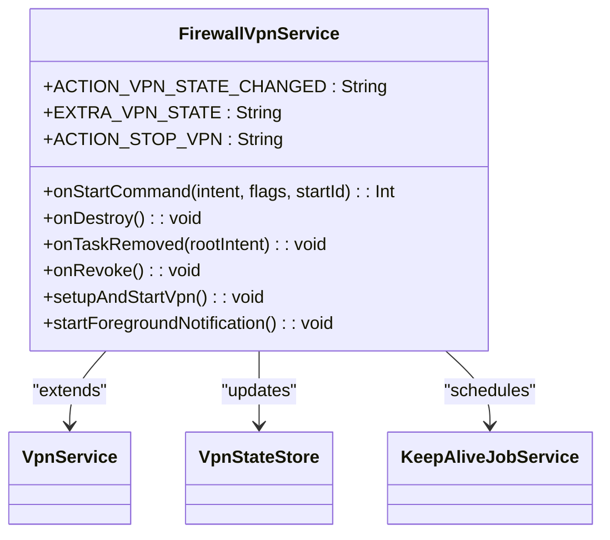
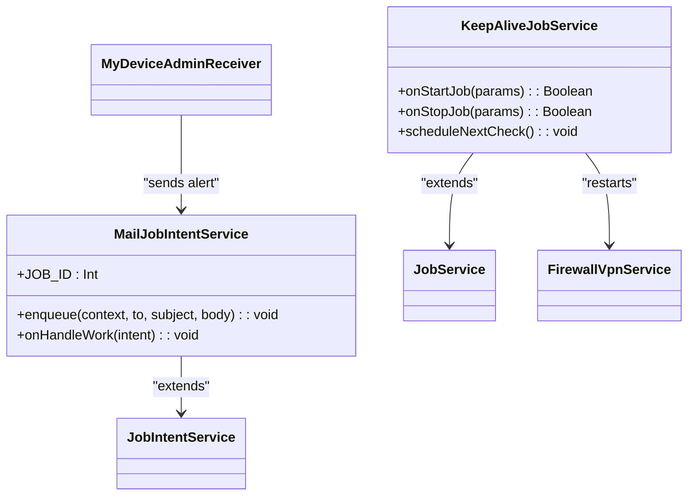
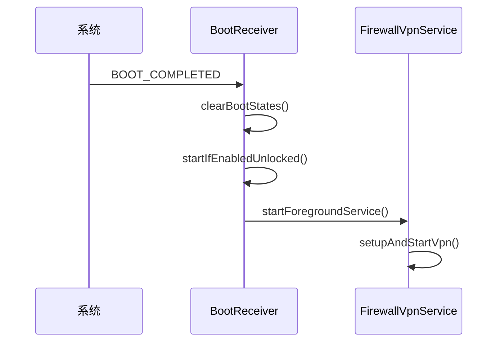

# AndroidManifest 声明式API

<cite>
**Referenced Files in This Document**   
- [AndroidManifest.xml](file://app/src/main/AndroidManifest.xml)
- [FirewallVpnService.kt](file://app/src/main/java/com/example/phonenet/FirewallVpnService.kt)
- [BootReceiver.kt](file://app/src/main/java/com/example/phonenet/BootReceiver.kt)
- [KeepAliveJobService.kt](file://app/src/main/java/com/example/phonenet/KeepAliveJobService.kt)
- [MailJobIntentService.kt](file://app/src/main/java/com/example/phonenet/mail/MailJobIntentService.kt)
- [MyDeviceAdminReceiver.kt](file://app/src/main/java/com/example/phonenet/admin/MyDeviceAdminReceiver.kt)
</cite>

## 目录
1. [应用组件与权限声明](#应用组件与权限声明)
2. [queries标签与应用可见性](#queries标签与应用可见性)
3. 关键权限说明
   - [FOREGROUND_SERVICE权限](#foreground_service权限)
   - [SCHEDULE_EXACT_ALARM权限](#schedule_exact_alarm权限)
4. 核心服务组件
   - [FirewallVpnService声明](#firewallvpnservice声明)
   - [KeepAliveJobService与MailJobIntentService](#keepalivejobservice与mailjobintentservice)
5. 广播接收器
   - [BootReceiver配置](#bootreceiver配置)
   - [MyDeviceAdminReceiver说明](#mydeviceadminreceiver说明)
6. 组件安全性与exported属性](#组件安全性与exported属性)
7. 未来扩展建议](#未来扩展建议)

## 应用组件与权限声明

本应用通过`AndroidManifest.xml`文件声明了多个核心组件与系统权限，构建了一个完整的网络管控与设备管理解决方案。文档详细说明了各组件的配置、权限需求及相互关系。

**Section sources**
- [AndroidManifest.xml](file://app/src/main/AndroidManifest.xml#L1-L112)

## queries标签与应用可见性

应用通过`<queries>`标签替代了`QUERY_ALL_PACKAGES`权限，实现了更精细化的应用可见性控制。该标签声明了以下两类系统意图：

1. **MAIN/LAUNCHER应用查询**：通过声明`android.intent.action.MAIN`和`android.intent.category.LAUNCHER`，应用可以发现设备上所有具有启动入口的应用，用于构建白名单或显示列表。
2. **系统设置入口可见性**：声明了多个系统设置相关的隐式意图，包括：
   - `POWER_USAGE_SUMMARY`：电量使用情况
   - `BATTERY_SAVER_SETTINGS`：电池节省器设置
   - `IGNORE_BATTERY_OPTIMIZATION_SETTINGS`：忽略电池优化设置
   - `APPLICATION_DETAILS_SETTINGS`：应用详情设置
   - `REQUEST_SCHEDULE_EXACT_ALARM`：精确闹钟请求
   - `SETTINGS`：系统设置主界面

这种声明式方法避免了过度权限请求，符合Android 11+的隐私保护要求。

**Diagram sources**
- [AndroidManifest.xml](file://app/src/main/AndroidManifest.xml#L4-L20)

**Section sources**
- [AndroidManifest.xml](file://app/src/main/AndroidManifest.xml#L4-L20)

## 关键权限说明

### FOREGROUND_SERVICE权限

`FOREGROUND_SERVICE`权限允许应用在前台运行服务，确保关键功能不被系统轻易终止。本应用的`FirewallVpnService`使用此权限，配合`startForeground()`方法显示持续通知，向用户表明服务正在运行。从Android 9开始，前台服务需要明确声明权限，以防止后台滥用。

**Section sources**
- [AndroidManifest.xml](file://app/src/main/AndroidManifest.xml#L23)

### SCHEDULE_EXACT_ALARM权限

`SCHEDULE_EXACT_ALARM`权限允许应用安排精确时间的闹钟，对于需要定时执行的任务至关重要。从Android 12开始，此权限需要用户明确授予，应用需通过`AlarmManager.canScheduleExactAlarms()`检查权限状态。本应用使用此权限在服务停止后安排精确的重启尝试，确保网络管控的持续性。

**Diagram sources**
- [AndroidManifest.xml](file://app/src/main/AndroidManifest.xml#L29)
- [FirewallVpnService.kt](file://app/src/main/java/com/example/phonenet/FirewallVpnService.kt#L280-L300)

**Section sources**
- [AndroidManifest.xml](file://app/src/main/AndroidManifest.xml#L29)
- [FirewallVpnService.kt](file://app/src/main/java/com/example/phonenet/FirewallVpnService.kt#L270-L320)

## 核心服务组件

### FirewallVpnService声明

`FirewallVpnService`是应用的核心网络管控服务，其声明包含以下关键特性：

- **BIND_VPN_SERVICE权限**：确保只有系统可以绑定此服务，防止恶意应用滥用VPN功能。
- **foregroundServiceType=dataSync**：指定前台服务类型为数据同步，适配Android 10+的后台限制。
- **intent-filter配置**：监听`android.net.VpnService`动作，与系统VPN框架集成。
- **exported=false**：服务不对外暴露，仅限应用内部使用。

服务实现中，通过`Builder`创建VPN接口，将白名单外的应用流量重定向，实现网络防火墙功能。

**Diagram sources**
- [AndroidManifest.xml](file://app/src/main/AndroidManifest.xml#L50-L58)
- [FirewallVpnService.kt](file://app/src/main/java/com/example/phonenet/FirewallVpnService.kt#L15-L392)

**Section sources**
- [AndroidManifest.xml](file://app/src/main/AndroidManifest.xml#L50-L58)
- [FirewallVpnService.kt](file://app/src/main/java/com/example/phonenet/FirewallVpnService.kt#L15-L392)

### KeepAliveJobService与MailJobIntentService

应用声明了两个辅助服务：

- **KeepAliveJobService**：使用`BIND_JOB_SERVICE`权限，通过`JobScheduler`定期检查并重启`FirewallVpnService`，确保服务持续运行。服务配置为持久化且设备重启后仍有效。
- **MailJobIntentService**：用于异步发送邮件通知，如设备管理权限变更提醒。服务通过`enqueue()`方法接收邮件参数，实现非阻塞的邮件发送功能。

两个服务均设置`exported=false`，确保安全性。

**Diagram sources**
- [AndroidManifest.xml](file://app/src/main/AndroidManifest.xml#L90-L98)
- [KeepAliveJobService.kt](file://app/src/main/java/com/example/phonenet/KeepAliveJobService.kt#L10-L70)
- [MailJobIntentService.kt](file://app/src/main/java/com/example/phonenet/mail/MailJobIntentService.kt#L14-L92)

**Section sources**
- [AndroidManifest.xml](file://app/src/main/AndroidManifest.xml#L90-L98)
- [KeepAliveJobService.kt](file://app/src/main/java/com/example/phonenet/KeepAliveJobService.kt#L10-L70)
- [MailJobIntentService.kt](file://app/src/main/java/com/example/phonenet/mail/MailJobIntentService.kt#L14-L92)

## 广播接收器

### BootReceiver配置

`BootReceiver`广播接收器配置了`directBootAware=true`特性，使其能够在设备直接启动模式下运行。接收器监听多个启动相关动作：

- `BOOT_COMPLETED`：设备启动完成
- `LOCKED_BOOT_COMPLETED`：锁定状态下启动完成
- `USER_UNLOCKED`：用户解锁
- `MY_PACKAGE_REPLACED`：应用更新
- `QUICKBOOT_POWERON`：厂商定制的快速启动
- `com.htc.intent.action.QUICKBOOT_POWERON`：HTC设备专用启动

高优先级的`intent-filter`确保接收器在其他应用之前处理启动事件，及时恢复网络管控服务。

**Diagram sources**
- [AndroidManifest.xml](file://app/src/main/AndroidManifest.xml#L73-L88)
- [BootReceiver.kt](file://app/src/main/java/com/example/phonenet/BootReceiver.kt#L9-L228)

**Section sources**
- [AndroidManifest.xml](file://app/src/main/AndroidManifest.xml#L73-L88)
- [BootReceiver.kt](file://app/src/main/java/com/example/phonenet/BootReceiver.kt#L9-L228)

### MyDeviceAdminReceiver说明

`MyDeviceAdminReceiver`是设备管理员接收器，继承自`DeviceAdminReceiver`。其配置包含：

- **meta-data配置**：引用`@xml/device_admin_receiver`资源文件，定义设备管理策略。
- **启用意图过滤**：监听`DEVICE_ADMIN_ENABLED`动作，接收设备管理权限启用事件。
- **onDisableRequested回调**：当用户尝试停用设备管理时，发送邮件提醒家长，并返回自定义提示信息。

接收器设置`exported=true`，允许系统调用，但通过权限控制确保安全性。

**Section sources**
- [AndroidManifest.xml](file://app/src/main/AndroidManifest.xml#L60-L69)
- [MyDeviceAdminReceiver.kt](file://app/src/main/java/com/example/phonenet/admin/MyDeviceAdminReceiver.kt#L8-L32)

## 组件安全性与exported属性

`AndroidManifest.xml`中的`exported`属性是组件安全的关键。本应用遵循最小暴露原则：

- **exported=true**：仅用于需要外部调用的组件，如主`MainActivity`和`BootReceiver`。
- **exported=false**：用于内部服务和接收器，如`FirewallVpnService`和`KeepAliveJobService`，防止外部应用调用。

这种配置平衡了功能需求与安全要求，避免了不必要的组件暴露。

**Section sources**
- [AndroidManifest.xml](file://app/src/main/AndroidManifest.xml#L35-L98)

## 未来扩展建议

建议未来文档扩展以下内容：

1. **动态权限请求**：详细说明运行时权限请求流程，特别是`SCHEDULE_EXACT_ALARM`等敏感权限的用户引导策略。
2. **设备管理策略**：深入解释`device_admin_receiver.xml`中的策略配置及其对应用行为的影响。
3. **多用户支持**：描述应用在多用户环境下的行为，特别是`createDeviceProtectedStorageContext()`的使用场景。
4. **厂商定制适配**：记录对不同厂商设备（如vivo、HTC）的特殊处理逻辑和兼容性解决方案。

**Section sources**
- [AndroidManifest.xml](file://app/src/main/AndroidManifest.xml)
- [FirewallVpnService.kt](file://app/src/main/java/com/example/phonenet/FirewallVpnService.kt)
- [BootReceiver.kt](file://app/src/main/java/com/example/phonenet/BootReceiver.kt)