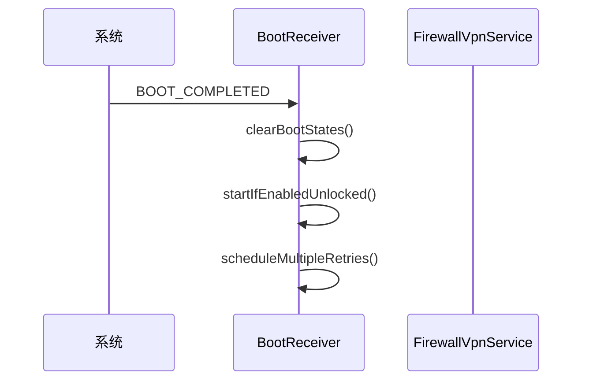
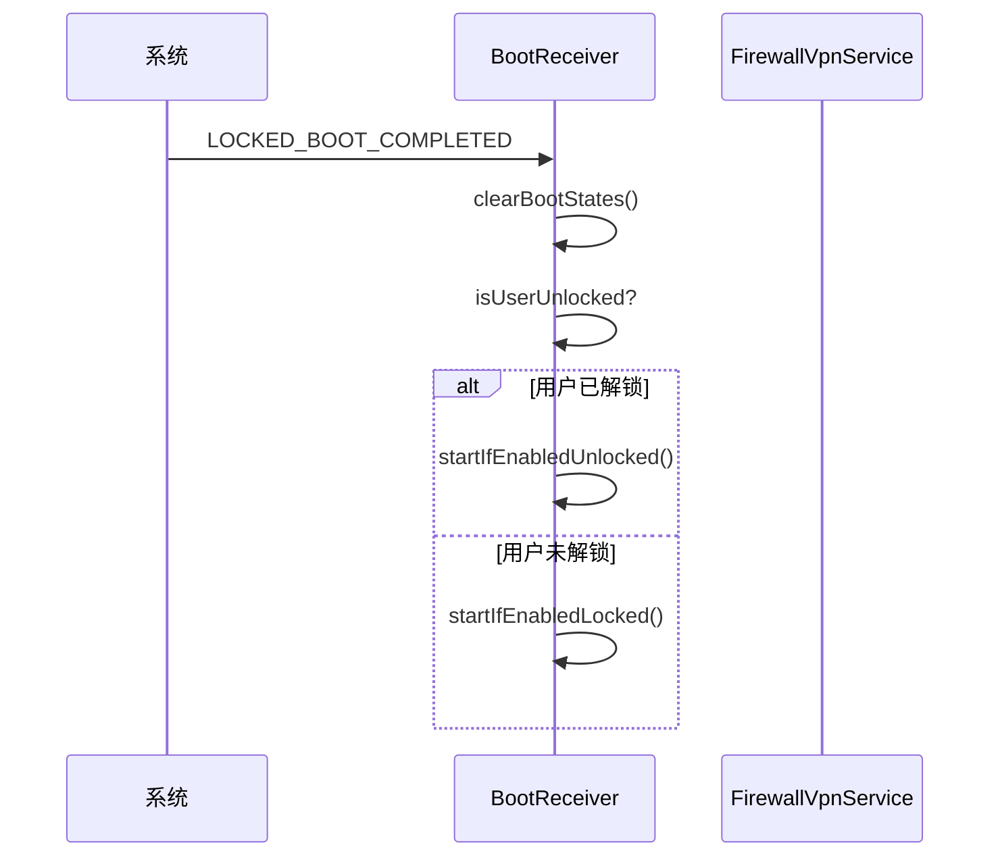
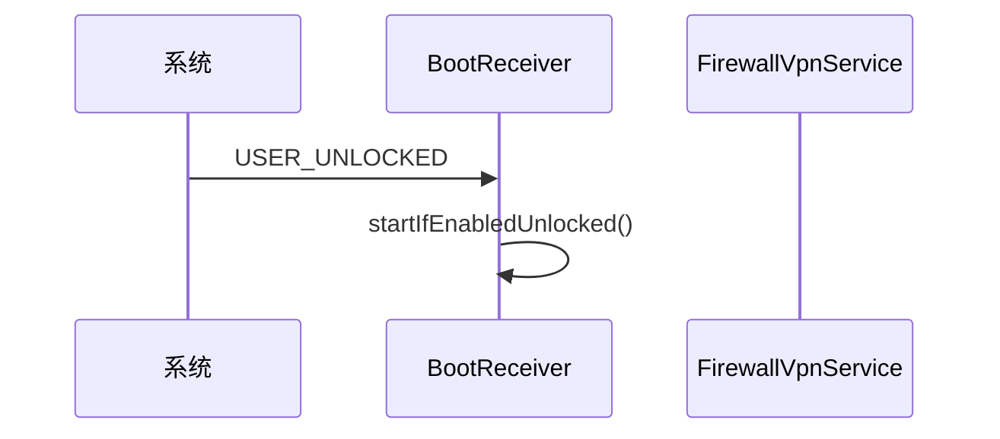
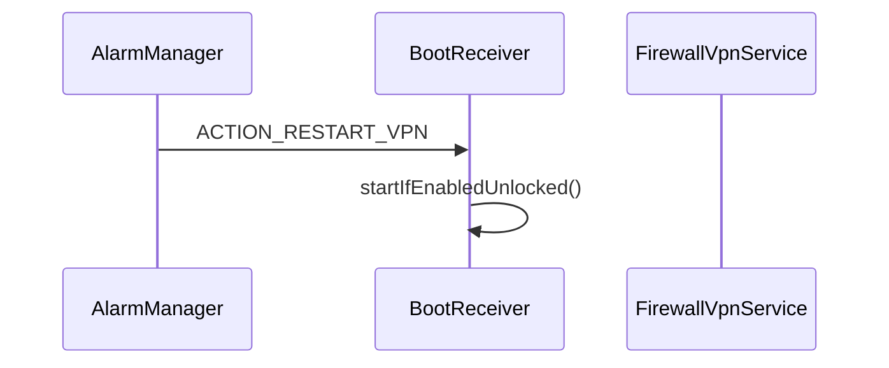
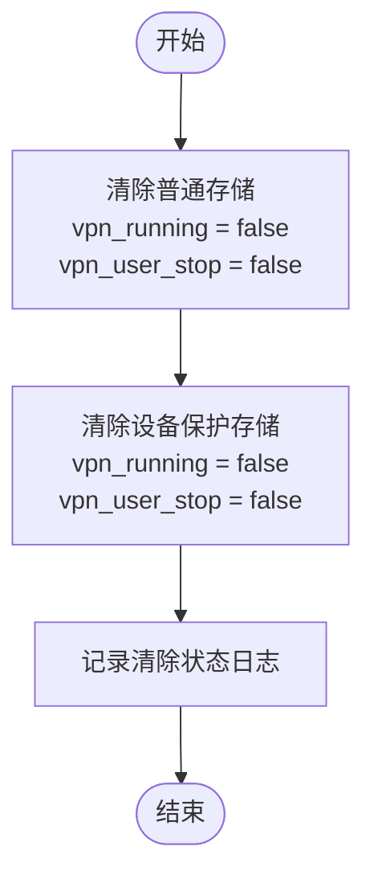
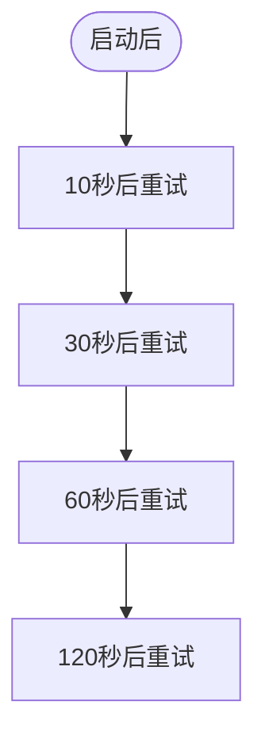
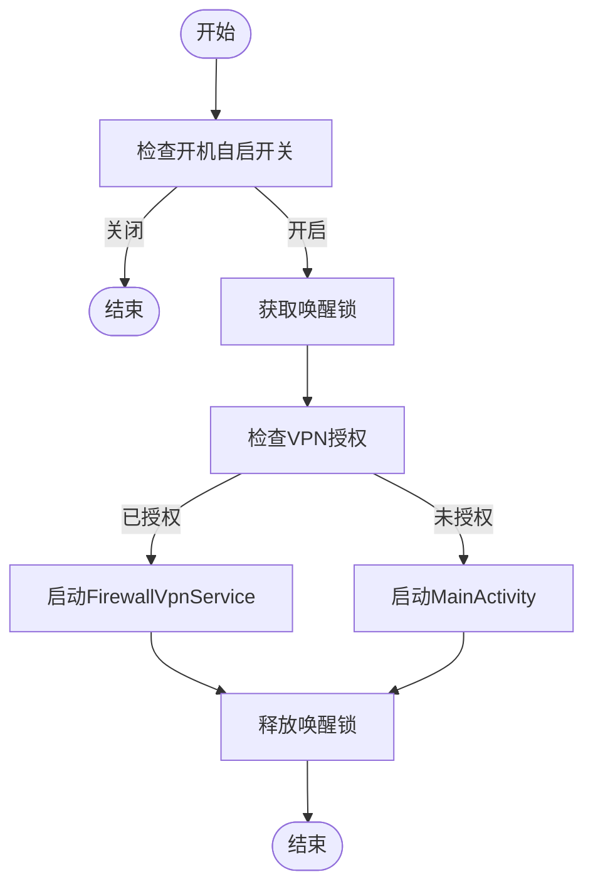
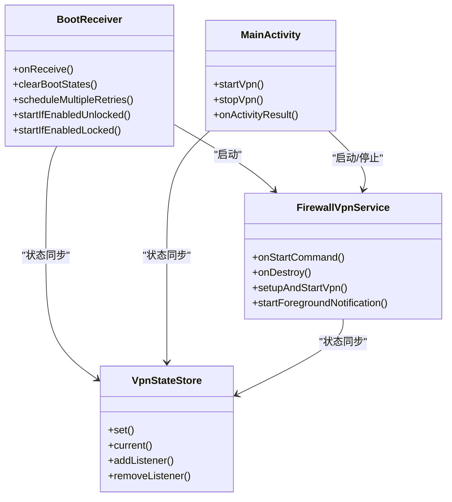

# BootReceiver 广播API

<cite>
**Referenced Files in This Document**   
- [BootReceiver.kt](file://app/src/main/java/com/example/phonenet/BootReceiver.kt)
- [AndroidManifest.xml](file://app/src/main/AndroidManifest.xml)
- [FirewallVpnService.kt](file://app/src/main/java/com/example/phonenet/FirewallVpnService.kt)
- [VpnStateStore.kt](file://app/src/main/java/com/example/phonenet/VpnStateStore.kt)
</cite>

## 目录
1. [简介](#简介)
2. [广播动作监听](#广播动作监听)
3. [系统广播触发条件与执行逻辑](#系统广播触发条件与执行逻辑)
4. [状态清除机制](#状态清除机制)
5. [厂商系统兼容性处理](#厂商系统兼容性处理)
6. [服务启动条件判断](#服务启动条件判断)
7. [AndroidManifest声明](#androidmanifest声明)
8. [扩展点分析](#扩展点分析)

## 简介
`BootReceiver` 是 StopNet 应用的核心广播接收器，负责在设备启动、用户解锁等关键生命周期事件中自动恢复 `FirewallVpnService` 服务。该接收器通过监听多种系统广播，在不同设备状态（完全启动、锁定启动、用户解锁）下执行差异化处理流程，确保VPN服务能够可靠地在后台自动重启。接收器还实现了针对vivo等厂商系统限制的重试机制，并通过唤醒锁保障启动流程的完整性。

## 广播动作监听
`BootReceiver` 在 `AndroidManifest.xml` 中声明了对以下系统广播动作的监听：

- `android.intent.action.BOOT_COMPLETED`：设备完成启动
- `android.intent.action.LOCKED_BOOT_COMPLETED`：设备锁定状态下完成启动
- `android.intent.action.USER_UNLOCKED`：用户解锁设备
- `android.intent.action.MY_PACKAGE_REPLACED`：应用包被替换（更新）
- `android.intent.action.QUICKBOOT_POWERON`：快速启动开机（部分厂商）
- `com.htc.intent.action.QUICKBOOT_POWERON`：HTC快速启动
- `com.example.stopnet.ACTION_RESTART_VPN`：自定义重启VPN动作

**Section sources**
- [AndroidManifest.xml](file://app/src/main/AndroidManifest.xml#L80-L92)

## 系统广播触发条件与执行逻辑
`BootReceiver` 根据接收到的不同广播动作执行相应的逻辑处理，主要分为三种场景：设备完全启动、锁定启动和用户解锁。

### 设备完全启动 (BOOT_COMPLETED)
当接收到 `BOOT_COMPLETED` 广播时，表示设备已完成所有启动流程，用户存储区已解锁。此时执行以下操作：
1. 清除所有持久化存储中的运行状态标记
2. 调用 `startIfEnabledUnlocked` 方法尝试启动服务
3. 安排多次重试以应对厂商系统限制



**Diagram sources**
- [BootReceiver.kt](file://app/src/main/java/com/example/phonenet/BootReceiver.kt#L14-L50)

**Section sources**
- [BootReceiver.kt](file://app/src/main/java/com/example/phonenet/BootReceiver.kt#L14-L35)

### 锁定启动 (LOCKED_BOOT_COMPLETED)
当接收到 `LOCKED_BOOT_COMPLETED` 广播时，表示设备已完成启动但用户存储区仍处于加密锁定状态。此时执行以下操作：
1. 清除所有持久化存储中的运行状态标记
2. 检查用户是否已解锁
   - 若已解锁，则调用 `startIfEnabledUnlocked`
   - 若未解锁，则调用 `startIfEnabledLocked`



**Diagram sources**
- [BootReceiver.kt](file://app/src/main/java/com/example/phonenet/BootReceiver.kt#L36-L49)

**Section sources**
- [BootReceiver.kt](file://app/src/main/java/com/example/phonenet/BootReceiver.kt#L36-L49)

### 用户解锁 (USER_UNLOCKED)
当接收到 `USER_UNLOCKED` 广播时，表示用户已成功解锁设备，用户存储区已可用。此时直接调用 `startIfEnabledUnlocked` 方法尝试启动服务。



**Diagram sources**
- [BootReceiver.kt](file://app/src/main/java/com/example/phonenet/BootReceiver.kt#L50-L52)

**Section sources**
- [BootReceiver.kt](file://app/src/main/java/com/example/phonenet/BootReceiver.kt#L50-L52)

### 自定义重启动作 (ACTION_RESTART_VPN)
当接收到自定义的 `ACTION_RESTART_VPN` 广播时，表示需要重启VPN服务。此动作通常由 `AlarmManager` 安排的定时任务触发，用于在服务意外停止后进行恢复。



**Diagram sources**
- [BootReceiver.kt](file://app/src/main/java/com/example/phonenet/BootReceiver.kt#L53-L55)

**Section sources**
- [BootReceiver.kt](file://app/src/main/java/com/example/phonenet/BootReceiver.kt#L53-L55)

## 状态清除机制
`clearBootStates` 方法负责清除SharedPreferences中存储的运行状态，确保服务能够正确重启。

### 功能说明
该方法同时清除两种存储上下文中的状态：
1. **普通存储上下文**：用于存储常规应用数据
2. **设备保护存储上下文**：在设备锁定状态下仍可访问的存储区域

### 执行逻辑


**Diagram sources**
- [BootReceiver.kt](file://app/src/main/java/com/example/phonenet/BootReceiver.kt#L53-L75)

**Section sources**
- [BootReceiver.kt](file://app/src/main/java/com/example/phonenet/BootReceiver.kt#L53-L75)

## 厂商系统兼容性处理
为应对vivo等厂商系统对后台服务的严格限制，`BootReceiver` 实现了 `scheduleMultipleRetries` 重试机制。

### 重试策略
在设备完全启动后，安排4次重试，延迟分别为：
- 10秒
- 30秒
- 60秒
- 120秒

### 定时机制
使用 `AlarmManager` 的 `setExactAndAllowWhileIdle` 方法，确保即使在设备休眠状态下也能精确触发。



**Diagram sources**
- [BootReceiver.kt](file://app/src/main/java/com/example/phonenet/BootReceiver.kt#L78-L110)

**Section sources**
- [BootReceiver.kt](file://app/src/main/java/com/example/phonenet/BootReceiver.kt#L78-L110)

## 服务启动条件判断
`BootReceiver` 提供了两个方法来在不同用户解锁状态下启动 `FirewallVpnService`。

### 解锁状态下启动 (startIfEnabledUnlocked)
在用户存储区已解锁时调用此方法：
1. 检查"开机自启"开关状态
2. 获取普通存储上下文的SharedPreferences
3. 持有唤醒锁30秒，防止启动过程中被系统杀死
4. 检查VPN授权状态
   - 若已授权，则直接启动前台服务
   - 若未授权，则尝试启动MainActivity引导用户授权



**Diagram sources**
- [BootReceiver.kt](file://app/src/main/java/com/example/phonenet/BootReceiver.kt#L144-L207)

**Section sources**
- [BootReceiver.kt](file://app/src/main/java/com/example/phonenet/BootReceiver.kt#L144-L207)

### 锁定状态下启动 (startIfEnabledLocked)
在用户存储区仍锁定时调用此方法：
1. 使用设备保护存储上下文获取SharedPreferences
2. 检查"开机自启"开关状态
3. 检查VPN授权状态
   - 若已授权，则启动服务
   - 若未授权，则无法启动（因无法访问用户界面）

**Section sources**
- [BootReceiver.kt](file://app/src/main/java/com/example/phonenet/BootReceiver.kt#L112-L142)

## AndroidManifest声明
`BootReceiver` 在 `AndroidManifest.xml` 中的声明包含了关键属性。

### 声明代码
```xml
<receiver
    android:name="com.example.stopnet.BootReceiver"
    android:exported="true"
    android:enabled="true"
    android:directBootAware="true">
    <intent-filter android:priority="999">
        <action android:name="android.intent.action.BOOT_COMPLETED"/>
        <action android:name="android.intent.action.LOCKED_BOOT_COMPLETED"/>
        <!-- 其他动作 -->
    </intent-filter>
</receiver>
```

### 属性说明
- `android:exported="true"`：允许其他应用发送广播
- `android:enabled="true"`：默认启用接收器
- `android:directBootAware="true"`：支持直接启动模式，在用户解锁前可接收 `LOCKED_BOOT_COMPLETED` 广播
- `android:priority="999"`：设置高优先级，确保优先接收广播

**Section sources**
- [AndroidManifest.xml](file://app/src/main/AndroidManifest.xml#L80-L92)

## 扩展点分析
`BootReceiver` 的设计为处理系统权限变更或包更新后的服务恢复提供了潜在扩展点。

### 包更新后自动恢复
通过监听 `MY_PACKAGE_REPLACED` 广播，可以在应用更新后自动重启服务，确保用户配置的开机自启功能在更新后仍然有效。

### 权限变更处理
当用户授予权限（如通知权限、忽略电池优化）后，可通过发送自定义广播触发服务重启，确保新权限能够立即生效。

### 状态同步机制
`VpnStateStore` 对象提供了内存状态的集中管理，多个组件（`BootReceiver`、`MainActivity`、`FirewallVpnService`）通过它保持状态同步，为扩展新的状态监听者提供了便利。



**Diagram sources**
- [BootReceiver.kt](file://app/src/main/java/com/example/phonenet/BootReceiver.kt)
- [FirewallVpnService.kt](file://app/src/main/java/com/example/phonenet/FirewallVpnService.kt)
- [VpnStateStore.kt](file://app/src/main/java/com/example/phonenet/VpnStateStore.kt)
- [MainActivity.kt](file://app/src/main/java/com/example/phonenet/MainActivity.kt)

**Section sources**
- [BootReceiver.kt](file://app/src/main/java/com/example/phonenet/BootReceiver.kt)
- [FirewallVpnService.kt](file://app/src/main/java/com/example/phonenet/FirewallVpnService.kt)
- [VpnStateStore.kt](file://app/src/main/java/com/example/phonenet/VpnStateStore.kt)