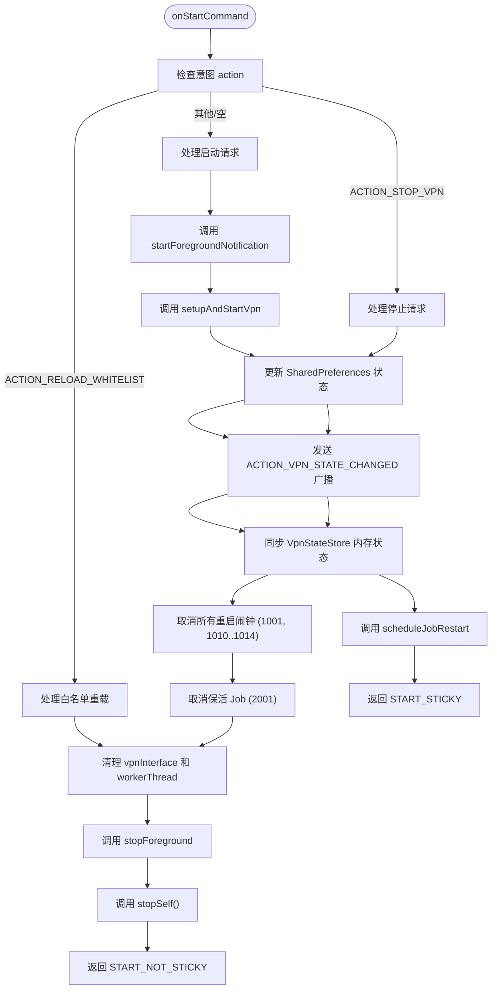
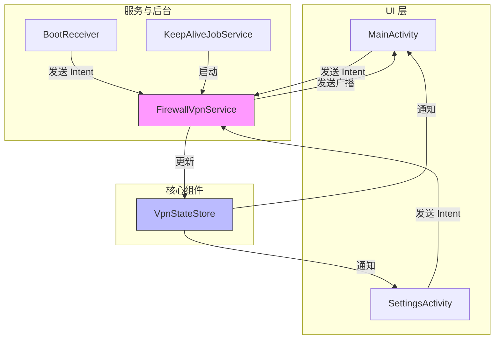

# FirewallVpnService API

<cite>
**Referenced Files in This Document**   
- [FirewallVpnService.kt](file://app/src/main/java/com/example/phonenet/FirewallVpnService.kt)
- [VpnStateStore.kt](file://app/src/main/java/com/example/phonenet/VpnStateStore.kt)
- [MainActivity.kt](file://app/src/main/java/com/example/phonenet/MainActivity.kt)
- [SettingsActivity.kt](file://app/src/main/java/com/example/phonenet/SettingsActivity.kt)
- [BootReceiver.kt](file://app/src/main/java/com/example/phonenet/BootReceiver.kt)
- [KeepAliveJobService.kt](file://app/src/main/java/com/example/phonenet/KeepAliveJobService.kt)
- [MyDeviceAdminReceiver.kt](file://app/src/main/java/com/example/phonenet/admin/MyDeviceAdminReceiver.kt)
- [AndroidManifest.xml](file://app/src/main/AndroidManifest.xml)
</cite>

## 目录
1. [简介](#简介)
2. [公开常量与广播意图](#公开常量与广播意图)
3. [onStartCommand方法处理流程](#onstartcommand方法处理流程)
4. [生命周期方法实现](#生命周期方法实现)
5. [服务调用示例](#服务调用示例)
6. [前台通知与兼容性](#前台通知与兼容性)
7. [状态同步与自恢复机制](#状态同步与自恢复机制)
8. [组件关系图](#组件关系图)

## 简介
`FirewallVpnService` 是一个基于 Android VpnService 的网络管控服务，用于实现应用级防火墙功能。该服务通过建立虚拟专用网络（VPN）隧道，拦截并过滤设备上所有应用程序的网络流量，实现对特定应用的网络访问控制。服务设计为高可用性，具备自启动、自恢复和跨设备重启的持久化能力，确保网络管控策略的持续生效。

**Section sources**
- [FirewallVpnService.kt](file://app/src/main/java/com/example/phonenet/FirewallVpnService.kt#L15-L392)

## 公开常量与广播意图
`FirewallVpnService` 定义了三个公开的常量，用于服务间的通信和状态同步。

### ACTION_VPN_STATE_CHANGED
此常量定义了 VPN 状态变更的广播动作。当服务的运行状态发生改变时，会发送此广播。

- **用途**: 通知 UI 组件（如 `MainActivity`）或其他监听者，VPN 服务的启动或停止状态已更新。
- **广播意图格式**:
  - `action`: `com.example.stopnet.VPN_STATE_CHANGED`
  - `package`: 服务所在应用包名
  - `extra`: 包含 `EXTRA_VPN_STATE` 键，其值为布尔类型，表示当前 VPN 是否正在运行。
- **使用方法**: 应用内任何需要监听 VPN 状态的组件都应注册一个 `BroadcastReceiver`，并过滤此动作。接收到广播后，通过 `getBooleanExtra(EXTRA_VPN_STATE, false)` 获取最新状态并更新 UI。

**Section sources**
- [FirewallVpnService.kt](file://app/src/main/java/com/example/phonenet/FirewallVpnService.kt#L18-L18)
- [MainActivity.kt](file://app/src/main/java/com/example/phonenet/MainActivity.kt#L104-L114)

### ACTION_STOP_VPN
此常量定义了停止 VPN 服务的显式意图动作。

- **用途**: 提供一个标准的、可预测的接口来请求停止 `FirewallVpnService`。与直接调用 `stopSelf()` 不同，此动作会触发完整的清理和状态持久化流程。
- **数据传递结构**: 该意图本身不携带额外数据，其 `action` 字段即为 `ACTION_STOP_VPN`。
- **接收方处理逻辑**: 在 `onStartCommand` 方法中，服务会检查传入意图的 `action`。如果匹配 `ACTION_STOP_VPN`，服务将：
  1. 更新 SharedPreferences 和设备保护存储中的状态为“已停止”。
  2. 发送 `ACTION_VPN_STATE_CHANGED` 广播，通知所有监听者。
  3. 同步 `VpnStateStore` 内存状态。
  4. 取消所有已安排的重启闹钟和 JobScheduler 任务，防止服务被意外拉起。
  5. 清理 VPN 接口和工作线程资源。
  6. 调用 `stopForeground` 和 `stopSelf()` 终止服务。

**Section sources**
- [FirewallVpnService.kt](file://app/src/main/java/com/example/phonenet/FirewallVpnService.kt#L20-L20)
- [FirewallVpnService.kt](file://app/src/main/java/com/example/phonenet/FirewallVpnService.kt#L28-L127)

### ACTION_RELOAD_WHITELIST
此常量定义了重载白名单的意图动作。

- **用途**: 当应用的白名单配置（允许联网的应用列表）发生更改时，触发此动作。它允许服务在不完全重启的情况下，动态更新其网络过滤规则。
- **数据传递结构**: 该意图本身不携带数据，仅通过 `action` 字段触发。
- **接收方处理逻辑**: 在 `onStartCommand` 方法中，服务会检查此动作。如果匹配，服务将：
  1. 中断并清理当前的 VPN 隧道（关闭 `vpnInterface` 和 `workerThread`）。
  2. 继续执行后续的 `setupAndStartVpn()` 流程，重新读取最新的白名单配置并建立新的隧道。
  3. 这确保了新的白名单规则能够立即生效。

**Section sources**
- [FirewallVpnService.kt](file://app/src/main/java/com/example/phonenet/FirewallVpnService.kt#L22-L22)
- [SettingsActivity.kt](file://app/src/main/java/com/example/phonenet/SettingsActivity.kt#L175-L195)

## onStartCommand方法处理流程
`onStartCommand` 方法是服务启动逻辑的核心，根据传入意图的 `action` 执行不同的处理流程。



**Diagram sources**
- [FirewallVpnService.kt](file://app/src/main/java/com/example/phonenet/FirewallVpnService.kt#L28-L127)
- [FirewallVpnService.kt](file://app/src/main/java/com/example/phonenet/FirewallVpnService.kt#L319-L359)
- [FirewallVpnService.kt](file://app/src/main/java/com/example/phonenet/FirewallVpnService.kt#L261-L317)
- [FirewallVpnService.kt](file://app/src/main/java/com/example/phonenet/FirewallVpnService.kt#L247-L259)

**Section sources**
- [FirewallVpnService.kt](file://app/src/main/java/com/example/phonenet/FirewallVpnService.kt#L28-L127)

## 生命周期方法实现
### onDestroy
`onDestroy` 方法在服务被系统终止时调用，负责资源清理和状态持久化。

- **资源清理**: 中断工作线程 (`workerThread`) 并关闭 VPN 接口 (`vpnInterface`)。
- **状态持久化**: 发送 `ACTION_VPN_STATE_CHANGED` 广播，通知 UI 服务已停止，并同步 `VpnStateStore` 状态。
- **自恢复逻辑**: 检查 `SharedPreferences` 中的 `vpn_user_stop` 标志。如果用户是主动停止服务（`userStopped = true`），则不安排重启。否则，服务认为是意外终止，会通过 `AlarmManager` 或 `JobScheduler` 安排一个延迟重启任务（通常在3秒后），以实现自恢复。

### onTaskRemoved
`onTaskRemoved` 方法在用户从最近任务列表中清除应用时调用。

- **自恢复逻辑**: 与 `onDestroy` 类似，但策略更为激进。如果非用户主动停止，服务会：
  1. 短暂持有 `PARTIAL_WAKE_LOCK` 唤醒锁，防止设备进入 Doze 模式中断重启流程。
  2. 尝试立即启动服务 3 次。
  3. 调用 `scheduleMultipleRestarts()`，安排一系列（5次）不同延迟的重启闹钟（3秒、10秒、30秒、60秒、120秒），以应对不同厂商 ROM 的后台限制。
  4. 调用 `scheduleJobRestart()`，安排一个 JobScheduler 任务作为后备。

**Section sources**
- [FirewallVpnService.kt](file://app/src/main/java/com/example/phonenet/FirewallVpnService.kt#L129-L184)
- [FirewallVpnService.kt](file://app/src/main/java/com/example/phonenet/FirewallVpnService.kt#L187-L218)

## 服务调用示例
以下是在 `MainActivity` 或 `SettingsActivity` 中通过 `Intent` 控制服务状态的代码示例。

### 启动服务
```kotlin
val intent = VpnService.prepare(this)
if (intent != null) {
    // 需要用户授权
    startActivityForResult(intent, PREPARE_VPN_REQ)
} else {
    // 已授权，直接启动
    val serviceIntent = Intent(this, FirewallVpnService::class.java)
    startService(serviceIntent) // 或 startForegroundService
}
```

### 停止服务
```kotlin
val stopIntent = Intent(this, FirewallVpnService::class.java).apply {
    action = FirewallVpnService.ACTION_STOP_VPN
}
startService(stopIntent) // 或 startForegroundService
```

### 重载白名单
```kotlin
val reloadIntent = Intent(this, FirewallVpnService::class.java).apply {
    action = FirewallVpnService.ACTION_RELOAD_WHITELIST
}
startService(reloadIntent) // 或 startForegroundService
```

**Section sources**
- [MainActivity.kt](file://app/src/main/java/com/example/phonenet/MainActivity.kt#L347-L378)
- [SettingsActivity.kt](file://app/src/main/java/com/example/phonenet/SettingsActivity.kt#L175-L195)

## 前台通知与兼容性
为了在 Android 8.0+ 系统上合法运行前台服务，`FirewallVpnService` 必须创建一个前台通知。

- **通知创建**: `startForegroundNotification()` 方法负责创建通知。
  - 在 Android O (API 26) 及以上版本，会创建一个名为 `stopnet_vpn_channel` 的通知渠道，其重要性为 `IMPORTANCE_HIGH`。
  - 通知内容为“StopNet 网络管控运行中”，并设置为持续（`setOngoing(true)`）且不可清除（`setAutoCancel(false)`）。
  - 点击通知会跳转到 `MainActivity`。
- **兼容性处理**:
  - 对于 Android 14 (API 34) 及以上版本，调用 `startForeground()` 时会指定 `FOREGROUND_SERVICE_TYPE_DATA_SYNC` 类型，以满足新的前台服务类型要求。
  - 对于旧版本，则使用传统的 `startForeground(id, notification)` 形式。

**Section sources**
- [FirewallVpnService.kt](file://app/src/main/java/com/example/phonenet/FirewallVpnService.kt#L319-L359)
- [AndroidManifest.xml](file://app/src/main/AndroidManifest.xml#L25-L28)

## 状态同步与自恢复机制
### VpnStateStore 状态同步
`VpnStateStore` 是一个单例对象，用于在内存中维护 VPN 的运行状态。

- **实现细节**: 它使用 `@Volatile` 修饰的 `state` 变量确保线程可见性，并通过 `CopyOnWriteArrayList` 管理状态监听器。
- **同步逻辑**: 当 `FirewallVpnService` 的状态改变时（启动、停止、用户操作），会调用 `VpnStateStore.set(isRunning)`。这会更新内存状态，并立即通知所有注册的监听器。`MainActivity` 等 UI 组件通过 `addListener` 注册监听，实现 UI 的实时更新。

### stopForeground 调用适配
`stopForeground` 方法在不同 Android 版本下有不同的行为。

- **适配策略**: 服务通过 `Build.VERSION.SDK_INT` 进行判断。
  - 对于 API 24 (Android 7.0) 及以上版本，调用 `stopForeground(STOP_FOREGROUND_REMOVE)`，这会同时移除通知。
  - 对于旧版本，则调用 `stopForeground(true)`，同样移除通知。
- **目的**: 确保在服务停止时，前台通知能够被正确移除，避免残留通知。

**Section sources**
- [VpnStateStore.kt](file://app/src/main/java/com/example/phonenet/VpnStateStore.kt#L4-L29)
- [FirewallVpnService.kt](file://app/src/main/java/com/example/phonenet/FirewallVpnService.kt#L118-L119)
- [FirewallVpnService.kt](file://app/src/main/java/com/example/phonenet/FirewallVpnService.kt#L177-L178)

## 组件关系图


**Diagram sources**
- [FirewallVpnService.kt](file://app/src/main/java/com/example/phonenet/FirewallVpnService.kt#L15-L392)
- [MainActivity.kt](file://app/src/main/java/com/example/phonenet/MainActivity.kt#L104-L114)
- [SettingsActivity.kt](file://app/src/main/java/com/example/phonenet/SettingsActivity.kt#L175-L195)
- [BootReceiver.kt](file://app/src/main/java/com/example/phonenet/BootReceiver.kt#L144-L207)
- [KeepAliveJobService.kt](file://app/src/main/java/com/example/phonenet/KeepAliveJobService.kt#L17-L46)
- [VpnStateStore.kt](file://app/src/main/java/com/example/phonenet/VpnStateStore.kt#L4-L29)