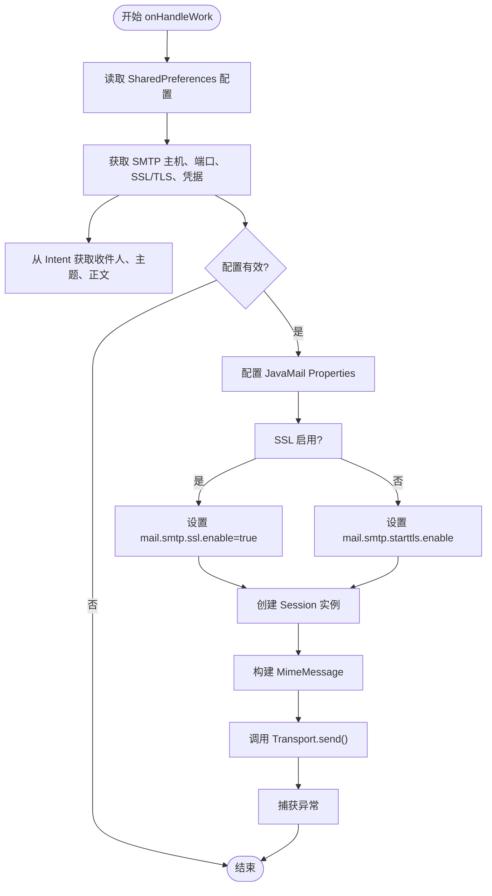
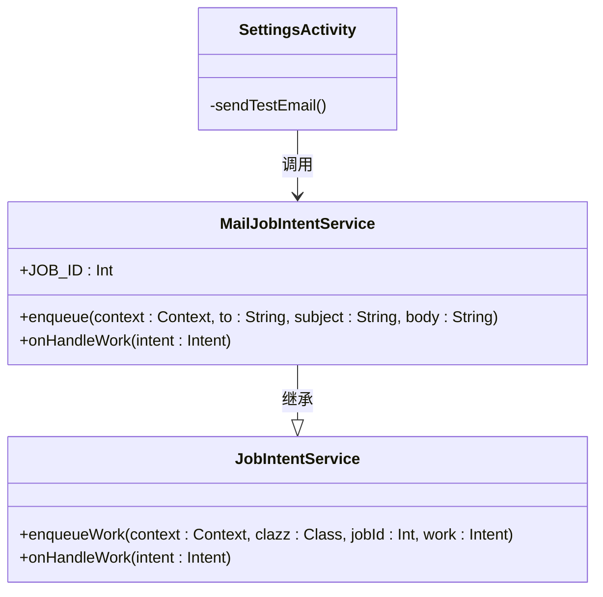

# MailJobIntentService 邮件服务API

<cite>
**Referenced Files in This Document**   
- [MailJobIntentService.kt](file://app/src/main/java/com/example/phonenet/mail/MailJobIntentService.kt)
- [SettingsActivity.kt](file://app/src/main/java/com/example/phonenet/SettingsActivity.kt)
- [strings.xml](file://app/src/main/res/values/strings.xml)
</cite>

## 目录
1. [简介](#简介)
2. [核心组件](#核心组件)
3. [架构概述](#架构概述)
4. [详细组件分析](#详细组件分析)
5. [依赖分析](#依赖分析)
6. [性能考虑](#性能考虑)
7. [故障排除指南](#故障排除指南)
8. [结论](#结论)

## 简介
`MailJobIntentService` 是 StopNet 应用中的一个关键后台服务组件，专门负责异步发送电子邮件。该服务继承自 `JobIntentService`，利用 Android 的 JobScheduler 机制在后台可靠地执行邮件发送任务，即使应用处于后台或设备重启后也能保证任务的完成。其主要用途是向家长邮箱发送网络活动报告、状态通知和测试邮件，是 StopNet 家长控制功能的重要通信渠道。

该服务通过 `JOB_ID=1001` 进行唯一标识，确保了任务调度的确定性和可管理性。它从 `SharedPreferences` 中读取 SMTP 配置，并使用 JavaMail API 构建和发送 MIME 格式的邮件。服务设计注重健壮性，包含了对配置缺失的检查、网络超时设置以及异常处理，以应对低质量网络环境下的挑战。

## 核心组件

`MailJobIntentService` 的核心功能围绕两个静态方法展开：`enqueue` 用于将邮件任务提交到队列，而 `onHandleWork` 则在后台线程中实际执行邮件发送逻辑。该服务通过读取应用的共享首选项来获取 SMTP 服务器、端口、认证凭据等配置信息，并支持设备保护存储（Device Protected Storage, DPS）的双存储读取机制，以确保在设备加密锁定状态下仍能访问关键配置。

**Section sources**
- [MailJobIntentService.kt](file://app/src/main/java/com/example/phonenet/mail/MailJobIntentService.kt#L18-L25)
- [MailJobIntentService.kt](file://app/src/main/java/com/example/phonenet/mail/MailJobIntentService.kt#L28-L91)

## 架构概述

`MailJobIntentService` 作为 StopNet 应用的后台邮件引擎，其架构体现了清晰的职责分离。`SettingsActivity` 负责收集和持久化用户配置，而 `MailJobIntentService` 则专注于执行发送任务。这种设计使得邮件发送逻辑与用户界面完全解耦，提高了代码的可维护性和可靠性。

```mermaid
graph TB
subgraph "用户界面"
SettingsActivity[SettingsActivity]
end
subgraph "后台服务"
MailJobIntentService[MailJobIntentService]
end
subgraph "数据存储"
SharedPreferences[SharedPreferences]
DPS[设备保护存储 (DPS)]
end
subgraph "外部系统"
SMTP_Server[SMTP服务器]
end
SettingsActivity --> |调用 enqueue| MailJobIntentService
MailJobIntentService --> |读取| SharedPreferences
MailJobIntentService --> |读取| DPS
MailJobIntentService --> |发送| SMTP_Server
```

**Diagram sources **
- [MailJobIntentService.kt](file://app/src/main/java/com/example/phonenet/mail/MailJobIntentService.kt#L18-L25)
- [MailJobIntentService.kt](file://app/src/main/java/com/example/phonenet/mail/MailJobIntentService.kt#L28-L91)
- [SettingsActivity.kt](file://app/src/main/java/com/example/phonenet/SettingsActivity.kt#L212-L226)

## 详细组件分析

### enqueue 方法分析
`enqueue` 方法是 `MailJobIntentService` 的公共接口，用于安全地将邮件发送任务添加到工作队列中。它是一个静态方法，接收 `Context`、收件人地址、邮件主题和正文作为参数。该方法首先创建一个 `Intent` 对象，并将邮件内容作为额外数据（extras）放入其中。然后，它调用父类 `JobIntentService.enqueueWork()` 方法，将此 `Intent` 与服务的 `JOB_ID=1001` 一起提交给系统调度器。这种设计模式确保了任务的异步执行，不会阻塞调用线程。

**Section sources**
- [MailJobIntentService.kt](file://app/src/main/java/com/example/phonenet/mail/MailJobIntentService.kt#L18-L25)

### onHandleWork 方法分析
`onHandleWork` 方法是服务的核心，它在后台线程中被系统调用以处理 `enqueue` 提交的 `Intent`。该方法首先获取应用上下文，并创建两个 `SharedPreferences` 实例：一个用于常规存储，另一个通过 `createDeviceProtectedStorageContext()` 访问设备保护存储区，实现了配置的双源读取。



**Diagram sources **
- [MailJobIntentService.kt](file://app/src/main/java/com/example/phonenet/mail/MailJobIntentService.kt#L28-L91)

#### 配置读取与验证
该方法定义了三个内联函数 `prefString`、`prefInt` 和 `prefBool` 来封装双存储读取逻辑。对于每个配置项，它首先尝试从常规首选项读取，如果失败则回退到设备保护存储。获取到所有配置后，方法会进行严格的空值和有效性检查，如果任何关键参数（如主机、端口、用户名、密码、发件人、收件人）为空或无效，则直接返回，不执行发送操作。

#### JavaMail API 配置
在配置 `Properties` 对象时，服务设置了连接、读取和写入超时均为10秒，以防止在低质量网络下长时间阻塞。SSL 和 STARTTLS 的启用是互斥的：如果 `smtp_ssl` 为 `true`，则启用 `mail.smtp.ssl.enable`；否则，根据 `smtp_tls` 的值启用 `mail.smtp.starttls.enable`。

#### 邮件构建与发送
`MimeMessage` 的构建过程明确指定了 UTF-8 字符编码，确保了对中文等非ASCII字符的正确支持。邮件的发件人、收件人、主题和正文都被正确设置。最后，`Transport.send(message)` 被调用以发送邮件。整个发送过程被包裹在 `try-catch` 块中，任何异常都会被捕获，但目前没有进行日志记录或重试，这为未来的容错设计提供了扩展点。

**Section sources**
- [MailJobIntentService.kt](file://app/src/main/java/com/example/phonenet/mail/MailJobIntentService.kt#L28-L91)

### SettingsActivity 调用示例
`SettingsActivity` 提供了调用 `MailJobIntentService.enqueue` 的实际示例。当用户点击“发送测试邮件”按钮时，`sendTestEmail()` 方法被触发。该方法首先检查家长邮箱是否已填写，然后从 `strings.xml` 中获取预定义的测试邮件主题和正文（`smtp_test_subject` 和 `smtp_test_body`），最后调用 `MailJobIntentService.enqueue(this, to, subject, body)` 来提交任务。发送成功或失败后，会通过 `Toast` 消息向用户反馈结果。

**Section sources**
- [SettingsActivity.kt](file://app/src/main/java/com/example/phonenet/SettingsActivity.kt#L212-L226)
- [strings.xml](file://app/src/main/res/values/strings.xml#L27-L28)

## 依赖分析

`MailJobIntentService` 依赖于 AndroidX 的 `JobIntentService` 作为其基类，以利用系统级的后台任务调度能力。它还依赖于 JavaMail API（`javax.mail.*`）来实现邮件协议的底层通信。在数据存储方面，它依赖于 `SharedPreferences` 和设备保护存储上下文。该服务与 `SettingsActivity` 存在松耦合关系，后者通过调用其静态方法来触发邮件发送。



**Diagram sources **
- [MailJobIntentService.kt](file://app/src/main/java/com/example/phonenet/mail/MailJobIntentService.kt#L1-L92)
- [SettingsActivity.kt](file://app/src/main/java/com/example/phonenet/SettingsActivity.kt#L1-L361)

## 性能考虑
该服务的设计充分考虑了性能和资源消耗。通过使用 `JobIntentService`，它避免了创建长期运行的前台服务，从而减少了电池消耗。10秒的超时设置可以防止在不可用的网络上无限期等待。然而，当前的异常处理策略较为简单，捕获异常后不做任何处理，这可能导致任务在失败后丢失。未来可以引入重试机制（如指数退避）和持久化任务队列，以增强在低质量网络环境下的容错能力。

## 故障排除指南
如果邮件发送失败，请按以下步骤排查：
1.  **检查配置**：确保在 `SettingsActivity` 中正确填写了所有 SMTP 配置，包括服务器、端口、用户名、密码和发件人地址。
2.  **验证网络**：确认设备已连接到互联网。
3.  **检查权限**：虽然邮件发送本身不需要特殊权限，但确保应用没有被系统强制停止或电池优化。
4.  **查看日志**：目前服务未输出日志，建议在 `catch` 块中添加 `Log.e()` 语句以捕获和记录异常信息，便于调试。

## 结论
`MailJobIntentService` 是一个设计简洁、职责明确的后台邮件服务。它成功地将邮件发送功能从用户界面中分离出来，利用 Android 的 JobScheduler 保证了任务的可靠执行。其对设备保护存储的支持增强了在设备锁定状态下的可用性。尽管当前的错误处理较为基础，但它为未来扩展（如重试机制、邮件模板、附件支持）提供了良好的基础。通过 `SettingsActivity` 中的测试邮件功能，用户可以方便地验证配置的正确性。