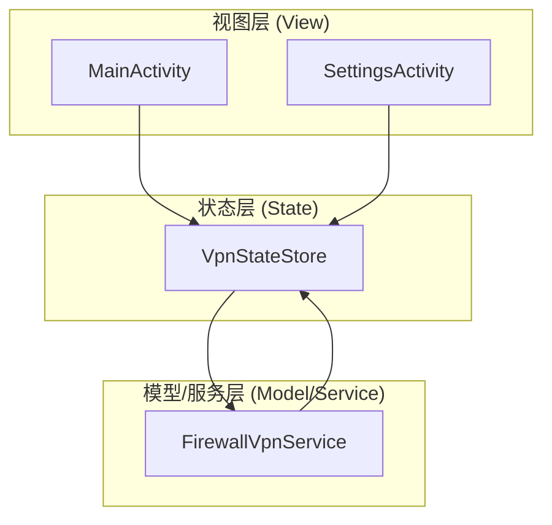
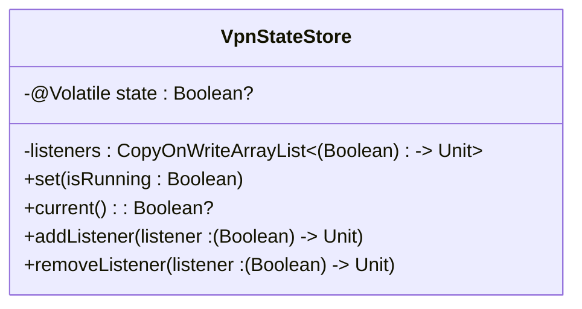
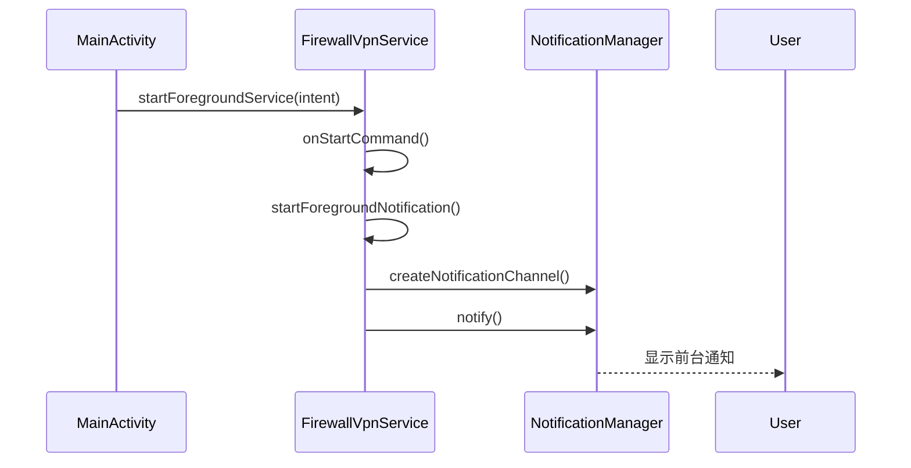
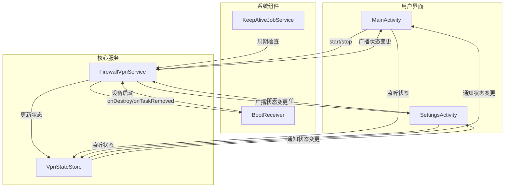

# 技术架构设计

<cite>
**本文档引用的文件**
- [VpnStateStore.kt](file://app/src/main/java/com/example/phonenet/VpnStateStore.kt)
- [FirewallVpnService.kt](file://app/src/main/java/com/example/phonet/FirewallVpnService.kt)
- [MainActivity.kt](file://app/src/main/java/com/example/phonenet/MainActivity.kt)
- [SettingsActivity.kt](file://app/src/main/java/com/example/phonenet/SettingsActivity.kt)
- [AndroidManifest.xml](file://app/src/main/AndroidManifest.xml)
- [KeepAliveJobService.kt](file://app/src/main/java/com/example/phonenet/KeepAliveJobService.kt)
- [BootReceiver.kt](file://app/src/main/java/com/example/phonenet/BootReceiver.kt)
</cite>

## 目录
1. [简介](#简介)
2. [项目结构](#项目结构)
3. [核心组件](#核心组件)
4. [架构概述](#架构概述)
5. [详细组件分析](#详细组件分析)
6. [依赖分析](#依赖分析)
7. [性能考虑](#性能考虑)
8. [故障排除指南](#故障排除指南)
9. [结论](#结论)

## 简介
stopnet是一款基于Android平台的网络管控应用，通过Android的`VpnService`实现对设备网络流量的拦截与过滤。本架构文档详细阐述了其核心机制，包括基于`VpnStateStore`单例的观察者模式状态同步、MVVM架构的实现、前台服务的声明与保活策略，以及各组件间的数据流与控制流。

## 项目结构
stopnet项目采用标准的Android项目结构，主要代码位于`app/src/main/java/com/example/phonenet`包下。核心组件包括`MainActivity`和`SettingsActivity`作为视图层，`FirewallVpnService`作为模型/服务层，以及`VpnStateStore`作为全局状态存储。`BootReceiver`和`KeepAliveJobService`负责服务的启动与保活。

**Section sources**
- [AndroidManifest.xml](file://app/src/main/AndroidManifest.xml)

## 核心组件
stopnet的核心组件包括`VpnStateStore`、`FirewallVpnService`、`MainActivity`和`SettingsActivity`。`VpnStateStore`是一个单例对象，负责在内存中存储和同步VPN的运行状态。`FirewallVpnService`继承自`VpnService`，是实现网络拦截功能的核心服务。`MainActivity`和`SettingsActivity`是用户交互的界面，遵循MVVM架构的视图层。

**Section sources**
- [VpnStateStore.kt](file://app/src/main/java/com/example/phonenet/VpnStateStore.kt)
- [FirewallVpnService.kt](file://app/src/main/java/com/example/phonenet/FirewallVpnService.kt)
- [MainActivity.kt](file://app/src/main/java/com/example/phonenet/MainActivity.kt)
- [SettingsActivity.kt](file://app/src/main/java/com/example/phonenet/SettingsActivity.kt)

## 架构概述
stopnet应用采用MVVM（Model-View-ViewModel）架构模式，清晰地分离了关注点。`MainActivity`和`SettingsActivity`作为**视图层**，负责用户界面的展示和用户输入的接收。`FirewallVpnService`扮演**模型/服务层**的角色，它直接与Android系统交互，管理VPN连接、网络流量和持久化数据。`VpnStateStore`作为全局状态管理器，充当了连接视图与模型的桥梁，实现了状态的集中管理和响应式更新。

**Section sources**
- [MainActivity.kt](file://app/src/main/java/com/example/phonenet/MainActivity.kt)
- [FirewallVpnService.kt](file://app/src/main/java/com/example/phonenet/FirewallVpnService.kt)
- [VpnStateStore.kt](file://app/src/main/java/com/example/phonenet/VpnStateStore.kt)

**Diagram sources**
- [MainActivity.kt](file://app/src/main/java/com/example/phonenet/MainActivity.kt)
- [SettingsActivity.kt](file://app/src/main/java/com/example/phonenet/SettingsActivity.kt)
- [VpnStateStore.kt](file://app/src/main/java/com/example/phonenet/VpnStateStore.kt)
- [FirewallVpnService.kt](file://app/src/main/java/com/example/phonenet/FirewallVpnService.kt)

## 详细组件分析

### VpnStateStore单例与观察者模式
`VpnStateStore`是一个Kotlin对象（`object`），实现了单例模式，确保在整个应用生命周期内只有一个实例。它通过观察者模式在组件间高效、实时地同步VPN的运行状态。

- **状态存储**：`VpnStateStore`内部使用一个`@Volatile`修饰的`state`变量来存储当前的VPN运行状态（`true`或`false`），`@Volatile`关键字保证了多线程环境下的可见性。
- **观察者列表**：使用`CopyOnWriteArrayList`来存储所有监听状态变化的回调函数。`CopyOnWriteArrayList`是线程安全的，适合读多写少的场景，能有效避免在遍历列表时因其他线程修改列表而引发的并发问题。
- **状态变更**：当`set(isRunning: Boolean)`方法被调用时，它会更新`state`值，并遍历`listeners`列表，逐一调用每个监听器的回调函数，将新的状态值传递给它们。
- **监听管理**：`addListener`方法用于注册新的监听器。一个关键的设计是，当一个新的监听器被添加时，如果当前`state`已有值（即服务已经运行过），它会立即“回放”当前状态给新监听器，确保新加入的组件能立刻获取到最新的状态，避免了状态不一致的问题。`removeListener`方法则用于注销监听器，防止内存泄漏。

这种设计使得`MainActivity`和`SettingsActivity`等UI组件可以轻松地订阅状态变化，一旦VPN状态改变，它们就能立即收到通知并更新界面，实现了松耦合和响应式编程。

**Diagram sources**
- [VpnStateStore.kt](file://app/src/main/java/com/example/phonenet/VpnStateStore.kt)

**Section sources**
- [VpnStateStore.kt](file://app/src/main/java/com/example/phonenet/VpnStateStore.kt)

### 前台服务（Foreground Service）的实现
为了在后台持续运行并拦截网络流量，`FirewallVpnService`必须作为前台服务运行。这要求它在运行时显示一个无法轻易清除的通知，以告知用户有应用正在后台活动。

- **服务声明**：在`AndroidManifest.xml`中，`FirewallVpnService`被声明为一个`<service>`，并指定了`android.permission.BIND_VPN_SERVICE`权限，这是使用`VpnService`所必需的。`android:foregroundServiceType="dataSync"`属性明确指定了该服务的类型，有助于系统进行资源管理。
- **启动前台服务**：在`FirewallVpnService`的`onStartCommand`方法中，会调用`startForegroundNotification()`方法来创建并显示通知。该通知的优先级为`PRIORITY_MAX`，并且是持续性的（`setOngoing(true)`），用户无法手动清除。
- **通知内容**：通知的标题为“StopNet 网络管控运行中”，内容为“正在保护设备网络安全，请勿关闭此通知”，清晰地向用户说明了服务的作用。点击通知会跳转回`MainActivity`。

**Diagram sources**
- [FirewallVpnService.kt](file://app/src/main/java/com/example/phonenet/FirewallVpnService.kt)
- [AndroidManifest.xml](file://app/src/main/AndroidManifest.xml)

**Section sources**
- [FirewallVpnService.kt](file://app/src/main/java/com/example/phonenet/FirewallVpnService.kt)
- [AndroidManifest.xml](file://app/src/main/AndroidManifest.xml)

### 服务保活机制：JobScheduler与AlarmManager
Android系统为了省电，会对后台服务进行严格的限制。为了确保`FirewallVpnService`能够持续运行，stopnet应用采用了`JobScheduler`和`AlarmManager`相结合的保活策略。

- **JobScheduler (主策略)**：对于Android 5.0（API 21）及以上版本，应用使用`JobScheduler`。在`FirewallVpnService`启动后，会调用`scheduledJobRestart()`方法，安排一个`KeepAliveJobService`。这个Job被设置为周期性执行（每15分钟一次），并且是持久化的（`setPersisted(true)`），即使设备重启后依然有效。当Job执行时，`KeepAliveJobService`会检查配置，如果允许自启动，则会尝试重新启动`FirewallVpnService`。
- **AlarmManager (备用策略)**：当设备不支持精确闹钟（如未授予`SCHEDULE_EXACT_ALARM`权限）或在特定场景下（如`onDestroy`被调用但非用户主动停止），应用会退而使用`AlarmManager`。它会设置一个精确的闹钟，在服务停止后3秒（`onDestroy`）或更长的延迟后（`onTaskRemoved`）尝试重启服务。这种方法能应对系统因内存不足而杀死服务的情况。
- **多层保障**：`BootReceiver`在设备启动完成时，会清除旧的运行状态，并尝试根据用户的设置重新启动服务。`onTaskRemoved`方法则在用户从最近任务列表中清除应用时，立即尝试自恢复。这些机制共同构成了一个多层次的保活方案。

**Section sources**
- [FirewallVpnService.kt](file://app/src/main/java/com/example/phonenet/FirewallVpnService.kt)
- [KeepAliveJobService.kt](file://app/src/main/java/com/example/phonenet/KeepAliveJobService.kt)
- [BootReceiver.kt](file://app/src/main/java/com/example/phonenet/BootReceiver.kt)

### 组件交互图
下图展示了stopnet应用中主要组件之间的数据流和控制流。

**Diagram sources**
- [MainActivity.kt](file://app/src/main/java/com/example/phonenet/MainActivity.kt)
- [SettingsActivity.kt](file://app/src/main/java/com/example/phonenet/SettingsActivity.kt)
- [FirewallVpnService.kt](file://app/src/main/java/com/example/phonenet/FirewallVpnService.kt)
- [VpnStateStore.kt](file://app/src/main/java/com/example/phonenet/VpnStateStore.kt)
- [BootReceiver.kt](file://app/src/main/java/com/example/phonenet/BootReceiver.kt)
- [KeepAliveJobService.kt](file://app/src/main/java/com/example/phonenet/KeepAliveJobService.kt)

## 依赖分析
stopnet应用的依赖关系清晰，主要依赖于Android SDK提供的核心组件。

- **Android SDK**：应用重度依赖`VpnService`、`JobScheduler`、`AlarmManager`、`BroadcastReceiver`等Android系统服务和API。
- **内部依赖**：`MainActivity`和`SettingsActivity`依赖`VpnStateStore`来获取状态；`VpnStateStore`被`FirewallVpnService`和UI组件共同依赖；`KeepAliveJobService`和`BootReceiver`依赖`FirewallVpnService`来启动服务。
- **无外部库**：从代码分析来看，该项目没有引入第三方依赖库，所有功能均通过Android原生API实现。

**Section sources**
- [AndroidManifest.xml](file://app/src/main/AndroidManifest.xml)

## 性能考虑
- **线程安全**：`VpnStateStore`使用`CopyOnWriteArrayList`和`@Volatile`变量，确保了状态同步的线程安全。
- **资源管理**：`FirewallVpnService`在`onDestroy`和处理`ACTION_STOP_VPN`时，会主动关闭`ParcelFileDescriptor`和中断工作线程，及时释放系统资源。
- **唤醒锁**：在`onTaskRemoved`和`BootReceiver`中，应用会短暂持有`PARTIAL_WAKE_LOCK`，以确保重启逻辑在设备休眠时也能执行，但这段时间很短，对电池的影响可控。
- **Job调度**：`KeepAliveJobService`的周期为15分钟，频率适中，平衡了服务稳定性和电池消耗。

## 故障排除指南
- **VPN无法启动**：检查是否已授予“POST_NOTIFICATIONS”权限（Android 13+），以及是否在系统设置中允许了VPN权限。
- **服务频繁停止**：引导用户将应用加入电池优化白名单（忽略电池优化），并检查厂商的自启动管理设置。
- **开机未自启**：确认“开机自启StopNet”开关已打开，并检查设备是否支持设备所有者（DO）模式。
- **状态不同步**：检查`VpnStateStore`的监听器是否正确注册和注销，避免内存泄漏。

**Section sources**
- [MainActivity.kt](file://app/src/main/java/com/example/phonenet/MainActivity.kt)
- [FirewallVpnService.kt](file://app/src/main/java/com/example/phonenet/FirewallVpnService.kt)

## 结论
stopnet应用通过精心设计的MVVM架构和观察者模式，实现了清晰的代码结构和高效的状态管理。其基于`VpnService`的网络拦截机制稳定可靠，结合`JobScheduler`和`AlarmManager`的双重保活策略，有效应对了Android系统的后台限制。`VpnStateStore`单例作为全局状态中枢，确保了UI与服务之间的实时同步。整体架构健壮，具备良好的可维护性和扩展性。