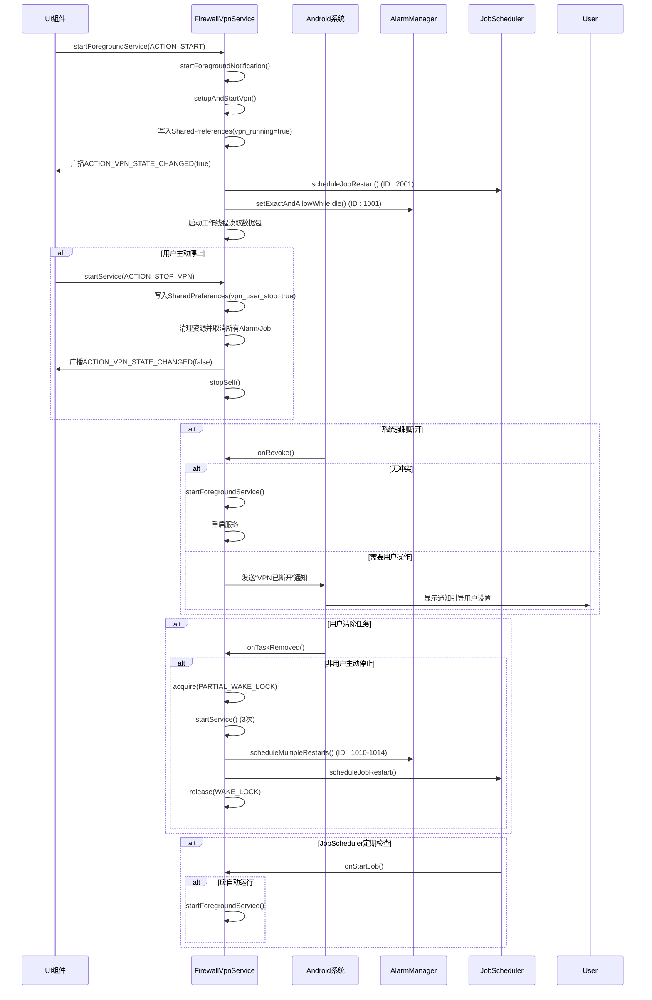

# VPN服务核心

<cite>
**Referenced Files in This Document**   
- [FirewallVpnService.kt](file://app/src/main/java/com/example/phonenet/FirewallVpnService.kt)
- [AndroidManifest.xml](file://app/src/main/AndroidManifest.xml)
- [VpnStateStore.kt](file://app/src/main/java/com/example/phonenet/VpnStateStore.kt)
- [KeepAliveJobService.kt](file://app/src/main/java/com/example/phonenet/KeepAliveJobService.kt)
</cite>

## 目录
1. [服务声明与前台服务兼容性](#服务声明与前台服务兼容性)
2. [onStartCommand方法处理逻辑](#onstartcommand方法处理逻辑)
3. [虚拟网络接口配置与应用拦截](#虚拟网络接口配置与应用拦截)
4. [前台通知创建技术细节](#前台通知创建技术细节)
5. [系统强制断开后的重连策略](#系统强制断开后的重连策略)
6. [服务生命周期时序图](#服务生命周期时序图)

## 服务声明与前台服务兼容性

`FirewallVpnService`作为stopnet应用的核心VPN服务，继承自Android系统的`VpnService`类，实现了应用级网络流量的拦截与管控功能。该服务在`AndroidManifest.xml`中通过`<service>`标签进行声明，并配置了关键属性以确保其在现代Android系统中的稳定运行。

服务声明中设置了`android:permission="android.permission.BIND_VPN_SERVICE"`权限，这是所有VPN服务必须声明的绑定权限，确保只有系统可以绑定该服务。更重要的是，服务配置了`android:foregroundServiceType="dataSync"`属性，这使得服务在Android 14（API 34）及以上系统中能够正确声明其前台服务类型为"数据同步"。这一配置至关重要，因为它满足了Android 14对前台服务类型的精细化要求，避免了因类型不匹配导致的服务启动失败或权限问题。

此外，服务设置`android:stopWithTask="false"`，确保当用户从最近任务中清除应用时，服务不会随之停止，从而维持网络防护的连续性。服务的`android:exported="false"`属性则保证了服务的私有性，防止其他应用恶意调用。

**Section sources**
- [FirewallVpnService.kt](file://app/src/main/java/com/example/phonenet/FirewallVpnService.kt#L15-L392)
- [AndroidManifest.xml](file://app/src/main/AndroidManifest.xml#L45-L52)

## onStartCommand方法处理逻辑

`onStartCommand()`方法是`FirewallVpnService`的入口点，负责处理来自不同组件的启动意图，并根据意图的`action`执行相应的逻辑。该方法实现了两种关键的意图处理：`ACTION_STOP_VPN`和`ACTION_RELOAD_WHITELIST`。

当接收到`ACTION_STOP_VPN`意图时，服务执行完整的资源清理和状态持久化流程。首先，它通过`SharedPreferences`将`"vpn_user_stop"`和`"vpn_running"`两个状态标志位设置为`false`，并将这些状态持久化到设备保护存储（Device Protected Storage）中，确保即使在设备加密锁定状态下，状态也能被正确保存。随后，服务发送`ACTION_VPN_STATE_CHANGED`广播，通知UI组件VPN状态已改变。在资源清理阶段，服务会中断工作线程、关闭虚拟网络接口文件描述符，并调用`stopForeground()`和`stopSelf()`来停止自身。一个关键的防护机制是，服务会取消所有先前通过`AlarmManager`安排的重启闹钟（ID 1001, 1010-1014）以及通过`JobScheduler`安排的保活任务（ID 2001），防止服务在被用户主动停止后被系统机制重新拉起。

当接收到`ACTION_RELOAD_WHITELIST`意图时，服务会优雅地重建VPN隧道。它首先中断当前的工作线程并关闭现有的虚拟网络接口，然后调用`setupAndStartVpn()`方法，该方法会从`SharedPreferences`中重新读取最新的白名单应用集合，并基于此重建网络配置。这种设计允许应用在不中断服务整体运行的情况下动态更新拦截规则。

**Section sources**
- [FirewallVpnService.kt](file://app/src/main/java/com/example/phonenet/FirewallVpnService.kt#L28-L127)

## 虚拟网络接口配置与应用拦截

`setupAndStartVpn()`方法负责构建和启动虚拟网络接口，这是实现应用级网络拦截的核心。该方法首先检查当前是否存在有效的`vpnInterface`和工作线程，以避免重复创建。

方法通过`VpnService.Builder`创建一个会话名为"StopNet Firewall"的虚拟网络。它为虚拟接口配置了IPv4地址`10.0.0.2/32`和一个指向`0.0.0.0/0`的默认路由，这意味着所有IPv4流量都将被重定向到此虚拟接口。同样，它也尝试配置IPv6地址`fd00:1:1::2/128`和默认路由`::/0`，以支持IPv6网络。

最关键的拦截逻辑在于`addDisallowedApplication()`的调用。服务从`SharedPreferences`中读取名为`"whitelist_packages"`的字符串集合，该集合包含了用户允许联网的应用包名。随后，服务遍历这个白名单集合，并对其中的每一个包名调用`builder.addDisallowedApplication(pkg)`。根据Android VpnService的机制，被添加到`disallowedApplications`列表中的应用将被禁止通过此VPN连接网络，从而实现了对白名单之外所有应用的网络拦截。

配置完成后，调用`builder.establish()`创建`ParcelFileDescriptor`，并将其封装在`FileInputStream`中。服务启动一个独立的工作线程，持续从该输入流中读取数据包。虽然当前实现中数据包被简单地丢弃（`buffer.clear()`），但这个线程的存在是维持VPN连接所必需的，其读取操作本身即代表了数据包的“处理”。

**Section sources**
- [FirewallVpnService.kt](file://app/src/main/java/com/example/phonenet/FirewallVpnService.kt#L261-L317)

## 前台通知创建技术细节

为了在Android 8.0（API 26）及以上系统中保持服务的前台状态，`FirewallVpnService`必须创建一个持续的通知。`startForegroundNotification()`方法负责这一任务。

该方法首先为Android O（API 26）及以上系统创建一个`NotificationChannel`，其ID为`"stopnet_vpn_channel"`，重要性级别为`IMPORTANCE_HIGH`。该通知渠道被配置为不显示角标、不闪烁、不震动、不发声，以减少对用户的干扰，同时其描述明确提示用户“请勿关闭”。

通知本身使用`NotificationCompat.Builder`构建，内容为“StopNet 网络管控运行中”和“正在保护设备网络安全，请勿关闭此通知”。通知的图标为系统信息图标，点击后将跳转至应用的`MainActivity`。通知被设置为`setOngoing(true)`和`setAutoCancel(false)`，使其无法被用户手动滑动清除，确保了服务的持续可见性。通知的优先级被设为`PRIORITY_MAX`，并归类为`CATEGORY_SERVICE`，以确保其在通知栏中获得最高优先级的展示。

在启动前台服务时，方法根据API级别进行兼容性处理。对于Android 14（API 34）及以上系统，调用`startForeground(id, notification, FOREGROUND_SERVICE_TYPE_DATA_SYNC)`，明确指定服务类型。对于旧版本系统，则调用传统的`startForeground(id, notification)`重载方法。

**Section sources**
- [FirewallVpnService.kt](file://app/src/main/java/com/example/phonenet/FirewallVpnService.kt#L319-L359)

## 系统强制断开后的重连策略

`onRevoke()`方法是系统强制断开VPN连接时的回调，例如当用户在系统设置中手动断开VPN或系统因策略原因撤销连接时。该方法实现了自动重连和用户引导的双重策略。

首先，服务调用`VpnService.prepare(this)`检查当前是否有其他VPN服务正在运行。如果返回`null`，说明没有冲突，服务会立即尝试通过`startForegroundService()`或`startService()`重新启动自身，实现无缝重连。

如果`prepare()`返回了一个`Intent`，则说明存在冲突或需要用户授权。此时，服务会创建一个高优先级的警示通知。该通知的标题为“VPN 已断开”，内容明确指导用户：“请在系统 VPN 设置中将 StopNet 设为“始终开启”，并启用“无 VPN 不允许连接”。” 这个通知会引导用户进入系统VPN设置页面，帮助用户正确配置系统策略，从而避免未来发生非预期的断开。

**Section sources**
- [FirewallVpnService.kt](file://app/src/main/java/com/example/phonenet/FirewallVpnService.kt#L361-L391)

## 服务生命周期时序图

**Diagram sources**
- [FirewallVpnService.kt](file://app/src/main/java/com/example/phonenet/FirewallVpnService.kt#L28-L392)
- [KeepAliveJobService.kt](file://app/src/main/java/com/example/phonenet/KeepAliveJobService.kt#L10-L70)

**Section sources**
- [FirewallVpnService.kt](file://app/src/main/java/com/example/phonenet/FirewallVpnService.kt#L28-L392)
- [KeepAliveJobService.kt](file://app/src/main/java/com/example/phonenet/KeepAliveJobService.kt#L10-L70)