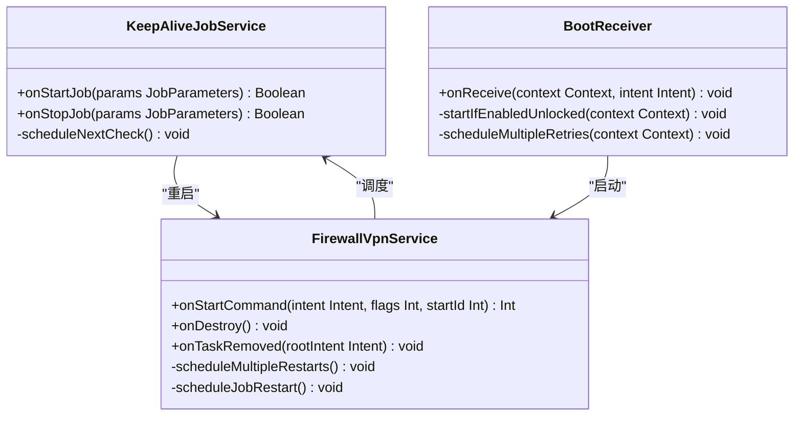
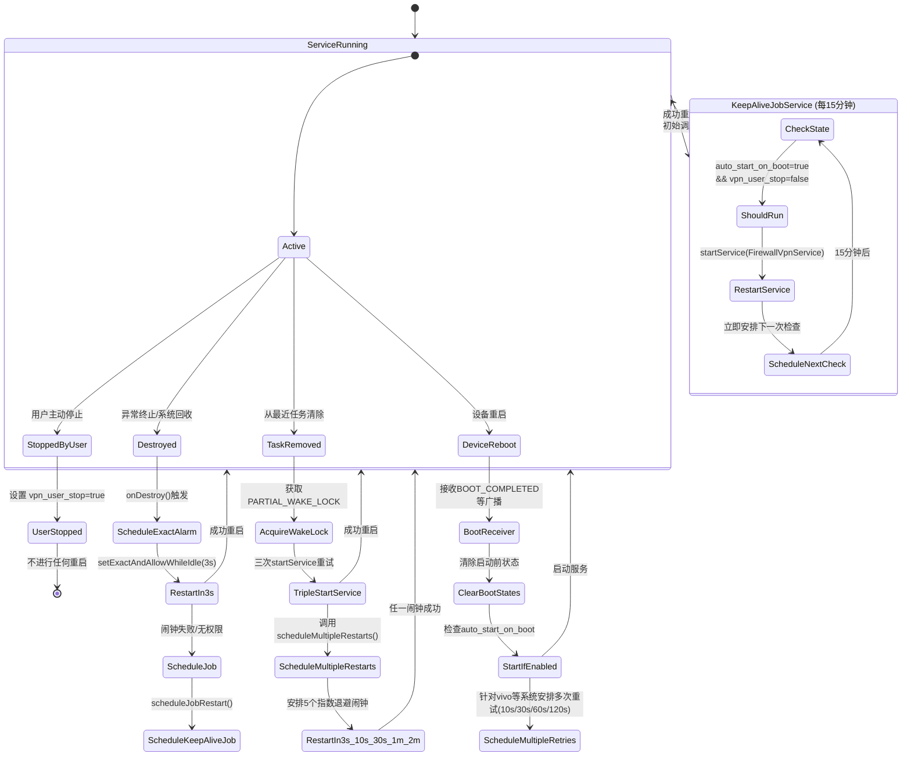

# 后台保活机制

<cite>
**Referenced Files in This Document**   
- [FirewallVpnService.kt](file://app/src/main/java/com/example/phonenet/FirewallVpnService.kt)
- [KeepAliveJobService.kt](file://app/src/main/java/com/example/phonenet/KeepAliveJobService.kt)
- [BootReceiver.kt](file://app/src/main/java/com/example/phonenet/BootReceiver.kt)
- [VpnStateStore.kt](file://app/src/main/java/com/example/phonenet/VpnStateStore.kt)
- [AndroidManifest.xml](file://app/src/main/AndroidManifest.xml)
</cite>

## Table of Contents
1. [核心保活策略概述](#核心保活策略概述)
2. [onDestroy() 精确闹钟重启机制](#ondestroy-精确闹钟重启机制)
3. [onTaskRemoved() 三重重试与唤醒锁](#ontaskremoved-三重重试与唤醒锁)
4. [指数退避式多节点闹钟策略](#指数退避式多节点闹钟策略)
5. [KeepAliveJobService 周期性保活](#keepalivejobservice-周期性保活)
6. [保活机制状态机](#保活机制状态机)

## 核心保活策略概述

stopnet应用通过多层级、多策略的协同机制，构建了一套高鲁棒性的后台保活体系。该系统以`FirewallVpnService`为核心，结合`KeepAliveJobService`和`BootReceiver`，实现了从服务异常终止到设备重启的全场景覆盖。保活策略分为三个主要层级：**即时重启**（基于`onDestroy`的3秒闹钟）、**任务清理恢复**（基于`onTaskRemoved`的三重重试）和**周期性守护**（基于`JobScheduler`的15分钟心跳）。所有策略均通过`SharedPreferences`中的`vpn_user_stop`和`auto_start_on_boot`状态进行智能判断，确保在用户主动停止服务时不会进行无意义的重启，从而兼顾了功能需求与用户体验。

**Section sources**
- [FirewallVpnService.kt](file://app/src/main/java/com/example/phonenet/FirewallVpnService.kt#L1-L50)
- [KeepAliveJobService.kt](file://app/src/main/java/com/example/phonenet/KeepAliveJobService.kt#L1-L20)

## onDestroy() 精确闹钟重启机制

当`FirewallVpnService`因异常或系统回收而被销毁时，`onDestroy()`方法会触发第一道保活防线。该机制的核心是使用`AlarmManager`的`setExactAndAllowWhileIdle`方法，在服务销毁后3秒（3000毫秒）安排一次精确的单次重启闹钟。

为适配Android 12+（API 31）引入的`Exact Alarms`权限，代码中通过`AlarmManager.canScheduleExactAlarms()`方法进行运行时检查。如果应用已获得该权限，则正常设置精确闹钟；若未获得权限，则作为降级方案，转而调度`KeepAliveJobService`的周期性任务，确保在无法使用精确闹钟的情况下仍有保活能力。此设计体现了对新旧Android版本的兼容性处理，保证了保活策略的普适性。

**Section sources**
- [FirewallVpnService.kt](file://app/src/main/java/com/example/phonenet/FirewallVpnService.kt#L129-L184)

## onTaskRemoved() 三重重试与唤醒锁

当用户从最近任务列表中手动清除应用时，系统会调用`onTaskRemoved()`方法。此场景下的保活策略更为激进，旨在对抗设备制造商（如vivo）的激进后台管理策略。

该机制包含两个关键组件：
1.  **三重`startService`重试**：通过一个`for`循环连续三次尝试启动`FirewallVpnService`，极大提高了在后台被限制的环境中成功启动的概率。
2.  **唤醒锁（PARTIAL_WAKE_LOCK）**：在执行重启逻辑前，会短暂获取一个持续5秒的`PARTIAL_WAKE_LOCK`。这能有效防止设备在Doze模式下进入深度休眠，确保CPU在重启过程中保持活跃，避免因系统休眠导致重启流程中断。

此双重保障机制显著提升了在用户主动清理任务后服务的恢复成功率。

**Section sources**
- [FirewallVpnService.kt](file://app/src/main/java/com/example/phonenet/FirewallVpnService.kt#L187-L218)

## 指数退避式多节点闹钟策略

`scheduleMultipleRestarts()`方法实现了一套更为强大的指数退避式闹钟策略。它通过`AlarmManager`一次性安排6个独立的`PendingIntent`，在3秒、10秒、30秒、1分钟和2分钟后触发重启，形成了一个多层次的时间容错网络。

这种设计的优势在于：
- **多节点容错**：即使某个时间点的闹钟因系统调度延迟或权限问题未能触发，后续的闹钟仍有机会成功拉起服务。
- **指数退避**：重启间隔从3秒开始，逐渐延长至2分钟，既保证了快速恢复，又避免了在短时间内过度消耗系统资源。
- **独立PendingIntent**：每个闹钟使用不同的请求码（1010-1014），确保它们是独立的调度单元，互不干扰。

该策略与`onDestroy`中的单次闹钟形成互补，共同构成了一个高可用的闹钟保活层。

**Section sources**
- [FirewallVpnService.kt](file://app/src/main/java/com/example/phonenet/FirewallVpnService.kt#L220-L245)

## KeepAliveJobService 周期性保活

`KeepAliveJobService`是保活体系中的长效守护者。它通过`JobScheduler` API，创建了一个ID为2001的周期性任务，每15分钟执行一次。

该服务的关键特性包括：
- **持久化调度（setPersisted）**：通过调用`setPersisted(true)`，确保该任务在设备重启后依然存在并继续执行，实现了跨设备重启的持久化保活。
- **业务逻辑判断**：在`onStartJob()`中，服务会读取`auto_start_on_boot`和`vpn_user_stop`两个共享偏好设置。只有当“开机自启”开关开启且用户未主动停止服务时，才会尝试重启`FirewallVpnService`。
- **链式调用机制**：在`jobFinished()`后，立即调用`scheduleNextCheck()`，重新安排下一次15分钟后的检查。这种“完成即预约”的模式保证了守护任务的连续性，形成了一个自我维持的保活循环。

此机制作为保活体系的最后防线，确保了即使其他所有即时重启策略都失败，服务也能在15分钟内被唤醒。

**Diagram sources**
- [KeepAliveJobService.kt](file://app/src/main/java/com/example/phonenet/KeepAliveJobService.kt#L1-L70)
- [FirewallVpnService.kt](file://app/src/main/java/com/example/phonenet/FirewallVpnService.kt#L1-L392)
- [BootReceiver.kt](file://app/src/main/java/com/example/phonenet/BootReceiver.kt#L1-L229)

**Section sources**
- [KeepAliveJobService.kt](file://app/src/main/java/com/example/phonenet/KeepAliveJobService.kt#L17-L46)
- [FirewallVpnService.kt](file://app/src/main/java/com/example/phonenet/FirewallVpnService.kt#L247-L259)

## 保活机制状态机

以下状态机图展示了`FirewallVpnService`在不同异常终止场景下的恢复路径及其优先级。

**Diagram sources**
- [FirewallVpnService.kt](file://app/src/main/java/com/example/phonenet/FirewallVpnService.kt)
- [KeepAliveJobService.kt](file://app/src/main/java/com/example/phonenet/KeepAliveJobService.kt)
- [BootReceiver.kt](file://app/src/main/java/com/example/phonenet/BootReceiver.kt)

**Section sources**
- [FirewallVpnService.kt](file://app/src/main/java/com/example/phonenet/FirewallVpnService.kt)
- [KeepAliveJobService.kt](file://app/src/main/java/com/example/phonenet/KeepAliveJobService.kt)
- [BootReceiver.kt](file://app/src/main/java/com/example/phonenet/BootReceiver.kt)