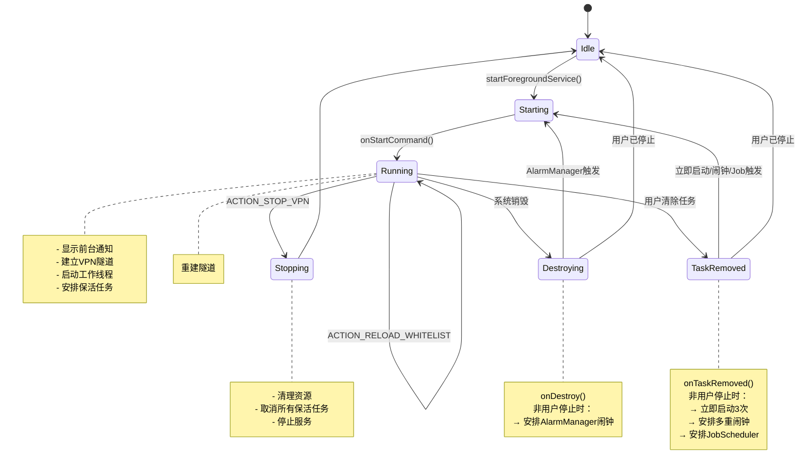

# 服务架构与保活机制

<cite>
**Referenced Files in This Document**   
- [FirewallVpnService.kt](file://app/src/main/java/com/example/phonenet/FirewallVpnService.kt)
- [KeepAliveJobService.kt](file://app/src/main/java/com/example/phonenet/KeepAliveJobService.kt)
- [AndroidManifest.xml](file://app/src/main/AndroidManifest.xml)
- [VpnStateStore.kt](file://app/src/main/java/com/example/phonenet/VpnStateStore.kt)
</cite>

## 目录
1. [简介](#简介)
2. [核心服务实现](#核心服务实现)
3. [前台服务声明](#前台服务声明)
4. [启动与命令处理](#启动与命令处理)
5. [服务自恢复机制](#服务自恢复机制)
6. [保活任务服务](#保活任务服务)
7. [服务生命周期](#服务生命周期)
8. [结论](#结论)

## 简介
本文档深入解析stopnet应用的服务架构，重点阐述其核心网络管控服务`FirewallVpnService`的实现机制。该服务继承自Android的`VpnService`，通过多层级的保活策略确保在各种系统条件下持续运行。文档详细说明了服务的前台声明、启动流程、命令处理逻辑以及在服务被销毁或任务被移除时的自恢复机制，并分析了`KeepAliveJobService`如何通过周期性任务维持服务的长期存活。

## 核心服务实现

`FirewallVpnService`是stopnet应用的核心组件，负责建立和管理VPN连接，实现网络流量的过滤与管控。该服务继承自Android的`VpnService`类，通过创建虚拟网络接口并配置路由规则，实现对设备网络流量的拦截与控制。

**Section sources**
- [FirewallVpnService.kt](file://app/src/main/java/com/example/phonenet/FirewallVpnService.kt#L1-L393)

## 前台服务声明

在`AndroidManifest.xml`文件中，`FirewallVpnService`被声明为一个前台服务，并指定了特定的前台服务类型：

```xml
<service
    android:name="com.example.stopnet.FirewallVpnService"
    android:permission="android.permission.BIND_VPN_SERVICE"
    android:foregroundServiceType="dataSync"
    android:exported="false"
    android:stopWithTask="false">
    <intent-filter>
        <action android:name="android.net.VpnService" />
    </intent-filter>
</service>
```

`android:foregroundServiceType="dataSync"`的声明至关重要。从Android 10（API 29）开始，使用`VpnService`必须在清单文件中声明此类型，否则服务将无法启动。此声明明确告知系统该服务用于数据同步和网络管控，使其能够获得必要的权限和后台执行能力，避免被系统轻易终止。

**Diagram sources**
- [AndroidManifest.xml](file://app/src/main/AndroidManifest.xml#L45-L53)

**Section sources**
- [AndroidManifest.xml](file://app/src/main/AndroidManifest.xml#L45-L53)

## 启动与命令处理

`FirewallVpnService`的生命周期由`onStartCommand()`方法控制，该方法处理来自应用其他组件的Intent命令。

### ACTION_STOP_VPN 处理
当接收到`ACTION_STOP_VPN`命令时，服务执行完整的资源清理和状态持久化流程：
1.  **状态持久化**：将`vpn_running`和`vpn_user_stop`标志写入`SharedPreferences`，记录用户主动停止的状态。
2.  **广播通知**：发送`ACTION_VPN_STATE_CHANGED`广播，通知UI和其他组件VPN状态已变为关闭。
3.  **内存状态同步**：更新`VpnStateStore`中的全局状态。
4.  **取消保活任务**：主动取消所有已安排的`AlarmManager`闹钟和`JobScheduler`任务，防止服务在停止后被再次拉起。
5.  **资源清理**：中断工作线程，关闭VPN接口文件描述符。
6.  **停止服务**：调用`stopSelf()`并返回`START_NOT_STICKY`，确保服务不会被系统自动重启。

### ACTION_RELOAD_WHITELIST 处理
当接收到`ACTION_RELOAD_WHITELIST`命令时，服务会：
1.  **重建隧道**：清理当前的VPN接口和工作线程，为重建新的网络隧道做准备。
2.  **重新配置**：在后续流程中，从`SharedPreferences`重新读取最新的白名单应用列表，并调用`setupAndStartVpn()`方法建立新的VPN连接。

**Diagram sources**
- [FirewallVpnService.kt](file://app/src/main/java/com/example/phonenet/FirewallVpnService.kt#L28-L127)

**Section sources**
- [FirewallVpnService.kt](file://app/src/main/java/com/example/phonenet/FirewallVpnService.kt#L28-L127)

## 服务自恢复机制

为了应对系统内存回收或用户手动清除任务，`FirewallVpnService`实现了多层级的自恢复策略。

### onDestroy() 中的恢复
当服务被系统销毁时（非用户主动停止），`onDestroy()`方法会检查`vpn_user_stop`标志。如果服务是被系统终止而非用户停止，它会立即通过`AlarmManager`安排一个精确的重启闹钟（3秒后执行），尝试重新启动服务。

### onTaskRemoved() 中的恢复
当用户从最近任务列表中清除应用时，`onTaskRemoved()`回调会被触发。在此方法中，服务会：
1.  **立即启动**：尝试立即启动服务3次。
2.  **安排多重闹钟**：调用`scheduleMultipleRestarts()`，使用`AlarmManager`安排一系列延迟递增的精确闹钟（3秒、10秒、30秒、1分钟、2分钟），形成时间梯度的重启尝试。
3.  **安排保活任务**：调用`scheduleJobRestart()`，确保`JobScheduler`任务被安排。

这种多层级的策略（立即启动 + 精确闹钟 + JobScheduler）极大地提高了服务在各种场景下的存活率。

**Diagram sources**
- [FirewallVpnService.kt](file://app/src/main/java/com/example/phonenet/FirewallVpnService.kt#L129-L218)

**Section sources**
- [FirewallVpnService.kt](file://app/src/main/java/com/example/phonenet/FirewallVpnService.kt#L129-L218)

## 保活任务服务

`KeepAliveJobService`是一个`JobService`，它与`JobScheduler`协同工作，提供长期、持久的保活能力。

### 工作原理
1.  **周期性执行**：`KeepAliveJobService`被配置为一个周期性任务，每15分钟执行一次。
2.  **状态检查**：每次执行时，它会检查`auto_start_on_boot`和`vpn_user_stop`这两个共享首选项中的标志，以确定是否应该启动`FirewallVpnService`。
3.  **启动主服务**：如果条件满足，它会调用`startForegroundService()`来启动主VPN服务。
4.  **安排下一次执行**：在任务结束前，它会调用`scheduleNextCheck()`来安排下一次15分钟后的执行。

### 持久化特性
`JobScheduler`的一个关键优势是其任务的持久化。通过在`JobInfo.Builder`中调用`.setPersisted(true)`，即使设备重启，这个周期性任务也会被系统自动恢复并继续执行。这确保了应用在设备重启后能够自动恢复网络管控功能，无需用户手动干预。

**Diagram sources**
- [KeepAliveJobService.kt](file://app/src/main/java/com/example/phonenet/KeepAliveJobService.kt#L17-L69)
- [FirewallVpnService.kt](file://app/src/main/java/com/example/phonenet/FirewallVpnService.kt#L247-L259)

**Section sources**
- [KeepAliveJobService.kt](file://app/src/main/java/com/example/phonenet/KeepAliveJobService.kt#L1-L71)
- [FirewallVpnService.kt](file://app/src/main/java/com/example/phonenet/FirewallVpnService.kt#L247-L259)

## 服务生命周期

下图展示了`FirewallVpnService`的完整生命周期，包括启动、运行、销毁和重启的各个流程。



**Diagram sources**
- [FirewallVpnService.kt](file://app/src/main/java/com/example/phonenet/FirewallVpnService.kt#L28-L218)
- [KeepAliveJobService.kt](file://app/src/main/java/com/example/phonenet/KeepAliveJobService.kt#L17-L46)

## 结论

`stopnet`应用通过精心设计的服务架构实现了强大的后台保活能力。`FirewallVpnService`作为核心，利用前台服务声明获得系统豁免，并通过`onStartCommand()`、`onDestroy()`和`onTaskRemoved()`等生命周期方法，结合`AlarmManager`的精确闹钟和`JobScheduler`的持久化周期任务，构建了一个多维度、高可靠性的自恢复网络。`KeepAliveJobService`则作为保活策略的基石，确保了服务在设备重启后也能自动恢复。这种分层协作的架构设计，有效保障了应用网络管控功能的持续性和稳定性。