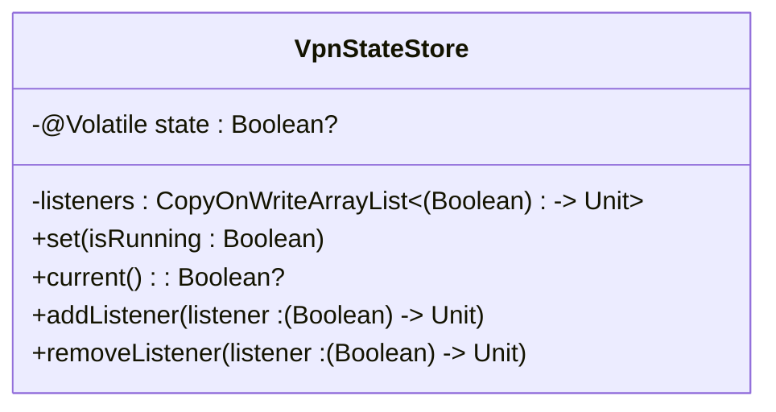
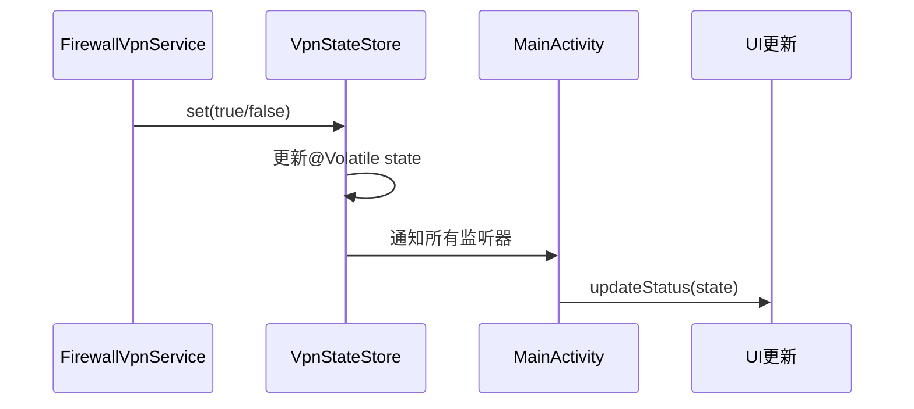

# 状态管理机制

<cite>
**Referenced Files in This Document**   
- [VpnStateStore.kt](file://app/src/main/java/com/example/phonenet/VpnStateStore.kt)
- [MainActivity.kt](file://app/src/main/java/com/example/phonenet/MainActivity.kt)
- [SettingsActivity.kt](file://app/src/main/java/com/example/phonenet/SettingsActivity.kt)
- [FirewallVpnService.kt](file://app/src/main/java/com/example/phonenet/FirewallVpnService.kt)
</cite>

## 目录
1. [简介](#简介)
2. [核心状态中枢：VpnStateStore](#核心状态中枢：vpnstatestore)
3. [线程安全与可见性保障](#线程安全与可见性保障)
4. [状态变更与通知机制](#状态变更与通知机制)
5. [观察者模式实现](#观察者模式实现)
6. [UI层状态订阅与响应](#ui层状态订阅与响应)
7. [MVVM架构中的角色](#mvvm架构中的角色)
8. [与SharedPreferences的对比](#与sharedpreferences的对比)
9. [完整状态流图](#完整状态流图)
10. [结论](#结论)

## 简介
本文档详细阐述了stopnet应用中基于`VpnStateStore`单例对象的全局状态管理机制。该机制作为应用的核心状态中枢，实现了跨组件、跨线程的VPN运行状态同步。文档将深入分析其线程安全设计、状态通知流程、UI层集成方式，并与传统持久化方案进行对比，全面展示其在现代Android应用架构中的优势。

## 核心状态中枢：VpnStateStore
`VpnStateStore`是一个Kotlin单例对象，作为整个应用的全局状态中枢，负责集中管理VPN服务的运行状态。它通过内存中的单一状态源（Single Source of Truth）模式，确保了状态的一致性和可预测性。该对象封装了状态的读取、更新和监听功能，为`MainActivity`、`SettingsActivity`以及后台服务`FirewallVpnService`提供了统一的状态访问接口，有效解耦了业务逻辑与状态管理。

**Section sources**
- [VpnStateStore.kt](file://app/src/main/java/com/example/phonenet/VpnStateStore.kt#L4-L29)

## 线程安全与可见性保障
为了应对Android应用中复杂的多线程环境，`VpnStateStore`采用了双重保障机制来确保状态的线程安全。

首先，`state`变量使用`@Volatile`关键字修饰。这保证了该变量的写操作对所有线程立即可见，防止了因CPU缓存导致的脏读问题。当`FirewallVpnService`在后台线程中更新状态时，`MainActivity`在主线程中通过`current()`方法读取到的值始终是最新的。

其次，观察者列表`listeners`采用了`CopyOnWriteArrayList`这一线程安全的数据结构。该结构在遍历（如通知所有监听器）时不会抛出`ConcurrentModificationException`，并且在添加或移除监听器时，会创建一个新的底层数组副本，从而保证了读操作的无锁高效性，非常适合读多写少的观察者模式场景。



**Diagram sources**
- [VpnStateStore.kt](file://app/src/main/java/com/example/phonenet/VpnStateStore.kt#L5-L6)
- [VpnStateStore.kt](file://app/src/main/java/com/example/phonenet/VpnStateStore.kt#L7-L7)

## 状态变更与通知机制
`VpnStateStore`通过`set()`方法实现状态的同步更新。当调用`set(isRunning: Boolean)`时，方法首先将`@Volatile`修饰的`state`变量更新为新值，确保了状态的可见性。随后，它会遍历`CopyOnWriteArrayList`中的所有监听器，并在`try-catch`块中安全地调用每个监听器函数，传递最新的状态值。

这种设计确保了状态变更的原子性和通知的可靠性。即使某个监听器在执行时抛出异常，也不会中断对其他监听器的通知流程，从而保证了整个状态系统的健壮性。

**Section sources**
- [VpnStateStore.kt](file://app/src/main/java/com/example/phonenet/VpnStateStore.kt#L9-L14)

## 观察者模式实现
`VpnStateStore`完整实现了观察者模式，其核心在于`addListener()`和`removeListener()`方法。

`addListener()`方法不仅将新的监听器加入列表，还具备关键的“状态回放”（state replay）功能。在添加监听器之前，它会检查当前的`state`是否为非空。如果是，则立即使用当前状态调用该监听器一次，确保新注册的组件（如刚创建的`MainActivity`）能够立即获取到最新的VPN运行状态，而无需等待下一次状态变更。这极大地提升了用户体验，避免了UI因初始状态未知而出现的短暂空白或错误状态。

`removeListener()`方法则负责在组件（如Activity）销毁时，安全地移除监听器，防止内存泄漏和无效回调。

**Section sources**
- [VpnStateStore.kt](file://app/src/main/java/com/example/phonenet/VpnStateStore.kt#L18-L28)

## UI层状态订阅与响应
在`MainActivity`和`SettingsActivity`中，状态管理机制得到了实际应用。

`MainActivity`在`onStart()`生命周期方法中通过`VpnStateStore.addListener(onVpnStateChanged)`订阅状态变更。`onVpnStateChanged`是一个Lambda函数，它在每次状态更新时被调用，负责刷新UI按钮的文本和颜色。在`onStop()`方法中，通过`removeListener()`取消订阅，遵循了Android组件的生命周期管理原则。

此外，`MainActivity`还通过一个`BroadcastReceiver`接收来自`FirewallVpnService`的广播。在接收到广播后，它会立即调用`VpnStateStore.set()`来同步内存状态，然后再更新UI，确保了状态源的统一。



**Diagram sources**
- [MainActivity.kt](file://app/src/main/java/com/example/phonenet/MainActivity.kt#L119-L156)
- [FirewallVpnService.kt](file://app/src/main/java/com/example/phonenet/FirewallVpnService.kt#L28-L127)

## MVVM架构中的角色
尽管本应用未严格遵循标准的MVVM模式，但`VpnStateStore`的设计理念与MVVM的核心思想高度契合。它扮演了类似“ViewModel”的角色，作为UI层与数据层（`FirewallVpnService`）之间的桥梁。

`FirewallVpnService`作为数据源，负责与系统VPN API交互并产生状态变更。`VpnStateStore`作为状态容器，接收并管理这些状态。`MainActivity`和`SettingsActivity`作为视图层，仅负责订阅状态并更新UI，不直接处理复杂的业务逻辑。这种分层使得代码结构清晰，职责分明，便于维护和测试。

## 与SharedPreferences的对比
相比于使用`SharedPreferences`来持久化和共享状态，`VpnStateStore`方案具有显著优势：

1.  **实时性**：`SharedPreferences`的读写涉及I/O操作，存在延迟。而`VpnStateStore`基于内存，状态变更和通知几乎是即时的，提供了更流畅的用户体验。
2.  **内存同步**：`SharedPreferences`在多进程或高并发场景下可能出现读写不一致。`VpnStateStore`通过`@Volatile`和`CopyOnWriteArrayList`确保了内存状态的强一致性。
3.  **解耦**：`SharedPreferences`要求组件直接与持久化层耦合。`VpnStateStore`提供了一个抽象层，UI组件只需关注状态变更，无需关心状态的来源和持久化细节。

当然，`SharedPreferences`在应用重启后仍能保留状态，而内存状态会丢失。因此，本应用采用了混合策略：`VpnStateStore`用于实时同步，`SharedPreferences`作为持久化备份，在应用启动时回退读取。

## 完整状态流图
下图展示了从服务状态变化到UI更新的完整数据流。

```mermaid
flowchart TD
A[FirewallVpnService] --> |onStartCommand| B[VpnStateStore.set()]
A --> |onDestroy| B
A --> |onTaskRemoved| B
B --> C[更新@Volatile state]
B --> D[遍历listeners]
D --> E[调用onVpnStateChanged]
E --> F[MainActivity.updateStatus()]
F --> G[更新按钮文本和颜色]
H[MainActivity.onStart] --> I[VpnStateStore.addListener()]
I --> D
```

**Diagram sources**
- [FirewallVpnService.kt](file://app/src/main/java/com/example/phonenet/FirewallVpnService.kt#L28-L127)
- [VpnStateStore.kt](file://app/src/main/java/com/example/phonenet/VpnStateStore.kt#L9-L14)
- [MainActivity.kt](file://app/src/main/java/com/example/phonenet/MainActivity.kt#L119-L156)

## 结论
`VpnStateStore`单例对象是stopnet应用状态管理的核心。它通过`@Volatile`关键字和`CopyOnWriteArrayList`实现了高效、安全的多线程状态同步，并通过观察者模式和状态回放功能，为UI层提供了实时、可靠的状态更新。该设计在MVVM架构思想的指导下，有效解耦了组件，提升了代码的可维护性和用户体验，是Android应用中实现全局状态管理的一个优秀实践。