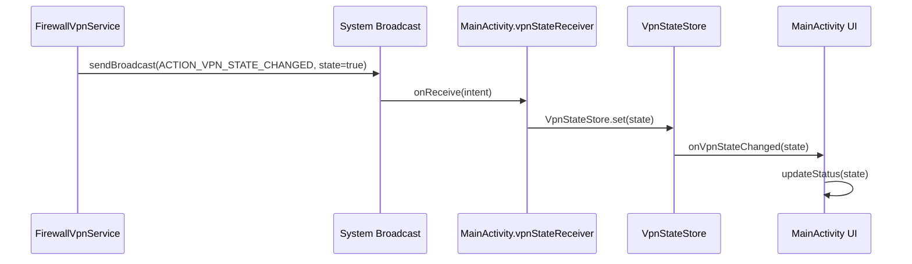

# 应用内事件通信机制

<cite>
**Referenced Files in This Document**   
- [FirewallVpnService.kt](file://app/src/main/java/com/example/phonenet/FirewallVpnService.kt)
- [BootReceiver.kt](file://app/src/main/java/com/example/phonenet/BootReceiver.kt)
- [VpnStateStore.kt](file://app/src/main/java/com/example/phonenet/VpnStateStore.kt)
- [MainActivity.kt](file://app/src/main/java/com/example/phonenet/MainActivity.kt)
- [AndroidManifest.xml](file://app/src/main/AndroidManifest.xml)
</cite>

## 目录
1. [简介](#简介)
2. [核心事件广播机制](#核心事件广播机制)
3. [服务生命周期与广播触发](#服务生命周期与广播触发)
4. [自定义重启广播与保活机制](#自定义重启广播与保活机制)
5. [安全性与包限定广播](#安全性与包限定广播)
6. [应用内事件流序列图](#应用内事件流序列图)
7. [内存状态同步与VpnStateStore](#内存状态同步与vpnstatestore)
8. [结论](#结论)

## 简介
本文档深入解析stopnet应用内部基于Intent广播的组件间通信模式。重点阐述`FirewallVpnService`如何通过`ACTION_VPN_STATE_CHANGED`广播通知UI组件服务状态变更，以及`BootReceiver`如何监听`ACTION_RESTART_VPN`广播实现服务自启与保活。文档详细说明了广播在服务关键生命周期中的触发时机、业务意义、安全性设计，并通过序列图展示从服务状态变化到UI更新的完整事件流，同时解释`VpnStateStore`单例如何与广播机制协同工作，确保应用内状态的一致性。

## 核心事件广播机制

stopnet应用采用Android标准的Intent广播机制实现组件间松耦合通信。核心广播定义在`FirewallVpnService`中，用于通知应用内其他组件（主要是Activity）VPN服务的运行状态。

```kotlin
companion object {
    const val ACTION_VPN_STATE_CHANGED = "com.example.stopnet.VPN_STATE_CHANGED"
    const val EXTRA_VPN_STATE = "vpn_state"
}
```

该广播通过`sendBroadcast`方法发送，携带一个布尔值的`EXTRA_VPN_STATE`额外数据，表示服务当前是运行（`true`）还是停止（`false`）。这种设计使得状态变更的生产者（`FirewallVpnService`）和消费者（如`MainActivity`）完全解耦，任何对`ACTION_VPN_STATE_CHANGED`感兴趣的组件都可以通过注册广播接收器来监听状态变化。

**Section sources**
- [FirewallVpnService.kt](file://app/src/main/java/com/example/phonenet/FirewallVpnService.kt#L2-L5)

## 服务生命周期与广播触发

`FirewallVpnService`在多个关键生命周期方法中触发`ACTION_VPN_STATE_CHANGED`广播，以确保UI能实时反映服务的真实状态。

### onStartCommand中的状态广播
当服务被启动或重启时，`onStartCommand`方法会被调用。在此方法中，无论服务是因用户操作还是系统重启而启动，只要成功建立VPN连接，就会发送一个携带`true`值的广播，通知所有监听者服务已进入运行状态。这确保了UI能立即更新为“已启动”状态。

**Section sources**
- [FirewallVpnService.kt](file://app/src/main/java/com/example/phonenet/FirewallVpnService.kt#L28-L127)

### onDestroy中的状态广播
当服务被销毁时（非用户主动停止），`onDestroy`方法会发送一个携带`false`值的广播。这通常发生在服务因异常或系统资源回收而终止时。发送此广播的目的是通知UI服务已停止，以便用户能感知到状态变化并采取相应操作。

**Section sources**
- [FirewallVpnService.kt](file://app/src/main/java/com/example/phonenet/FirewallVpnService.kt#L129-L184)

### onTaskRemoved中的状态广播
当用户从最近任务列表中清除应用时，`onTaskRemoved`方法会被调用。虽然此方法本身不直接发送广播，但它会触发服务的重启逻辑。重启成功后，新的服务实例会再次调用`onStartCommand`，从而发送`true`状态的广播。这保证了即使用户手动“清理”了应用，服务重启后UI状态也能正确同步。

**Section sources**
- [FirewallVpnService.kt](file://app/src/main/java/com/example/phonenet/FirewallVpnService.kt#L187-L218)

## 自定义重启广播与保活机制

为了增强服务在复杂环境下的存活能力，stopnet应用设计了一套基于自定义广播`ACTION_RESTART_VPN`的保活机制。

### BootReceiver监听重启广播
`BootReceiver`不仅监听系统启动广播（`BOOT_COMPLETED`），还明确注册了对`ACTION_RESTART_VPN`的监听。当接收到此广播时，`BootReceiver`会立即调用`startIfEnabledUnlocked`方法，尝试重新启动`FirewallVpnService`。

```kotlin
when (action) {
    "com.example.stopnet.ACTION_RESTART_VPN" -> {
        Log.d(TAG, "接收到重启VPN请求")
        startIfEnabledUnlocked(context)
    }
}
```

**Section sources**
- [BootReceiver.kt](file://app/src/main/java/com/example/phonenet/BootReceiver.kt#L14-L50)

### 多层次的重启触发
`ACTION_RESTART_VPN`广播由多个场景触发：
1.  **服务销毁后**：`onDestroy`方法在非用户停止的情况下，会通过`AlarmManager`安排一个延迟3秒的`ACTION_RESTART_VPN`广播。
2.  **任务被移除后**：`onTaskRemoved`方法会安排多个不同延迟的`ACTION_RESTART_VPN`广播，以应对不同厂商ROM的后台限制。
3.  **设备启动后**：`BootReceiver`在处理`BOOT_COMPLETED`时，会安排多次`ACTION_RESTART_VPN`广播，以应对vivo等系统严格的后台管控。

这种多层次、多延迟的重启策略，极大地提高了服务在各种极端情况下的恢复能力。

**Section sources**
- [FirewallVpnService.kt](file://app/src/main/java/com/example/phonenet/FirewallVpnService.kt#L159-L184)
- [BootReceiver.kt](file://app/src/main/java/com/example/phonenet/BootReceiver.kt#L53-L90)

## 安全性与包限定广播

为了防止其他应用窃听stopnet的内部状态变更，所有发送的`ACTION_VPN_STATE_CHANGED`广播都使用了`setPackage(packageName)`进行包限定。

```kotlin
val broadcastIntent = Intent(ACTION_VPN_STATE_CHANGED).apply {
    setPackage(packageName)
    putExtra(EXTRA_VPN_STATE, true)
}
sendBroadcast(broadcastIntent)
```

这一安全措施确保了只有stopnet应用自身（即包名为`com.example.stopnet`的应用）才能接收到这些广播。这有效防止了恶意应用通过监听广播来探测stopnet的运行状态，从而保护了用户隐私和应用安全。

**Section sources**
- [FirewallVpnService.kt](file://app/src/main/java/com/example/phonenet/FirewallVpnService.kt#L85-L88)

## 应用内事件流序列图

以下序列图展示了从`FirewallVpnService`状态变化到`MainActivity`UI更新的完整链路。



**Diagram sources**
- [FirewallVpnService.kt](file://app/src/main/java/com/example/phonenet/FirewallVpnService.kt#L106-L109)
- [MainActivity.kt](file://app/src/main/java/com/example/phonenet/MainActivity.kt#L41-L49)
- [VpnStateStore.kt](file://app/src/main/java/com/example/phonenet/VpnStateStore.kt#L9-L14)
- [MainActivity.kt](file://app/src/main/java/com/example/phonenet/MainActivity.kt#L36-L38)

## 内存状态同步与VpnStateStore

`VpnStateStore`是一个单例对象，作为应用内VPN状态的单一可信来源（Single Source of Truth）。它与广播机制协同工作，确保状态同步的可靠性和即时性。

### 双重状态同步
1.  **广播同步**：`MainActivity`通过`BroadcastReceiver`接收`ACTION_VPN_STATE_CHANGED`广播，并调用`VpnStateStore.set(state)`将状态写入单例。
2.  **直接同步**：`MainActivity`在用户操作（如点击“启动”按钮）后，会直接调用`VpnStateStore.set(true)`来预设状态，避免UI在服务响应前出现回退。

### 状态监听与UI更新
`MainActivity`通过`VpnStateStore.addListener(onVpnStateChanged)`注册一个监听器。每当`VpnStateStore.set()`被调用时，所有注册的监听器都会被触发，从而立即更新UI。这种设计保证了无论状态变更来自广播还是直接调用，UI都能得到及时、一致的更新。

**Section sources**
- [VpnStateStore.kt](file://app/src/main/java/com/example/phonenet/VpnStateStore.kt#L1-L30)
- [MainActivity.kt](file://app/src/main/java/com/example/phonenet/MainActivity.kt#L36-L38)
- [MainActivity.kt](file://app/src/main/java/com/example/phonenet/MainActivity.kt#L41-L49)

## 结论
stopnet应用构建了一个健壮、安全的应用内事件通信系统。通过`ACTION_VPN_STATE_CHANGED`广播，实现了服务与UI之间的高效状态同步。利用`ACTION_RESTART_VPN`广播和`BootReceiver`，设计了一套多层次的保活机制，显著提升了服务的存活率。通过`setPackage(packageName)`确保了内部通信的安全性。最后，`VpnStateStore`单例作为状态中枢，与广播机制完美结合，确保了应用内状态的一致性和UI的即时响应。这一整套机制是stopnet应用稳定运行的核心保障。