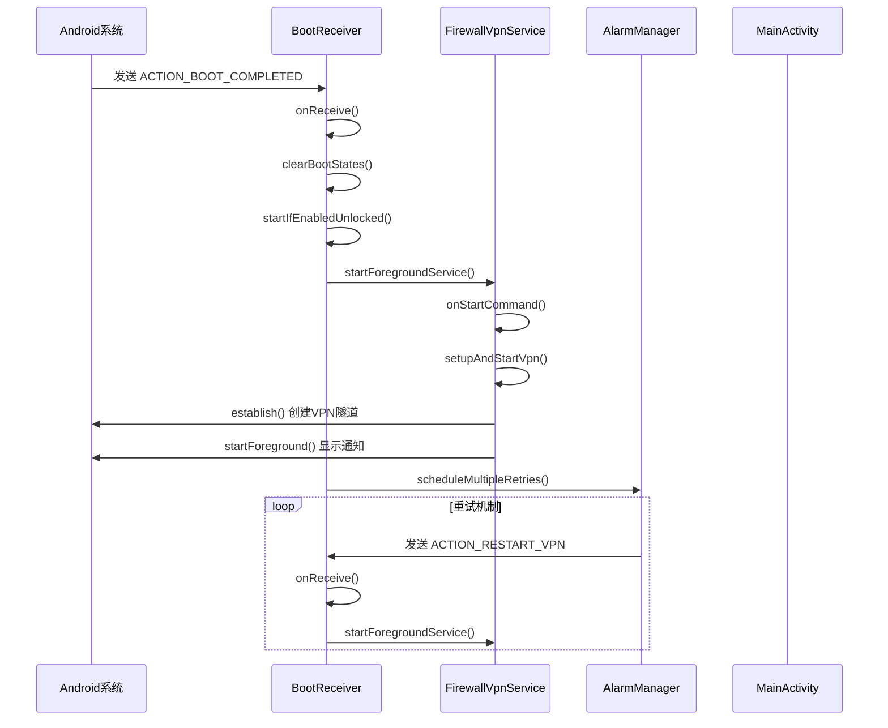
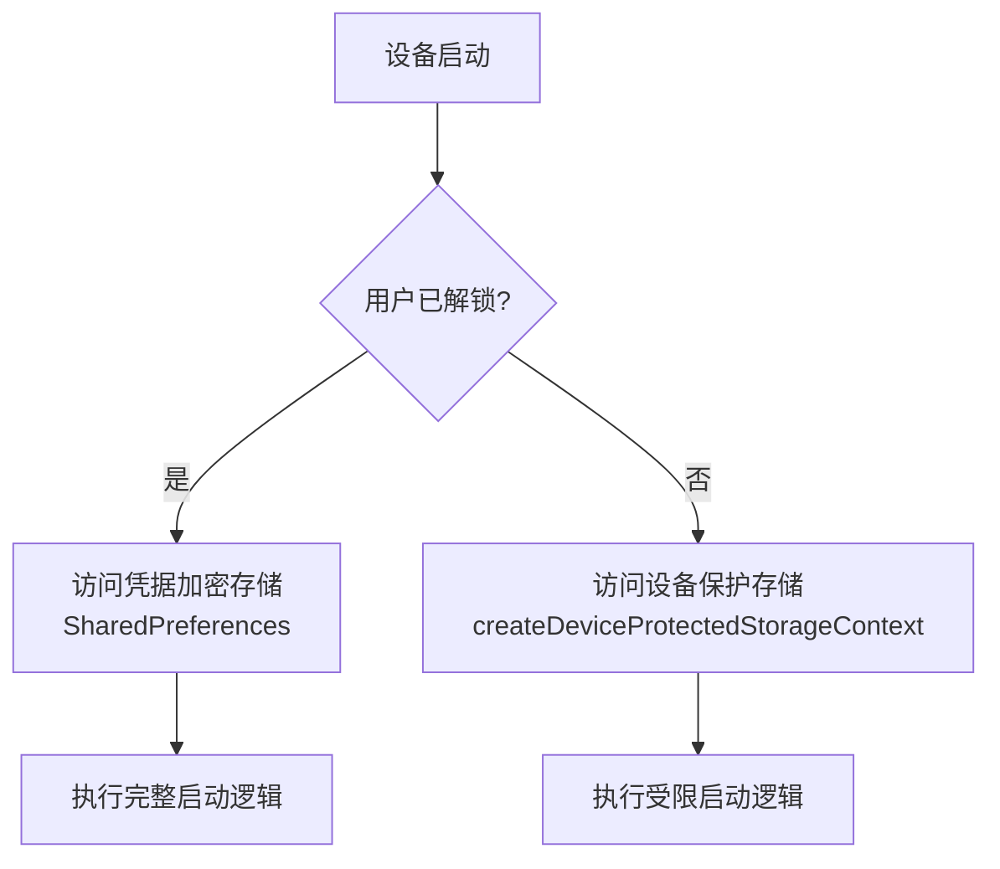
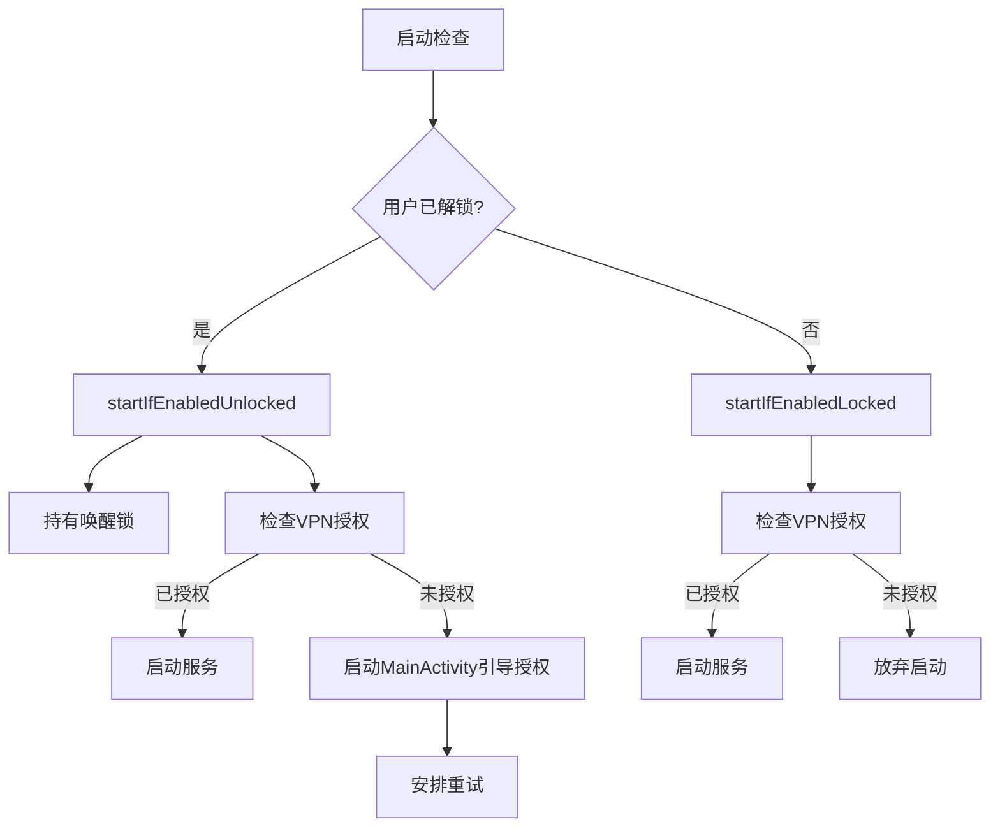

# 系统广播响应机制

<cite>
**Referenced Files in This Document**   
- [BootReceiver.kt](file://app/src/main/java/com/example/phonenet/BootReceiver.kt)
- [AndroidManifest.xml](file://app/src/main/AndroidManifest.xml)
- [FirewallVpnService.kt](file://app/src/main/java/com/example/phonenet/FirewallVpnService.kt)
- [VpnStateStore.kt](file://app/src/main/java/com/example/phonenet/VpnStateStore.kt)
- [MainActivity.kt](file://app/src/main/java/com/example/phonenet/MainActivity.kt)
</cite>

## 目录
1. [系统广播响应机制](#系统广播响应机制)
2. [核心组件](#核心组件)
3. [启动流程与执行时序](#启动流程与执行时序)
4. [直接启动模式与设备保护存储](#直接启动模式与设备保护存储)
5. [差异化启动逻辑分析](#差异化启动逻辑分析)
6. [兼容性处理与重试机制](#兼容性处理与重试机制)
7. [结论](#结论)

## 核心组件

`BootReceiver` 是 stopnet 应用的核心系统事件监听器，负责响应设备启动、用户解锁等关键广播事件。该组件通过 `onReceive` 方法接收并处理来自系统的广播，根据不同的动作类型（ACTION）执行相应的启动逻辑。其主要职责包括清除旧的运行状态、判断启动条件、调用服务启动方法以及安排重试任务。`BootReceiver` 与 `FirewallVpnService` 紧密协作，确保 VPN 服务能够在合适的时机被正确启动。

`FirewallVpnService` 是应用的核心服务，继承自 `VpnService`，负责建立和管理网络防火墙隧道。该服务通过 `onStartCommand` 方法响应启动请求，创建虚拟网络接口，配置路由规则，并启动数据处理线程。服务在启动时会创建前台通知以保证后台运行的稳定性，并通过 `AlarmManager` 和 `JobScheduler` 实现自我保护和重启机制，防止被系统杀死。

`VpnStateStore` 是一个全局状态管理对象，采用单例模式实现，用于在应用的不同组件间同步 VPN 服务的运行状态。它维护一个内存中的布尔值，并提供监听器机制，使得 UI 界面（如 `MainActivity`）能够实时响应服务状态的变化，实现界面与后台服务的解耦。

**Section sources**
- [BootReceiver.kt](file://app/src/main/java/com/example/phonenet/BootReceiver.kt#L1-L230)
- [FirewallVpnService.kt](file://app/src/main/java/com/example/phonenet/FirewallVpnService.kt#L1-L393)
- [VpnStateStore.kt](file://app/src/main/java/com/example/phonenet/VpnStateStore.kt#L1-L30)

## 启动流程与执行时序

**Diagram sources**
- [BootReceiver.kt](file://app/src/main/java/com/example/phonenet/BootReceiver.kt#L14-L50)
- [FirewallVpnService.kt](file://app/src/main/java/com/example/phonenet/FirewallVpnService.kt#L28-L127)

**Section sources**
- [BootReceiver.kt](file://app/src/main/java/com/example/phonenet/BootReceiver.kt#L14-L50)
- [FirewallVpnService.kt](file://app/src/main/java/com/example/phonenet/FirewallVpnService.kt#L28-L127)

## 直接启动模式与设备保护存储

从 Android 7.0 (API 24) 开始，系统引入了直接启动（Direct Boot）模式，允许设备在用户解锁前运行部分应用。为了支持此功能，`BootReceiver` 在 `AndroidManifest.xml` 中被声明为 `directBootAware="true"`。这使得接收器能够在设备锁定启动完成（`ACTION_LOCKED_BOOT_COMPLETED`）时被触发，即使用户尚未解锁设备。

在直接启动模式下，应用只能访问设备保护存储（Device Protected Storage）中的数据，而无法访问凭据加密存储（Credential Encrypted Storage）。`BootReceiver` 通过调用 `context.createDeviceProtectedStorageContext()` 方法获取一个特殊的上下文环境，该环境可以访问设备保护存储。此方法在 `clearBootStates` 和 `startIfEnabledLocked` 方法中被使用，用于读取和写入存储在设备保护存储中的 `SharedPreferences`。例如，在 `startIfEnabledLocked` 方法中，代码会从设备保护存储中读取 `auto_start_on_boot` 开关的状态，以决定是否在锁定状态下启动服务。

**Diagram sources**
- [BootReceiver.kt](file://app/src/main/java/com/example/phonenet/BootReceiver.kt#L64-L75)
- [BootReceiver.kt](file://app/src/main/java/com/example/phonenet/BootReceiver.kt#L113-L142)

**Section sources**
- [BootReceiver.kt](file://app/src/main/java/com/example/phonenet/BootReceiver.kt#L64-L75)
- [BootReceiver.kt](file://app/src/main/java/com/example/phonenet/BootReceiver.kt#L113-L142)
- [AndroidManifest.xml](file://app/src/main/AndroidManifest.xml#L80-L84)

## 差异化启动逻辑分析

`BootReceiver` 实现了两种不同的启动逻辑：`startIfEnabledLocked` 和 `startIfEnabledUnlocked`，以适应设备的不同状态。

`startIfEnabledLocked` 方法专为锁定状态设计。在此状态下，应用功能受限，无法启动 Activity。因此，该方法的逻辑非常谨慎：它首先检查“开机自启”开关，如果开启，则尝试直接启动 `FirewallVpnService`。然而，如果系统尚未授予 VPN 权限（`VpnService.prepare(context)` 返回非 null 的 Intent），则无法在后台完成授权流程，因此该方法会直接放弃启动，并记录警告日志。这体现了在锁定状态下处理 VPN 服务启动的固有风险和限制。

`startIfEnabledUnlocked` 方法则用于用户解锁后的场景，拥有完整的功能权限。除了检查自启开关外，该方法还持有 `PARTIAL_WAKE_LOCK` 唤醒锁，以防止在 vivo 等定制 ROM 的激进后台管理策略下，启动流程被中断。如果已获得 VPN 授权，则直接启动服务。如果未授权，它会尝试启动 `MainActivity`，引导用户完成授权操作。即使启动失败，也会通过 `scheduleRetry` 安排一次短延时重试，提高了启动成功率。

**Diagram sources**
- [BootReceiver.kt](file://app/src/main/java/com/example/phonenet/BootReceiver.kt#L112-L142)
- [BootReceiver.kt](file://app/src/main/java/com/example/phonenet/BootReceiver.kt#L144-L207)

**Section sources**
- [BootReceiver.kt](file://app/src/main/java/com/example/phonenet/BootReceiver.kt#L112-L142)
- [BootReceiver.kt](file://app/src/main/java/com/example/phonenet/BootReceiver.kt#L144-L207)

## 兼容性处理与重试机制

为了应对 vivo 等定制 ROM 对后台应用的严格限制，`BootReceiver` 实现了多层次的兼容性处理和重试机制。

首先，在 `AndroidManifest.xml` 中，`BootReceiver` 的 `intent-filter` 设置了极高的优先级 `priority="999"`。这确保了 stopnet 的接收器会在其他应用之前收到 `BOOT_COMPLETED` 广播，抢占宝贵的启动窗口期。

其次，`scheduleMultipleRetries` 方法是核心的兼容性策略。在收到 `ACTION_BOOT_COMPLETED` 广播后，该方法会利用 `AlarmManager` 安排四次精确的闹钟，分别在开机后 10 秒、30 秒、60 秒和 120 秒再次触发 `ACTION_RESTART_VPN` 广播。这种“多次重试”的设计极大地增加了服务最终被成功启动的概率，即使前几次尝试因系统资源紧张或后台限制而失败。

此外，`FirewallVpnService` 自身也实现了强大的自我保护机制。在 `onDestroy` 和 `onTaskRemoved` 回调中，如果服务不是被用户主动停止的，它会立即安排一次或多次重启闹钟以及一个 `JobScheduler` 任务，确保服务能够从各种意外终止中恢复。

**Section sources**
- [BootReceiver.kt](file://app/src/main/java/com/example/phonenet/BootReceiver.kt#L78-L110)
- [AndroidManifest.xml](file://app/src/main/AndroidManifest.xml#L85-L96)
- [FirewallVpnService.kt](file://app/src/main/java/com/example/phonenet/FirewallVpnService.kt#L130-L159)

## 结论

stopnet 应用的系统广播响应机制是一个精心设计的、健壮的启动框架。它充分利用了 Android 的直接启动模式，通过 `directBootAware` 属性和 `createDeviceProtectedStorageContext` 方法实现了对设备保护存储的安全访问。通过 `startIfEnabledLocked` 和 `startIfEnabledUnlocked` 的差异化逻辑，应用能够在设备锁定和解锁状态下采取最合适的启动策略，平衡了功能需求与系统限制。针对定制 ROM 的后台管理问题，应用通过高优先级广播接收器和多轮次的 `AlarmManager` 重试机制，显著提升了服务的启动成功率和稳定性。这一整套机制确保了 stopnet 能够在各种复杂的设备环境下可靠地自动启动并恢复网络管控功能。