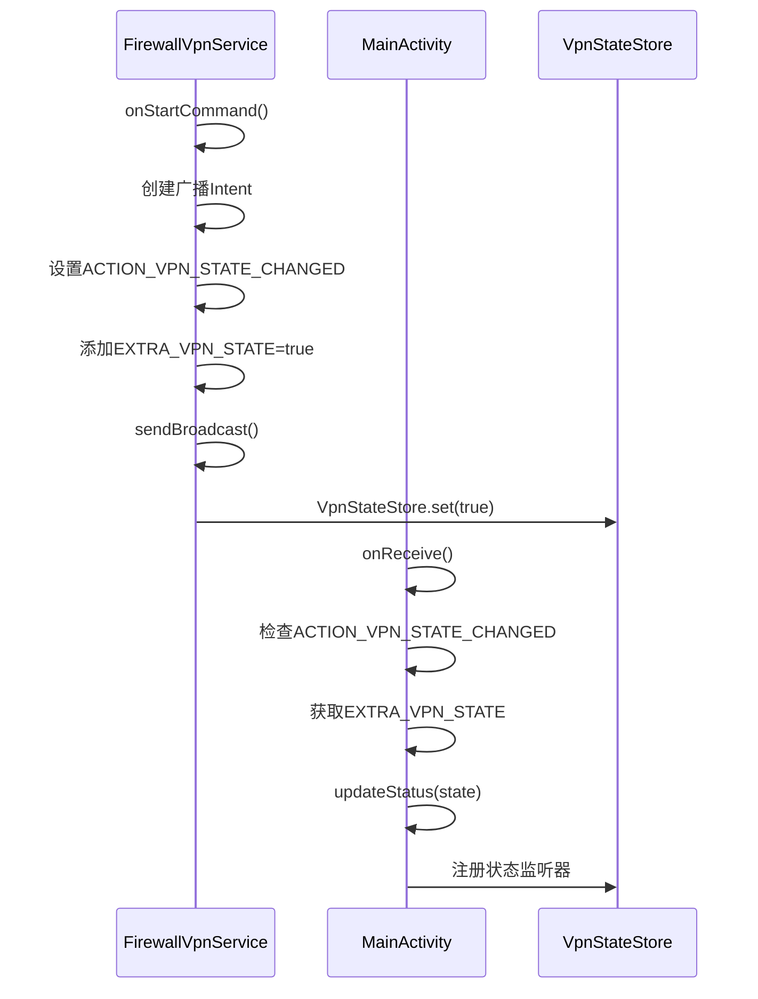
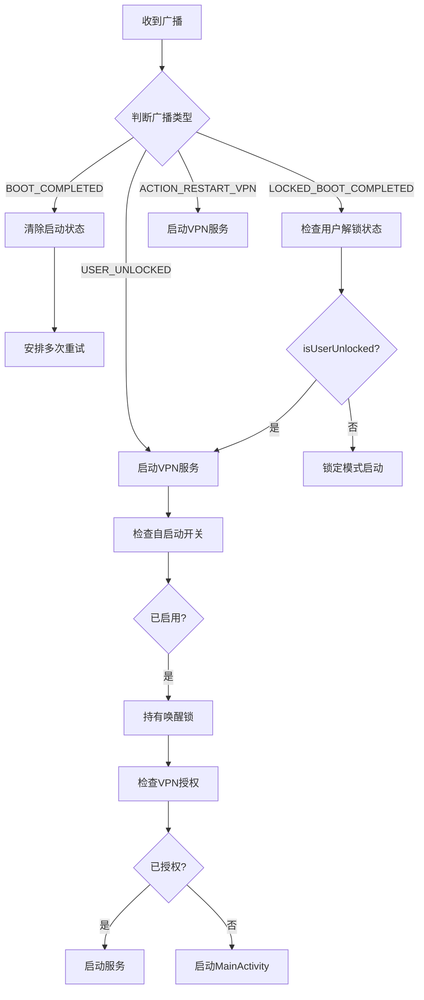
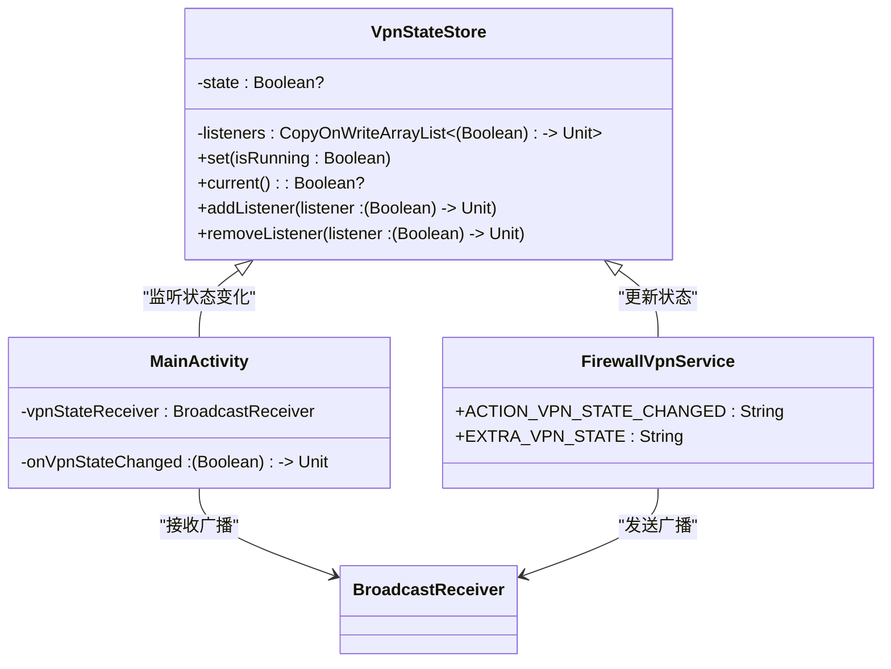
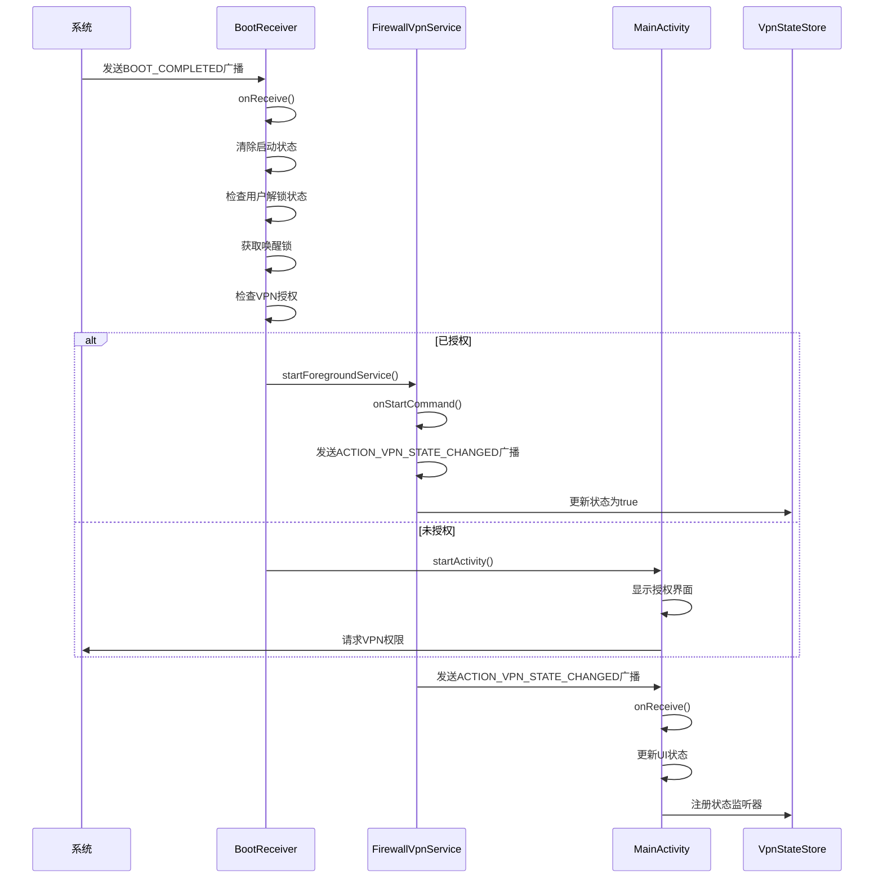

# 组件通信与广播机制

<cite>
**Referenced Files in This Document**   
- [FirewallVpnService.kt](file://app/src/main/java/com/example/phonenet/FirewallVpnService.kt)
- [BootReceiver.kt](file://app/src/main/java/com/example/phonenet/BootReceiver.kt)
- [AndroidManifest.xml](file://app/src/main/AndroidManifest.xml)
- [MainActivity.kt](file://app/src/main/java/com/example/phonenet/MainActivity.kt)
- [SettingsActivity.kt](file://app/src/main/java/com/example/phonenet/SettingsActivity.kt)
- [VpnStateStore.kt](file://app/src/main/java/com/example/phonenet/VpnStateStore.kt)
</cite>

## Table of Contents
1. [广播通信机制概述](#广播通信机制概述)
2. [VPN状态变更广播](#vpn状态变更广播)
3. [系统启动与自定义广播处理](#系统启动与自定义广播处理)
4. [直接启动模式支持](#直接启动模式支持)
5. [广播处理最佳实践](#广播处理最佳实践)
6. [组件通信时序图](#组件通信时序图)

## 广播通信机制概述

stopnet应用采用基于Intent的广播通信机制实现组件间通信。该机制主要由`FirewallVpnService`、`BootReceiver`和`MainActivity`等核心组件构成，通过自定义广播和系统广播实现跨组件的状态同步和事件通知。应用利用Android的广播系统在不同组件间传递VPN服务状态变化、设备启动完成等关键事件，确保各组件能够及时响应系统状态变化。

**Section sources**
- [FirewallVpnService.kt](file://app/src/main/java/com/example/phonenet/FirewallVpnService.kt#L15-L392)
- [BootReceiver.kt](file://app/src/main/java/com/example/phonenet/BootReceiver.kt#L9-L228)
- [AndroidManifest.xml](file://app/src/main/AndroidManifest.xml#L1-L112)

## VPN状态变更广播

`FirewallVpnService`组件定义了`ACTION_VPN_STATE_CHANGED`广播，用于将VPN状态变化通知给所有Activity组件。当VPN服务启动或停止时，该服务会发送包含当前VPN状态的广播，使UI组件能够实时更新显示。



**Diagram sources**
- [FirewallVpnService.kt](file://app/src/main/java/com/example/phonenet/FirewallVpnService.kt#L18-L18)
- [MainActivity.kt](file://app/src/main/java/com/example/phonenet/MainActivity.kt#L60-L75)

**Section sources**
- [FirewallVpnService.kt](file://app/src/main/java/com/example/phonenet/FirewallVpnService.kt#L18-L18)
- [MainActivity.kt](file://app/src/main/java/com/example/phonenet/MainActivity.kt#L60-L75)

## 系统启动与自定义广播处理

`BootReceiver`组件监听多种系统级和自定义广播，包括`BOOT_COMPLETED`、`LOCKED_BOOT_COMPLETED`、`USER_UNLOCKED`和自定义的`ACTION_RESTART_VPN`。在`onReceive()`方法中，根据设备解锁状态决定启动策略。

当设备启动完成时，`BootReceiver`会清除开机前的运行状态标记，然后根据用户解锁状态决定是否启动VPN服务。对于已锁定的设备，它会检查设备保护存储中的设置；对于已解锁的设备，则使用普通存储中的设置。这种设计确保了在不同启动阶段都能正确恢复服务状态。



**Diagram sources**
- [BootReceiver.kt](file://app/src/main/java/com/example/phonenet/BootReceiver.kt#L14-L50)
- [AndroidManifest.xml](file://app/src/main/AndroidManifest.xml#L90-L103)

**Section sources**
- [BootReceiver.kt](file://app/src/main/java/com/example/phonenet/BootReceiver.kt#L14-L50)
- [AndroidManifest.xml](file://app/src/main/AndroidManifest.xml#L90-L103)

## 直接启动模式支持

在`AndroidManifest.xml`中，`BootReceiver`的`directBootAware="true"`属性支持直接启动模式。这一特性允许接收器在用户解锁设备之前就能接收广播，对于需要在设备启动早期就进行初始化的应用至关重要。

同时，`intent-filter`的高优先级（`priority=999`）确保了广播能够优先被接收。这对于需要在其他应用之前启动的服务尤为重要，可以提高应用的可靠性和响应速度。

```xml
<receiver
    android:name="com.example.stopnet.BootReceiver"
    android:exported="true"
    android:enabled="true"
    android:directBootAware="true">
    <intent-filter android:priority="999">
        <action android:name="android.intent.action.BOOT_COMPLETED"/>
        <action android:name="android.intent.action.LOCKED_BOOT_COMPLETED"/>
        <action android:name="android.intent.action.USER_UNLOCKED"/>
        <action android:name="com.example.stopnet.ACTION_RESTART_VPN"/>
    </intent-filter>
</receiver>
```

**Section sources**
- [AndroidManifest.xml](file://app/src/main/AndroidManifest.xml#L90-L103)

## 广播处理最佳实践

stopnet应用在广播处理中采用了多项最佳实践。其中最重要的是使用`WakeLock`防止在vivo等定制系统中被后台杀死。在`BootReceiver`的`startIfEnabledUnlocked`方法中，通过获取部分唤醒锁确保启动流程不被中断。

此外，应用还实现了多重重试机制，特别是在处理vivo系统的后台限制时。通过`scheduleMultipleRetries`方法，在设备启动后10秒、30秒、60秒和120秒分别尝试启动服务，大大提高了服务启动的成功率。

另一个重要实践是状态同步。应用使用`VpnStateStore`对象作为全局状态存储，确保所有组件都能访问到一致的VPN状态。当收到广播时，不仅更新UI，还会同步更新`VpnStateStore`中的状态。



**Diagram sources**
- [VpnStateStore.kt](file://app/src/main/java/com/example/phonenet/VpnStateStore.kt#L4-L29)
- [MainActivity.kt](file://app/src/main/java/com/example/phonenet/MainActivity.kt#L60-L75)
- [FirewallVpnService.kt](file://app/src/main/java/com/example/phonenet/FirewallVpnService.kt#L18-L18)

**Section sources**
- [VpnStateStore.kt](file://app/src/main/java/com/example/phonenet/VpnStateStore.kt#L4-L29)
- [MainActivity.kt](file://app/src/main/java/com/example/phonenet/MainActivity.kt#L60-L75)

## 组件通信时序图

以下时序图展示了从系统事件触发到服务启动的完整交互流程：



**Diagram sources**
- [BootReceiver.kt](file://app/src/main/java/com/example/phonenet/BootReceiver.kt#L14-L50)
- [FirewallVpnService.kt](file://app/src/main/java/com/example/phonenet/FirewallVpnService.kt#L18-L18)
- [MainActivity.kt](file://app/src/main/java/com/example/phonenet/MainActivity.kt#L60-L75)
- [VpnStateStore.kt](file://app/src/main/java/com/example/phonenet/VpnStateStore.kt#L4-L29)