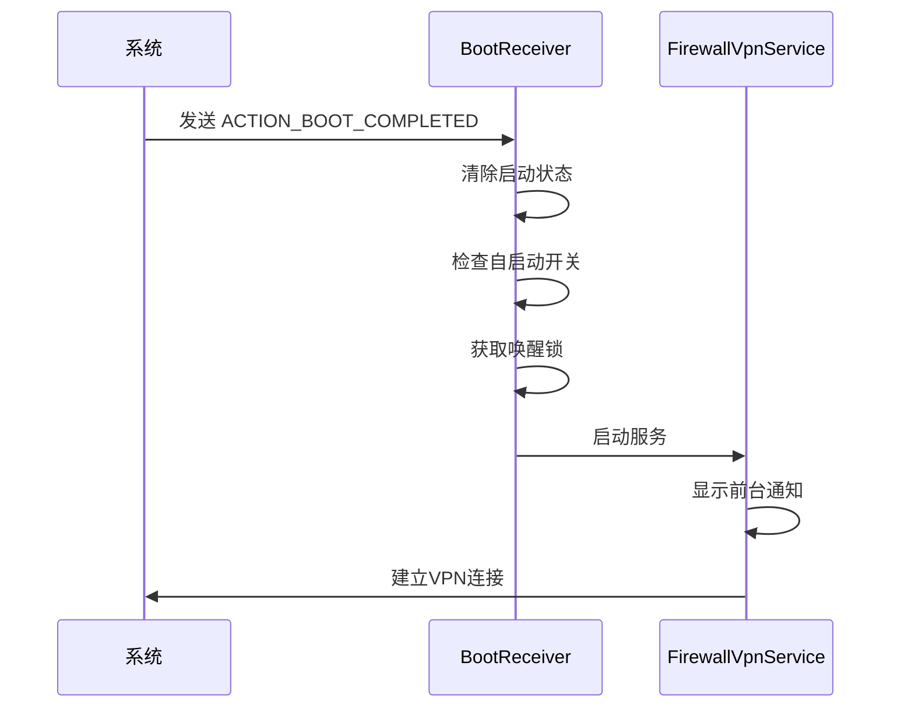
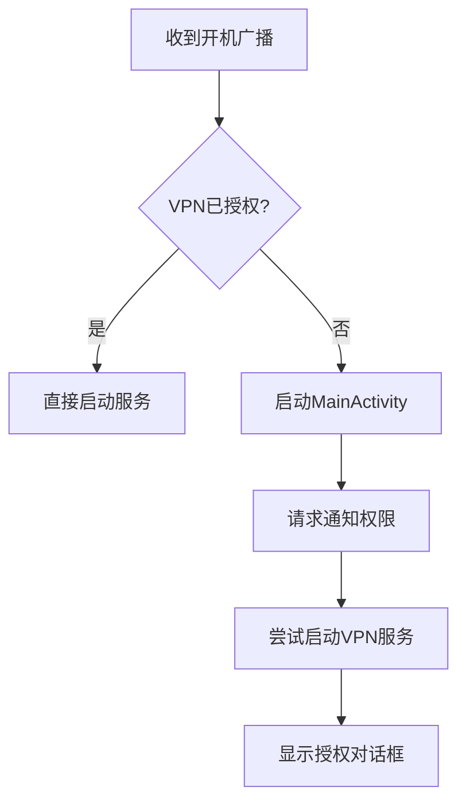
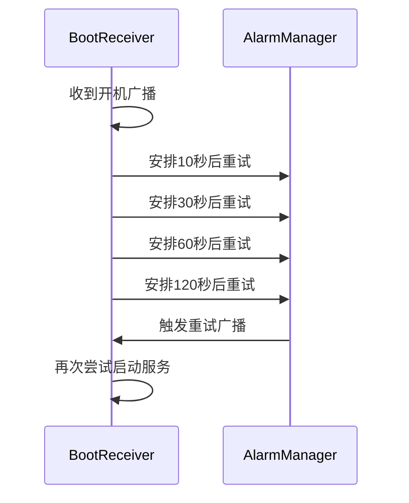
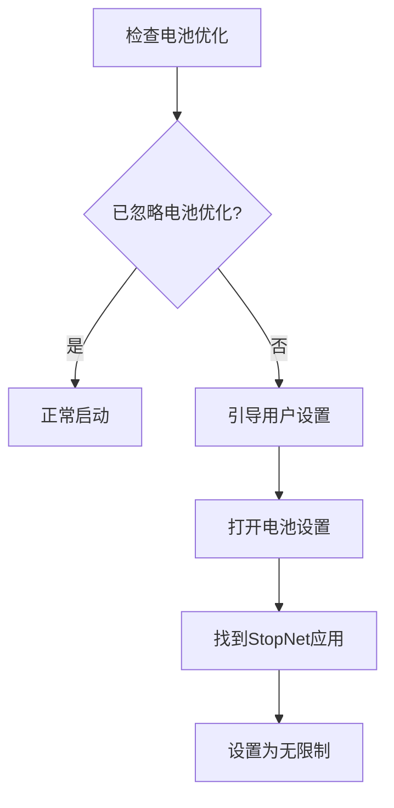
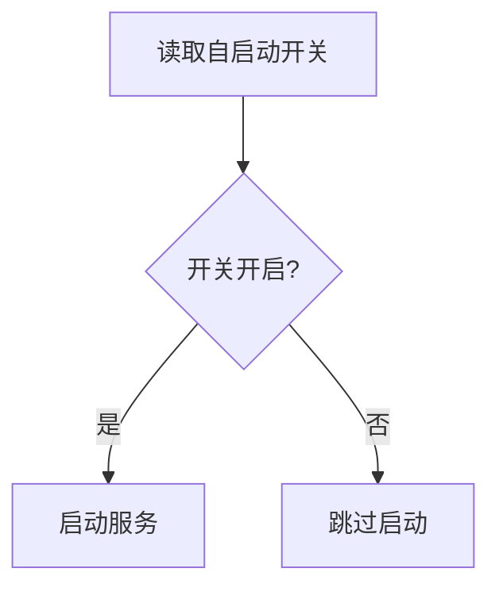
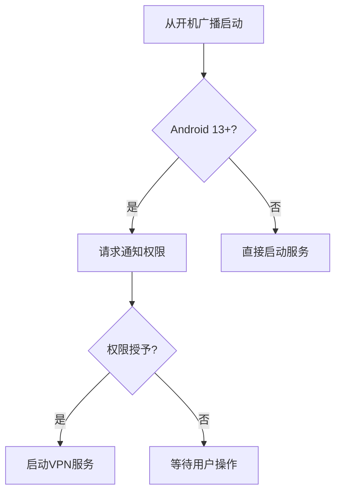

# 启动问题排查

<cite>
**Referenced Files in This Document**   
- [BootReceiver.kt](file://app/src/main/java/com/example/phonenet/BootReceiver.kt)
- [AndroidManifest.xml](file://app/src/main/AndroidManifest.xml)
- [MainActivity.kt](file://app/src/main/java/com/example/phonenet/MainActivity.kt)
- [FirewallVpnService.kt](file://app/src/main/java/com/example/phonenet/FirewallVpnService.kt)
- [SettingsActivity.kt](file://app/src/main/java/com/example/phonenet/SettingsActivity.kt)
- [VpnStateStore.kt](file://app/src/main/java/com/example/phonenet/VpnStateStore.kt)
</cite>

## 目录
1. [问题概述](#问题概述)
2. [启动流程分析](#启动流程分析)
3. [厂商系统限制](#厂商系统限制)
4. [权限配置要求](#权限配置要求)
5. [日志诊断方法](#日志诊断方法)
6. [解决方案](#解决方案)
7. [应用内开关状态](#应用内开关状态)
8. [Android 13+ 通知权限影响](#android-13-通知权限影响)

## 问题概述

设备重启后管控服务未能自动启动是Android应用开发中常见的兼容性问题。该问题主要由厂商系统限制、权限配置不当和应用内设置错误等多方面因素导致。本指南将深入分析StopNet应用的启动机制，重点排查vivo、华为、小米等主流厂商设备上的启动失败原因，并提供完整的解决方案。

**Section sources**
- [BootReceiver.kt](file://app/src/main/java/com/example/phonenet/BootReceiver.kt#L9-L228)
- [AndroidManifest.xml](file://app/src/main/AndroidManifest.xml#L1-L112)

## 启动流程分析

### 开机广播接收流程

当设备完成启动后，系统会发送`ACTION_BOOT_COMPLETED`和`ACTION_LOCKED_BOOT_COMPLETED`广播。StopNet应用通过`BootReceiver`组件接收这些广播，启动管控服务。



**Diagram sources**
- [BootReceiver.kt](file://app/src/main/java/com/example/phonenet/BootReceiver.kt#L21-L47)
- [FirewallVpnService.kt](file://app/src/main/java/com/example/phonenet/FirewallVpnService.kt#L28-L127)

### 从开机广播拉起MainActivity流程

当VPN服务未获得授权时，`BootReceiver`会尝试启动`MainActivity`引导用户完成授权。



**Diagram sources**
- [BootReceiver.kt](file://app/src/main/java/com/example/phonenet/BootReceiver.kt#L170-L207)
- [MainActivity.kt](file://app/src/main/java/com/example/phonenet/MainActivity.kt#L63-L101)

**Section sources**
- [BootReceiver.kt](file://app/src/main/java/com/example/phonenet/BootReceiver.kt#L9-L228)
- [MainActivity.kt](file://app/src/main/java/com/example/phonenet/MainActivity.kt#L56-L101)

## 厂商系统限制

### vivo系统特殊处理

vivo系统对后台应用有严格的限制策略，可能导致`BootReceiver`被系统杀死。StopNet应用针对vivo系统实现了多次重试机制。



**Diagram sources**
- [BootReceiver.kt](file://app/src/main/java/com/example/phonenet/BootReceiver.kt#L78-L110)

### 唤醒锁使用逻辑

为防止在启动过程中被系统杀死，`BootReceiver`在启动服务时会持有部分唤醒锁30秒。

```kotlin
// 持有唤醒锁确保启动流程不被打断（vivo系统容易杀后台）
val pm = context.getSystemService(android.os.PowerManager::class.java)
val wl = pm?.newWakeLock(android.os.PowerManager.PARTIAL_WAKE_LOCK, "stopnet:boot")
try {
    wl?.acquire(30000) // 持有30秒
    // 启动服务逻辑
} finally {
    try {
        wl?.release()
    } catch (e: Exception) {
        Log.e(TAG, "释放唤醒锁失败: ${e.message}")
    }
}
```

**Section sources**
- [BootReceiver.kt](file://app/src/main/java/com/example/phonenet/BootReceiver.kt#L144-L207)

## 权限配置要求

### 自启动权限

不同厂商设备的自启动权限设置位置不同，需要在系统设置中手动开启。

| 厂商 | 设置路径 |
|------|--------|
| 小米 | 安全中心 → 自启动管理 |
| 华为 | 手机管家 → 启动管理 |
| vivo | 电池 → 后台高耗电 |
| OPPO | 手机管家 → 权限隐私 → 自启动管理 |
| 三星 | 电池 → 应用电源管理 |

### 电池优化设置

必须将应用添加到电池优化白名单，否则系统可能在后台杀死应用。



**Section sources**
- [MainActivity.kt](file://app/src/main/java/com/example/phonenet/MainActivity.kt#L419-L481)
- [SettingsActivity.kt](file://app/src/main/java/com/example/phonenet/SettingsActivity.kt#L278-L308)

## 日志诊断方法

### 使用adb logcat查看广播接收情况

开发者可以使用adb命令查看系统广播接收情况：

```bash
# 过滤BootReceiver日志
adb logcat | grep BootReceiver

# 查看开机广播接收情况
adb logcat | grep "收到广播"
```

关键日志标签：
- `收到广播: android.intent.action.BOOT_COMPLETED` - 设备启动完成
- `收到广播: android.intent.action.LOCKED_BOOT_COMPLETED` - 设备锁定启动完成
- `设备启动完成` - 成功接收开机广播
- `服务启动成功` - 成功启动管控服务

**Section sources**
- [BootReceiver.kt](file://app/src/main/java/com/example/phonenet/BootReceiver.kt#L14-L50)

## 解决方案

### 系统设置配置

1. **开启自启动权限**：在系统设置中找到StopNet应用，开启自启动权限
2. **关闭电池优化**：将StopNet添加到电池优化白名单
3. **允许后台弹出界面**：允许应用在后台显示界面
4. **设置为无限制**：在后台管理中设置为无限制运行

### 验证应用内开关状态

应用内提供了"开机自启"开关，需要确保该开关处于开启状态。



**Section sources**
- [BootReceiver.kt](file://app/src/main/java/com/example/phonenet/BootReceiver.kt#L115-L121)
- [BootReceiver.kt](file://app/src/main/java/com/example/phonenet/BootReceiver.kt#L147-L151)

## 应用内开关状态

### 开机自启开关实现

应用通过SharedPreferences存储"开机自启"开关状态，该状态在设备重启后保持不变。

```kotlin
// 读取"开机自启 StopNet"开关
val enabled = prefs.getBoolean("auto_start_on_boot", true)
```

用户可以在设置界面切换该开关状态，系统会立即保存。

**Section sources**
- [BootReceiver.kt](file://app/src/main/java/com/example/phonenet/BootReceiver.kt#L115-L121)
- [SettingsActivity.kt](file://app/src/main/java/com/example/phonenet/SettingsActivity.kt#L110-L115)

## Android 13+ 通知权限影响

### 通知权限要求

从Android 13开始，前台服务需要通知权限才能稳定显示通知。



**Diagram sources**
- [MainActivity.kt](file://app/src/main/java/com/example/phonenet/MainActivity.kt#L63-L101)

### 权限处理流程

当应用从开机广播启动时，会自动请求通知权限：

```kotlin
// Android 13+ 先请求通知权限，保证前台服务 10s 内通知稳定展示
if (android.os.Build.VERSION.SDK_INT >= 33) {
    val granted = ContextCompat.checkSelfPermission(this, Manifest.permission.POST_NOTIFICATIONS) == PackageManager.PERMISSION_GRANTED
    if (!granted) {
        ActivityCompat.requestPermissions(this, arrayOf(Manifest.permission.POST_NOTIFICATIONS), REQUEST_NOTIF)
        return
    }
}
```

**Section sources**
- [MainActivity.kt](file://app/src/main/java/com/example/phonenet/MainActivity.kt#L63-L101)