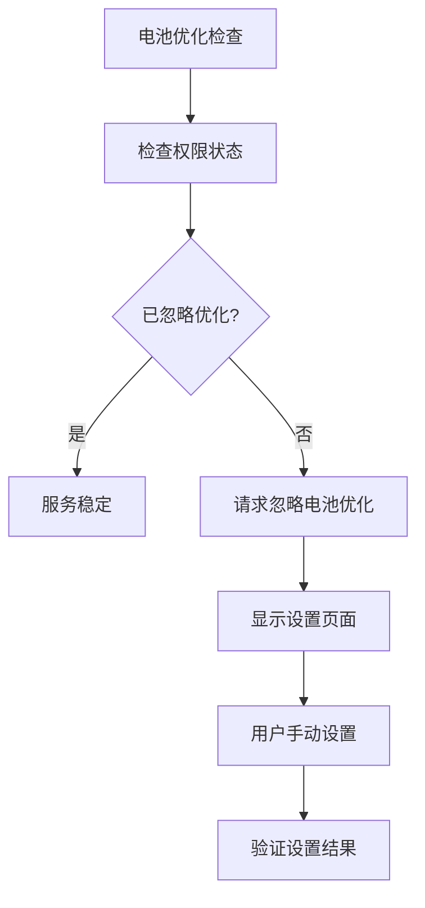
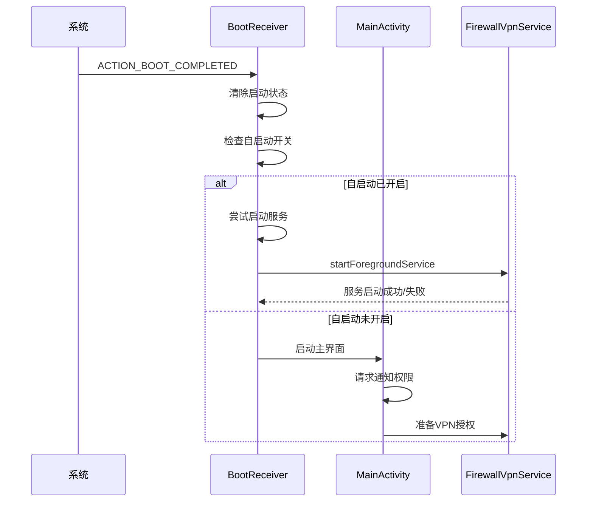
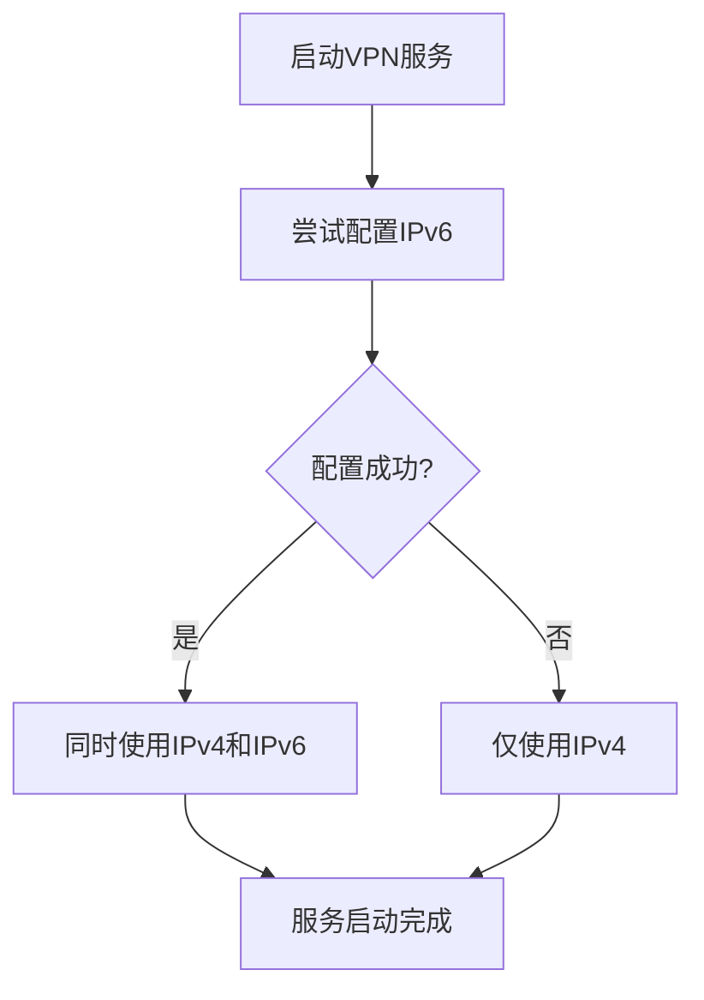

# 故障排除与调试

<cite>
**本文档引用的文件**   
- [README.md](file://README.md)
- [BootReceiver.kt](file://app/src/main/java/com/example/phonenet/BootReceiver.kt)
- [MainActivity.kt](file://app/src/main/java/com/example/phonenet/MainActivity.kt)
- [FirewallVpnService.kt](file://app/src/main/java/com/example/phonenet/FirewallVpnService.kt)
- [SettingsActivity.kt](file://app/src/main/java/com/example/phonenet/SettingsActivity.kt)
- [VpnStateStore.kt](file://app/src/main/java/com/example/phonenet/VpnStateStore.kt)
- [AndroidManifest.xml](file://app/src/main/AndroidManifest.xml)
</cite>

## 目录
1. [常见问题与解决方案](#常见问题与解决方案)
2. [诊断步骤](#诊断步骤)
3. [日志分析](#日志分析)
4. [PIN码恢复](#pin码恢复)
5. [IPv6兼容性](#ipv6兼容性)

## 常见问题与解决方案

### 应用无法联网（未加入白名单）
当应用未被添加到白名单时，其网络请求将被本地拦截并丢弃。此功能旨在限制非授权应用的联网行为。

**解决方案**：
1. 打开应用设置页面
2. 在"白名单应用"列表中勾选需要联网的应用
3. 确保本应用自身也在白名单中（代码中已自动处理）

**Section sources**
- [SettingsActivity.kt](file://app/src/main/java/com/example/phonenet/SettingsActivity.kt#L236-L272)
- [FirewallVpnService.kt](file://app/src/main/java/com/example/phonenet/FirewallVpnService.kt#L278-L317)

### 通知权限的重要性
Android 13及以上版本需要通知权限来显示前台服务通知，这对于保持服务稳定运行至关重要。

**解决方案**：
1. 首次启动时系统会自动请求通知权限
2. 若未授权，可在系统设置中手动开启
3. 前台通知确保服务不被系统轻易终止

**Section sources**
- [MainActivity.kt](file://app/src/main/java/com/example/phonenet/MainActivity.kt#L67-L91)
- [FirewallVpnService.kt](file://app/src/main/java/com/example/phonenet/FirewallVpnService.kt#L319-L359)

### 与其他VPN的互斥性
系统同一时间只能运行一个VPN服务，StopNet与其他VPN应用存在互斥关系。

**解决方案**：
1. 关闭其他正在运行的VPN服务
2. 在系统VPN设置中将StopNet设为"始终开启"
3. 启用"无VPN不允许连接"选项以增强稳定性

**Section sources**
- [README.md](file://README.md#L100-L105)
- [FirewallVpnService.kt](file://app/src/main/java/com/example/phonenet/FirewallVpnService.kt#L361-L392)

### 开机自启失败
由于不同厂商对后台应用的限制策略不同，可能导致开机自启动失败。

**解决方案**：
1. 检查系统自启动权限是否开启
2. 确认电池优化设置已配置为"不优化"
3. 对于vivo等特殊机型，需完成多项特定设置

**Section sources**
- [BootReceiver.kt](file://app/src/main/java/com/example/phonenet/BootReceiver.kt#L9-L228)
- [MainActivity.kt](file://app/src/main/java/com/example/phonenet/MainActivity.kt#L154-L194)

## 诊断步骤

### 检查VPN服务是否在运行
通过以下步骤确认VPN服务状态：

1. 查看状态栏是否有"StopNet 网络管控运行中"的通知
2. 检查主界面"启动管控"按钮的状态
3. 使用`adb shell dumpsys activity services com.example.stopnet`命令查看服务状态

```mermaid
flowchart TD
Start["检查服务状态"] --> CheckNotification["检查状态栏通知"]
CheckNotification --> HasNotification{有通知?}
HasNotification --> |是| ServiceRunning["服务正在运行"]
HasNotification --> |否| CheckButton["检查主界面按钮状态"]
CheckButton --> IsRunning{显示"停止管控"?}
IsRunning --> |是| ServiceRunning
IsRunning --> |否| ServiceNotRunning["服务未运行"]
```

**Diagram sources**
- [FirewallVpnService.kt](file://app/src/main/java/com/example/phonenet/FirewallVpnService.kt#L319-L359)
- [MainActivity.kt](file://app/src/main/java/com/example/phonenet/MainActivity.kt#L516-L546)

### 确认通知是否被清除
通知的可见性直接影响服务的稳定性。

1. 检查是否允许应用显示通知
2. 确认通知渠道未被用户手动关闭
3. 验证通知权限是否被授予

**Section sources**
- [FirewallVpnService.kt](file://app/src/main/java/com/example/phonenet/FirewallVpnService.kt#L319-L359)
- [MainActivity.kt](file://app/src/main/java/com/example/phonenet/MainActivity.kt#L67-L91)

### 验证电池优化设置
电池优化设置可能影响服务的后台运行。

1. 点击主界面"忽略电池优化"按钮
2. 或进入系统设置→电池→更多设置→电池优化
3. 找到StopNet并选择"不优化"或"允许后台运行"



**Diagram sources**
- [MainActivity.kt](file://app/src/main/java/com/example/phonenet/MainActivity.kt#L154-L194)
- [AndroidManifest.xml](file://app/src/main/AndroidManifest.xml#L1-L112)

## 日志分析

### 使用adb logcat命令
开发者可以使用adb工具分析启动失败的原因：

```bash
adb logcat | grep -E "BootReceiver|FirewallVpnService|MainActivity"
```

**关键日志标签**：
- `BootReceiver`: 开机启动相关日志
- `FirewallVpnService`: VPN服务运行日志
- `MainActivity`: 主界面操作日志

### 分析启动失败原因
结合BootReceiver和MainActivity中的日志进行分析：



**Diagram sources**
- [BootReceiver.kt](file://app/src/main/java/com/example/phonenet/BootReceiver.kt#L9-L228)
- [MainActivity.kt](file://app/src/main/java/com/example/phonenet/MainActivity.kt#L17-L456)
- [FirewallVpnService.kt](file://app/src/main/java/com/example/phonenet/FirewallVpnService.kt#L25-L49)

**Section sources**
- [BootReceiver.kt](file://app/src/main/java/com/example/phonenet/BootReceiver.kt#L9-L228)
- [MainActivity.kt](file://app/src/main/java/com/example/phonenet/MainActivity.kt#L17-L456)

## PIN码恢复

### 忘记PIN码的解决方案
若忘记设置页PIN码，可采取以下措施：

1. **清除应用数据**：进入系统设置→应用管理→StopNet→存储→清除数据
2. **卸载重装**：完全卸载后重新安装应用

**注意**：以上操作将丢失所有已有配置，需要重新设置。

**Section sources**
- [README.md](file://README.md#L115-L117)
- [SettingsActivity.kt](file://app/src/main/java/com/example/phonenet/SettingsActivity.kt#L258-L272)

## IPv6兼容性

### IPv6支持说明
应用支持IPv6网络环境，但在不支持IPv6的设备或网络中也能正常工作。

**实现机制**：
1. 尝试添加IPv6地址和路由
2. 若失败则仅使用IPv4（静默处理异常）
3. 功能不受影响，自动降级到IPv4模式



**Diagram sources**
- [FirewallVpnService.kt](file://app/src/main/java/com/example/phonenet/FirewallVpnService.kt#L278-L317)
- [README.md](file://README.md#L120-L122)

**Section sources**
- [FirewallVpnService.kt](file://app/src/main/java/com/example/phonenet/FirewallVpnService.kt#L278-L317)
- [README.md](file://README.md#L120-L122)