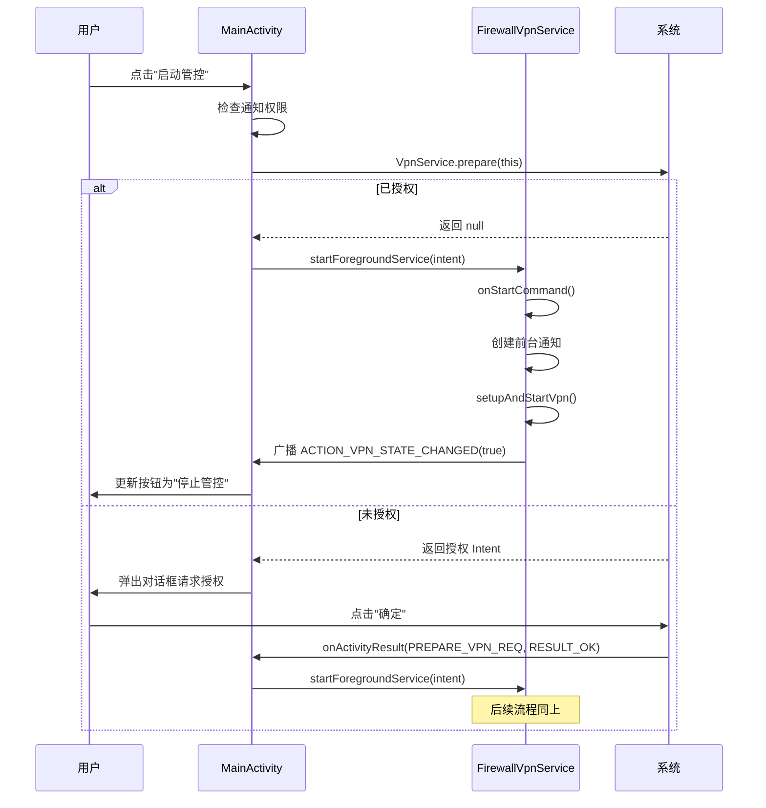
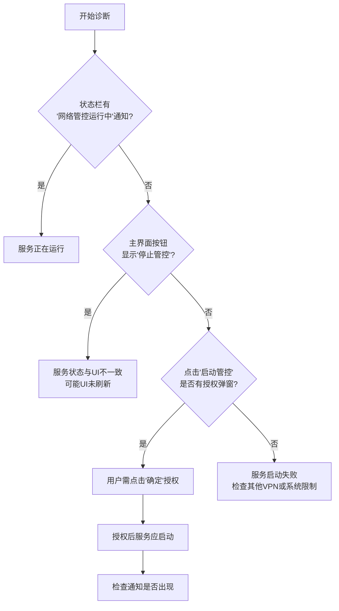

# 网络连接问题

<cite>
**Referenced Files in This Document**  
- [FirewallVpnService.kt](file://app/src/main/java/com/example/phonenet/FirewallVpnService.kt)
- [MainActivity.kt](file://app/src/main/java/com/example/phonenet/MainActivity.kt)
- [VpnStateStore.kt](file://app/src/main/java/com/example/phonenet/VpnStateStore.kt)
- [BootReceiver.kt](file://app/src/main/java/com/example/phonenet/BootReceiver.kt)
- [AndroidManifest.xml](file://app/src/main/AndroidManifest.xml)
</cite>

## Table of Contents
1. [非白名单应用无法联网机制](#非白名单应用无法联网机制)
2. [检查VPN服务运行状态](#检查vpn服务运行状态)
3. [系统级VPN排他性说明](#系统级vpn排他性说明)
4. [诊断步骤](#诊断步骤)
5. [IPv6兼容性说明](#ipv6兼容性说明)
6. [验证网络恢复](#验证网络恢复)

## 非白名单应用无法联网机制

StopNet通过Android系统的`VpnService`框架实现网络管控。当用户点击主界面的“启动管控”按钮后，应用会请求系统授权并建立一个虚拟专用网络（VPN）隧道。该隧道接管设备的全部网络流量。

在`FirewallVpnService.kt`中，`setupAndStartVpn()`方法负责配置VPN连接。它首先创建一个`Builder`实例，并通过`addAddress()`和`addRoute()`方法为VPN分配IP地址（IPv4: 10.0.0.2/32, IPv6: fd00:1:1::2/128）并设置路由规则（0.0.0.0/0 和 ::/0），这意味着所有网络流量都将被重定向至该VPN服务。

核心的防火墙功能通过`addDisallowedApplication(pkg)`方法实现。该方法接收一个应用包名列表，这些应用被明确标记为“不允许联网”。在服务启动时，系统会读取用户在设置中配置的白名单应用集合，并将这些应用包名逐一添加到`Builder`的禁止列表中。任何来自这些应用的网络请求都会被系统底层拦截，从而实现“非白名单应用无法联网”的功能。

**Section sources**
- [FirewallVpnService.kt](file://app/src/main/java/com/example/phonenet/FirewallVpnService.kt#L261-L317)

## 检查VPN服务运行状态

要确认`FirewallVpnService`是否正常运行，应遵循以下步骤：

1.  **检查主界面按钮状态**：打开StopNet主界面（`MainActivity`）。界面上的“启动管控”按钮是服务状态的直接反映。如果按钮显示为“停止管控”（红色），则表明`FirewallVpnService`正在运行。如果按钮显示为“启动管控”（绿色），则服务未运行。

2.  **验证VPN服务激活**：该状态由`VpnStateStore`对象统一管理。`MainActivity`通过`VpnStateStore.current()`方法获取当前的VPN运行状态，并据此更新按钮的文本和颜色。当用户点击按钮时，`MainActivity`会调用`startVpn()`或`stopVpn()`方法，这些方法会最终通过`Intent`与`FirewallVpnService`通信，启动或停止服务。

3.  **服务生命周期**：`FirewallVpnService`继承自`VpnService`，其`onStartCommand()`方法在服务启动时被调用。该方法会创建一个前台通知（Notification），以防止服务被系统轻易杀死。同时，它会广播`ACTION_VPN_STATE_CHANGED`意图，通知`MainActivity`更新UI。

**Diagram sources**
- [MainActivity.kt](file://app/src/main/java/com/example/phonenet/MainActivity.kt#L255-L349)
- [FirewallVpnService.kt](file://app/src/main/java/com/example/phonenet/FirewallVpnService.kt#L28-L127)

**Section sources**
- [MainActivity.kt](file://app/src/main/java/com/example/phonenet/MainActivity.kt#L52-L52)
- [VpnStateStore.kt](file://app/src/main/java/com/example/phonenet/VpnStateStore.kt#L0-L29)

## 系统级VPN排他性说明

Android系统在同一时间只允许一个活跃的`VpnService`。这意味着当其他VPN应用（如游戏加速器、代理工具等）正在运行时，StopNet将无法成功接管网络。

当用户尝试启动StopNet时，系统会检查当前是否有其他VPN服务处于活动状态。如果有，`VpnService.prepare(this)`方法将返回一个`Intent`，引导用户去系统设置中手动断开当前的VPN连接。只有在没有其他VPN服务运行的情况下，`prepare()`方法才会返回`null`，表示StopNet可以立即启动其服务。

这种排他性是Android系统层面的安全机制，旨在防止多个VPN服务同时修改网络路由，导致网络混乱或安全漏洞。因此，如果用户发现StopNet无法启动，首要的排查步骤就是检查是否已有其他VPN应用在运行，并将其关闭。

**Section sources**
- [MainActivity.kt](file://app/src/main/java/com/example/phonenet/MainActivity.kt#L232-L310)

## 诊断步骤

为了系统地诊断网络连接问题，请按以下步骤操作：

1.  **查看状态栏通知**：当`FirewallVpnService`成功运行时，系统状态栏会显示一个名为“StopNet 网络管控运行中”的持续通知。这是服务正在运行的最直接证据。如果该通知不存在，则服务很可能未启动或已被系统终止。

2.  **检查VPN授权流程**：在`MainActivity.kt`中，`PREPARE_VPN_REQ`是一个关键的请求码（值为1001），用于处理系统VPN授权。当用户点击“启动管控”时，应用会调用`VpnService.prepare(this)`。如果用户尚未授权，系统会弹出一个标准的授权对话框。用户必须点击“确定”才能完成授权。授权成功后，系统会回调`MainActivity`的`onActivityResult()`方法，传入`requestCode`为`PREPARE_VPN_REQ`且`resultCode`为`RESULT_OK`。只有在此回调成功执行后，`MainActivity`才会真正启动`FirewallVpnService`。

3.  **检查后台自启**：`BootReceiver.kt`负责在设备重启后自动启动StopNet。它会监听`BOOT_COMPLETED`等系统广播，并根据用户的“开机自启”设置来决定是否尝试启动服务。如果此功能失效，可能是因为厂商的系统限制（如vivo的后台管理）或用户未在系统设置中授予自启动权限。

**Diagram sources**
- [MainActivity.kt](file://app/src/main/java/com/example/phonenet/MainActivity.kt#L105-L105)
- [BootReceiver.kt](file://app/src/main/java/com/example/phonenet/BootReceiver.kt#L65-L95)

**Section sources**
- [MainActivity.kt](file://app/src/main/java/com/example/phonenet/MainActivity.kt#L52-L52)
- [BootReceiver.kt](file://app/src/main/java/com/example/phonenet/BootReceiver.kt#L93-L126)

## IPv6兼容性说明

StopNet服务在设计上具备良好的网络兼容性。在`setupAndStartVpn()`方法中，服务会尝试同时配置IPv4和IPv6地址与路由。

-   **IPv6支持**：服务会调用`builder.addAddress("fd00:1:1::2", 128)`和`builder.addRoute("::", 0)`来为IPv6流量建立隧道。
-   **IPv6降级**：这些操作被包裹在`try-catch`块中。如果设备或网络环境不支持IPv6（例如，调用`addAddress`时抛出异常），异常会被捕获并忽略。此时，服务会继续执行后续的IPv4配置和白名单应用设置。

因此，即使在不支持IPv6的网络环境中，StopNet也能自动降级到仅使用IPv4，确保核心的网络管控功能不受影响。用户无需进行任何额外配置，服务会无缝适应当前的网络条件。

**Section sources**
- [FirewallVpnService.kt](file://app/src/main/java/com/example/phonenet/FirewallVpnService.kt#L277-L280)

## 验证网络恢复

如果怀疑StopNet的网络管控导致了连接问题，最直接的验证方法是临时停止管控。

1.  在StopNet主界面，点击“停止管控”按钮。
2.  等待几秒钟，让`FirewallVpnService`完全停止。此时，状态栏的通知会消失。
3.  尝试访问之前无法连接的网络服务。

如果网络连接在停止管控后恢复正常，则可以确认问题是由StopNet的防火墙规则引起的。用户应检查白名单设置，确保需要联网的应用已被正确添加。如果问题依旧存在，则网络问题可能源于其他因素，如设备本身的网络设置、路由器问题或运营商限制。

**Section sources**
- [MainActivity.kt](file://app/src/main/java/com/example/phonenet/MainActivity.kt#L349-L367)
- [FirewallVpnService.kt](file://app/src/main/java/com/example/phonenet/FirewallVpnService.kt#L28-L127)