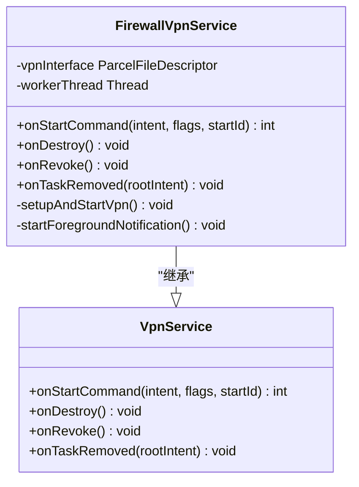
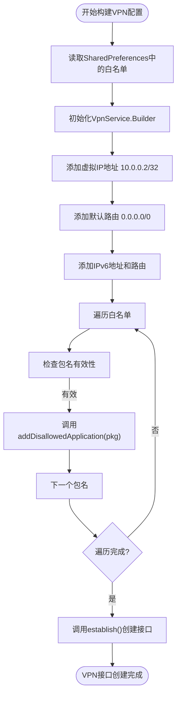
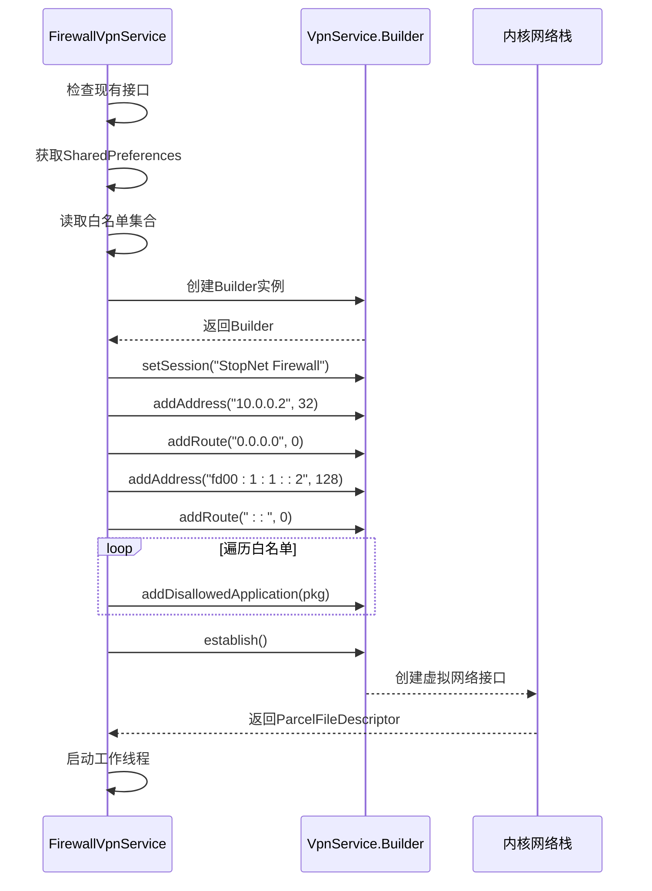
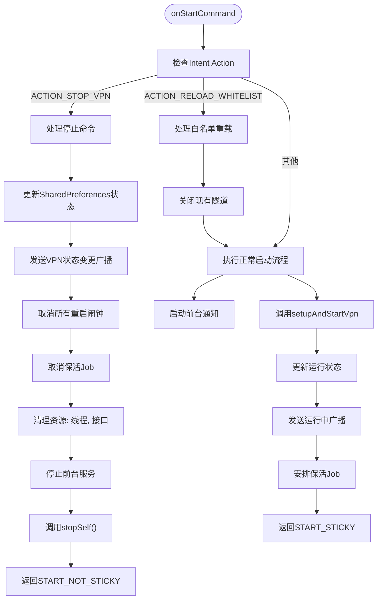
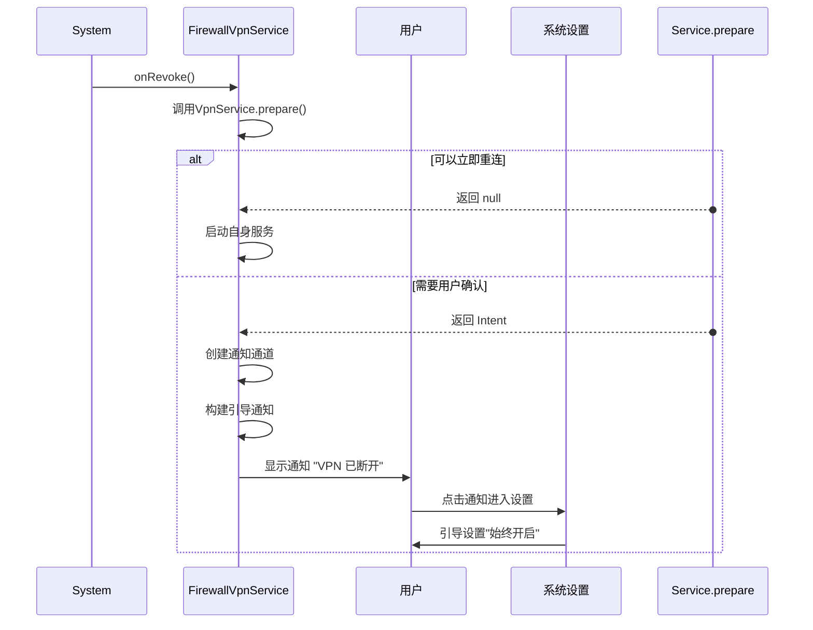
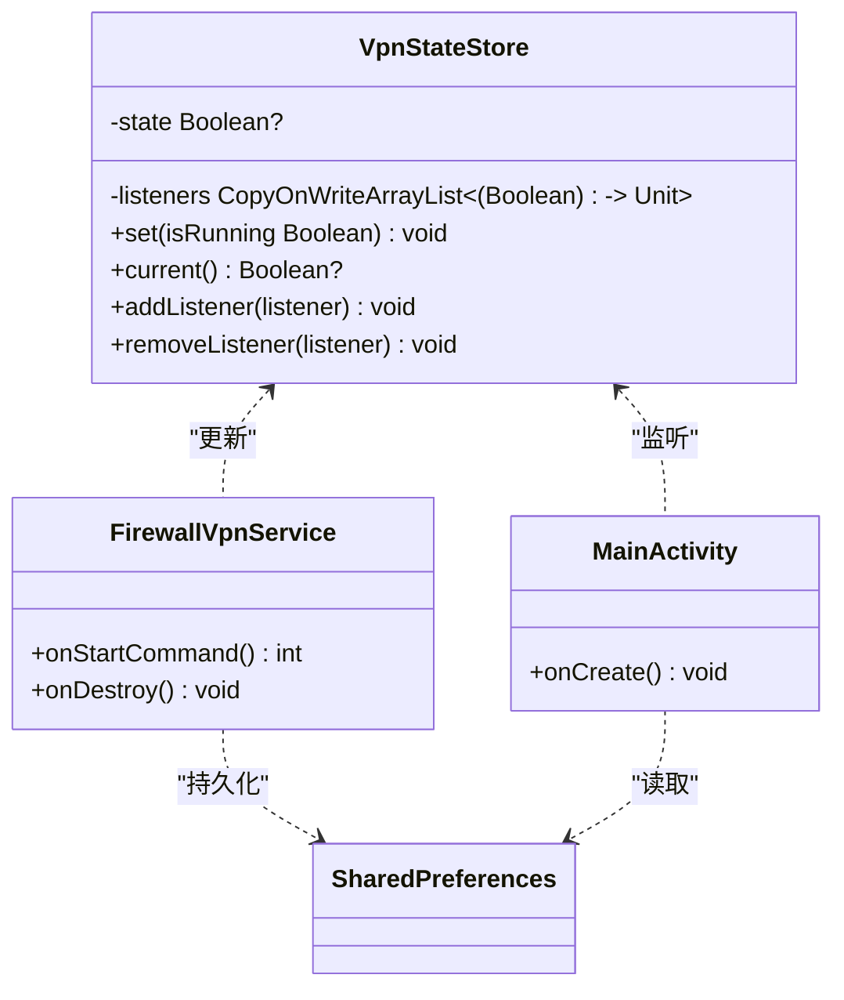

# VPN网络管控

<cite>
**Referenced Files in This Document**   
- [FirewallVpnService.kt](file://app/src/main/java/com/example/phonenet/FirewallVpnService.kt)
- [VpnStateStore.kt](file://app/src/main/java/com/example/phonenet/VpnStateStore.kt)
- [AndroidManifest.xml](file://app/src/main/AndroidManifest.xml)
</cite>

## Table of Contents
1. [核心功能概述](#核心功能概述)
2. [服务继承与虚拟接口创建](#服务继承与虚拟接口创建)
3. [应用级防火墙实现](#应用级防火墙实现)
4. [VPN配置构建与启动](#vpn配置构建与启动)
5. [服务命令处理逻辑](#服务命令处理逻辑)
6. [前台服务通知机制](#前台服务通知机制)
7. [用户断开处理与自动恢复](#用户断开处理与自动恢复)
8. [隧道维持与数据读取](#隧道维持与数据读取)
9. [状态管理与广播](#状态管理与广播)
10. [调试与测试建议](#调试与测试建议)

## 核心功能概述

`FirewallVpnService` 是一个Android服务，实现了基于VPN技术的网络管控功能。该服务通过继承系统`VpnService`类，创建虚拟网络接口并配置路由规则，实现对设备网络流量的精细控制。核心功能包括应用级防火墙、白名单动态管理、前台服务保活、自动重启机制以及系统级状态同步。服务通过读取SharedPreferences中的白名单包名集合，使用`VpnService.Builder`的`addDisallowedApplication`方法阻止非白名单应用的网络访问，从而实现应用级网络管控。

**Section sources**
- [FirewallVpnService.kt](file://app/src/main/java/com/example/phonenet/FirewallVpnService.kt#L1-L392)

## 服务继承与虚拟接口创建

`FirewallVpnService`类通过继承Android系统的`VpnService`抽象类来实现其核心功能。`VpnService`是Android平台提供的用于创建和管理虚拟专用网络(VPN)连接的系统服务。通过继承此类，`FirewallVpnService`获得了创建虚拟网络接口、配置网络路由和控制应用网络访问的权限。

服务通过`VpnService.Builder`类来配置和建立虚拟网络接口。`Builder`模式允许开发者以链式调用的方式逐步构建VPN配置。在`setupAndStartVpn`方法中，服务创建了一个`Builder`实例，并通过`setSession`方法设置会话名称为"StopNet Firewall"。随后，服务调用`establish`方法来实际创建虚拟网络接口，并返回一个`ParcelFileDescriptor`对象，该对象代表了与内核网络栈通信的文件描述符。

**Diagram sources**
- [FirewallVpnService.kt](file://app/src/main/java/com/example/phonenet/FirewallVpnService.kt#L1-L392)

**Section sources**
- [FirewallVpnService.kt](file://app/src/main/java/com/example/phonenet/FirewallVpnService.kt#L1-L392)

## 应用级防火墙实现

应用级防火墙功能通过`VpnService.Builder`的`addDisallowedApplication`方法实现。该方法允许服务明确指定哪些应用程序不允许通过创建的VPN隧道进行网络通信。在`setupAndStartVpn`方法中，服务首先从SharedPreferences中读取名为"whitelist_packages"的字符串集合，该集合包含了所有被允许访问网络的应用包名。

服务遍历白名单集合中的每个包名，并调用`builder.addDisallowedApplication(pkg)`方法。这实际上创建了一个黑名单机制，即除了白名单中的应用外，所有其他应用的网络流量都将被阻止。这种实现方式利用了Android系统的VPN框架，无需root权限即可实现应用级别的网络访问控制。

**Diagram sources**
- [FirewallVpnService.kt](file://app/src/main/java/com/example/phonenet/FirewallVpnService.kt#L261-L317)

**Section sources**
- [FirewallVpnService.kt](file://app/src/main/java/com/example/phonenet/FirewallVpnService.kt#L261-L317)

## VPN配置构建与启动

`setupAndStartVpn`方法负责读取配置并动态构建VPN。该方法首先检查当前是否已存在有效的VPN接口和工作线程，以避免重复创建。然后，服务根据系统版本和用户解锁状态，选择从常规存储或设备保护存储中读取SharedPreferences，确保在设备启动早期也能访问配置。

服务为虚拟网络接口分配IPv4地址"10.0.0.2"，子网掩码为32位，同时添加一个指向"0.0.0.0"的目标路由，子网掩码为0位，这相当于默认网关，将所有IPv4流量重定向到VPN隧道。对于IPv6，服务尝试分配地址"fd00:1:1::2"，前缀长度为128位，并添加一个指向"::"的默认路由。这些操作被包裹在try-catch块中，以处理可能不支持IPv6的设备。

**Diagram sources**
- [FirewallVpnService.kt](file://app/src/main/java/com/example/phonenet/FirewallVpnService.kt#L261-L317)

**Section sources**
- [FirewallVpnService.kt](file://app/src/main/java/com/example/phonenet/FirewallVpnService.kt#L261-L317)

## 服务命令处理逻辑

`onStartCommand`方法是服务的核心入口点，负责处理来自系统和应用的各种意图(Intent)。该方法根据意图的`action`字段执行不同的逻辑。

当收到`ACTION_STOP_VPN`意图时，服务执行完整的清理和停止流程。首先，服务更新SharedPreferences中的状态标志，将"vpn_user_stop"和"vpn_running"设置为`true`和`false`，以记录用户主动停止的行为。然后，服务发送`ACTION_VPN_STATE_CHANGED`广播，通知UI和其他组件VPN状态已变为断开。接着，服务取消所有已安排的重启闹钟(AlarmManager)和保活任务(JobScheduler)，确保服务不会被意外拉起。最后，服务中断工作线程、关闭VPN接口文件描述符、停止前台通知，并调用`stopSelf()`终止自身。

当收到`ACTION_RELOAD_WHITELIST`意图时，服务会关闭现有的VPN隧道（通过中断线程和关闭文件描述符），以便在后续的`setupAndStartVpn`调用中能够根据更新后的白名单重新建立配置。

**Diagram sources**
- [FirewallVpnService.kt](file://app/src/main/java/com/example/phonenet/FirewallVpnService.kt#L28-L127)

**Section sources**
- [FirewallVpnService.kt](file://app/src/main/java/com/example/phonenet/FirewallVpnService.kt#L28-L127)

## 前台服务通知机制

为了防止服务被系统回收，`FirewallVpnService`实现了前台服务机制。`startForegroundNotification`方法负责创建并显示一个前台通知。

该方法首先检查Android版本，对于API 26及以上版本，需要创建一个`NotificationChannel`。服务创建了一个名为"stopnet_vpn_channel"的高优先级通道，并设置了描述信息。然后，服务构建一个`NotificationCompat.Builder`，配置了通知的标题、内容、小图标，并设置了`PendingIntent`以关联到`MainActivity`。通知被设置为持续(ongoing)、不可自动取消(autoCancel=false)，并具有最高优先级，确保其在通知栏中保持可见。

最后，服务调用`startForeground()`方法，将通知与服务关联。对于Android 14(API 34)及以上版本，服务指定了`FOREGROUND_SERVICE_TYPE_DATA_SYNC`类型，以符合新的前台服务类型要求。

**Section sources**
- [FirewallVpnService.kt](file://app/src/main/java/com/example/phonenet/FirewallVpnService.kt#L319-L359)

## 用户断开处理与自动恢复

`onRevoke`方法在用户通过系统设置手动断开VPN连接时被系统调用。该方法实现了自动重连机制和用户引导。

首先，服务调用`VpnService.prepare(this)`检查当前是否有其他VPN连接处于活动状态。如果返回`null`，说明可以立即重新建立连接，服务会尝试启动自身。否则，服务会创建一个通知，引导用户前往系统VPN设置，将StopNet配置为"始终开启"，并启用"无VPN不允许连接"选项，以防止用户意外断开连接。

此外，服务还实现了`onTaskRemoved`方法，当用户从最近任务列表中清除应用时，只要不是用户主动停止，服务就会尝试立即自恢复。这通过启动服务和安排多个重启闹钟来实现，提高了服务的存活率。

**Diagram sources**
- [FirewallVpnService.kt](file://app/src/main/java/com/example/phonenet/FirewallVpnService.kt#L361-L391)

**Section sources**
- [FirewallVpnService.kt](file://app/src/main/java/com/example/phonenet/FirewallVpnService.kt#L361-L391)

## 隧道维持与数据读取

为了维持VPN隧道的活跃状态，`FirewallVpnService`启动了一个名为`workerThread`的工作线程。该线程在`setupAndStartVpn`方法中创建并启动。

工作线程的核心任务是持续从VPN接口的文件描述符中读取数据。服务通过`vpnInterface?.fileDescriptor`获取文件描述符，并创建一个`FileInputStream`。线程在一个循环中调用`input.read()`方法，尝试读取数据包。即使读取到的数据不被处理（即不转发到实际网络），这个读取操作本身也向Android系统表明VPN隧道正在工作，从而保持连接。

如果`read()`返回长度大于0，表示有数据包到达，线程会清空缓冲区并继续循环。如果返回-1或0，线程会短暂休眠10毫秒，然后继续尝试读取，避免了忙等待消耗过多CPU资源。

**Section sources**
- [FirewallVpnService.kt](file://app/src/main/java/com/example/phonenet/FirewallVpnService.kt#L300-L317)

## 状态管理与广播

服务使用两种机制来管理其运行状态：全局单例`VpnStateStore`和SharedPreferences。

`VpnStateStore`是一个Kotlin对象，使用`@Volatile`关键字确保状态变量的线程可见性。它维护一个`CopyOnWriteArrayList`来存储状态监听器，当调用`set()`方法更新状态时，会通知所有注册的监听器。这为应用内组件提供了一种高效、线程安全的状态同步方式。

同时，服务通过`SharedPreferences`在磁盘上持久化状态，包括"vpn_running"和"vpn_user_stop"标志。这确保了在设备重启或应用进程被杀死后，服务能够恢复到正确的状态。服务还通过发送`ACTION_VPN_STATE_CHANGED`广播，将状态变更通知给所有感兴趣的组件。

**Diagram sources**
- [VpnStateStore.kt](file://app/src/main/java/com/example/phonenet/VpnStateStore.kt#L4-L29)
- [FirewallVpnService.kt](file://app/src/main/java/com/example/phonenet/FirewallVpnService.kt#L1-L392)

**Section sources**
- [VpnStateStore.kt](file://app/src/main/java/com/example/phonenet/VpnStateStore.kt#L4-L29)
- [FirewallVpnService.kt](file://app/src/main/java/com/example/phonenet/FirewallVpnService.kt#L1-L392)

## 调试与测试建议

为有效调试和测试此VPN服务，建议采取以下方法：

1.  **日志监控**：在`onStartCommand`、`setupAndStartVpn`等关键方法中添加详细的`Log.d`和`Log.e`语句。使用Android Studio的Logcat工具，过滤`FirewallVpnService`标签，可以实时观察服务的启动、停止和错误情况。

2.  **白名单测试**：
    *   在设置界面中添加一个测试应用到白名单。
    *   启动VPN服务。
    *   验证该应用能否正常访问网络。
    *   将该应用从白名单移除。
    *   验证该应用的网络访问是否被立即阻止。

3.  **手动断开测试**：通过系统设置手动断开VPN连接，验证`onRevoke`方法是否被调用，并检查是否弹出了引导用户进行正确设置的通知。

4.  **进程杀死测试**：使用Android Studio的"Terminate Application"功能或系统设置中的"强制停止"来杀死应用进程，然后检查服务是否能通过`onDestroy`中安排的闹钟或`onTaskRemoved`机制成功重启。

5.  **设备重启测试**：重启设备，验证`BootReceiver`是否能正确接收`BOOT_COMPLETED`等广播并成功启动VPN服务。

**Section sources**
- [FirewallVpnService.kt](file://app/src/main/java/com/example/phonenet/FirewallVpnService.kt#L1-L392)
- [AndroidManifest.xml](file://app/src/main/AndroidManifest.xml#L1-L112)