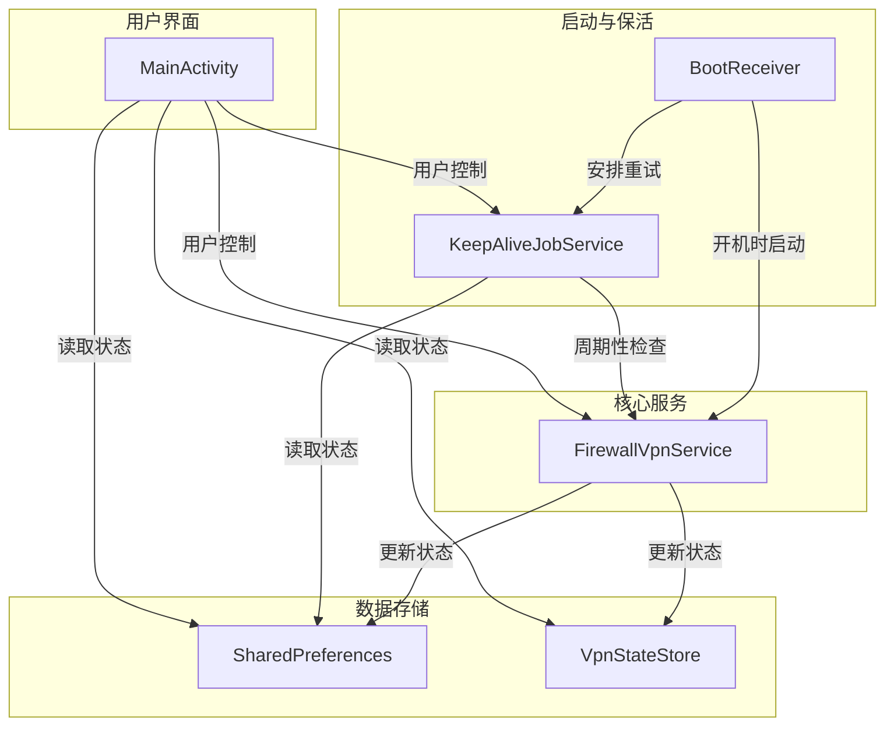
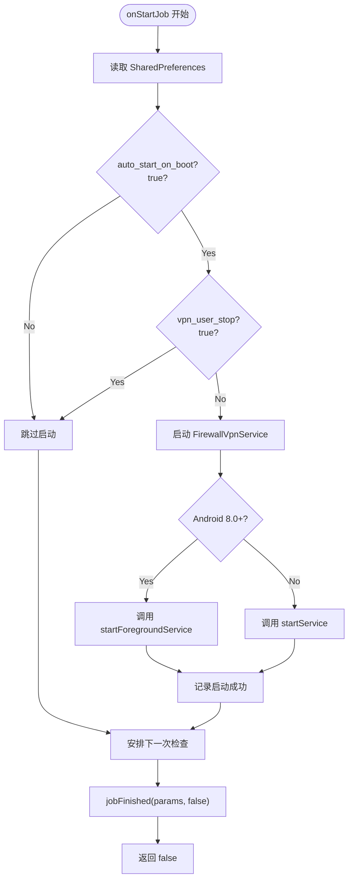
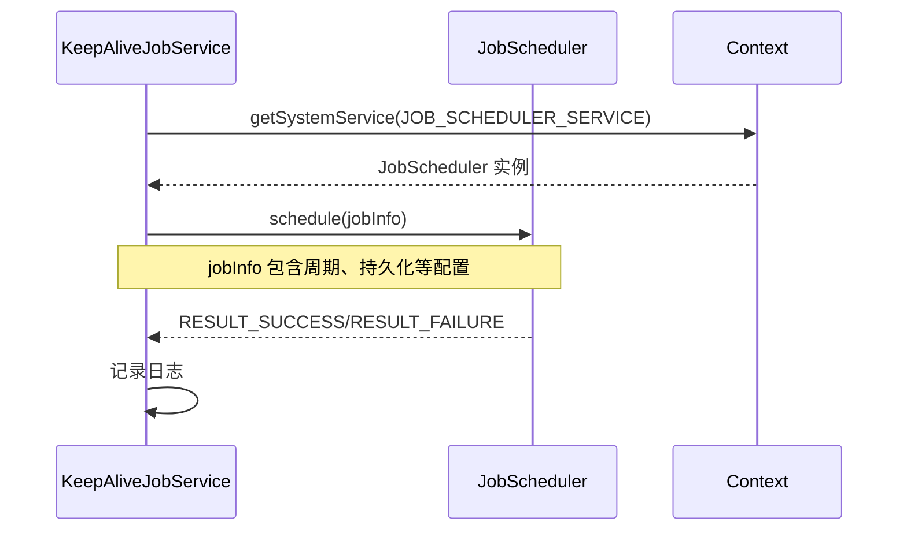
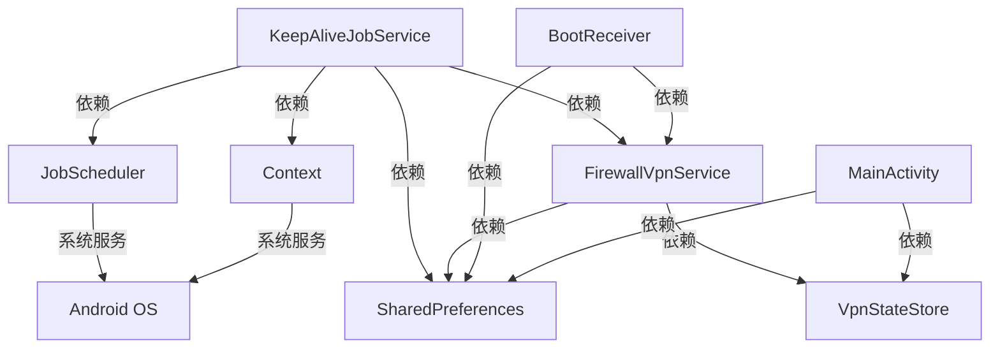

# 后台保活作业服务

<cite>
**Referenced Files in This Document**   
- [KeepAliveJobService.kt](file://app/src/main/java/com/example/phonenet/KeepAliveJobService.kt)
- [FirewallVpnService.kt](file://app/src/main/java/com/example/phonenet/FirewallVpnService.kt)
- [VpnStateStore.kt](file://app/src/main/java/com/example/phonenet/VpnStateStore.kt)
- [BootReceiver.kt](file://app/src/main/java/com/example/phonenet/BootReceiver.kt)
- [MainActivity.kt](file://app/src/main/java/com/example/phonenet/MainActivity.kt)
- [AndroidManifest.xml](file://app/src/main/AndroidManifest.xml)
</cite>

## 目录
1. [简介](#简介)
2. [核心组件](#核心组件)
3. [架构概览](#架构概览)
4. [详细组件分析](#详细组件分析)
5. [依赖分析](#依赖分析)
6. [性能考量](#性能考量)
7. [故障排除指南](#故障排除指南)
8. [结论](#结论)

## 简介
本文档深入分析 `KeepAliveJobService` 的实现机制，该服务是确保 `FirewallVpnService` 在后台持续运行的核心保活组件。文档详细阐述了其如何利用 Android JobScheduler 框架实现周期性任务调度，通过读取配置项判断服务状态，并在 Android 8.0 及以上系统中正确使用 `startForegroundService`。同时，文档解释了持久化任务的创建、JobInfo 的配置参数含义、任务终止后的重试逻辑，并提供了在不同 Android 版本和厂商定制系统中的行为差异说明及完整的注册配置指南。

## 核心组件
`KeepAliveJobService` 是一个继承自 `JobService` 的后台服务，其核心职责是周期性地检查并确保 `FirewallVpnService` 处于运行状态。它通过 `onStartJob` 方法执行核心逻辑，根据 `auto_start_on_boot` 和 `vpn_user_stop` 配置项决定是否需要重启 VPN 服务。该服务通过 `scheduleNextCheck` 方法创建一个周期为15分钟的持久化任务，即使设备重启也能恢复。`onStopJob` 方法返回 `true` 表明任务被系统终止后需要重新调度，增强了保活的鲁棒性。

**Section sources**
- [KeepAliveJobService.kt](file://app/src/main/java/com/example/phonenet/KeepAliveJobService.kt#L1-L71)
- [FirewallVpnService.kt](file://app/src/main/java/com/example/phonenet/FirewallVpnService.kt#L1-L393)

## 架构概览
整个保活系统由 `KeepAliveJobService`、`FirewallVpnService`、`BootReceiver` 和 `MainActivity` 共同构成。`BootReceiver` 在设备启动时负责初始化和启动服务。`KeepAliveJobService` 作为后台保活的主力，周期性地唤醒系统并检查 `FirewallVpnService` 的状态。`FirewallVpnService` 是实际的 VPN 服务，负责网络流量的过滤和管控。`MainActivity` 提供用户界面，允许用户手动控制服务的启停和配置。这些组件通过共享的 SharedPreferences (`stopnet_prefs`) 和全局状态 `VpnStateStore` 进行通信和状态同步。

**Diagram sources**
- [KeepAliveJobService.kt](file://app/src/main/java/com/example/phonenet/KeepAliveJobService.kt#L1-L71)
- [FirewallVpnService.kt](file://app/src/main/java/com/example/phonenet/FirewallVpnService.kt#L1-L393)
- [BootReceiver.kt](file://app/src/main/java/com/example/phonenet/BootReceiver.kt#L1-L230)
- [MainActivity.kt](file://app/src/main/java/com/example/phonenet/MainActivity.kt#L1-L645)
- [VpnStateStore.kt](file://app/src/main/java/com/example/phonenet/VpnStateStore.kt#L1-L30)

## 详细组件分析

### KeepAliveJobService 分析
`KeepAliveJobService` 是实现后台保活的核心。其 `onStartJob` 方法是任务执行的入口点。

#### onStartJob 方法分析
该方法首先从 `stopnet_prefs` 中读取两个关键配置项：`auto_start_on_boot`（开机自启动开关）和 `vpn_user_stop`（用户手动停止标记）。只有当 `auto_start_on_boot` 为 `true` 且 `vpn_user_stop` 为 `false` 时，才认为需要重新启动 `FirewallVpnService`。这种设计确保了用户手动停止服务后，保活机制不会强行重启，尊重了用户的操作意图。

**Diagram sources**
- [KeepAliveJobService.kt](file://app/src/main/java/com/example/phonenet/KeepAliveJobService.kt#L17-L46)
- [FirewallVpnService.kt](file://app/src/main/java/com/example/phonenet/FirewallVpnService.kt#L1-L393)

**Section sources**
- [KeepAliveJobService.kt](file://app/src/main/java/com/example/phonenet/KeepAliveJobService.kt#L17-L46)
- [BootReceiver.kt](file://app/src/main/java/com/example/phonenet/BootReceiver.kt#L115-L147)
- [MainActivity.kt](file://app/src/main/java/com/example/phonenet/MainActivity.kt#L385-L386)

#### startForegroundService 调用逻辑
在 `onStartJob` 中，根据 Android 系统版本决定启动服务的方式。对于 Android 8.0 (API 26) 及以上版本，必须使用 `startForegroundService` 方法。这是因为 Android 8.0 引入了严格的后台执行限制，直接调用 `startService` 启动前台服务会抛出 `ForegroundServiceStartNotAllowedException` 异常。`startForegroundService` 允许应用在后台启动一个前台服务，但该服务必须在5秒内调用 `startForeground()` 来显示通知，否则系统会强制停止该服务。`FirewallVpnService` 在其 `onStartCommand` 中立即调用 `startForegroundNotification()`，满足了这一要求。

#### scheduleNextCheck 方法分析
`scheduleNextCheck` 方法负责创建一个周期性的持久化任务。它使用 `JobInfo.Builder` 配置任务，其关键参数如下：
- `setPeriodic(15 * 60 * 1000)`: 设置任务周期为15分钟。这是平衡保活效果和电池消耗的关键，过短的周期会显著增加耗电。
- `setRequiredNetworkType(JobInfo.NETWORK_TYPE_NONE)`: 表示任务执行不依赖任何网络连接，可以在任何网络状态下运行，提高了任务的灵活性。
- `setPersisted(true)`: 这是实现“设备重启后依然有效”的关键。它将任务标记为持久化，即使设备重启，JobScheduler 也会在系统恢复后重新调度该任务。
- `setRequiresCharging(false)`: 任务不需要设备处于充电状态即可运行，保证了在非充电时也能进行保活检查。
- `setRequiresDeviceIdle(false)`: 任务不需要设备处于空闲状态（Doze模式）即可运行，确保了检查的及时性。

**Diagram sources**
- [KeepAliveJobService.kt](file://app/src/main/java/com/example/phonenet/KeepAliveJobService.kt#L53-L69)

**Section sources**
- [KeepAliveJobService.kt](file://app/src/main/java/com/example/phonenet/KeepAliveJobService.kt#L53-L69)

#### onStopJob 方法分析
`onStopJob` 方法在系统终止任务时被调用。该方法返回 `true`，这具有重要的含义：它告诉 JobScheduler，当前任务的执行被中断了，需要在系统资源允许时重新调度该任务。这为保活机制提供了额外的容错能力。例如，如果系统因为资源紧张而提前终止了 `KeepAliveJobService` 的执行，返回 `true` 可以确保这个“检查并重启”的任务不会被丢弃，而是在稍后再次尝试，从而提高了服务的存活率。

**Section sources**
- [KeepAliveJobService.kt](file://app/src/main/java/com/example/phonenet/KeepAliveJobService.kt#L48-L51)

### FirewallVpnService 与 BootReceiver 分析
`FirewallVpnService` 和 `BootReceiver` 与 `KeepAliveJobService` 紧密协作，共同构建了完整的保活方案。

#### 服务启动与状态管理
`FirewallVpnService` 在 `onStartCommand` 中会更新 `stopnet_prefs` 中的 `vpn_running` 和 `vpn_user_stop` 状态，并通过 `VpnStateStore` 对象同步内存中的全局状态。当用户通过 `MainActivity` 手动停止服务时，会设置 `vpn_user_stop` 为 `true`，这会直接影响 `KeepAliveJobService` 的决策逻辑，使其不再尝试重启服务。

#### 多层次保活策略
`BootReceiver` 在设备启动时扮演了第一道保活防线。它会清除旧的运行状态，并尝试立即启动 `FirewallVpnService`。如果启动失败（例如，用户尚未授权），它还会安排多次重试（`scheduleMultipleRetries`），以应对某些厂商（如vivo）对后台应用的严格限制。`FirewallVpnService` 在 `onDestroy` 和 `onTaskRemoved` 方法中也实现了自恢复逻辑，会安排 `AlarmManager` 闹钟或再次调用 `scheduleJobRestart` 来确保服务能被重新拉起。`KeepAliveJobService` 则作为最后一道防线，提供了一个周期性的、系统级的保活检查。

**Section sources**
- [FirewallVpnService.kt](file://app/src/main/java/com/example/phonenet/FirewallVpnService.kt#L35-L159)
- [BootReceiver.kt](file://app/src/main/java/com/example/phonenet/BootReceiver.kt#L59-L68)
- [MainActivity.kt](file://app/src/main/java/com/example/phonenet/MainActivity.kt#L330-L334)

## 依赖分析
`KeepAliveJobService` 的正常运行依赖于多个组件和系统服务。

**Diagram sources**
- [AndroidManifest.xml](file://app/src/main/AndroidManifest.xml#L1-L113)
- [KeepAliveJobService.kt](file://app/src/main/java/com/example/phonenet/KeepAliveJobService.kt#L1-L71)

**Section sources**
- [AndroidManifest.xml](file://app/src/main/AndroidManifest.xml#L1-L113)

## 性能考量
`KeepAliveJobService` 的设计在保活效果和性能消耗之间进行了权衡。
- **周期设置**: 15分钟的周期是一个相对合理的值。更短的周期（如5分钟）虽然能更快地恢复服务，但会显著增加 CPU 唤醒次数和电池消耗。更长的周期则可能导致服务中断时间过长。
- **JobScheduler 优势**: 使用 JobScheduler 而非 `AlarmManager` 的 `setExactAndAllowWhileIdle`，可以让系统将多个应用的后台任务进行批处理，从而减少整体的唤醒次数，更加省电。
- **配置项影响**: `setRequiresCharging(false)` 和 `setRequiresDeviceIdle(false)` 确保了任务的及时性，但可能会在设备电量较低或处于 Doze 模式时唤醒 CPU，对电池有轻微影响。开发者可以根据应用需求调整这些参数。

## 故障排除指南
开发者在使用此保活方案时可能遇到以下问题：
- **服务无法启动**: 检查 `auto_start_on_boot` 配置项是否为 `true`，并确认用户是否已授权 VPN 权限。在 `MainActivity` 中，首次启动需要用户手动确认。
- **保活任务未触发**: 确认 `KeepAliveJobService` 已在 `AndroidManifest.xml` 中正确声明，并拥有 `BIND_JOB_SERVICE` 权限。检查系统是否禁用了应用的后台活动。
- **厂商定制系统限制**: 某些厂商（如小米、华为、vivo）的系统会对后台应用进行更严格的限制。`BootReceiver` 中的 `requestAutoStartPermission` 方法尝试引导用户手动开启自启动权限，这是解决此类问题的关键。
- **Android 8.0+ 启动失败**: 确保在 `FirewallVpnService` 的 `onStartCommand` 或 `onCreate` 中立即调用 `startForeground()`，否则 `startForegroundService` 会失败。

**Section sources**
- [AndroidManifest.xml](file://app/src/main/AndroidManifest.xml#L1-L113)
- [MainActivity.kt](file://app/src/main/java/com/example/phonenet/MainActivity.kt#L385-L386)
- [BootReceiver.kt](file://app/src/main/java/com/example/phonenet/BootReceiver.kt#L191-L191)

## 结论
`KeepAliveJobService` 实现了一个健壮且多层次的后台保活方案。它巧妙地利用了 Android JobScheduler 的特性，通过合理的配置实现了周期性、持久化的任务调度。结合 `BootReceiver` 的启动拉活和 `FirewallVpnService` 自身的自恢复机制，该方案能够有效应对各种导致服务中断的场景。通过 `auto_start_on_boot` 和 `vpn_user_stop` 配置项，它在自动化保活和尊重用户意愿之间取得了良好的平衡。开发者在使用时，应充分理解其工作原理，并针对不同 Android 版本和厂商定制系统进行适配和优化，以达到最佳的保活效果和用户体验。