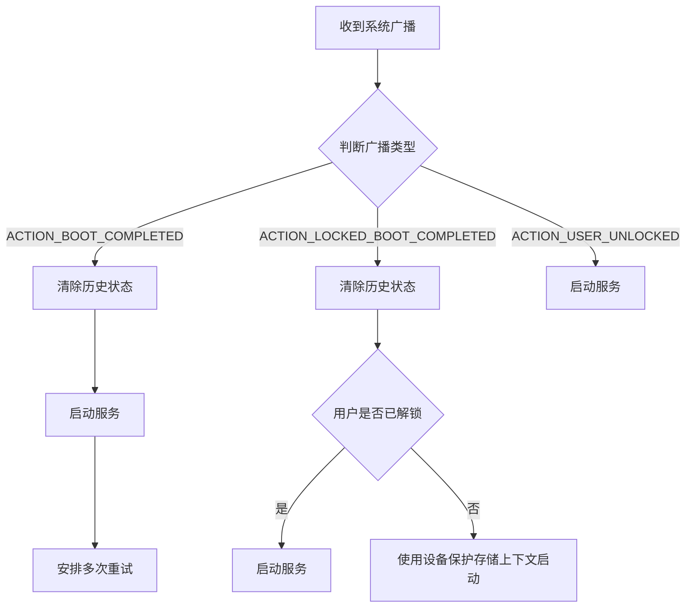
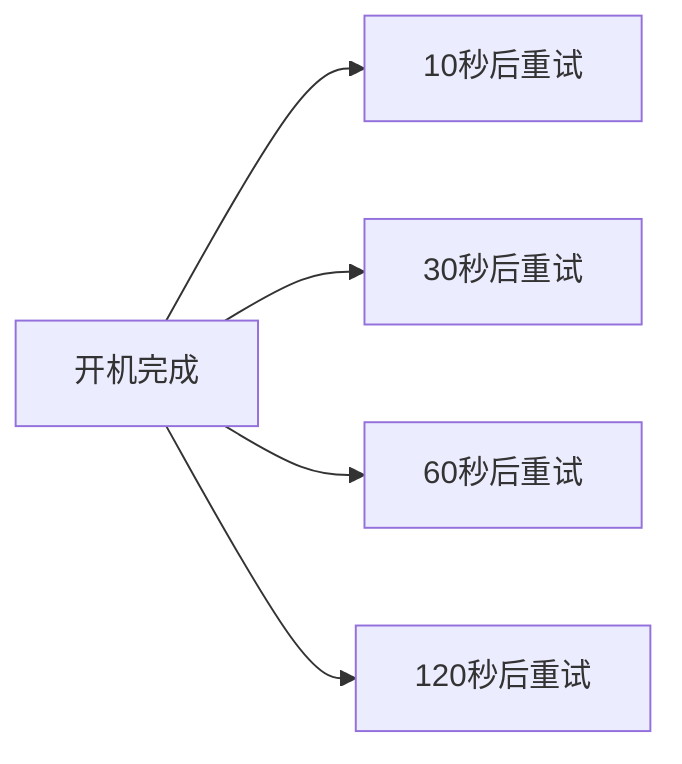
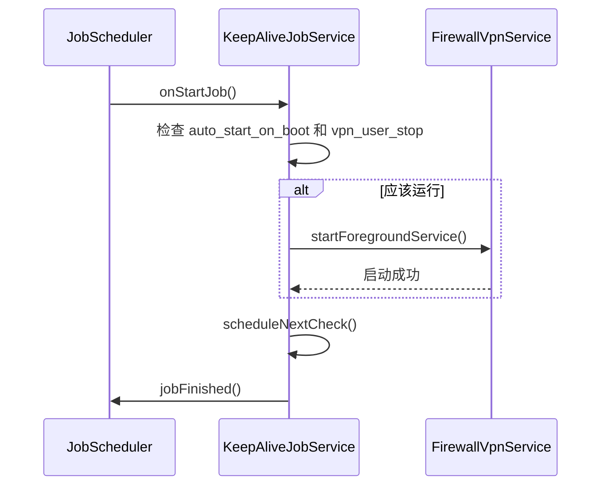
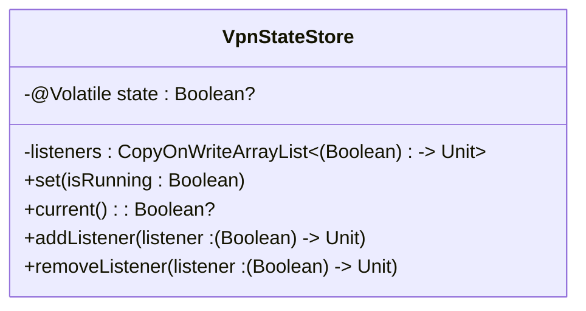

# 启动与保活机制

<cite>
**Referenced Files in This Document**   
- [BootReceiver.kt](file://app/src/main/java/com/example/phonenet/BootReceiver.kt)
- [KeepAliveJobService.kt](file://app/src/main/java/com/example/phonenet/KeepAliveJobService.kt)
- [FirewallVpnService.kt](file://app/src/main/java/com/example/phonenet/FirewallVpnService.kt)
- [VpnStateStore.kt](file://app/src/main/java/com/example/phonenet/VpnStateStore.kt)
- [AndroidManifest.xml](file://app/src/main/AndroidManifest.xml)
</cite>

## 目录
1. [启动与保活机制概述](#启动与保活机制概述)
2. [BootReceiver 启动机制](#bootreceiver-启动机制)
3. [KeepAliveJobService 保活机制](#keepalivejobservice-保活机制)
4. [服务自恢复与厂商适配](#服务自恢复与厂商适配)
5. [状态管理与数据同步](#状态管理与数据同步)
6. [开发者建议与优化策略](#开发者建议与优化策略)

## 启动与保活机制概述

本系统通过 `BootReceiver` 和 `KeepAliveJobService` 两个核心组件实现设备启动后的自动恢复与后台服务的持续保活。`BootReceiver` 负责监听系统启动广播，在设备开机或用户解锁后尝试启动VPN服务；`KeepAliveJobService` 则通过 `JobScheduler` 定期检查服务状态，确保服务在被系统回收后能够重新启动。两者结合，形成了多层次、高可靠性的启动与保活机制，有效应对了Android系统日益严格的后台限制。

**Section sources**
- [BootReceiver.kt](file://app/src/main/java/com/example/phonenet/BootReceiver.kt#L9-L228)
- [KeepAliveJobService.kt](file://app/src/main/java/com/example/phonenet/KeepAliveJobService.kt#L10-L70)

## BootReceiver 启动机制

### 广播监听与启动流程

`BootReceiver` 继承自 `BroadcastReceiver`，在 `AndroidManifest.xml` 中注册了多个关键的系统广播，包括 `ACTION_BOOT_COMPLETED`（设备完全启动）、`ACTION_LOCKED_BOOT_COMPLETED`（设备锁定启动）和 `ACTION_USER_UNLOCKED`（用户解锁）。当接收到这些广播时，`onReceive` 方法会被触发，根据不同的广播类型执行相应的启动逻辑。

**Diagram sources**
- [BootReceiver.kt](file://app/src/main/java/com/example/phonenet/BootReceiver.kt#L14-L50)
- [AndroidManifest.xml](file://app/src/main/AndroidManifest.xml#L80-L94)

**Section sources**
- [BootReceiver.kt](file://app/src/main/java/com/example/phonenet/BootReceiver.kt#L14-L50)

### 清除历史运行状态

`clearBootStates` 方法是确保服务能够正确重启的关键。它会同时清除普通存储和设备保护存储中的运行状态标记（`vpn_running` 和 `vpn_user_stop`）。设备保护存储（Device Protected Storage）在设备锁定时仍然可用，因此必须清除该存储中的状态，以避免因历史状态冲突而导致服务无法启动。

**Section sources**
- [BootReceiver.kt](file://app/src/main/java/com/example/phonenet/BootReceiver.kt#L53-L75)

### 用户解锁前后的启动差异

系统通过 `startIfEnabledLocked` 和 `startIfEnabledUnlocked` 两个方法处理用户解锁前后的启动差异。在用户解锁前，应用只能访问设备保护存储，因此 `startIfEnabledLocked` 会使用 `createDeviceProtectedStorageContext()` 获取上下文来读取配置。只有在用户解锁后，才能访问完整的应用数据，执行更复杂的启动逻辑。

**Section sources**
- [BootReceiver.kt](file://app/src/main/java/com/example/phonenet/BootReceiver.kt#L112-L142)
- [BootReceiver.kt](file://app/src/main/java/com/example/phonenet/BootReceiver.kt#L144-L207)

### 针对厂商系统的多次重试

`scheduleMultipleRetries` 方法专门用于应对vivo等厂商系统对后台应用的严格限制。在设备启动完成后，它会通过 `AlarmManager` 在10秒、30秒、60秒和120秒后安排四次重试。这种“饱和攻击”式的策略大大提高了服务在被系统延迟启动或杀死后成功恢复的概率。

**Diagram sources**
- [BootReceiver.kt](file://app/src/main/java/com/example/phonenet/BootReceiver.kt#L78-L110)

**Section sources**
- [BootReceiver.kt](file://app/src/main/java/com/example/phonenet/BootReceiver.kt#L78-L110)

## KeepAliveJobService 保活机制

### JobScheduler 周期性检查

`KeepAliveJobService` 继承自 `JobService`，利用 `JobScheduler` API 实现周期性任务。`onStartJob` 方法是任务执行的入口，它会检查 `auto_start_on_boot` 开关和 `vpn_user_stop` 标记，只有在用户未主动停止服务且自启动开关开启时，才会尝试重新启动 `FirewallVpnService`。

**Diagram sources**
- [KeepAliveJobService.kt](file://app/src/main/java/com/example/phonenet/KeepAliveJobService.kt#L17-L46)
- [KeepAliveJobService.kt](file://app/src/main/java/com/example/phonenet/KeepAliveJobService.kt#L53-L69)

**Section sources**
- [KeepAliveJobService.kt](file://app/src/main/java/com/example/phonenet/KeepAliveJobService.kt#L17-L46)

### 15分钟周期性任务

`scheduleNextCheck` 方法通过 `JobInfo.Builder` 创建一个周期性任务，设置 `setPeriodic(15 * 60 * 1000)` 实现每15分钟执行一次。`setPersisted(true)` 确保了设备重启后该任务依然存在，保证了保活机制的持久性。

**Section sources**
- [KeepAliveJobService.kt](file://app/src/main/java/com/example/phonenet/KeepAliveJobService.kt#L53-L69)

## 服务自恢复与厂商适配

### 任务移除时的自恢复

`FirewallVpnService` 的 `onTaskRemoved` 方法是应对用户手动清理后台任务的关键。当用户从最近任务列表中清除应用时，此方法会被调用。它会立即尝试启动服务，并安排多次重试和 `JobScheduler` 任务，确保服务能够快速恢复。为了防止在低功耗模式下被中断，该方法还短暂持有了一个 `PARTIAL_WAKE_LOCK` 唤醒锁。

**Section sources**
- [FirewallVpnService.kt](file://app/src/main/java/com/example/phonenet/FirewallVpnService.kt#L228-L264)

### 服务销毁时的重试

`onDestroy` 方法在服务被系统销毁时执行。它会检查 `vpn_user_stop` 标记，如果服务不是被用户主动停止的，则会安排一个3秒后的重试闹钟，尝试重新启动服务。

**Section sources**
- [FirewallVpnService.kt](file://app/src/main/java/com/example/phonenet/FirewallVpnService.kt#L188-L226)

### 厂商适配策略

系统通过多种策略应对不同厂商的后台限制：
1.  **多层重试**：结合 `AlarmManager` 的即时重试和 `JobScheduler` 的周期性检查。
2.  **权限检查**：在 `onStartCommand` 中检查 `SCHEDULE_EXACT_ALARM` 权限，如果用户未授权，则退而使用 `JobScheduler`。
3.  **设备保护存储**：在用户解锁前使用 `createDeviceProtectedStorageContext` 访问关键配置。

**Section sources**
- [FirewallVpnService.kt](file://app/src/main/java/com/example/phonenet/FirewallVpnService.kt#L266-L309)
- [FirewallVpnService.kt](file://app/src/main/java/com/example/phonenet/FirewallVpnService.kt#L188-L226)

## 状态管理与数据同步

### 全局状态存储

`VpnStateStore` 是一个单例对象，使用 `@Volatile` 关键字和 `CopyOnWriteArrayList` 确保了线程安全。它负责在内存中维护VPN服务的运行状态，并提供 `addListener` 和 `removeListener` 方法供UI组件订阅状态变化，实现了状态的实时同步。

**Diagram sources**
- [VpnStateStore.kt](file://app/src/main/java/com/example/phonenet/VpnStateStore.kt#L4-L29)

**Section sources**
- [VpnStateStore.kt](file://app/src/main/java/com/example/phonenet/VpnStateStore.kt#L4-L29)

### 状态持久化

应用状态（如 `vpn_running`、`vpn_user_stop`）被持久化存储在 `SharedPreferences` 中。为了确保在各种场景下都能正确读写，状态被同时存储在普通存储和设备保护存储中，保证了在设备锁定和解锁状态下数据的一致性。

**Section sources**
- [BootReceiver.kt](file://app/src/main/java/com/example/phonenet/BootReceiver.kt#L53-L75)
- [FirewallVpnService.kt](file://app/src/main/java/com/example/phonenet/FirewallVpnService.kt#L157-L175)

## 开发者建议与优化策略

1.  **权限声明**：在 `AndroidManifest.xml` 中正确声明 `RECEIVE_BOOT_COMPLETED` 和 `WAKE_LOCK` 等权限。
2.  **前台服务**：将 `FirewallVpnService` 设置为前台服务，并提供一个无法关闭的持续通知，以降低被系统杀死的风险。
3.  **优雅降级**：当 `AlarmManager` 的精确闹钟权限被拒绝时，应无缝切换到 `JobScheduler` 方案。
4.  **日志记录**：在关键流程中添加详细的日志，便于在不同厂商设备上进行问题排查。
5.  **用户引导**：在 `onRevoke` 回调中，引导用户在系统设置中将应用设置为“始终开启”，这是保证长期保活的最有效手段。