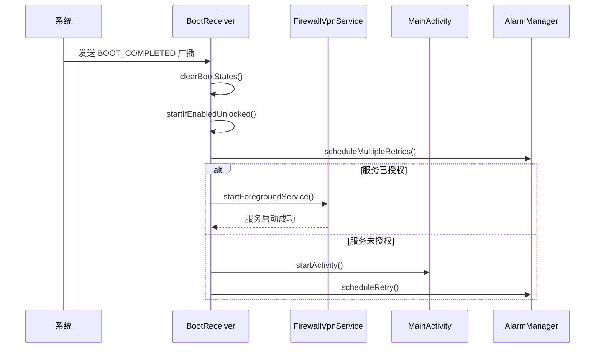
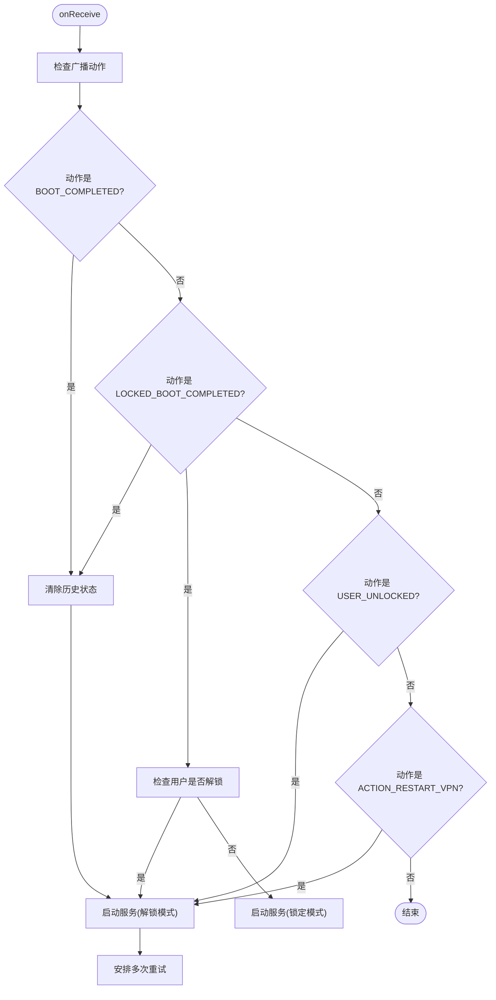
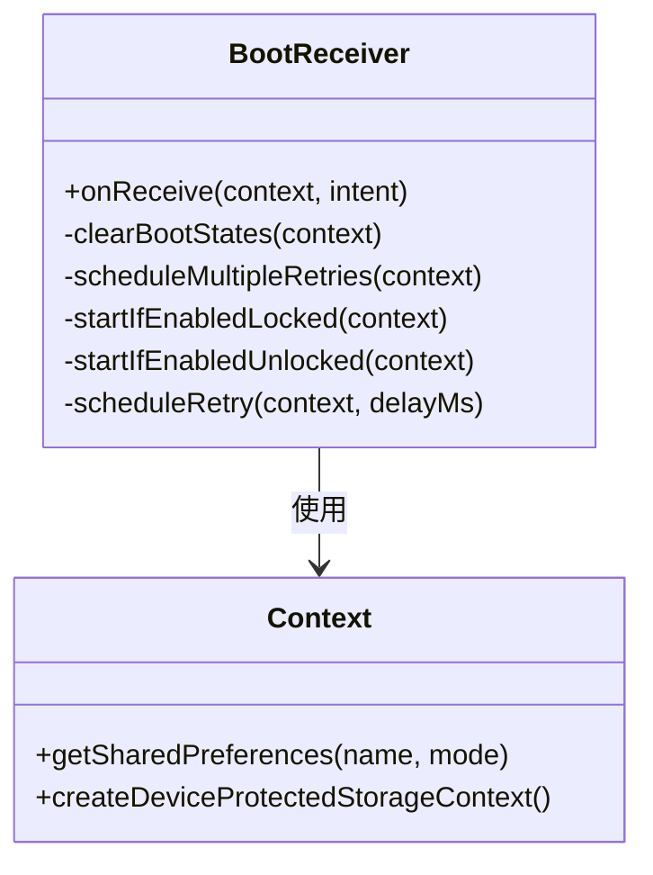
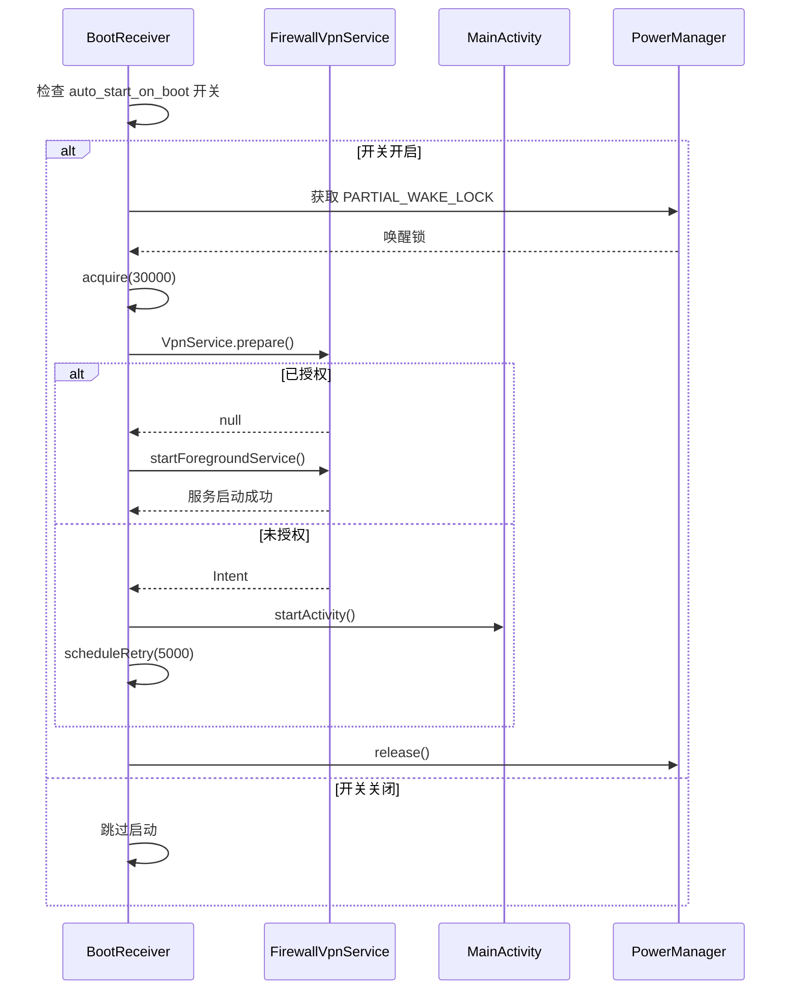
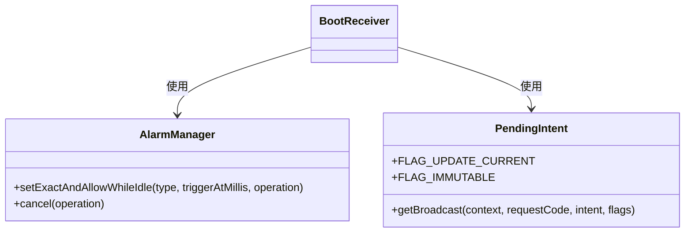
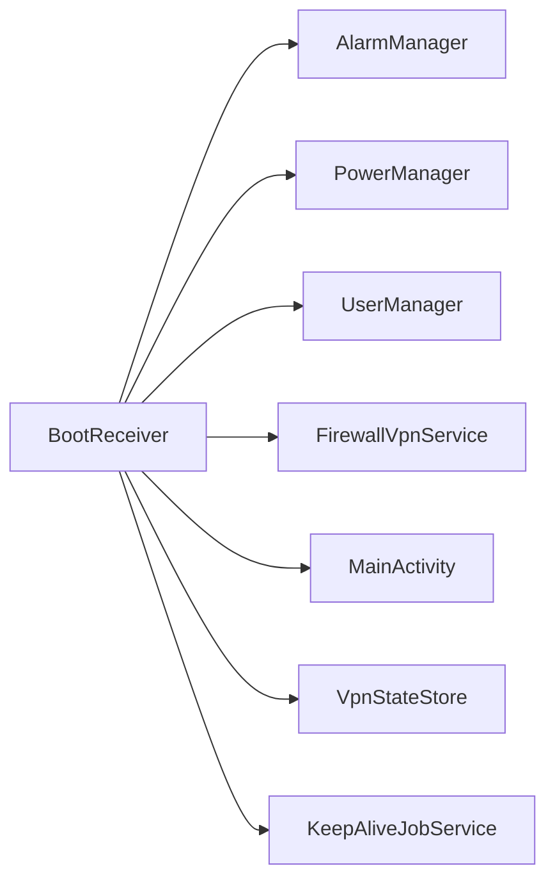

# 开机广播接收器

<cite>
**Referenced Files in This Document**   
- [BootReceiver.kt](file://app/src/main/java/com/example/phonenet/BootReceiver.kt)
- [AndroidManifest.xml](file://app/src/main/AndroidManifest.xml)
- [FirewallVpnService.kt](file://app/src/main/java/com/example/phonenet/FirewallVpnService.kt)
- [MainActivity.kt](file://app/src/main/java/com/example/phonenet/MainActivity.kt)
- [VpnStateStore.kt](file://app/src/main/java/com/example/phonenet/VpnStateStore.kt)
- [KeepAliveJobService.kt](file://app/src/main/java/com/example/phonenet/KeepAliveJobService.kt)
</cite>

## Table of Contents
1. [简介](#简介)
2. [项目结构](#项目结构)
3. [核心组件](#核心组件)
4. [架构概述](#架构概述)
5. [详细组件分析](#详细组件分析)
6. [依赖分析](#依赖分析)
7. [性能考虑](#性能考虑)
8. [故障排除指南](#故障排除指南)
9. [结论](#结论)

## 简介
`BootReceiver` 是 StopNet 应用的核心组件之一，负责在设备启动和用户解锁等关键生命周期事件中自动恢复网络管控服务。该广播接收器通过监听系统广播，确保应用的防火墙服务能够在设备重启后自动启动，从而持续保护设备网络安全。本文档深入分析了 `BootReceiver` 的实现细节，包括其广播事件处理逻辑、状态管理机制、服务启动策略以及针对不同厂商设备的兼容性处理方案。

## 项目结构
项目采用标准的 Android 应用结构，核心功能模块集中在 `app/src/main/java/com/example/phonenet/` 目录下。`BootReceiver.kt` 作为系统事件的入口点，与 `FirewallVpnService.kt`（核心服务）、`MainActivity.kt`（用户界面）和 `VpnStateStore.kt`（全局状态管理）等组件紧密协作，形成一个完整的开机自启动和后台保活体系。

```mermaid
graph TB
subgraph "核心组件"
BR[BootReceiver.kt]
FVS[FirewallVpnService.kt]
MA[MainActivity.kt]
VSS[VpnStateStore.kt]
KAJ[KeepAliveJobService.kt]
end
BR --> FVS : 启动服务
BR --> MA : 拉起界面
BR --> KAJ : 安排重试
FVS --> VSS : 同步状态
MA --> VSS : 监听状态
KAJ --> FVS : 周期性检查
```

**Diagram sources**
- [BootReceiver.kt](file://app/src/main/java/com/example/phonenet/BootReceiver.kt)
- [FirewallVpnService.kt](file://app/src/main/java/com/example/phonenet/FirewallVpnService.kt)
- [MainActivity.kt](file://app/src/main/java/com/example/phonenet/MainActivity.kt)
- [VpnStateStore.kt](file://app/src/main/java/com/example/phonenet/VpnStateStore.kt)
- [KeepAliveJobService.kt](file://app/src/main/java/com/example/phonenet/KeepAliveJobService.kt)

**Section sources**
- [BootReceiver.kt](file://app/src/main/java/com/example/phonenet/BootReceiver.kt)
- [AndroidManifest.xml](file://app/src/main/AndroidManifest.xml)

## 核心组件
`BootReceiver` 的核心功能是监听并响应系统广播事件，其主要职责包括：清除历史运行状态、根据用户解锁状态启动服务、以及通过多种机制确保服务能够成功启动。该组件与 `FirewallVpnService` 服务、`MainActivity` 界面和 `VpnStateStore` 全局状态管理器协同工作，构成了应用的自动恢复和后台保活机制。

**Section sources**
- [BootReceiver.kt](file://app/src/main/java/com/example/phonenet/BootReceiver.kt#L14-L229)
- [FirewallVpnService.kt](file://app/src/main/java/com/example/phonenet/FirewallVpnService.kt#L15-L392)

## 架构概述
`BootReceiver` 在应用架构中扮演着“系统事件触发器”的角色。当设备完成启动或用户解锁时，系统会发送相应的广播，`BootReceiver` 接收到这些广播后，会触发一系列操作来恢复网络管控服务。整个流程涉及状态清理、服务启动、界面拉起和重试机制等多个环节，确保了服务的高可用性和稳定性。



**Diagram sources**
- [BootReceiver.kt](file://app/src/main/java/com/example/phonenet/BootReceiver.kt#L14-L229)
- [FirewallVpnService.kt](file://app/src/main/java/com/example/phonenet/FirewallVpnService.kt#L15-L392)
- [MainActivity.kt](file://app/src/main/java/com/example/phonenet/MainActivity.kt#L17-L643)

## 详细组件分析

### BootReceiver 分析
`BootReceiver` 继承自 `BroadcastReceiver`，通过 `onReceive` 方法处理系统广播。其核心逻辑围绕三个关键广播事件展开：`ACTION_BOOT_COMPLETED`、`ACTION_LOCKED_BOOT_COMPLETED` 和 `ACTION_USER_UNLOCKED`。

#### 广播事件处理
`onReceive` 方法是 `BootReceiver` 的入口点，它根据接收到的广播动作执行不同的逻辑。对于 `ACTION_BOOT_COMPLETED`，它会清除历史状态并尝试启动服务；对于 `ACTION_LOCKED_BOOT_COMPLETED`，它会根据用户是否解锁来决定启动模式；对于 `ACTION_USER_UNLOCKED`，它会在用户解锁后立即启动服务。



**Diagram sources**
- [BootReceiver.kt](file://app/src/main/java/com/example/phonenet/BootReceiver.kt#L14-L50)

**Section sources**
- [BootReceiver.kt](file://app/src/main/java/com/example/phonenet/BootReceiver.kt#L14-L50)

#### 状态清除机制
`clearBootStates` 方法用于清除设备在上次运行时留下的状态标记，避免新启动的服务与旧状态发生冲突。该方法会同时清除普通存储和设备保护存储中的 `vpn_running` 和 `vpn_user_stop` 标记，确保服务能够以“干净”的状态重新启动。



**Diagram sources**
- [BootReceiver.kt](file://app/src/main/java/com/example/phonenet/BootReceiver.kt#L53-L75)

**Section sources**
- [BootReceiver.kt](file://app/src/main/java/com/example/phonenet/BootReceiver.kt#L53-L75)
- [FirewallVpnService.kt](file://app/src/main/java/com/example/phonenet/FirewallVpnService.kt#L15-L392)

#### 服务启动逻辑
`startIfEnabledUnlocked` 和 `startIfEnabledLocked` 方法分别处理用户解锁前后启动服务的逻辑。`startIfEnabledUnlocked` 会在用户解锁后尝试启动服务，并在失败时安排重试；`startIfEnabledLocked` 则在设备锁定状态下尝试启动服务，但需要系统已授权。



**Diagram sources**
- [BootReceiver.kt](file://app/src/main/java/com/example/phonenet/BootReceiver.kt#L78-L229)

**Section sources**
- [BootReceiver.kt](file://app/src/main/java/com/example/phonenet/BootReceiver.kt#L78-L229)
- [FirewallVpnService.kt](file://app/src/main/java/com/example/phonenet/FirewallVpnService.kt#L15-L392)
- [MainActivity.kt](file://app/src/main/java/com/example/phonenet/MainActivity.kt#L17-L643)

#### 重试机制
`scheduleMultipleRetries` 和 `scheduleRetry` 方法实现了针对不同场景的重试策略。`scheduleMultipleRetries` 针对 vivo 等厂商的严格后台限制，在开机后 10 秒、30 秒、60 秒、120 秒安排四次重试；`scheduleRetry` 则用于在服务启动失败或未授权时进行短延时重试。



**Diagram sources**
- [BootReceiver.kt](file://app/src/main/java/com/example/phonenet/BootReceiver.kt#L78-L110)
- [BootReceiver.kt](file://app/src/main/java/com/example/phonenet/BootReceiver.kt#L213-L229)

**Section sources**
- [BootReceiver.kt](file://app/src/main/java/com/example/phonenet/BootReceiver.kt#L78-L110)
- [BootReceiver.kt](file://app/src/main/java/com/example/phonenet/BootReceiver.kt#L213-L229)

## 依赖分析
`BootReceiver` 依赖于多个 Android 系统服务和应用内部组件。它通过 `AlarmManager` 实现定时重试，通过 `PowerManager` 获取唤醒锁以确保启动流程不被中断，通过 `UserManager` 检查用户解锁状态。同时，它与 `FirewallVpnService`、`MainActivity` 和 `VpnStateStore` 等内部组件紧密协作，共同完成服务的自动恢复和状态同步。



**Diagram sources**
- [BootReceiver.kt](file://app/src/main/java/com/example/phonenet/BootReceiver.kt)
- [AndroidManifest.xml](file://app/src/main/AndroidManifest.xml)

**Section sources**
- [BootReceiver.kt](file://app/src/main/java/com/example/phonenet/BootReceiver.kt)
- [AndroidManifest.xml](file://app/src/main/AndroidManifest.xml)

## 性能考虑
`BootReceiver` 的设计充分考虑了性能和稳定性。通过使用 `PARTIAL_WAKE_LOCK` 唤醒锁，确保了服务启动流程不会被系统中断；通过 `AlarmManager` 的 `setExactAndAllowWhileIdle` 方法，即使在设备休眠状态下也能精确触发重试；通过 `FLAG_IMMUTABLE` 标志，确保了 `PendingIntent` 在 Android 12+ 系统上的兼容性。

## 故障排除指南
开发者在使用 `BootReceiver` 时可能遇到以下问题：
1. **服务无法自动启动**：检查 `AndroidManifest.xml` 中的权限声明和 `receiver` 配置是否正确。
2. **重试机制失效**：确认 `AlarmManager` 是否被系统限制，或检查 `PendingIntent` 的 `requestCode` 是否冲突。
3. **厂商定制系统限制**：引导用户在厂商的自启动管理中手动开启权限，或在电池优化设置中将应用设为“无限制”。

**Section sources**
- [AndroidManifest.xml](file://app/src/main/AndroidManifest.xml)
- [MainActivity.kt](file://app/src/main/java/com/example/phonenet/MainActivity.kt#L374-L394)

## 结论
`BootReceiver` 是一个功能强大且设计精巧的广播接收器，它通过监听系统关键广播事件，结合状态管理、服务启动和重试机制，确保了 StopNet 应用能够在设备重启后自动恢复网络管控服务。其针对不同厂商设备的兼容性处理方案，以及对 Android 新版本 API 的适配，体现了开发者对用户体验和应用稳定性的高度重视。