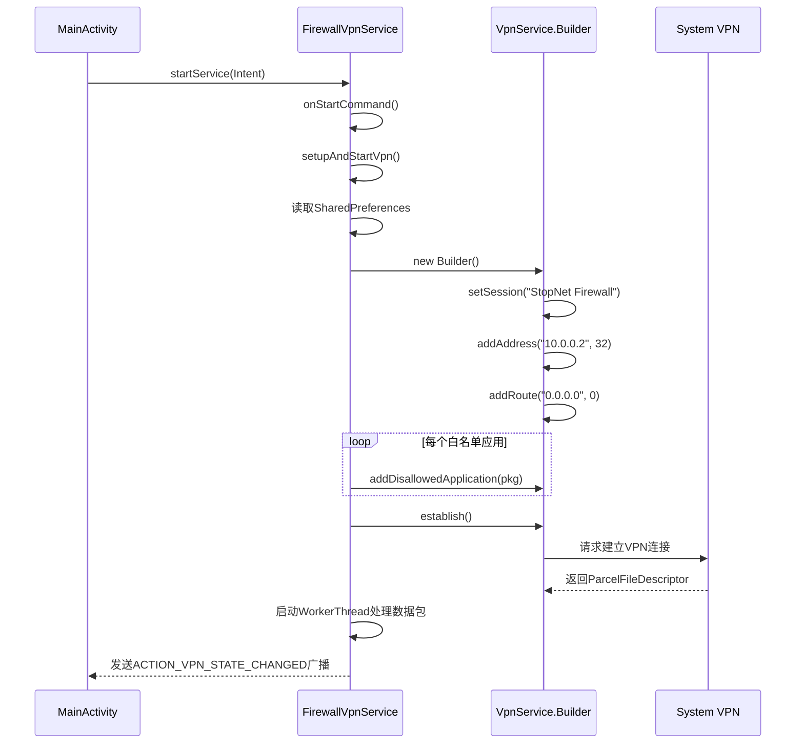
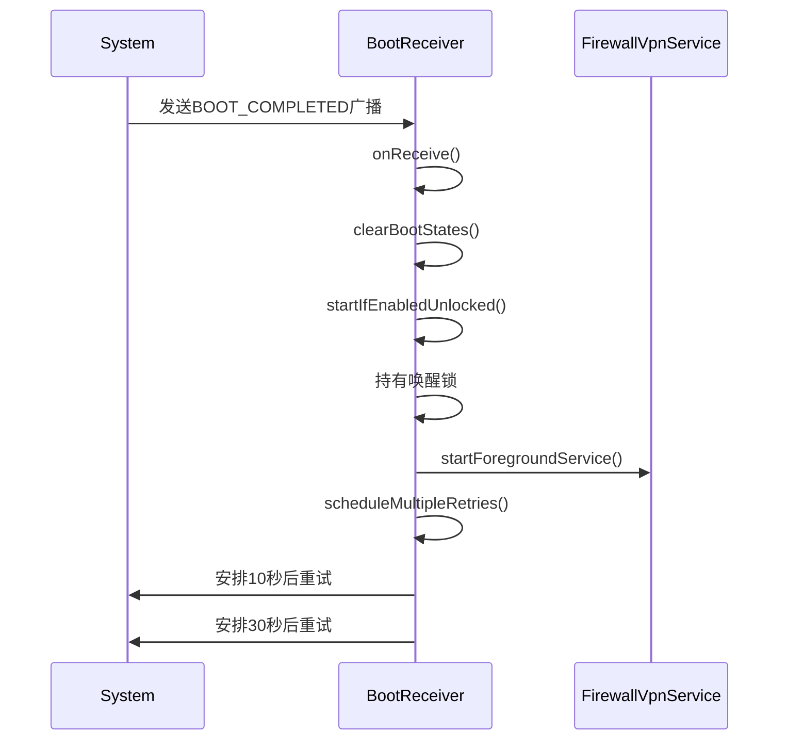
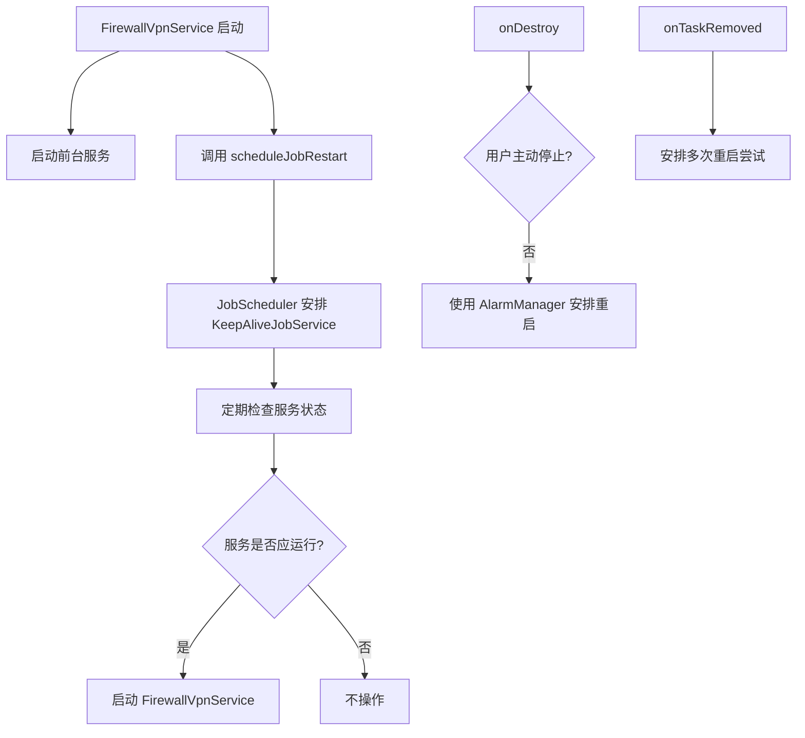

# 核心功能详解

<cite>
**Referenced Files in This Document**   
- [FirewallVpnService.kt](file://app/src/main/java/com/example/phonenet/FirewallVpnService.kt)
- [BootReceiver.kt](file://app/src/main/java/com/example/phonenet/BootReceiver.kt)
- [KeepAliveJobService.kt](file://app/src/main/java/com/example/phonenet/KeepAliveJobService.kt)
- [MailJobIntentService.kt](file://app/src/main/java/com/example/phonenet/mail/MailJobIntentService.kt)
- [MyDeviceAdminReceiver.kt](file://app/src/main/java/com/example/phonenet/admin/MyDeviceAdminReceiver.kt)
- [VpnStateStore.kt](file://app/src/main/java/com/example/phonenet/VpnStateStore.kt)
</cite>

## 目录
1. [应用级防火墙与VPN服务](#应用级防火墙与vpn服务)
2. [开机自启与广播监听](#开机自启与广播监听)
3. [服务保活机制](#服务保活机制)
4. [邮件发送功能](#邮件发送功能)
5. [设备管理员权限](#设备管理员权限)

## 应用级防火墙与VPN服务

`FirewallVpnService` 是应用的核心，它继承自 Android 的 `VpnService`，通过创建虚拟网络接口来实现应用级防火墙功能。该服务利用 `VpnService.Builder` 构建并配置一个虚拟专用网络（VPN）隧道，通过 `addDisallowedApplication` 方法将用户配置的黑名单应用加入到阻止列表中，从而实现对特定应用的网络访问控制。

服务启动时，`onStartCommand` 方法被调用。它首先检查启动意图（Intent）的动作。如果动作是 `ACTION_STOP_VPN`，则清理所有状态并停止服务。否则，它会调用 `setupAndStartVpn` 方法来建立VPN连接。此方法从共享偏好设置（SharedPreferences）中读取用户配置的白名单应用包名集合，然后使用 `VpnService.Builder` 进行配置。它会为虚拟网络分配一个IP地址（如 `10.0.0.2`），添加一个默认路由（`0.0.0.0/0`）以捕获所有流量，并为每个白名单应用调用 `addDisallowedApplication` 方法。最后，调用 `establish()` 方法创建 `ParcelFileDescriptor`，并启动一个工作线程来读取和丢弃通过该虚拟接口的网络数据包，从而实现防火墙效果。

**Diagram sources**
- [FirewallVpnService.kt](file://app/src/main/java/com/example/phonenet/FirewallVpnService.kt#L261-L317)
- [FirewallVpnService.kt](file://app/src/main/java/com/example/phonenet/FirewallVpnService.kt#L28-L127)

**Section sources**
- [FirewallVpnService.kt](file://app/src/main/java/com/example/phonenet/FirewallVpnService.kt#L15-L392)

## 开机自启与广播监听

`BootReceiver` 是一个 `BroadcastReceiver`，负责监听系统广播以实现开机自启。它主要监听 `ACTION_BOOT_COMPLETED`（设备启动完成）、`ACTION_LOCKED_BOOT_COMPLETED`（设备锁定启动完成）和 `ACTION_USER_UNLOCKED`（用户解锁）等广播。当接收到这些广播时，它会尝试启动 `FirewallVpnService`。

为了处理 Android N (API 24) 引入的设备加密存储（Device Protected Storage）问题，`BootReceiver` 在用户解锁前（`ACTION_LOCKED_BOOT_COMPLETED`）会使用 `createDeviceProtectedStorageContext()` 来访问加密存储中的偏好设置，以读取“开机自启”开关的状态。一旦用户解锁，它会切换到常规的偏好设置。此外，为了应对某些厂商（如vivo）系统的后台限制，`BootReceiver` 在收到 `ACTION_BOOT_COMPLETED` 后，会使用 `AlarmManager` 安排多次重试（例如在10秒、30秒后），以确保服务能够成功启动。

**Diagram sources**
- [BootReceiver.kt](file://app/src/main/java/com/example/phonenet/BootReceiver.kt#L14-L50)
- [BootReceiver.kt](file://app/src/main/java/com/example/phonenet/BootReceiver.kt#L144-L207)

**Section sources**
- [BootReceiver.kt](file://app/src/main/java/com/example/phonenet/BootReceiver.kt#L9-L228)

## 服务保活机制

为了防止 `FirewallVpnService` 被系统杀死，项目采用了多层保活策略。第一层是前台服务（Foreground Service），通过 `startForegroundNotification` 方法创建一个持续显示的通知，向用户表明服务正在运行，这可以显著降低被系统回收的概率。

第二层是 `JobScheduler` 保活。`FirewallVpnService` 在启动后会调用 `scheduleJobRestart` 方法，安排一个 `JobInfo` 任务给 `KeepAliveJobService`。这个任务被设置为持久化（persisted），即使设备重启也会保留。`KeepAliveJobService` 的 `onStartJob` 方法会在任务执行时检查服务状态，如果服务应该运行，则尝试重新启动 `FirewallVpnService`。

第三层是 `AlarmManager` 保活。当 `FirewallVpnService` 被销毁（`onDestroy`）且不是用户主动停止时，它会使用 `AlarmManager` 安排一个精确的闹钟，在3秒后再次尝试启动服务。此外，当用户从最近任务列表中清除应用时（`onTaskRemoved`），服务也会触发多次重启尝试。

**Diagram sources**
- [FirewallVpnService.kt](file://app/src/main/java/com/example/phonenet/FirewallVpnService.kt#L247-L259)
- [KeepAliveJobService.kt](file://app/src/main/java/com/example/phonenet/KeepAliveJobService.kt#L17-L46)

**Section sources**
- [FirewallVpnService.kt](file://app/src/main/java/com/example/phonenet/FirewallVpnService.kt#L129-L184)
- [KeepAliveJobService.kt](file://app/src/main/java/com/example/phonenet/KeepAliveJobService.kt#L10-L70)

## 邮件发送功能

`MailJobIntentService` 是一个 `JobIntentService`，用于在后台异步发送SMTP测试邮件。它通过 `javax.mail` API 实现邮件发送功能。类中定义了一个 `enqueue` 静态方法，作为外部调用的入口，用于将发送邮件的任务加入队列。

`onHandleWork` 方法是实际处理邮件发送逻辑的地方。它首先从共享偏好设置中读取SMTP服务器的配置信息（主机、端口、SSL/TLS设置、用户名、密码等）。然后，它使用 `Properties` 对象配置JavaMail会话（`Session`），并创建一个 `Authenticator` 来处理身份验证。接着，它构建一个 `MimeMessage` 对象，设置发件人、收件人、主题和正文。最后，通过 `Transport.send(message)` 方法发送邮件。整个过程被包裹在 try-catch 块中，以处理可能的网络或认证异常。

**Section sources**
- [MailJobIntentService.kt](file://app/src/main/java/com/example/phonenet/mail/MailJobIntentService.kt#L14-L92)

## 设备管理员权限

`MyDeviceAdminReceiver` 继承自 `DeviceAdminReceiver`，用于集成Android的设备管理员权限。这可以增强应用的管控能力，例如防止用户轻易卸载应用。

该接收器重写了 `onDisableRequested` 方法。当用户尝试停用设备管理员权限时，此方法会被调用。在此方法中，应用会检查是否配置了家长邮箱。如果配置了，它会使用 `MailJobIntentService.enqueue` 方法发送一封提醒邮件，通知家长设备管理权限即将被停用，这可能意味着应用将被卸载。同时，它会返回一个提示字符串，告知用户停用权限的后果。`onEnabled` 和 `onDisabled` 方法则分别在权限被启用和停用时显示Toast提示。

**Section sources**
- [MyDeviceAdminReceiver.kt](file://app/src/main/java/com/example/phonenet/admin/MyDeviceAdminReceiver.kt#L8-L32)