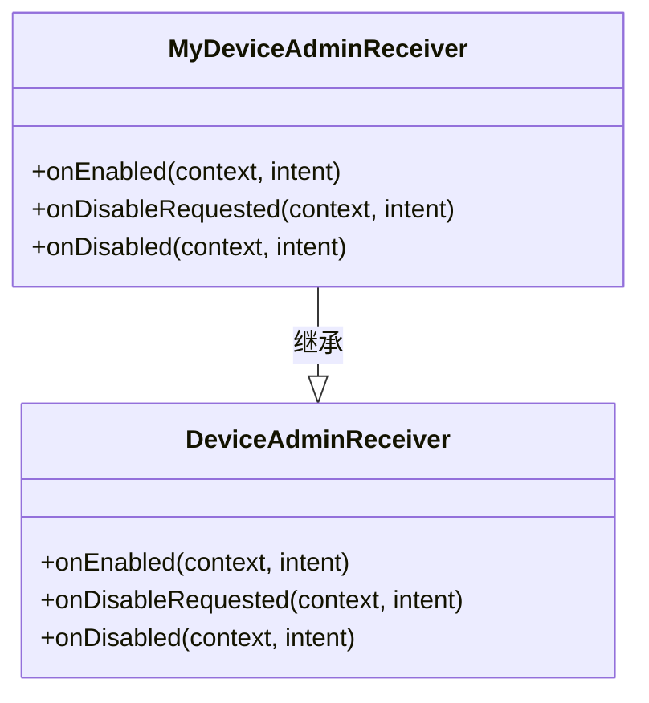
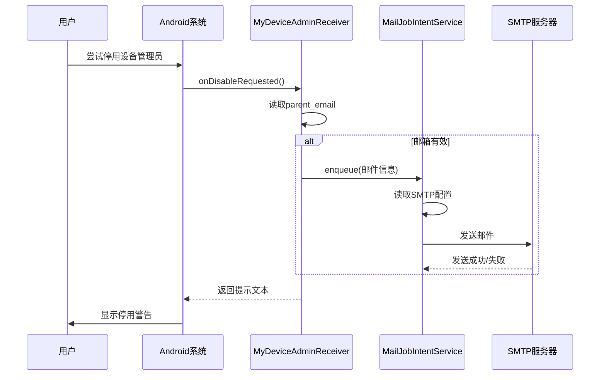

# 设备管理员集成

<cite>
**Referenced Files in This Document**   
- [MyDeviceAdminReceiver.kt](file://app/src/main/java/com/example/phonenet/admin/MyDeviceAdminReceiver.kt)
- [MailJobIntentService.kt](file://app/src/main/java/com/example/phonenet/mail/MailJobIntentService.kt)
- [SettingsActivity.kt](file://app/src/main/java/com/example/phonenet/SettingsActivity.kt)
- [device_admin_receiver.xml](file://app/src/main/res/xml/device_admin_receiver.xml)
- [AndroidManifest.xml](file://app/src/main/AndroidManifest.xml)
</cite>

## 目录
1. [简介](#简介)
2. [核心组件](#核心组件)
3. [设备管理员权限机制](#设备管理员权限机制)
4. [权限启用与停用处理](#权限启用与停用处理)
5. [家长通知邮件机制](#家长通知邮件机制)
6. [配置与声明文件](#配置与声明文件)
7. [集成指南](#集成指南)
8. [安全最佳实践](#安全最佳实践)

## 简介
本文档深入解析StopNet应用中设备管理员功能的集成实现。重点阐述`MyDeviceAdminReceiver`如何继承Android系统`DeviceAdminReceiver`类，实现设备管理权限的核心功能。文档详细说明权限启用、停用时的回调处理流程，以及在用户尝试停用权限时触发家长通知邮件的机制，旨在为开发者提供完整的设备管理员权限集成方案和安全实践指导。

## 核心组件

`MyDeviceAdminReceiver`是StopNet应用实现设备管理员功能的核心组件。该类继承自Android SDK提供的`DeviceAdminReceiver`基类，通过重写其生命周期方法来响应设备管理权限的状态变化。当权限被启用、请求停用或最终停用时，系统会回调相应的方法，使应用能够执行特定的业务逻辑，如显示用户提示或发送通知邮件。

**Section sources**
- [MyDeviceAdminReceiver.kt](file://app/src/main/java/com/example/phonenet/admin/MyDeviceAdminReceiver.kt#L8-L32)

## 设备管理员权限机制

Android设备管理员（Device Admin）API允许应用在获得用户明确授权后，执行一系列与设备安全和策略相关的操作。StopNet应用利用此机制来增强其家长控制功能的管控能力。通过成为设备管理员，应用可以防止被轻易卸载，并能对设备施加一定的安全策略。

**Diagram sources**
- [MyDeviceAdminReceiver.kt](file://app/src/main/java/com/example/phonenet/admin/MyDeviceAdminReceiver.kt#L8-L32)

**Section sources**
- [MyDeviceAdminReceiver.kt](file://app/src/main/java/com/example/phonenet/admin/MyDeviceAdminReceiver.kt#L8-L32)

## 权限启用与停用处理

### onEnabled 方法
当用户在系统设置中成功启用StopNet的设备管理员权限后，系统会调用`onEnabled`方法。在此方法中，应用通过`Toast`向用户显示“设备管理已启用”的提示信息，以提供即时的反馈。

### onDisabled 方法
当设备管理员权限被最终停用时，系统会调用`onDisabled`方法。与`onEnabled`类似，该方法也通过`Toast`显示“设备管理已停用”的提示，告知用户当前状态。

### onDisableRequested 方法
此方法是权限管理中的关键环节。当用户尝试在系统设置中停用StopNet的设备管理员权限时，系统会首先调用`onDisableRequested`。该方法会返回一个提示字符串，显示给用户，警告其停用权限将导致应用可被卸载并解除网络管控。

**Section sources**
- [MyDeviceAdminReceiver.kt](file://app/src/main/java/com/example/phonenet/admin/MyDeviceAdminReceiver.kt#L14-L30)

## 家长通知邮件机制

`onDisableRequested`方法不仅提供用户提示，还实现了主动通知家长的功能。其核心流程如下：

1.  **读取配置**：方法首先从应用的共享首选项`stopnet_prefs`中读取预先配置的家长邮箱地址（`parent_email`）。
2.  **发送邮件**：如果邮箱地址有效，系统会调用`MailJobIntentService.enqueue()`方法，传入家长邮箱、预设的主题和正文。
3.  **异步执行**：`MailJobIntentService`是一个`JobIntentService`，它会在后台异步执行邮件发送任务。该服务会从共享首选项中读取SMTP服务器配置（主机、端口、用户名、密码等），构建邮件并使用JavaMail API通过SMTP协议发送。
4.  **异常处理**：整个邮件发送过程被包裹在`try-catch`块中，任何发送失败的异常都会被忽略，以确保不影响主流程。

此机制极大地增强了应用的管控能力。即使孩子尝试通过停用设备管理员权限来绕过家长控制，家长也会立即收到邮件提醒，从而能够及时干预。

**Diagram sources**
- [MyDeviceAdminReceiver.kt](file://app/src/main/java/com/example/phonenet/admin/MyDeviceAdminReceiver.kt#L18-L28)
- [MailJobIntentService.kt](file://app/src/main/java/com/example/phonenet/mail/MailJobIntentService.kt#L14-L92)

**Section sources**
- [MyDeviceAdminReceiver.kt](file://app/src/main/java/com/example/phonenet/admin/MyDeviceAdminReceiver.kt#L18-L28)
- [MailJobIntentService.kt](file://app/src/main/java/com/example/phonenet/mail/MailJobIntentService.kt#L14-L92)

## 配置与声明文件

### AndroidManifest.xml
在`AndroidManifest.xml`文件中，`MyDeviceAdminReceiver`作为一个广播接收器被声明。其关键配置包括：
- **android:label**：在系统设置中显示的名称。
- **android:exported="true"**：允许系统外部（即系统设置）启动此接收器。
- **<meta-data>**：通过`android.app.device_admin`指向`@xml/device_admin_receiver`资源文件，这是声明设备管理员组件的必要步骤。
- **<intent-filter>**：监听`DEVICE_ADMIN_ENABLED`等设备管理员相关的系统广播。

### device_admin_receiver.xml
位于`res/xml/`目录下的`device_admin_receiver.xml`文件定义了应用请求的设备管理策略。StopNet应用声明了以下策略：
- `limit-password`：限制密码复杂度。
- `watch-login`：监控登录尝试。
- `wipe-data`：允许远程擦除数据。
- `reset-password`：允许重置密码。
- `force-lock`：允许强制锁定设备。
- `expire-password`：允许设置密码过期。

这些策略的声明是应用能够执行相应操作的前提。

**Section sources**
- [AndroidManifest.xml](file://app/src/main/AndroidManifest.xml#L70-L80)
- [device_admin_receiver.xml](file://app/src/main/res/xml/device_admin_receiver.xml#L1-L11)

## 集成指南

开发者在集成设备管理员功能时，应遵循以下步骤：

1.  **创建接收器**：创建一个继承自`DeviceAdminReceiver`的类（如`MyDeviceAdminReceiver`）。
2.  **重写回调方法**：根据业务需求，重写`onEnabled`、`onDisableRequested`和`onDisabled`等方法。
3.  **定义策略文件**：在`res/xml/`目录下创建XML文件，声明所需的应用策略。
4.  **注册组件**：在`AndroidManifest.xml`中声明接收器，并通过`<meta-data>`链接到策略文件。
5.  **请求权限**：在需要时，通过`ACTION_ADD_DEVICE_ADMIN` Intent启动系统设置页面，引导用户授权。
6.  **检查权限状态**：使用`DevicePolicyManager`的`isAdminActive()`方法检查当前权限状态。

**Section sources**
- [SettingsActivity.kt](file://app/src/main/java/com/example/phonenet/SettingsActivity.kt#L183-L190)
- [AndroidManifest.xml](file://app/src/main/AndroidManifest.xml#L70-L80)

## 安全最佳实践

1.  **最小权限原则**：仅请求应用功能所必需的设备管理策略，避免过度申请权限。
2.  **敏感信息保护**：像SMTP密码这样的敏感信息应妥善存储。本例中虽未加密，但最佳实践是使用Android Keystore系统进行加密。
3.  **用户知情权**：在请求权限时，通过`EXTRA_ADD_EXPLANATION`提供清晰的说明，告知用户授权的目的和影响。
4.  **优雅降级**：当权限被停用时，应用应能正常运行（尽管部分功能受限），避免崩溃。
5.  **后台任务安全**：如`MailJobIntentService`所示，耗时操作应在后台服务中执行，避免阻塞主线程。