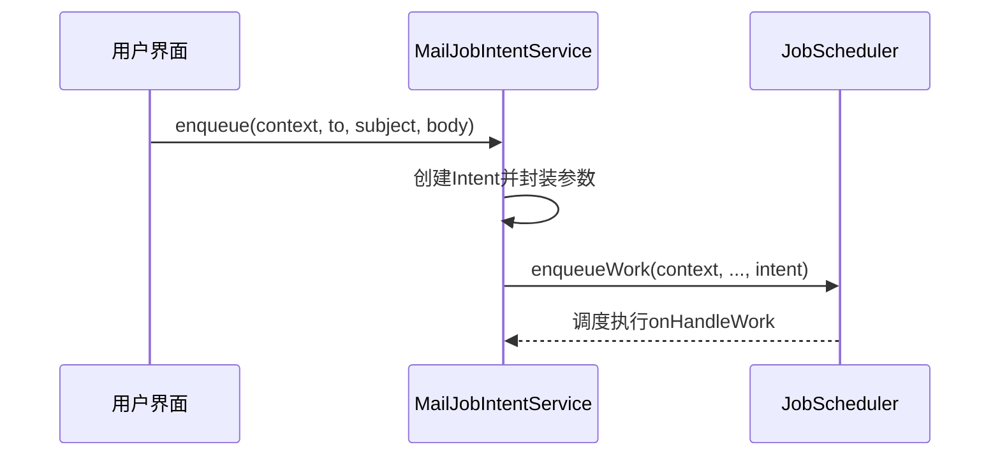
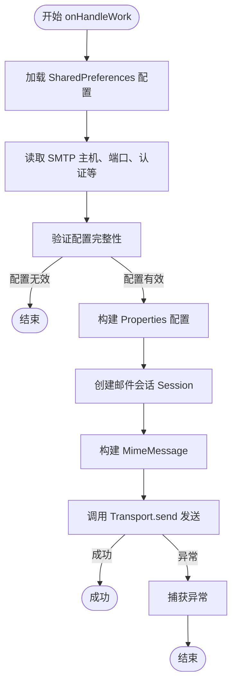
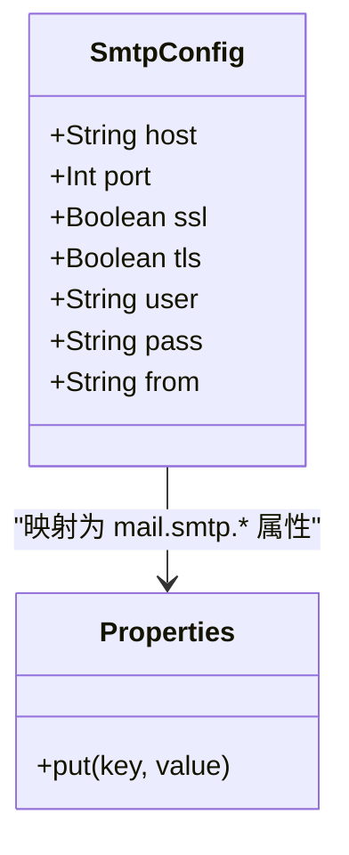
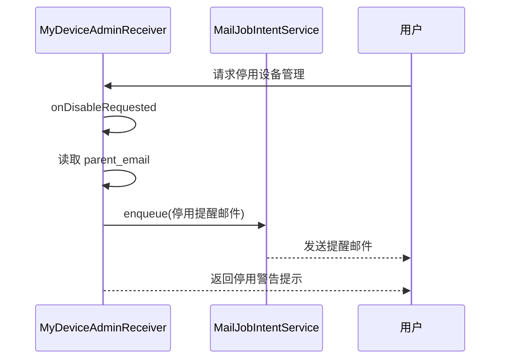
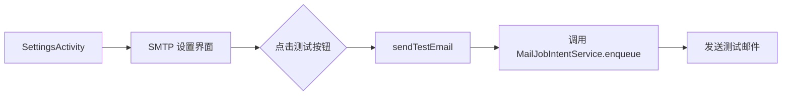

# 邮件通知功能

<cite>
**本文档引用的文件**  
- [MailJobIntentService.kt](file://app/src/main/java/com/example/phonenet/mail/MailJobIntentService.kt)
- [MyDeviceAdminReceiver.kt](file://app/src/main/java/com/example/phonenet/admin/MyDeviceAdminReceiver.kt)
- [SettingsActivity.kt](file://app/src/main/java/com/example/phonenet/SettingsActivity.kt)
- [AndroidManifest.xml](file://app/src/main/AndroidManifest.xml)
- [strings.xml](file://app/src/main/res/values/strings.xml)
- [activity_settings.xml](file://app/src/main/res/layout/activity_settings.xml)
- [device_admin_receiver.xml](file://app/src/main/res/xml/device_admin_receiver.xml)
</cite>

## 目录
1. [简介](#简介)
2. [核心组件](#核心组件)
3. [工作流程分析](#工作流程分析)
4. [SMTP 配置策略](#smtp-配置策略)
5. [异常处理机制](#异常处理机制)
6. [触发场景分析](#触发场景分析)
7. [测试与排查建议](#测试与排查建议)
8. [结论](#结论)

## 简介
本系统实现了基于 Android 后台服务的邮件通知功能，主要用于家长控制场景下的关键事件提醒。通过 `JobIntentService` 实现可靠的后台邮件发送机制，并结合设备管理权限状态变化触发特定通知。系统支持完整的 SMTP 安全连接配置，包括 SSL 和 STARTTLS 模式，确保邮件传输的安全性。

## 核心组件

`MailJobIntentService` 是邮件发送功能的核心实现类，继承自 `JobIntentService`，用于在后台线程安全地执行邮件发送任务。该服务通过 `enqueue` 方法接收外部请求，并在 `onHandleWork` 中处理实际的邮件构建与发送逻辑。

`MyDeviceAdminReceiver` 作为设备管理接收器，在特定生命周期事件（如停用请求）中触发邮件通知，实现关键安全事件的即时告警。

**Section sources**
- [MailJobIntentService.kt](file://app/src/main/java/com/example/phonenet/mail/MailJobIntentService.kt#L1-L92)
- [MyDeviceAdminReceiver.kt](file://app/src/main/java/com/example/phonenet/admin/MyDeviceAdminReceiver.kt#L1-L32)

## 工作流程分析

### 邮件任务提交流程


**Diagram sources**
- [MailJobIntentService.kt](file://app/src/main/java/com/example/phonenet/mail/MailJobIntentService.kt#L18-L25)

`enqueue` 方法是邮件发送的入口点，它接受上下文、收件人地址、主题和正文作为参数。方法内部创建一个 `Intent` 对象，将邮件参数通过 `putExtra` 封装到 Intent 中，然后调用父类的 `enqueueWork` 方法提交工作请求。这种设计实现了异步解耦，保证邮件发送不会阻塞主线程。

### 邮件处理执行流程


**Diagram sources**
- [MailJobIntentService.kt](file://app/src/main/java/com/example/phonenet/mail/MailJobIntentService.kt#L28-L91)

`onHandleWork` 方法负责处理实际的邮件发送任务。首先从 `SharedPreferences` 中读取 SMTP 配置，支持普通存储和设备保护存储（DPS）双路径读取，提高配置的持久性和安全性。然后从传入的 Intent 中提取邮件参数，进行必要的空值检查。

## SMTP 配置策略

### 配置读取机制
系统采用双层配置读取策略，优先从普通共享首选项读取，若未找到则回退到设备保护存储：

```kotlin
val prefs = ctx.getSharedPreferences("stopnet_prefs", Context.MODE_PRIVATE)
val dpsPrefs = ctx.createDeviceProtectedStorageContext()
    .getSharedPreferences("stopnet_prefs", Context.MODE_PRIVATE)
```

这种设计确保在设备加密状态下仍能访问关键配置，提升服务的可靠性。

### 连接配置策略


**Diagram sources**
- [MailJobIntentService.kt](file://app/src/main/java/com/example/phonenet/mail/MailJobIntentService.kt#L45-L67)

系统根据 SSL 和 TLS 标志动态配置邮件连接属性：
- 当启用 SSL 时，设置 `mail.smtp.ssl.enable` 为 true，通常使用端口 465
- 当禁用 SSL 但启用 TLS 时，设置 `mail.smtp.starttls.enable` 为 true，通常使用端口 587
- 统一设置连接超时、读取超时和写入超时均为 10 秒，防止网络异常导致服务长时间阻塞

### 编码与消息构建
`MimeMessage` 在构建时明确指定 UTF-8 编码，确保中文等多字节字符能正确显示：

```kotlin
setSubject(subject, "UTF-8")
setText(body, "UTF-8")
```

发件人和收件人均使用 `InternetAddress` 进行解析，符合 RFC 822 标准。

**Section sources**
- [MailJobIntentService.kt](file://app/src/main/java/com/example/phonenet/mail/MailJobIntentService.kt#L75-L85)

## 异常处理机制
系统在邮件发送过程中采用静默异常处理策略：

```kotlin
try {
    Transport.send(message)
} catch (_: Exception) {
    // 可按需增加日志或重试
}
```

这种设计避免了因邮件发送失败而导致应用崩溃，同时保留了扩展日志记录和重试机制的空间。对于关键业务场景，建议在此处添加适当的错误日志记录。

**Section sources**
- [MailJobIntentService.kt](file://app/src/main/java/com/example/phonenet/mail/MailJobIntentService.kt#L87-L91)

## 触发场景分析

### 设备管理停用提醒


**Diagram sources**
- [MyDeviceAdminReceiver.kt](file://app/src/main/java/com/example/phonenet/admin/MyDeviceAdminReceiver.kt#L14-L25)

当用户尝试停用设备管理权限时，`onDisableRequested` 方法会被调用。系统首先检查是否配置了家长邮箱，如果已配置，则通过 `MailJobIntentService.enqueue` 发送停用提醒邮件。邮件内容明确提示"设备管理权限正在被停用，可能即将卸载应用"，起到预警作用。

### 配置界面交互


在设置界面中，用户可以通过点击"发送测试邮件"按钮验证 SMTP 配置的有效性。系统会自动使用预设的测试主题和正文内容发送邮件，提供即时反馈。

**Section sources**
- [MyDeviceAdminReceiver.kt](file://app/src/main/java/com/example/phonenet/admin/MyDeviceAdminReceiver.kt#L14-L25)
- [SettingsActivity.kt](file://app/src/main/java/com/example/phonenet/SettingsActivity.kt#L212-L226)

## 测试与排查建议

### SMTP 测试配置建议
1. **使用主流邮箱服务**：推荐使用 Gmail、Outlook 等支持现代认证方式的邮箱
2. **应用专用密码**：对于启用两步验证的邮箱，应使用应用专用密码而非账户密码
3. **端口配置**：
   - SSL 模式：端口 465
   - STARTTLS 模式：端口 587
4. **超时设置**：当前 10 秒超时设置合理，不建议修改

### 常见连接问题排查
- **连接超时**：检查设备网络连接，确认防火墙未阻止邮件端口
- **认证失败**：验证用户名密码正确性，注意某些邮箱需要特殊应用密码
- **SSL/TLS 协商失败**：确认服务器支持所选加密模式，可尝试切换 SSL/STARTTLS 模式
- **发送权限被拒**：检查邮箱账户是否被锁定或限制发送权限

建议开发者在测试时开启详细的日志记录，以便快速定位问题根源。

**Section sources**
- [SettingsActivity.kt](file://app/src/main/java/com/example/phonenet/SettingsActivity.kt#L274-L304)
- [strings.xml](file://app/src/main/res/values/strings.xml#L20-L23)
- [activity_settings.xml](file://app/src/main/res/layout/activity_settings.xml#L36-L112)

## 结论
本邮件通知系统通过 `JobIntentService` 实现了可靠、安全的后台邮件发送功能。系统完整支持 SMTP SSL 和 STARTTLS 安全连接，具备合理的超时控制和异常处理机制。通过与设备管理功能深度集成，能够在关键安全事件发生时及时通知家长用户。配置界面提供了完整的测试功能，便于用户验证设置的正确性。整体设计兼顾了功能性、安全性和用户体验，为家长控制应用提供了重要的通知能力。