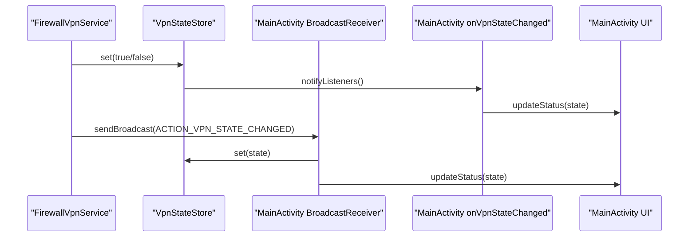
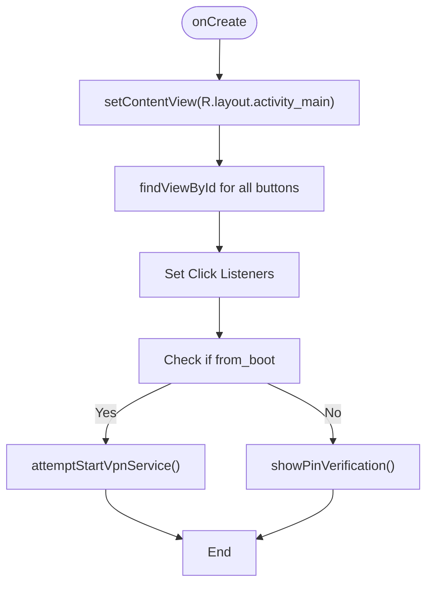
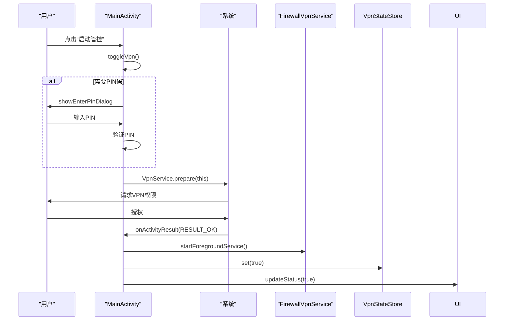
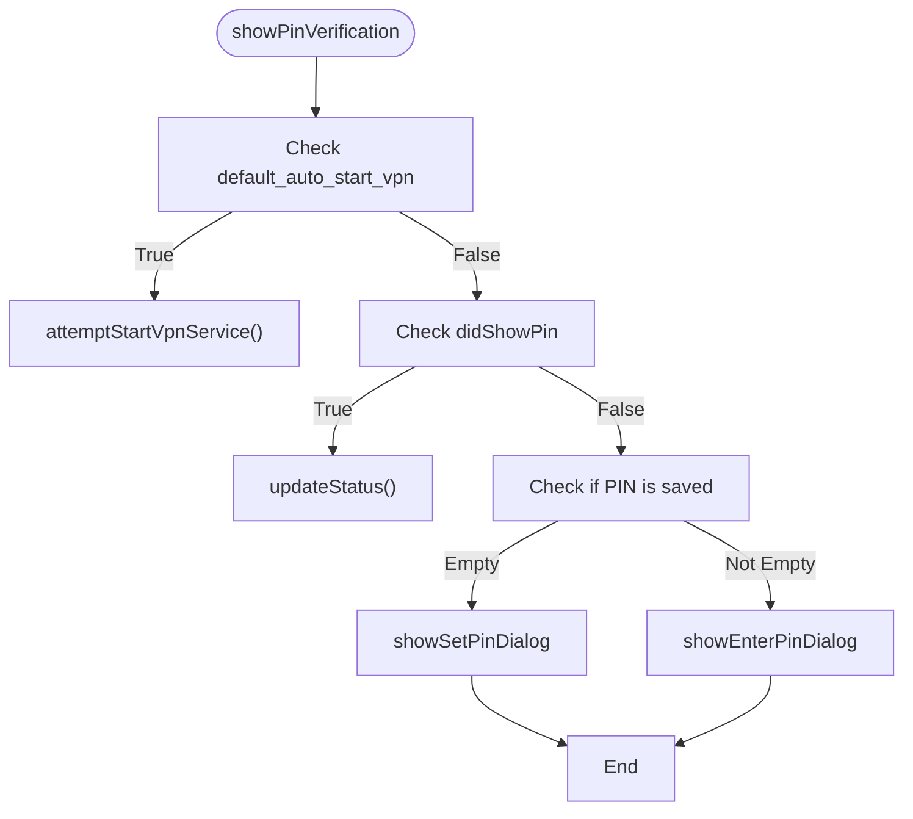
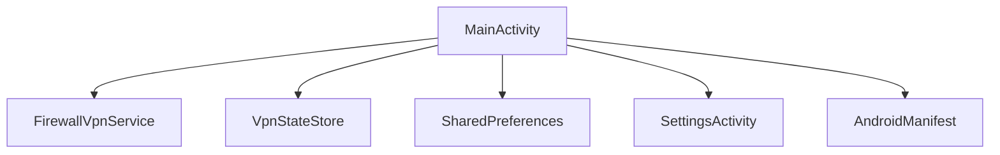

# 主界面 (MainActivity)

<cite>
**Referenced Files in This Document**   
- [MainActivity.kt](file://app/src/main/java/com/example/phonenet/MainActivity.kt)
- [activity_main.xml](file://app/src/main/res/layout/activity_main.xml)
- [VpnStateStore.kt](file://app/src/main/java/com/example/phonenet/VpnStateStore.kt)
- [FirewallVpnService.kt](file://app/src/main/java/com/example/phonenet/FirewallVpnService.kt)
- [SettingsActivity.kt](file://app/src/main/java/com/example/phonenet/SettingsActivity.kt)
- [AndroidManifest.xml](file://app/src/main/AndroidManifest.xml)
</cite>

## 目录
1. [简介](#简介)
2. [项目结构](#项目结构)
3. [核心组件](#核心组件)
4. [架构概述](#架构概述)
5. [详细组件分析](#详细组件分析)
6. [依赖分析](#依赖分析)
7. [性能考虑](#性能考虑)
8. [故障排除指南](#故障排除指南)
9. [结论](#结论)

## 简介
`MainActivity` 是 StopNet 应用的主入口，负责提供用户与网络管控功能交互的核心界面。该界面通过直观的按钮控制，实现了对 VPN 服务的启动与停止、系统设置的跳转、电池优化和自启动权限的引导。其核心职责是作为用户操作的中心枢纽，协调 PIN 码验证、权限请求、服务通信等复杂逻辑，确保用户能够安全、稳定地使用网络管控功能。本文档将深入剖析 `MainActivity` 的实现细节，包括其与 `VpnStateStore` 单例、`FirewallVpnService` 服务的交互，以及如何通过广播接收器和状态监听器实现实时的 UI 状态同步。

## 项目结构
`MainActivity` 位于 `app/src/main/java/com/example/phonenet/` 目录下，其对应的布局文件 `activity_main.xml` 位于 `app/src/main/res/layout/` 目录。该 Activity 与 `FirewallVpnService` 服务、`VpnStateStore` 状态管理器、`SettingsActivity` 设置界面等核心组件紧密协作。`AndroidManifest.xml` 文件定义了 `MainActivity` 作为应用启动入口的权限和配置。

```mermaid
graph TB
subgraph "UI 层"
MainActivity["MainActivity.kt"]
SettingsActivity["SettingsActivity.kt"]
activity_main["activity_main.xml"]
activity_settings["activity_settings.xml"]
end
subgraph "服务与状态层"
FirewallVpnService["FirewallVpnService.kt"]
VpnStateStore["VpnStateStore.kt"]
end
subgraph "配置"
AndroidManifest["AndroidManifest.xml"]
end
MainActivity --> FirewallVpnService : "startForegroundService"
MainActivity --> VpnStateStore : "addListener"
MainActivity --> SettingsActivity : "startActivity"
MainActivity --> AndroidManifest : "定义入口"
SettingsActivity --> FirewallVpnService : "重载白名单"
```

**Diagram sources**
- [MainActivity.kt](file://app/src/main/java/com/example/phonenet/MainActivity.kt)
- [SettingsActivity.kt](file://app/src/main/java/com/example/phonenet/SettingsActivity.kt)
- [FirewallVpnService.kt](file://app/src/main/java/com/example/phonenet/FirewallVpnService.kt)
- [VpnStateStore.kt](file://app/src/main/java/com/example/phonenet/VpnStateStore.kt)
- [AndroidManifest.xml](file://app/src/main/AndroidManifest.xml)

**Section sources**
- [MainActivity.kt](file://app/src/main/java/com/example/phonenet/MainActivity.kt)
- [activity_main.xml](file://app/src/main/res/layout/activity_main.xml)

## 核心组件
`MainActivity` 的核心在于其对 VPN 服务状态的精确控制和对用户交互的响应。它通过 `btnToggleVpn` 按钮实现“启动管控”和“停止管控”的状态切换，并通过 `updateStatus` 方法实时更新按钮的文本和颜色。该 Activity 在 `onCreate` 时初始化所有 UI 元素和监听器，并在 `onStart` 和 `onStop` 生命周期中注册和注销广播接收器与状态监听器，以确保资源的正确管理。`VpnStateStore` 作为全局状态的单一来源，被 `MainActivity` 和 `FirewallVpnService` 共同使用，实现了跨组件的状态同步。

**Section sources**
- [MainActivity.kt](file://app/src/main/java/com/example/phonenet/MainActivity.kt#L17-L643)
- [VpnStateStore.kt](file://app/src/main/java/com/example/phonenet/VpnStateStore.kt#L4-L29)

## 架构概述
`MainActivity` 采用了一种以状态为中心的架构。UI 的更新不依赖于轮询，而是通过事件驱动的方式进行。当 `FirewallVpnService` 的状态发生变化时，它会通过 `sendBroadcast` 发送一个 `ACTION_VPN_STATE_CHANGED` 广播。`MainActivity` 内部的 `BroadcastReceiver` 接收到此广播后，会立即调用 `VpnStateStore.set()` 更新内存中的状态。同时，`MainActivity` 在 `onStart` 时通过 `VpnStateStore.addListener()` 注册了一个回调监听器，一旦状态被 `set`，该监听器就会被触发，从而调用 `updateStatus()` 方法刷新 UI。这种双重监听机制（广播 + 内存状态）确保了即使在应用从后台恢复时，UI 也能与服务的真实状态保持一致。



**Diagram sources**
- [MainActivity.kt](file://app/src/main/java/com/example/phonenet/MainActivity.kt#L41-L49)
- [MainActivity.kt](file://app/src/main/java/com/example/phonenet/MainActivity.kt#L36-L38)
- [MainActivity.kt](file://app/src/main/java/com/example/phonenet/MainActivity.kt#L358-L369)
- [FirewallVpnService.kt](file://app/src/main/java/com/example/phonenet/FirewallVpnService.kt#L28-L127)
- [VpnStateStore.kt](file://app/src/main/java/com/example/phonenet/VpnStateStore.kt#L9-L14)

## 详细组件分析

### 启动与状态初始化分析
`MainActivity` 的 `onCreate` 方法是其生命周期的起点。它首先通过 `setContentView` 加载 `activity_main.xml` 布局，然后通过 `findViewById` 获取所有按钮的引用。接着，它为每个按钮设置点击监听器：`btnToggleVpn` 触发 `toggleVpn()`，`btnSettings` 跳转到 `SettingsActivity`，而 `btnIgnoreBattery` 和 `btnAutoStart` 则分别引导用户进行电池优化和自启动设置。在初始化完成后，它会检查启动来源。如果应用是通过 `BootReceiver` 从开机广播启动的（`from_boot` 为 true），则会自动尝试启动 VPN 服务，以实现开机自启。否则，对于普通启动，它会调用 `showPinVerification()` 进行 PIN 码验证。



**Diagram sources**
- [MainActivity.kt](file://app/src/main/java/com/example/phonenet/MainActivity.kt#L56-L101)
- [activity_main.xml](file://app/src/main/res/layout/activity_main.xml)

**Section sources**
- [MainActivity.kt](file://app/src/main/java/com/example/phonenet/MainActivity.kt#L56-L101)

### 状态切换与服务通信分析
“启动管控”按钮的点击逻辑由 `toggleVpn()` 方法处理。该方法首先通过 `VpnStateStore.current()` 或回退到 `SharedPreferences` 查询当前的 VPN 运行状态。然后，它会检查是否需要进行 PIN 码验证（即 `didShowPin` 为 false 且已设置 PIN）。如果需要，则弹出 `showEnterPinDialog`，验证成功后根据当前状态执行 `startVpn()` 或 `stopVpn()`。`startVpn()` 方法是启动服务的关键，它首先检查 Android 13+ 的通知权限，然后引导用户忽略电池优化，最后通过 `VpnService.prepare(this)` 弹出系统授权对话框。当用户授权后，系统会回调 `onActivityResult`，此时 `MainActivity` 会调用 `startForegroundService()` 启动 `FirewallVpnService`，并立即通过 `VpnStateStore.set(true)` 更新内存状态，使 UI 立即变为“停止管控”状态。



**Diagram sources**
- [MainActivity.kt](file://app/src/main/java/com/example/phonenet/MainActivity.kt#L260-L279)
- [MainActivity.kt](file://app/src/main/java/com/example/phonenet/MainActivity.kt#L281-L325)
- [MainActivity.kt](file://app/src/main/java/com/example/phonenet/MainActivity.kt#L103-L119)

**Section sources**
- [MainActivity.kt](file://app/src/main/java/com/example/phonenet/MainActivity.kt#L260-L343)

### PIN码验证流程分析
PIN 码验证流程是应用安全性的关键。`MainActivity` 在首次启动或非开机启动时调用 `showPinVerification()`。该方法会检查 `SharedPreferences` 中是否已设置 PIN。如果未设置，则调用 `showSetPinDialog` 引导用户设置一个至少4位的数字 PIN 码。如果已设置，则调用 `showEnterPinDialog` 要求用户输入 PIN 码。`showEnterPinDialog` 会创建一个模态对话框，用户输入后与存储的 PIN 进行比对。验证成功后，会执行传入的 `onSuccess` 回调函数，该回调通常会执行 `toggleVpn()` 中的启动或停止逻辑。`didShowPin` 标志位确保了 PIN 验证只在必要时进行一次。



**Diagram sources**
- [MainActivity.kt](file://app/src/main/java/com/example/phonenet/MainActivity.kt#L170-L202)
- [MainActivity.kt](file://app/src/main/java/com/example/phonenet/MainActivity.kt#L524-L563)
- [MainActivity.kt](file://app/src/main/java/com/example/phonenet/MainActivity.kt#L578-L636)

**Section sources**
- [MainActivity.kt](file://app/src/main/java/com/example/phonenet/MainActivity.kt#L170-L202)

### 布局与用户体验设计
`activity_main.xml` 布局文件采用垂直的 `LinearLayout`，包含四个主要按钮，从上到下依次为“启动管控”、“设置”、“忽略电池优化”和“允许自动启动”。这种线性排列清晰直观，符合用户的阅读习惯。每个按钮都设置了 `android:layout_marginTop` 以提供适当的间距。按钮的文本通过 `@string` 资源引用，便于国际化。`MainActivity` 通过代码动态地改变 `btnToggleVpn` 的背景色（红色表示运行中，绿色表示停止）和文本，为用户提供了明确的视觉反馈。`btnIgnoreBattery` 和 `btnAutoStart` 按钮也通过颜色变化（绿/红）来反映其当前状态，增强了用户体验。

```xml
<!-- activity_main.xml -->
<LinearLayout xmlns:android="http://schemas.android.com/apk/res/android"
    android:orientation="vertical"
    android:padding="24dp"
    android:layout_width="match_parent"
    android:layout_height="match_parent">

    <Button
        android:id="@+id/btnToggleVpn"
        android:text="@string/start_vpn"
        android:layout_width="match_parent"
        android:layout_height="wrap_content"/>

    <Button
        android:id="@+id/btnSettings"
        android:text="@string/open_settings"
        android:layout_width="match_parent"
        android:layout_height="wrap_content"
        android:layout_marginTop="12dp"/>

    <Button
        android:id="@+id/btnIgnoreBattery"
        android:text="@string/ignore_battery_optimization"
        android:layout_width="match_parent"
        android:layout_height="wrap_content"
        android:layout_marginTop="12dp"/>

    <Button
        android:id="@+id/btnAutoStart"
        android:layout_width="match_parent"
        android:layout_height="wrap_content"
        android:layout_marginTop="12dp"
        android:text="允许自动启动" />
</LinearLayout>
```

**Section sources**
- [activity_main.xml](file://app/src/main/res/layout/activity_main.xml)

## 依赖分析
`MainActivity` 与项目中的多个组件存在紧密的依赖关系。它直接依赖于 `FirewallVpnService` 来启动和停止 VPN 服务，并通过 `ACTION_VPN_STATE_CHANGED` 广播接收其状态更新。它依赖于 `VpnStateStore` 单例来获取和设置全局的 VPN 运行状态，这是实现 UI 与服务状态同步的核心。它还依赖于 `SharedPreferences` 来持久化存储 PIN 码、自启动设置等用户偏好。`AndroidManifest.xml` 文件是其运行的基础，定义了其作为主 Activity 的入口和所需的权限。`SettingsActivity` 是其功能的延伸，通过 `startActivity` 跳转，实现了更复杂的配置功能。



**Diagram sources**
- [MainActivity.kt](file://app/src/main/java/com/example/phonenet/MainActivity.kt)
- [FirewallVpnService.kt](file://app/src/main/java/com/example/phonenet/FirewallVpnService.kt)
- [VpnStateStore.kt](file://app/src/main/java/com/example/phonenet/VpnStateStore.kt)
- [SettingsActivity.kt](file://app/src/main/java/com/example/phonenet/SettingsActivity.kt)
- [AndroidManifest.xml](file://app/src/main/AndroidManifest.xml)

**Section sources**
- [MainActivity.kt](file://app/src/main/java/com/example/phonenet/MainActivity.kt)
- [AndroidManifest.xml](file://app/src/main/AndroidManifest.xml)

## 性能考虑
`MainActivity` 的性能主要体现在其对资源的高效管理和对用户交互的快速响应。它通过在 `onStart` 和 `onStop` 中注册/注销广播接收器和状态监听器，避免了内存泄漏和后台不必要的 CPU 占用。`updateStatus()` 方法的调用是高效的，它直接操作 UI 元素，没有复杂的计算。然而，需要注意的是，`onActivityResult` 中的 `updateStatusSoon()` 方法（尽管在代码中被注释掉）曾使用延迟刷新来“修复”UI 回退问题，这实际上是一种反模式，可能会导致 UI 闪烁。当前的实现通过在 `startVpn()` 和 `stopVpn()` 中立即调用 `VpnStateStore.set()` 和 `updateStatus()`，从根本上解决了状态同步问题，避免了此类性能开销。

## 故障排除指南
*   **问题：点击“启动管控”无反应或无法弹出系统授权框。**
    *   **原因**：Android 13+ 需要 `POST_NOTIFICATIONS` 权限才能启动前台服务。
    *   **解决方案**：确保应用已获得通知权限。`MainActivity` 会在启动时自动请求此权限。

*   **问题：VPN 服务频繁被系统杀死。**
    *   **原因**：设备的电池优化策略或厂商的自启动限制。
    *   **解决方案**：引导用户点击“忽略电池优化”和“允许自动启动”按钮，按照提示在系统设置中手动开启相关权限。

*   **问题：UI 状态与实际服务状态不一致。**
    *   **原因**：`VpnStateStore` 的监听器未正确注册，或广播接收器未收到 `ACTION_VPN_STATE_CHANGED`。
    *   **解决方案**：检查 `onStart` 和 `onStop` 中的 `addListener` 和 `removeListener` 调用是否成对出现。确保 `FirewallVpnService` 在 `onDestroy` 时正确发送了状态为 `false` 的广播。

*   **问题：开机后 VPN 服务未自动启动。**
    *   **原因**：`BootReceiver` 可能被系统禁用，或设备的自启动管理未开启。
    *   **解决方案**：检查设备的自启动管理设置，确保 StopNet 应用被允许自启动。

**Section sources**
- [MainActivity.kt](file://app/src/main/java/com/example/phonenet/MainActivity.kt)
- [FirewallVpnService.kt](file://app/src/main/java/com/example/phonenet/FirewallVpnService.kt)

## 结论
`MainActivity` 作为 StopNet 应用的门面，成功地将复杂的网络管控功能封装在一个简洁、直观的用户界面中。它通过精心设计的状态管理机制（`VpnStateStore` 和广播接收器），实现了 UI 与后台服务的实时、可靠同步。其对 Android 13+ 新权限的处理、对厂商定制系统的兼容性引导，以及对 PIN 码安全机制的集成，都体现了其健壮性和用户友好性。尽管存在一些历史遗留的代码（如 `updateStatusSoon`），但其核心架构清晰，职责分明，为应用的稳定运行提供了坚实的基础。