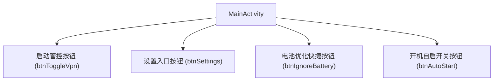
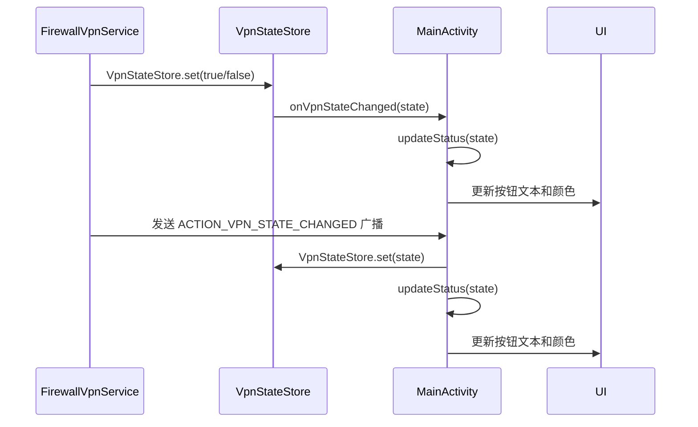
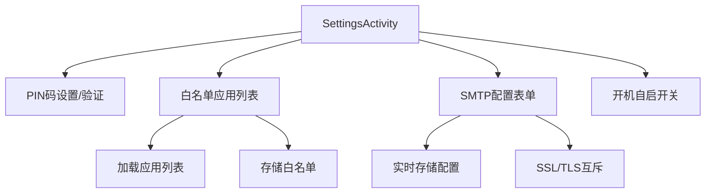
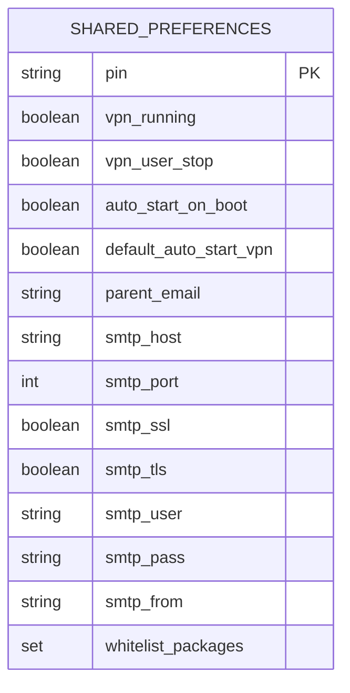
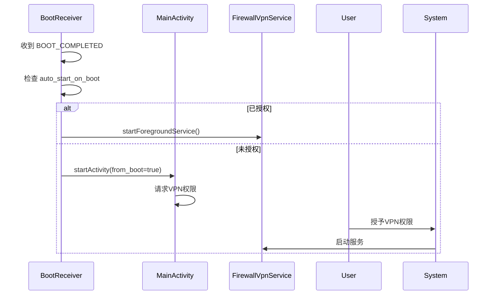

# 用户界面与交互

<cite>
**Referenced Files in This Document**   
- [MainActivity.kt](file://app/src/main/java/com/example/phonenet/MainActivity.kt)
- [activity_main.xml](file://app/src/main/res/layout/activity_main.xml)
- [SettingsActivity.kt](file://app/src/main/java/com/example/phonenet/SettingsActivity.kt)
- [activity_settings.xml](file://app/src/main/res/layout/activity_settings.xml)
- [VpnStateStore.kt](file://app/src/main/java/com/example/phonenet/VpnStateStore.kt)
- [FirewallVpnService.kt](file://app/src/main/java/com/example/phonenet/FirewallVpnService.kt)
- [BootReceiver.kt](file://app/src/main/java/com/example/phonenet/BootReceiver.kt)
- [KeepAliveJobService.kt](file://app/src/main/java/com/example/phonenet/KeepAliveJobService.kt)
- [AndroidManifest.xml](file://app/src/main/AndroidManifest.xml)
</cite>

## 目录
1. [简介](#简介)
2. [主界面 (MainActivity) 分析](#主界面-mainactivity-分析)
3. [设置界面 (SettingsActivity) 分析](#设置界面-settingsactivity-分析)
4. [用户配置存储机制](#用户配置存储机制)
5. [关键用户交互流程](#关键用户交互流程)
6. [界面截图建议](#界面截图建议)

## 简介
本文档详细描述了 `StopNet` 应用的用户界面与交互逻辑。核心内容包括 `MainActivity` 的布局与功能、`SettingsActivity` 的配置实现，以及两个界面如何通过 `SharedPreferences` 存储用户配置并与后台服务通信。文档还解释了应用如何通过广播和 `VpnStateStore` 全局状态管理器监听服务状态并实时更新UI。

## 主界面 (MainActivity) 分析

`MainActivity` 是应用的主入口，负责展示核心功能按钮、监听VPN服务状态并更新UI。

### 布局与核心功能
主界面布局定义在 `activity_main.xml` 中，包含四个主要按钮：
- **启动管控按钮** (`btnToggleVpn`)：用于启动或停止VPN服务，其文本和背景色会根据当前服务状态动态变化（绿色“启动管控”或红色“停止管控”）。
- **设置入口按钮** (`btnSettings`)：点击后跳转至 `SettingsActivity`。
- **电池优化快捷按钮** (`btnIgnoreBattery`)：点击后引导用户进入系统设置，将应用加入电池优化白名单。
- **开机自启开关按钮** (`btnAutoStart`)：一个状态按钮，点击可切换应用的开机自启状态，其颜色会根据当前状态变化（绿色表示已启用，红色表示已禁用）。

**Diagram sources**
- [activity_main.xml](file://app/src/main/res/layout/activity_main.xml#L1-L33)

**Section sources**
- [MainActivity.kt](file://app/src/main/java/com/example/phonenet/MainActivity.kt#L17-L643)
- [activity_main.xml](file://app/src/main/res/layout/activity_main.xml#L1-L33)

### 服务状态监听与UI更新
`MainActivity` 通过两种机制监听VPN服务状态并更新UI：

1.  **广播接收器 (BroadcastReceiver)**：`MainActivity` 在 `onStart` 时注册一个 `BroadcastReceiver`，专门监听 `FirewallVpnService.ACTION_VPN_STATE_CHANGED` 广播。当服务状态改变时，会发送此广播，`MainActivity` 接收后调用 `VpnStateStore.set()` 更新全局状态，并最终调用 `updateStatus()` 刷新UI。

2.  **全局状态管理器 (VpnStateStore)**：`VpnStateStore` 是一个单例对象，用于在内存中保存VPN服务的运行状态。`MainActivity` 在 `onStart` 时向 `VpnStateStore` 添加一个监听器 `onVpnStateChanged`。当服务状态通过 `VpnStateStore.set()` 被更新时，所有监听器都会被通知，从而触发UI刷新。

**Diagram sources**
- [MainActivity.kt](file://app/src/main/java/com/example/phonenet/MainActivity.kt#L65-L85)
- [VpnStateStore.kt](file://app/src/main/java/com/example/phonenet/VpnStateStore.kt#L4-L29)
- [FirewallVpnService.kt](file://app/src/main/java/com/example/phonenet/FirewallVpnService.kt#L18-L18)

**Section sources**
- [MainActivity.kt](file://app/src/main/java/com/example/phonenet/MainActivity.kt#L65-L85)
- [VpnStateStore.kt](file://app/src/main/java/com/example/phonenet/VpnStateStore.kt#L4-L29)

## 设置界面 (SettingsActivity) 分析

`SettingsActivity` 提供了详细的配置选项，允许用户进行个性化设置。

### PIN码设置与验证流程
应用在首次启动时会强制用户设置PIN码，以保护应用安全。
- **PIN码设置**：当 `SharedPreferences` 中没有存储PIN码时，`SettingsActivity` 会弹出 `showSetPinDialog` 对话框，要求用户输入并确认一个至少4位的数字PIN码。设置成功后，PIN码会被加密存储。
- **PIN码验证**：在 `MainActivity` 启动时，如果检测到已设置PIN码且未验证过，会弹出 `showEnterPinDialog` 对话框要求用户输入PIN码。验证通过后才能进行其他操作。

### 白名单应用列表
`SettingsActivity` 包含一个 `RecyclerView` (`rvApps`)，用于展示设备上所有可启动的应用。
- **加载**：通过 `loadLaunchableApps()` 方法，使用 `PackageManager` 查询所有带有 `LAUNCHER` 类别的应用，并根据 `SharedPreferences` 中的 `whitelist_packages` 集合来标记哪些应用已被选中。
- **存储**：当用户勾选或取消勾选应用时，`AppAdapter` 会调用 `persistWhitelist()` 方法。该方法会将选中的应用包名集合保存到 `SharedPreferences` 中，并向 `FirewallVpnService` 发送 `ACTION_RELOAD_WHITELIST` 广播，以使新的白名单规则立即生效。

### SMTP配置表单
该界面允许用户配置SMTP服务器信息，用于发送邮件通知。
- **表单字段**：包括SMTP主机、端口、用户名、密码、发件人邮箱、SSL/TLS开关等。
- **实时存储**：每个输入框都绑定了 `TextWatcher`，当用户输入内容时，会立即调用 `persistSmtpSettings()` 方法，将配置信息实时保存到 `SharedPreferences` 中。
- **互斥逻辑**：SSL和TLS开关是互斥的，选择SSL会自动关闭TLS，并将端口建议为465；反之亦然。

### 开机自启开关
`swDefaultAutoStartVpn` 是一个开关，用于控制应用在启动时是否自动开启VPN管控。
- **功能**：当此开关开启时，应用在启动（包括开机启动）时会自动尝试启动VPN服务，无需用户手动点击。
- **存储**：该开关的状态通过 `SharedPreferences` 的 `default_auto_start_vpn` 键进行存储和读取。

**Diagram sources**
- [SettingsActivity.kt](file://app/src/main/java/com/example/phonenet/SettingsActivity.kt#L19-L312)
- [activity_settings.xml](file://app/src/main/res/layout/activity_settings.xml#L1-L113)

**Section sources**
- [SettingsActivity.kt](file://app/src/main/java/com/example/phonenet/SettingsActivity.kt#L19-L312)
- [activity_settings.xml](file://app/src/main/res/layout/activity_settings.xml#L1-L113)

## 用户配置存储机制
应用使用 `SharedPreferences` 来持久化存储用户配置。为了确保在设备加密保护（Direct Boot）模式下也能访问关键配置，应用采用了双存储策略：
- **普通存储**：通过 `getSharedPreferences("stopnet_prefs", Context.MODE_PRIVATE)` 获取。
- **设备保护存储**：通过 `createDeviceProtectedStorageContext().getSharedPreferences("stopnet_prefs", Context.MODE_PRIVATE)` 获取。

关键配置如 `vpn_running`、`whitelist_packages`、`auto_start_on_boot` 等，在写入时会同时写入这两种存储，以确保在各种系统状态下配置的可用性和一致性。

**Diagram sources**
- [MainActivity.kt](file://app/src/main/java/com/example/phonenet/MainActivity.kt#L150-L151)
- [SettingsActivity.kt](file://app/src/main/java/com/example/phonenet/SettingsActivity.kt#L27-L28)

## 关键用户交互流程

### 首次启动PIN设置
1.  用户首次打开应用。
2.  `MainActivity` 检测到 `SharedPreferences` 中无PIN码。
3.  弹出 `showSetPinDialog` 对话框。
4.  用户输入并确认PIN码。
5.  PIN码被加密存储，流程结束。

### VPN权限请求
1.  用户点击“启动管控”按钮。
2.  应用调用 `VpnService.prepare(this)` 检查权限。
3.  如果未授权，系统会弹出授权对话框，要求用户授予VPN权限。
4.  用户点击“确定”后，系统会启动VPN服务。
5.  服务启动成功，`MainActivity` 的UI更新为“停止管控”状态。

### 开机自启流程
1.  设备开机，`BootReceiver` 收到 `BOOT_COMPLETED` 广播。
2.  `BootReceiver` 清除旧的运行状态。
3.  检查 `auto_start_on_boot` 开关是否开启。
4.  如果开启且VPN已授权，则直接后台启动 `FirewallVpnService`。
5.  如果未授权，则尝试启动 `MainActivity` 并传递 `from_boot=true` 参数，引导用户完成授权。

**Diagram sources**
- [BootReceiver.kt](file://app/src/main/java/com/example/phonenet/BootReceiver.kt#L9-L228)
- [MainActivity.kt](file://app/src/main/java/com/example/phonenet/MainActivity.kt#L100-L115)
- [FirewallVpnService.kt](file://app/src/main/java/com/example/phonenet/FirewallVpnService.kt#L28-L127)

## 界面截图建议
为清晰展示应用功能，建议提供以下截图：
1.  **主界面截图**：展示四个按钮的布局，特别是“启动管控”按钮在“启动管控”和“停止管控”两种状态下的不同颜色。
2.  **设置界面截图**：展示完整的设置列表，包括PIN码设置、白名单列表、SMTP配置和开机自启开关。
3.  **PIN码设置对话框截图**：展示首次启动时的PIN码设置流程。
4.  **系统VPN权限请求截图**：展示用户点击“启动管控”后，系统弹出的VPN权限请求对话框。
5.  **电池优化设置引导截图**：展示点击“电池优化”按钮后，跳转到不同厂商（如小米、华为）设置界面的示例。