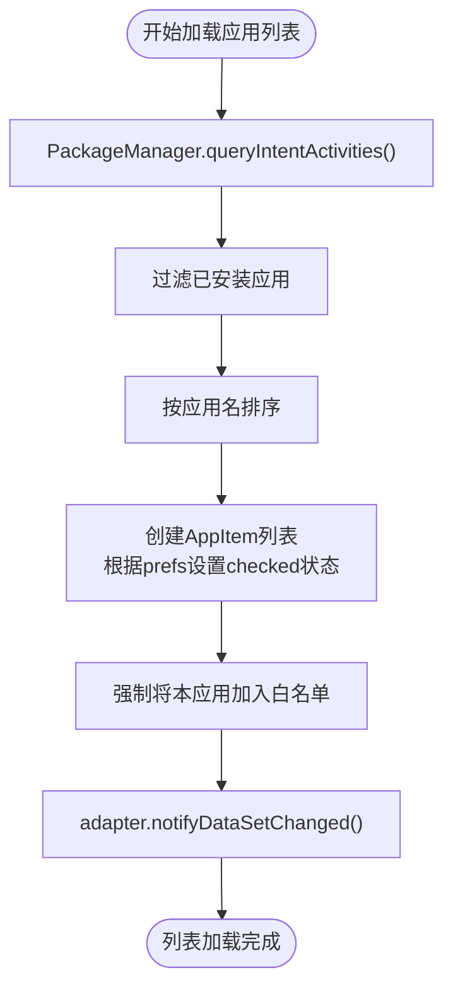
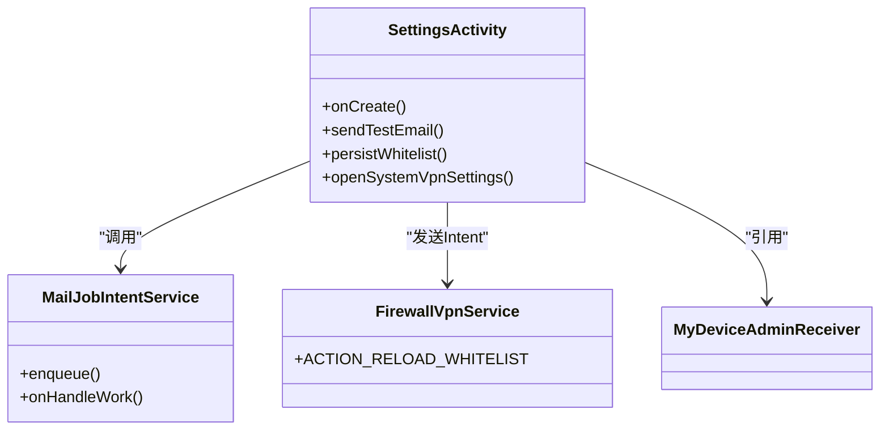

# 设置界面 (SettingsActivity)

<cite>
**Referenced Files in This Document**   
- [SettingsActivity.kt](file://app/src/main/java/com/example/phonenet/SettingsActivity.kt)
- [activity_settings.xml](file://app/src/main/res/layout/activity_settings.xml)
- [MailJobIntentService.kt](file://app/src/main/java/com/example/phonenet/mail/MailJobIntentService.kt)
- [strings.xml](file://app/src/main/res/values/strings.xml)
</cite>

## 目录
1. [简介](#简介)
2. [项目结构](#项目结构)
3. [核心组件](#核心组件)
4. [架构概述](#架构概述)
5. [详细组件分析](#详细组件分析)
6. [依赖分析](#依赖分析)
7. [性能考虑](#性能考虑)
8. [故障排除指南](#故障排除指南)
9. [结论](#结论)

## 简介
`SettingsActivity` 是 StopNet 应用的核心配置中心，负责管理应用的全局设置。该界面集成了多个关键功能模块，包括安全 PIN 码管理、应用白名单配置、SMTP 邮件服务器设置以及 VPN 服务控制。通过与 `SharedPreferences` 和设备保护存储 (DPS) 的协同工作，确保了配置数据在各种设备状态下的持久性和可靠性。本文档将深入分析其设计与实现，为开发者和用户提供全面的技术参考。

## 项目结构
`SettingsActivity` 作为应用的配置入口，其代码和资源文件分布在项目结构的多个位置。Kotlin 源码位于 `app/src/main/java/com/example/phonenet/` 目录下，而其对应的布局文件则位于 `app/src/main/res/layout/` 目录中。相关的字符串资源定义在 `app/src/main/res/values/strings.xml` 内，邮件发送功能由 `mail` 包下的 `MailJobIntentService` 实现。

```mermaid
graph TB
subgraph "源码 (Java/Kotlin)"
SettingsActivity[SettingsActivity.kt]
MailService[MailJobIntentService.kt]
VpnService[FirewallVpnService.kt]
end
subgraph "资源 (Res)"
Layout[activity_settings.xml]
Strings[strings.xml]
end
SettingsActivity --> Layout : "使用布局"
SettingsActivity --> Strings : "引用字符串"
SettingsActivity --> MailService : "调用发送邮件"
SettingsActivity --> VpnService : "触发重载白名单"
```

**Diagram sources**
- [SettingsActivity.kt](file://app/src/main/java/com/example/phonenet/SettingsActivity.kt)
- [activity_settings.xml](file://app/src/main/res/layout/activity_settings.xml)
- [MailJobIntentService.kt](file://app/src/main/java/com/example/phonenet/mail/MailJobIntentService.kt)
- [strings.xml](file://app/src/main/res/values/strings.xml)

**Section sources**
- [SettingsActivity.kt](file://app/src/main/java/com/example/phonenet/SettingsActivity.kt)
- [activity_settings.xml](file://app/src/main/res/layout/activity_settings.xml)

## 核心组件
`SettingsActivity` 的核心功能围绕着用户配置的持久化与管理。它通过 `SharedPreferences` 对象 `prefs` 和 `dpsPrefs` 来读写配置。`prefs` 用于常规存储，而 `dpsPrefs` 则利用 `createDeviceProtectedStorageContext()` 创建的上下文，确保在设备加密锁定时仍能访问关键配置，如“默认自动启动VPN”开关的状态。该 Activity 还负责加载系统中所有可启动的应用，并通过 `RecyclerView` 以列表形式展示，用户可以勾选应用加入白名单。此外，它集成了完整的 SMTP 配置表单，用于设置邮件告警功能。

**Section sources**
- [SettingsActivity.kt](file://app/src/main/java/com/example/phonenet/SettingsActivity.kt#L20-L30)
- [strings.xml](file://app/src/main/res/values/strings.xml#L1-L31)

## 架构概述
`SettingsActivity` 采用典型的 Android MVC 模式，将用户界面、业务逻辑和数据存储分离。其架构依赖于多个 Android 系统服务和组件，如 `PackageManager` 用于获取应用列表，`DevicePolicyManager` 用于设备管理（尽管入口已移除），以及 `JobIntentService` 用于后台邮件发送。数据流从用户在 `activity_settings.xml` 中的操作开始，通过事件监听器（如 `OnClickListener` 和 `OnCheckedChangeListener`）触发 Kotlin 代码中的逻辑处理，最终将配置数据持久化到 `SharedPreferences` 中。

```mermaid
graph LR
A[用户界面<br/>activity_settings.xml] --> B[SettingsActivity.kt]
B --> C[SharedPreferences<br/>(prefs & dpsPrefs)]
B --> D[PackageManager]
B --> E[MailJobIntentService]
B --> F[FirewallVpnService]
D --> G[应用列表]
E --> H[SMTP 邮件服务器]
F --> I[VPN 网络管控]
```

**Diagram sources**
- [SettingsActivity.kt](file://app/src/main/java/com/example/phonenet/SettingsActivity.kt)
- [activity_settings.xml](file://app/src/main/res/layout/activity_settings.xml)

## 详细组件分析

### PIN码管理
`SettingsActivity` 实现了简单的 PIN 码机制，用于保护设置界面。当需要验证时，会调用 `showEnterPinDialog` 方法弹出对话框，将用户输入与存储在 `prefs` 中的 PIN 码进行比对。若 PIN 码未设置，则调用 `showSetPinDialog` 引导用户创建。此功能确保了配置的安全性，防止未经授权的修改。

**Section sources**
- [SettingsActivity.kt](file://app/src/main/java/com/example/phonenet/SettingsActivity.kt#L110-L150)

### 白名单应用列表
该功能通过 `loadLaunchableApps` 方法实现。它首先使用 `PackageManager` 查询所有具有 `LAUNCHER` 类别的应用，然后根据 `prefs` 中存储的 `whitelist_packages` 集合来初始化 `AppItem` 列表的选中状态。`RecyclerView` 使用自定义的 `AppAdapter` 来渲染列表。一个关键的设计是，应用自身（`packageName`）被硬编码为始终在白名单中且复选框禁用，以防止应用因网络被拦截而无法正常工作。



**Diagram sources**
- [SettingsActivity.kt](file://app/src/main/java/com/example/phonenet/SettingsActivity.kt#L190-L210)

**Section sources**
- [SettingsActivity.kt](file://app/src/main/java/com/example/phonenet/SettingsActivity.kt#L190-L210)

### SMTP邮件服务器配置
`SettingsActivity` 提供了一个完整的 SMTP 配置表单，允许用户设置邮件服务器的主机、端口、SSL/TLS 加密方式、认证信息和发件人地址。所有输入框都绑定了 `TextWatcher`，实现配置的实时自动保存。`swSmtpSsl` 和 `swSmtpTls` 开关之间存在互斥逻辑：当启用 SSL 时，TLS 会自动关闭，并建议将端口设为 465；反之，当禁用 SSL 时，端口会建议设为 587。

#### SMTP测试邮件发送流程
点击“发送测试邮件”按钮后，会触发 `sendTestEmail` 方法。该流程的序列图如下：

```mermaid
sequenceDiagram
participant UI as "UI (按钮点击)"
participant Settings as "SettingsActivity"
participant MailService as "MailJobIntentService"
participant SMTP as "SMTP Server"
UI->>Settings : btnTestSmtp.setOnClickListener()
Settings->>Settings : 验证家长邮箱是否填写
alt 邮箱为空
Settings-->>UI : Toast : "请先填写家长邮箱"
deactivate Settings
else 邮箱有效
Settings->>MailService : MailJobIntentService.enqueue(to, subject, body)
MailService->>MailService : 从prefs/dpsPrefs读取SMTP配置
MailService->>MailService : 验证配置完整性
alt 配置不完整
deactivate MailService
else 配置完整
MailService->>SMTP : 使用JavaMail API建立连接并发送
SMTP-->>MailService : 发送成功/失败
MailService->>UI : Toast : "测试邮件已发送" 或 "发送失败"
end
end
```

**Diagram sources**
- [SettingsActivity.kt](file://app/src/main/java/com/example/phonenet/SettingsActivity.kt#L212-L234)
- [MailJobIntentService.kt](file://app/src/main/java/com/example/phonenet/mail/MailJobIntentService.kt#L18-L25)

**Section sources**
- [SettingsActivity.kt](file://app/src/main/java/com/example/phonenet/SettingsActivity.kt#L212-L234)
- [MailJobIntentService.kt](file://app/src/main/java/com/example/phonenet/mail/MailJobIntentService.kt)

### VPN服务控制
`SettingsActivity` 包含两个与 VPN 相关的控件。"默认自动启动VPN" 开关 (`swDefaultAutoStartVpn`) 用于控制应用启动时是否自动激活 `FirewallVpnService`。其状态被同时写入 `prefs` 和 `dpsPrefs`，确保在设备重启后依然有效。"打开系统VPN设置" 按钮 (`btnOpenVpnSettings`) 则通过启动 `android.provider.Settings.ACTION_VPN_SETTINGS` 的 Intent，引导用户进入系统的 VPN 配置页面，以便进行更高级的设置，如启用“始终开启”模式。

**Section sources**
- [SettingsActivity.kt](file://app/src/main/java/com/example/phonenet/SettingsActivity.kt#L40-L50)

### 布局与滚动设计
`activity_settings.xml` 的根布局使用 `NestedScrollView`，这解决了当 `RecyclerView` 内部也包含可滚动内容时可能出现的滚动冲突问题。`NestedScrollView` 能够正确地将触摸事件分发给内部的 `RecyclerView`，确保整个设置页面可以顺畅地滚动。`RecyclerView` 本身设置了 `android:nestedScrollingEnabled="false"`，这表明其滚动行为完全由外部的 `NestedScrollView` 管理，避免了嵌套滚动的复杂性。

```mermaid
erDiagram
NestedScrollView {
boolean fillViewport
}
LinearLayout {
string orientation
int padding
}
RecyclerView {
boolean nestedScrollingEnabled
}
NestedScrollView "1" ||--|| "1" LinearLayout : 包含
LinearLayout "1" ||--|| "1" RecyclerView : 包含
```

**Diagram sources**
- [activity_settings.xml](file://app/src/main/res/layout/activity_settings.xml#L1-L113)

**Section sources**
- [activity_settings.xml](file://app/src/main/res/layout/activity_settings.xml)

## 依赖分析
`SettingsActivity` 与项目中的多个组件存在紧密的依赖关系。它直接依赖于 `MailJobIntentService` 来执行邮件发送任务，并通过发送带有 `ACTION_RELOAD_WHITELIST` 动作的 Intent 来通知 `FirewallVpnService` 重新加载白名单配置。此外，它还依赖于 `MyDeviceAdminReceiver` 来检查设备管理权限（尽管相关功能入口已移除）。这些依赖关系确保了配置的变更能够及时反映到应用的运行时行为中。



**Diagram sources**
- [SettingsActivity.kt](file://app/src/main/java/com/example/phonenet/SettingsActivity.kt)
- [MailJobIntentService.kt](file://app/src/main/java/com/example/phonenet/mail/MailJobIntentService.kt)
- [FirewallVpnService.kt](file://app/src/main/java/com/example/phonenet/FirewallVpnService.kt#L22)

**Section sources**
- [SettingsActivity.kt](file://app/src/main/java/com/example/phonenet/SettingsActivity.kt)

## 性能考虑
`SettingsActivity` 的性能表现良好。应用列表的加载发生在 `onCreate` 期间，虽然会查询所有应用，但这是一个相对快速的操作。配置的持久化采用了实时保存策略，避免了在退出时进行大量 I/O 操作。使用 `JobIntentService` 进行邮件发送，确保了耗时的网络操作在后台线程执行，不会阻塞 UI 线程。`NestedScrollView` 与 `RecyclerView` 的组合是处理复杂滚动布局的标准且高效的做法。

## 故障排除指南
当用户遇到配置问题时，可以参考以下常见错误及解决方案：

| 问题现象 | 可能原因 | 解决方案 |
| :--- | :--- | :--- |
| **无法发送测试邮件** | SMTP 配置错误（主机、端口、用户名、密码） | 检查配置是否正确，特别是端口与 SSL/TLS 的匹配关系。确保邮箱服务商允许第三方客户端登录。 |
| **无法发送测试邮件** | 网络连接问题 | 确认设备网络连接正常，且 `FirewallVpnService` 未拦截 `SettingsActivity` 的网络请求。 |
| **白名单更改后未生效** | `FirewallVpnService` 未收到重载指令 | 检查 `persistWhitelist` 方法中发送 `ACTION_RELOAD_WHITELIST` Intent 的代码是否执行。重启 `FirewallVpnService` 服务。 |
| **“默认自动启动VPN”开关无效** | 设备重启后配置未从 DPS 读取 | 确认 `dpsPrefs` 在 `MainActivity` 或 `BootReceiver` 中被正确读取并用于启动 VPN。 |
| **应用列表加载缓慢或卡顿** | 设备上安装了大量应用 | 此问题通常不严重，加载仅在进入设置时发生一次。 |

**Section sources**
- [SettingsActivity.kt](file://app/src/main/java/com/example/phonenet/SettingsActivity.kt#L212-L234)
- [MailJobIntentService.kt](file://app/src/main/java/com/example/phonenet/mail/MailJobIntentService.kt)

## 结论
`SettingsActivity` 是一个功能全面且设计合理的配置中心。它成功地整合了安全、网络管控和告警通知等多个模块，为用户提供了直观的配置界面。通过使用 `NestedScrollView` 解决了复杂的滚动问题，并通过双写 `SharedPreferences` 和 `dpsPrefs` 确保了关键配置的可靠性。其与 `MailJobIntentService` 和 `FirewallVpnService` 的清晰交互，体现了良好的模块化设计。该组件是 StopNet 应用稳定运行的关键。