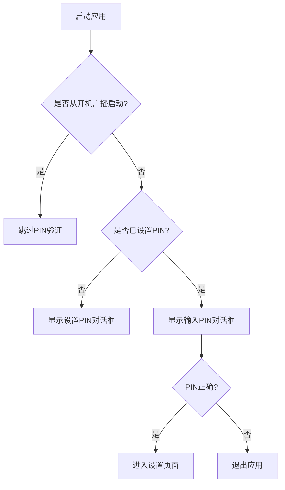
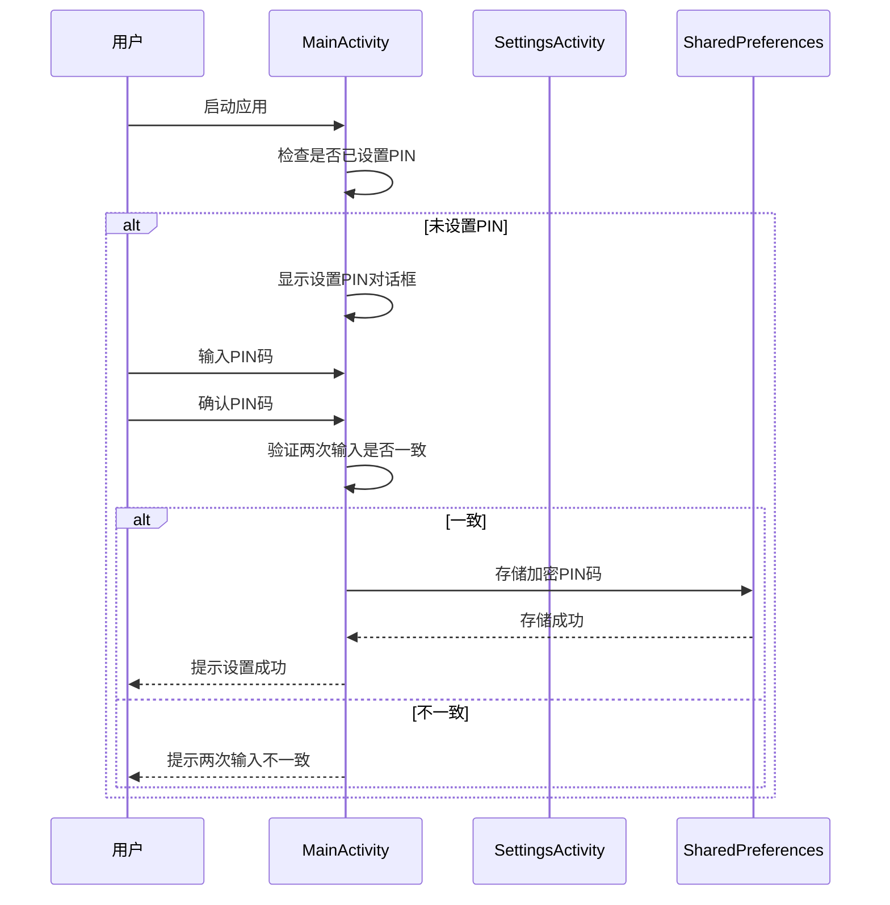
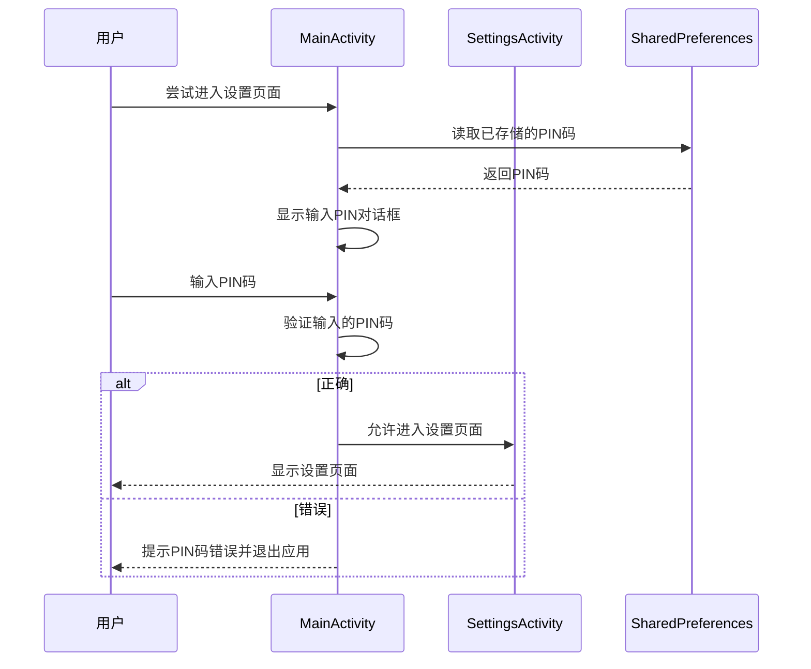
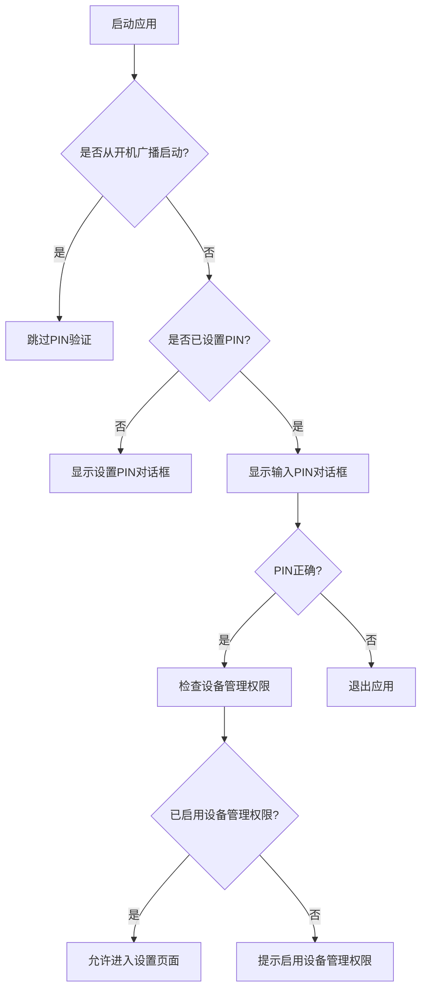

# PIN码保护配置

<cite>
**Referenced Files in This Document**  
- [SettingsActivity.kt](file://app/src/main/java/com/example/phonenet/SettingsActivity.kt)
- [MainActivity.kt](file://app/src/main/java/com/example/phonenet/MainActivity.kt)
- [strings.xml](file://app/src/main/res/values/strings.xml)
- [AndroidManifest.xml](file://app/src/main/AndroidManifest.xml)
- [README.md](file://README.md)
</cite>

## 目录
1. [简介](#简介)
2. [PIN码保护机制](#pin码保护机制)
3. [PIN码设置流程](#pin码设置流程)
4. [PIN码验证流程](#pin码验证流程)
5. [恢复方案](#恢复方案)
6. [双因素保护策略](#双因素保护策略)
7. [安全建议](#安全建议)
8. [结论](#结论)

## 简介

StopNet是一款网络管控工具，旨在通过白名单机制限制设备上应用的联网行为。为防止设置被随意更改，该应用实现了PIN码保护机制。本文档详细说明了在SettingsActivity中实现的PIN码设置、验证和安全保护机制，以及相关的恢复方案和安全建议。

**Section sources**  
- [README.md](file://README.md#L1-L144)

## PIN码保护机制

StopNet通过PIN码保护设置页面，确保只有授权用户才能访问和修改关键配置。PIN码的设置和验证主要在SettingsActivity和MainActivity中实现。PIN码存储在SharedPreferences中，使用普通存储和设备保护存储（DPS）双写，以提高安全性。

**Diagram sources**  
- [MainActivity.kt](file://app/src/main/java/com/example/phonenet/MainActivity.kt#L56-L101)
- [SettingsActivity.kt](file://app/src/main/java/com/example/phonenet/SettingsActivity.kt#L130-L181)

**Section sources**  
- [SettingsActivity.kt](file://app/src/main/java/com/example/phonenet/SettingsActivity.kt#L34-L35)
- [MainActivity.kt](file://app/src/main/java/com/example/phonenet/MainActivity.kt#L26-L26)

## PIN码设置流程

当用户首次进入设置页面时，如果尚未设置PIN码，系统会提示用户设置PIN码。设置过程包括输入PIN码和确认PIN码两个步骤，确保用户输入的PIN码正确无误。

**Diagram sources**  
- [SettingsActivity.kt](file://app/src/main/java/com/example/phonenet/SettingsActivity.kt#L151-L181)
- [MainActivity.kt](file://app/src/main/java/com/example/phonenet/MainActivity.kt#L578-L636)

**Section sources**  
- [SettingsActivity.kt](file://app/src/main/java/com/example/phonenet/SettingsActivity.kt#L151-L181)
- [MainActivity.kt](file://app/src/main/java/com/example/phonenet/MainActivity.kt#L578-L636)

## PIN码验证流程

当用户尝试进入设置页面时，系统会检查是否已设置PIN码。如果已设置，用户需要输入正确的PIN码才能访问设置页面。验证过程在MainActivity中实现，确保即使应用被重启，PIN码保护仍然有效。

**Diagram sources**  
- [SettingsActivity.kt](file://app/src/main/java/com/example/phonenet/SettingsActivity.kt#L130-L149)
- [MainActivity.kt](file://app/src/main/java/com/example/phonenet/MainActivity.kt#L524-L563)

**Section sources**  
- [SettingsActivity.kt](file://app/src/main/java/com/example/phonenet/SettingsActivity.kt#L130-L149)
- [MainActivity.kt](file://app/src/main/java/com/example/phonenet/MainActivity.kt#L524-L563)

## 恢复方案

如果用户忘记了PIN码，可以通过清除应用数据或重装应用来恢复访问。这将删除所有已存储的配置，包括PIN码、白名单和其他设置。

**Section sources**  
- [README.md](file://README.md#L130-L132)

## 双因素保护策略

StopNet采用了双因素保护策略，结合PIN码保护和设备管理权限，确保设置界面不被未授权访问。PIN码保护防止普通用户随意更改设置，而设备管理权限则提供了更高级别的保护，防止应用被卸载或禁用。

**Diagram sources**  
- [SettingsActivity.kt](file://app/src/main/java/com/example/phonenet/SettingsActivity.kt#L40-L128)
- [MainActivity.kt](file://app/src/main/java/com/example/phonenet/MainActivity.kt#L56-L101)

**Section sources**  
- [SettingsActivity.kt](file://app/src/main/java/com/example/phonenet/SettingsActivity.kt#L40-L128)
- [MainActivity.kt](file://app/src/main/java/com/example/phonenet/MainActivity.kt#L56-L101)

## 安全建议

为了确保PIN码保护机制的有效性，建议遵循以下安全建议：

- **PIN码复杂度要求**：建议使用至少4位数字的PIN码，避免使用简单的数字组合，如1234或0000。
- **防暴力破解机制**：目前系统在PIN码错误时直接退出应用，未来可考虑增加延迟或锁定机制，防止暴力破解。
- **定期更换PIN码**：建议定期更换PIN码，以降低被猜测的风险。
- **避免在公共场合输入PIN码**：在输入PIN码时，注意周围环境，避免被他人窥视。

**Section sources**  
- [README.md](file://README.md#L130-L132)
- [strings.xml](file://app/src/main/res/values/strings.xml#L1-L32)

## 结论

StopNet通过PIN码保护机制，有效防止了设置页面被未授权访问。结合设备管理权限，提供了双因素保护策略，确保了应用的安全性和稳定性。用户应遵循安全建议，合理设置和管理PIN码，以充分发挥该应用的保护作用。

**Section sources**  
- [README.md](file://README.md#L1-L144)
- [SettingsActivity.kt](file://app/src/main/java/com/example/phonenet/SettingsActivity.kt#L1-L361)
- [MainActivity.kt](file://app/src/main/java/com/example/phonenet/MainActivity.kt#L1-L645)