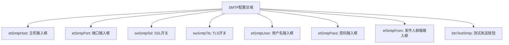
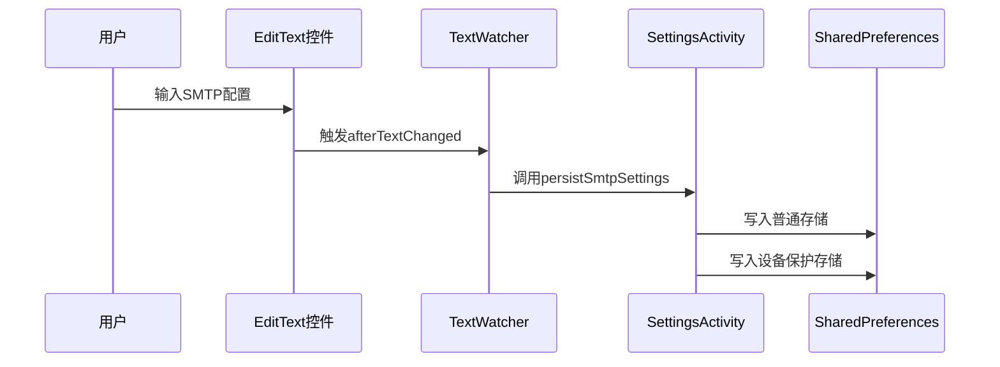
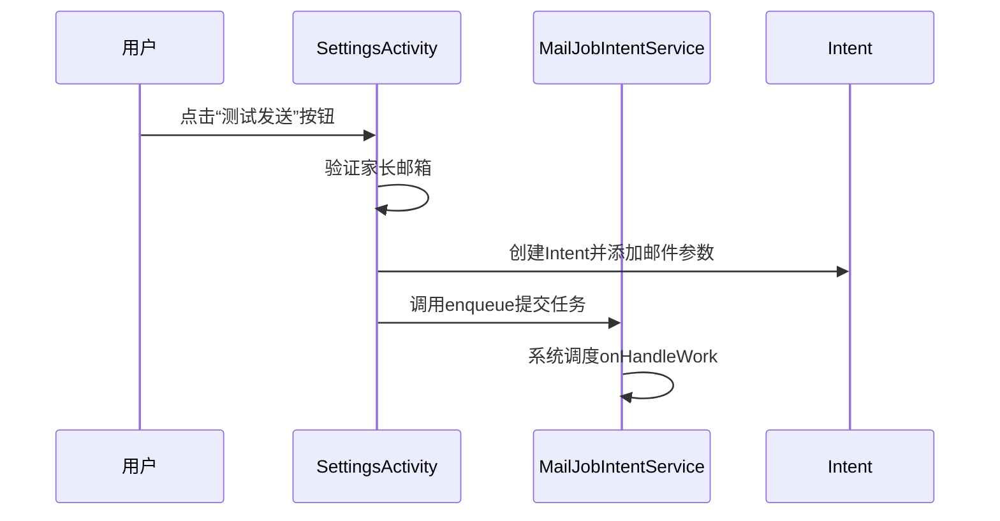
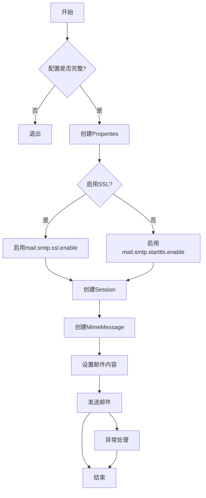

# SMTP邮件通知配置

<cite>
**Referenced Files in This Document**   
- [SettingsActivity.kt](file://app/src/main/java/com/example/phonenet/SettingsActivity.kt)
- [MailJobIntentService.kt](file://app/src/main/java/com/example/phonenet/mail/MailJobIntentService.kt)
- [activity_settings.xml](file://app/src/main/res/layout/activity_settings.xml)
</cite>

## 目录
1. [简介](#简介)
2. [SMTP配置界面与控件](#smtp配置界面与控件)
3. [配置实时保存机制](#配置实时保存机制)
4. [SSL/TLS互斥与端口切换逻辑](#ssltls互斥与端口切换逻辑)
5. [测试邮件发送流程](#测试邮件发送流程)
6. [邮件发送服务实现](#邮件发送服务实现)
7. [常见错误排查指南](#常见错误排查指南)

## 简介
本文档详细说明了Android应用中SMTP邮件通知功能的配置与实现。核心功能位于`SettingsActivity`，用户可在此配置SMTP主机、端口、SSL/TLS选项、用户名、密码及发件人邮箱。所有配置变更均通过`TextWatcher`实时保存至`SharedPreferences`，并利用`persistSmtpSettings`方法同时写入普通存储与设备保护存储（DPS），确保在设备加密状态下仍可访问。点击测试按钮后，系统通过`MailJobIntentService`调度后台任务，使用JavaMail API读取配置并发送邮件。

## SMTP配置界面与控件
`activity_settings.xml`布局文件定义了SMTP配置所需的全部UI控件，这些控件在`SettingsActivity`中被实例化并绑定事件。

**Diagram sources**
- [activity_settings.xml](file://app/src/main/res/layout/activity_settings.xml#L30-L80)

**Section sources**
- [activity_settings.xml](file://app/src/main/res/layout/activity_settings.xml#L30-L80)
- [SettingsActivity.kt](file://app/src/main/java/com/example/phonenet/SettingsActivity.kt#L27-L32)

## 配置实时保存机制
为实现配置的即时持久化，系统采用`TextWatcher`监听机制。当用户在`etSmtpHost`、`etSmtpPort`、`etSmtpUser`、`etSmtpPass`或`etSmtpFrom`等输入框中修改内容时，会立即触发`simpleWatcher`回调，最终调用`persistSmtpSettings`方法。

`persistSmtpSettings`方法负责将当前界面的所有SMTP配置项统一写入两种存储：
1.  **普通SharedPreferences**：通过`getSharedPreferences`获取，适用于常规运行时访问。
2.  **设备保护存储(SharedPreferences)**：通过`createDeviceProtectedStorageContext()`获取，可在设备加密后仍被系统服务访问。

此双写策略确保了即使在设备重启后处于锁定状态，后台服务也能读取到正确的邮件配置。

**Diagram sources**
- [SettingsActivity.kt](file://app/src/main/java/com/example/phonenet/SettingsActivity.kt#L108-L115)
- [SettingsActivity.kt](file://app/src/main/java/com/example/phonenet/SettingsActivity.kt#L275-L304)

**Section sources**
- [SettingsActivity.kt](file://app/src/main/java/com/example/phonenet/SettingsActivity.kt#L108-L115)
- [SettingsActivity.kt](file://app/src/main/java/com/example/phonenet/SettingsActivity.kt#L275-L304)

## SSL/TLS互斥与端口切换逻辑
为了防止配置冲突，系统实现了SSL与TLS的互斥逻辑。当用户开启`swSmtpSsl`开关时，`swSmtpTls`开关会自动关闭。反之，关闭SSL时，TLS开关状态不受影响。

此外，系统还集成了智能端口切换机制：
-   **开启SSL**：若当前端口为空或为0，则自动将`etSmtpPort`的值设为`465`（SSL的默认端口）。
-   **关闭SSL**：若当前端口为`465`，则自动将其切换为`587`（STARTTLS的默认端口）。

此逻辑在`swSmtpSsl`的`OnCheckedChangeListener`中实现，每次状态改变后都会调用`persistSmtpSettings`以保存最终配置。

**Section sources**
- [SettingsActivity.kt](file://app/src/main/java/com/example/phonenet/SettingsActivity.kt#L80-L95)

## 测试邮件发送流程
当用户点击`btnTestSmtp`按钮时，会触发`sendTestEmail`方法。该方法首先验证`etParentEmail`（家长邮箱）是否已填写。若验证通过，则构建一个包含收件人、主题和正文的测试邮件，并调用`MailJobIntentService.enqueue`方法。

`enqueue`方法接收`Context`、收件人地址、邮件主题和正文作为参数。它创建一个`Intent`，将邮件信息作为`extra`数据附加，并通过`JobIntentService.enqueueWork`将此任务提交给系统，由`MailJobIntentService`在后台线程中执行。

**Diagram sources**
- [SettingsActivity.kt](file://app/src/main/java/com/example/phonenet/SettingsActivity.kt#L212-L226)
- [MailJobIntentService.kt](file://app/src/main/java/com/example/phonenet/mail/MailJobIntentService.kt#L18-L25)

**Section sources**
- [SettingsActivity.kt](file://app/src/main/java/com/example/phonenet/SettingsActivity.kt#L212-L226)

## 邮件发送服务实现
`MailJobIntentService`是执行邮件发送的核心后台服务。其`onHandleWork`方法在后台线程中被调用，负责整个邮件发送流程。

1.  **读取配置**：服务会从普通和设备保护两种`SharedPreferences`中读取SMTP配置，优先使用普通存储中的值。
2.  **构建邮件会话**：根据读取到的配置（主机、端口、SSL/TLS状态等），创建一个`Properties`对象来配置JavaMail `Session`。连接超时、读取超时和写入超时均设置为10秒。
3.  **认证与发送**：创建`MimeMessage`对象，设置发件人、收件人、主题和正文。使用`PasswordAuthentication`进行身份验证，并通过`Transport.send(message)`发送邮件。

该服务处理了所有必要的异常，确保即使发送失败也不会导致应用崩溃。

**Diagram sources**
- [MailJobIntentService.kt](file://app/src/main/java/com/example/phonenet/mail/MailJobIntentService.kt#L28-L91)

**Section sources**
- [MailJobIntentService.kt](file://app/src/main/java/com/example/phonenet/mail/MailJobIntentService.kt#L28-L91)

## 常见错误排查指南
| 错误现象 | 可能原因 | 解决方案 |
| :--- | :--- | :--- |
| **发送失败，请检查配置** | 1. 某项配置为空 2. 认证失败 3. 网络连接问题 | 1. 检查主机、端口、用户名、密码、发件人邮箱是否完整填写 2. 确认密码正确，部分邮箱需使用授权码而非登录密码 3. 检查设备网络连接 |
| **连接超时** | 1. SMTP主机地址错误 2. 端口被防火墙屏蔽 3. 服务器未启用SSL/TLS | 1. 核对SMTP服务器地址（如smtp.gmail.com） 2. 尝试切换SSL/TLS模式，或手动设置正确端口 3. 确认邮箱服务商支持所选的加密方式 |
| **无法打开系统VPN设置** | 设备不支持或权限被拒绝 | 确保应用具有设备管理员权限，或在系统设置中手动开启 |

**Section sources**
- [SettingsActivity.kt](file://app/src/main/java/com/example/phonenet/SettingsActivity.kt#L218-L224)
- [MailJobIntentService.kt](file://app/src/main/java/com/example/phonenet/mail/MailJobIntentService.kt#L88-L90)