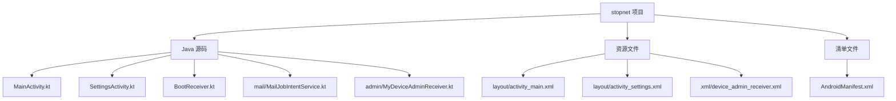
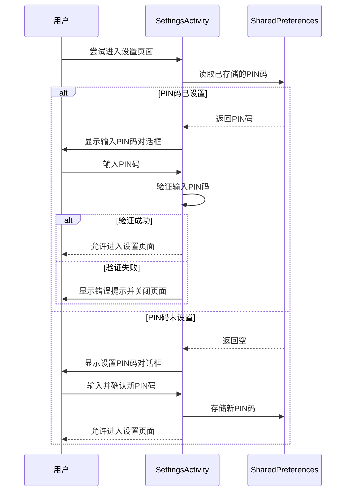
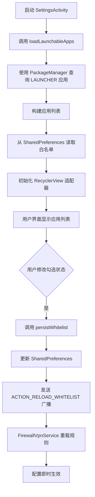
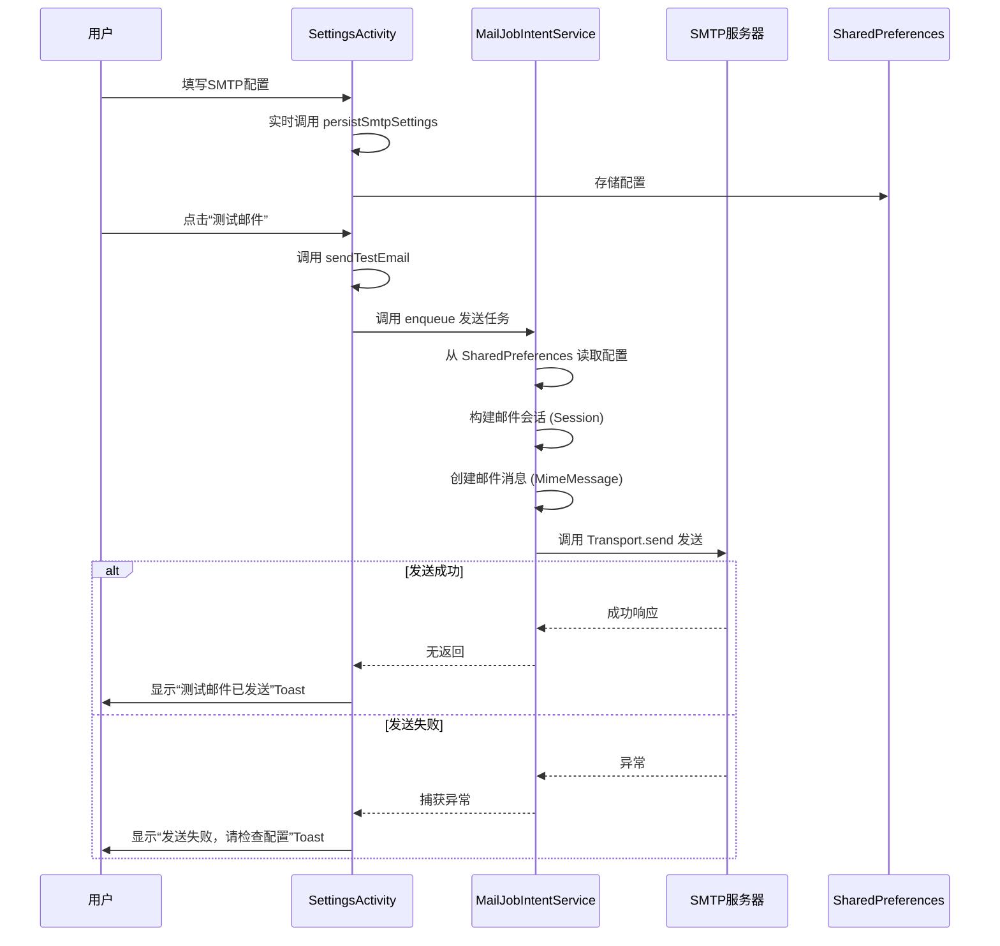
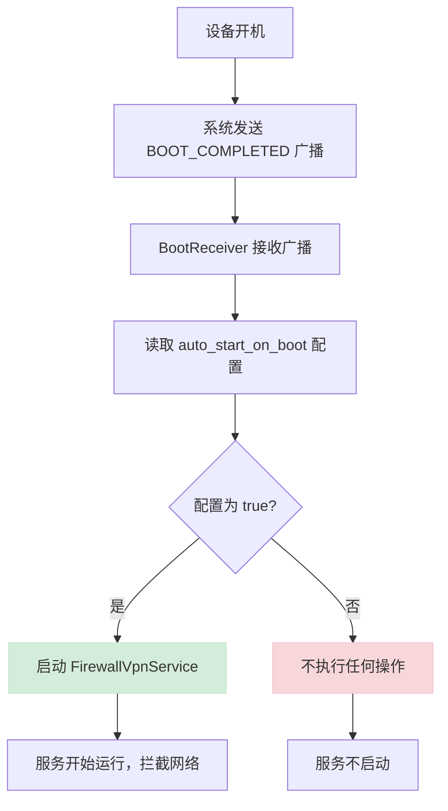

# 功能配置说明

<cite>
**Referenced Files in This Document**   
- [SettingsActivity.kt](file://app/src/main/java/com/example/phonenet/SettingsActivity.kt)
- [MainActivity.kt](file://app/src/main/java/com/example/phonenet/MainActivity.kt)
- [BootReceiver.kt](file://app/src/main/java/com/example/phonenet/BootReceiver.kt)
- [MailJobIntentService.kt](file://app/src/main/java/com/example/phonenet/mail/MailJobIntentService.kt)
- [MyDeviceAdminReceiver.kt](file://app/src/main/java/com/example/phonenet/admin/MyDeviceAdminReceiver.kt)
- [activity_settings.xml](file://app/src/main/res/layout/activity_settings.xml)
- [device_admin_receiver.xml](file://app/src/main/res/xml/device_admin_receiver.xml)
- [AndroidManifest.xml](file://app/src/main/AndroidManifest.xml)
- [VpnStateStore.kt](file://app/src/main/java/com/example/phonenet/VpnStateStore.kt)
</cite>

## 目录
1. [简介](#简介)
2. [项目结构](#项目结构)
3. [核心功能配置](#核心功能配置)
4. [PIN码保护机制](#pin码保护机制)
5. [白名单应用管理](#白名单应用管理)
6. [SMTP邮件配置与测试](#smtp邮件配置与测试)
7. [开机自启功能](#开机自启功能)
8. [配置数据存储机制](#配置数据存储机制)
9. [实际使用示例](#实际使用示例)
10. [故障排除指南](#故障排除指南)

## 简介
本文档旨在为 `stopnet` 应用提供全面的功能配置说明。`stopnet` 是一款家长控制类应用，通过VPN技术实现网络访问管控。其核心功能包括：使用PIN码保护设置页面安全、管理应用白名单以控制网络访问权限、配置SMTP邮件服务用于发送状态通知，以及启用开机自启功能确保服务持续运行。文档将结合代码逻辑，详细解释各项功能的配置方法、数据存储机制及实际使用场景。

## 项目结构
`stopnet` 项目采用标准的Android项目结构，主要功能模块集中在 `app/src/main/java/com/example/phonenet` 目录下。核心组件包括 `MainActivity`（主界面）、`SettingsActivity`（设置界面）、`FirewallVpnService`（防火墙服务）和 `BootReceiver`（开机广播接收器）。资源文件（如布局和字符串）位于 `res` 目录。该结构清晰地分离了用户界面、业务逻辑和系统服务，便于维护和扩展。



**Diagram sources**
- [SettingsActivity.kt](file://app/src/main/java/com/example/phonenet/SettingsActivity.kt)
- [MainActivity.kt](file://app/src/main/java/com/example/phonenet/MainActivity.kt)
- [BootReceiver.kt](file://app/src/main/java/com/example/phonenet/BootReceiver.kt)
- [activity_settings.xml](file://app/src/main/res/layout/activity_settings.xml)
- [AndroidManifest.xml](file://app/src/main/AndroidManifest.xml)

**Section sources**
- [SettingsActivity.kt](file://app/src/main/java/com/example/phonenet/SettingsActivity.kt)
- [project_structure](file://project_structure)

## 核心功能配置
`SettingsActivity` 是应用的配置中心，集成了所有可配置项。用户可以通过此界面设置PIN码、管理应用白名单、配置SMTP邮件参数以及启用开机自启功能。这些配置项通过 `SharedPreferences` 进行持久化存储，并在应用重启后自动加载，确保用户设置的连续性。

**Section sources**
- [SettingsActivity.kt](file://app/src/main/java/com/example/phonenet/SettingsActivity.kt)
- [activity_settings.xml](file://app/src/main/res/layout/activity_settings.xml)

## PIN码保护机制
### 设置与修改PIN码
用户首次进入设置页面或需要修改PIN码时，系统会弹出一个对话框，要求用户输入并确认新的4位数字PIN码。此功能通过 `showSetPinDialog()` 方法实现。一旦用户成功设置，PIN码将被加密存储在 `SharedPreferences` 中，用于后续的访问验证。

### PIN码验证流程
每次用户尝试访问 `SettingsActivity` 时，系统会检查是否已设置PIN码。如果已设置，`showEnterPinDialog()` 方法会被调用，强制用户输入正确的PIN码才能进入。输入错误将导致页面关闭，有效防止未授权访问。

### 忘记PIN码的恢复方案
目前应用未提供内置的PIN码找回功能。如果用户忘记PIN码，唯一的恢复方案是清除应用数据或卸载后重新安装。清除数据会删除 `SharedPreferences` 中存储的PIN码，从而允许用户重新设置。



**Diagram sources**
- [SettingsActivity.kt](file://app/src/main/java/com/example/phonenet/SettingsActivity.kt#L130-L181)
- [MainActivity.kt](file://app/src/main/java/com/example/phonenet/MainActivity.kt#L516-L606)

**Section sources**
- [SettingsActivity.kt](file://app/src/main/java/com/example/phonenet/SettingsActivity.kt#L130-L181)
- [MainActivity.kt](file://app/src/main/java/com/example/phonenet/MainActivity.kt#L516-L606)

## 白名单应用管理
### 基于QUERY_ALL_PACKAGES权限的应用扫描
应用通过在 `AndroidManifest.xml` 中声明 `<queries>` 标签，而非直接请求 `QUERY_ALL_PACKAGES` 权限，来安全地查询设备上所有可启动的应用。`loadLaunchableApps()` 方法利用 `PackageManager` 的 `queryIntentActivities()` 接口，获取所有包含 `MAIN` 和 `LAUNCHER` 类别的应用，从而构建一个可管理的应用列表。

### 管理白名单列表
在 `SettingsActivity` 的界面中，用户可以看到一个应用列表，每个应用旁边都有一个复选框。用户可以通过勾选或取消勾选来将应用添加或移出白名单。当前应用（`stopnet`）默认被加入白名单且复选框禁用，以防止自身网络被拦截。

### 配置即时生效
当用户修改白名单后，`persistWhitelist()` 方法会被立即调用。该方法不仅将更新后的白名单集合持久化到 `SharedPreferences`，还会向 `FirewallVpnService` 发送一个 `ACTION_RELOAD_WHITELIST` 广播，通知防火墙服务立即重新加载白名单规则，确保配置变更即时生效。



**Diagram sources**
- [SettingsActivity.kt](file://app/src/main/java/com/example/phonenet/SettingsActivity.kt#L183-L228)
- [AndroidManifest.xml](file://app/src/main/AndroidManifest.xml#L2-L14)

**Section sources**
- [SettingsActivity.kt](file://app/src/main/java/com/example/phonenet/SettingsActivity.kt#L183-L228)
- [AndroidManifest.xml](file://app/src/main/AndroidManifest.xml#L2-L14)

## SMTP邮件配置与测试
### 配置SMTP参数
用户可以在设置页面配置SMTP邮件服务的详细参数，包括：
- **主机 (Host)**: 邮件服务器地址（如 smtp.gmail.com）。
- **端口 (Port)**: 服务器端口号，根据SSL/TLS选择自动调整（SSL默认465，TLS默认587）。
- **用户名 (Username)**: 登录邮件服务器的用户名。
- **密码 (Password)**: 登录邮件服务器的密码。
- **发件人 (From)**: 邮件的发件人地址。

这些配置项支持实时保存，用户在输入框中修改内容后，系统会立即调用 `persistSmtpSettings()` 方法，将数据同步到 `SharedPreferences`。

### 发送测试邮件
用户配置完SMTP参数后，可以点击“测试邮件”按钮来验证配置的有效性。`sendTestEmail()` 方法会从设置中读取家长邮箱地址，并调用 `MailJobIntentService.enqueue()` 方法，向后台服务提交一个发送测试邮件的任务。如果发送成功，用户会收到一个Toast提示。



**Diagram sources**
- [SettingsActivity.kt](file://app/src/main/java/com/example/phonenet/SettingsActivity.kt#L230-L248)
- [MailJobIntentService.kt](file://app/src/main/java/com/example/phonenet/mail/MailJobIntentService.kt#L28-L91)

**Section sources**
- [SettingsActivity.kt](file://app/src/main/java/com/example/phonenet/SettingsActivity.kt#L230-L248)
- [MailJobIntentService.kt](file://app/src/main/java/com/example/phonenet/mail/MailJobIntentService.kt#L28-L91)

## 开机自启功能
### 功能启用与禁用
用户可以在 `MainActivity` 的主界面通过“开机自启”按钮来启用或禁用此功能。点击按钮会切换 `auto_start_on_boot` 这个布尔值，并将其存储在 `SharedPreferences` 中。

### 开机自启实现机制
`BootReceiver` 是一个广播接收器，它监听 `BOOT_COMPLETED`、`LOCKED_BOOT_COMPLETED` 等系统启动相关的广播。当设备启动时，`BootReceiver` 会收到广播，并根据 `SharedPreferences` 中 `auto_start_on_boot` 的值来决定是否启动 `FirewallVpnService`。为了应对某些厂商（如vivo）的后台限制，`BootReceiver` 还会安排多次重试，以确保服务能够成功启动。



**Diagram sources**
- [BootReceiver.kt](file://app/src/main/java/com/example/phonenet/BootReceiver.kt#L9-L228)
- [MainActivity.kt](file://app/src/main/java/com/example/phonenet/MainActivity.kt#L385-L386)

**Section sources**
- [BootReceiver.kt](file://app/src/main/java/com/example/phonenet/BootReceiver.kt#L9-L228)
- [MainActivity.kt](file://app/src/main/java/com/example/phonenet/MainActivity.kt#L385-L386)

## 配置数据存储机制
应用采用 `SharedPreferences` 作为主要的配置数据存储机制。为了确保在设备加密启动（Direct Boot）期间也能访问关键配置，应用同时使用了普通存储和设备保护存储（Device Protected Storage, DPS）。

- **普通SharedPreferences**: 通过 `getSharedPreferences()` 获取，用于常规的数据存储。
- **设备保护存储 (DPS)**: 通过 `createDeviceProtectedStorageContext()` 获取，可以在用户解锁设备前访问，确保 `BootReceiver` 能在开机时读取 `auto_start_on_boot` 和 `whitelist_packages` 等关键配置。

对于关键配置项（如 `default_auto_start_vpn` 和 `whitelist_packages`），应用会同时写入普通存储和DPS存储，实现“双写”策略，保证数据的高可用性。

```mermaid
classDiagram
class SettingsActivity {
+prefs : SharedPreferences
+dpsPrefs : SharedPreferences
+persistWhitelist()
+persistSmtpSettings()
}
class BootReceiver {
+onReceive()
+startIfEnabledUnlocked()
+startIfEnabledLocked()
}
class MailJobIntentService {
+onHandleWork()
}
SettingsActivity --> SharedPreferences : "使用"
BootReceiver --> SharedPreferences : "读取 (DPS)"
MailJobIntentService --> SharedPreferences : "读取 (DPS)"
note right of SettingsActivity
使用双写策略：
prefs.edit().putXxx(...).apply()
dpsPrefs.edit().putXxx(...).apply()
end note
```

**Diagram sources**
- [SettingsActivity.kt](file://app/src/main/java/com/example/phonenet/SettingsActivity.kt#L34-L35)
- [BootReceiver.kt](file://app/src/main/java/com/example/phonenet/BootReceiver.kt#L115-L147)
- [MailJobIntentService.kt](file://app/src/main/java/com/example/phonenet/mail/MailJobIntentService.kt#L28-L32)

**Section sources**
- [SettingsActivity.kt](file://app/src/main/java/com/example/phonenet/SettingsActivity.kt#L34-L35)
- [BootReceiver.kt](file://app/src/main/java/com/example/phonenet/BootReceiver.kt#L115-L147)

## 实际使用示例
1.  **首次使用**: 用户打开应用，系统会提示设置4位PIN码。设置完成后，用户可在主界面点击“设置”进入 `SettingsActivity`。
2.  **配置邮件通知**: 在设置页面，用户填写家长邮箱、SMTP主机、端口、用户名、密码和发件人地址。点击“测试邮件”按钮，确认邮件能成功发送。
3.  **管理应用白名单**: 在设置页面的应用列表中，用户取消勾选不希望孩子使用的应用（如游戏、社交软件），这些应用的网络访问将被立即拦截。
4.  **启用开机自启**: 用户返回主界面，点击“开机自启”按钮，确保设备重启后网络管控服务能自动恢复。
5.  **日常使用**: 此后，每次设备启动，`stopnet` 会自动运行并拦截白名单外的应用网络。用户可通过主界面的按钮手动开启或关闭VPN。

## 故障排除指南
- **无法打开设置页面**: 检查是否已设置PIN码。如果忘记PIN码，请尝试清除应用数据后重新设置。
- **测试邮件发送失败**: 检查SMTP配置是否正确，特别是端口和SSL/TLS选项。确保设备网络连接正常。
- **开机后服务未启动**: 检查“开机自启”开关是否已打开。对于某些国产手机（如小米、华为），可能需要在系统设置中手动授予“自启动”权限。
- **应用网络未被拦截**: 确认该应用已在白名单中被取消勾选。检查 `FirewallVpnService` 是否正在运行（主界面按钮应显示“停止管控”）。