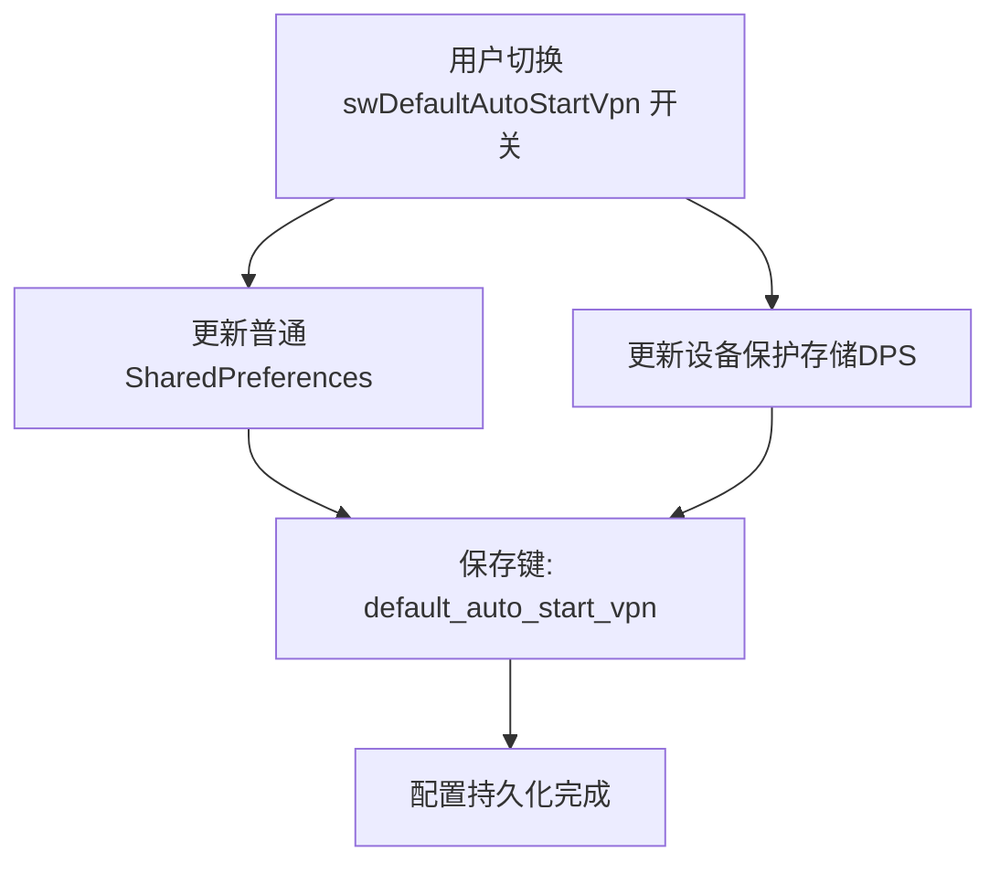
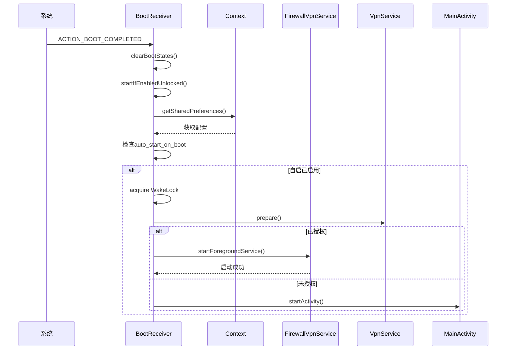

# 开机自启功能配置

<cite>
**Referenced Files in This Document**   
- [SettingsActivity.kt](file://app/src/main/java/com/example/phonenet/SettingsActivity.kt)
- [BootReceiver.kt](file://app/src/main/java/com/example/phonenet/BootReceiver.kt)
- [FirewallVpnService.kt](file://app/src/main/java/com/example/phonenet/FirewallVpnService.kt)
- [AndroidManifest.xml](file://app/src/main/AndroidManifest.xml)
</cite>

## 目录
1. [功能概述](#功能概述)
2. [配置持久化机制](#配置持久化机制)
3. [系统启动流程分析](#系统启动流程分析)
4. [设备保护存储的重要性](#设备保护存储的重要性)
5. [厂商定制ROM适配建议](#厂商定制rom适配建议)
6. [调试方法](#调试方法)

## 功能概述

本功能旨在实现应用在设备重启后自动启动VPN管控服务。通过`swDefaultAutoStartVpn`开关控制自启行为，该开关状态通过SharedPreferences双写机制（普通存储+设备保护存储）持久化保存键`default_auto_start_vpn`。系统启动时，`BootReceiver`会读取该配置，并在条件满足时启动`FirewallVpnService`。

**Section sources**
- [SettingsActivity.kt](file://app/src/main/java/com/example/phonenet/SettingsActivity.kt#L32)
- [BootReceiver.kt](file://app/src/main/java/com/example/phonenet/BootReceiver.kt#L9)

## 配置持久化机制

`swDefaultAutoStartVpn`开关的状态通过双写机制同时保存到普通SharedPreferences和设备保护存储（DPS）中。这种设计确保了即使在设备加密启动阶段，配置信息仍然可访问。

当用户在设置界面切换开关状态时，系统会同时更新两个存储位置的`default_auto_start_vpn`键值。这种双写策略提高了配置的可靠性和可访问性，特别是在设备启动的不同阶段。



**Diagram sources**
- [SettingsActivity.kt](file://app/src/main/java/com/example/phonenet/SettingsActivity.kt#L32-L360)

**Section sources**
- [SettingsActivity.kt](file://app/src/main/java/com/example/phonenet/SettingsActivity.kt#L32-L360)

## 系统启动流程分析

系统启动时，`BootReceiver`会接收启动完成广播，并根据配置决定是否启动VPN服务。启动流程分为多个阶段，以确保在各种设备状态下都能正确处理。



**Diagram sources**
- [BootReceiver.kt](file://app/src/main/java/com/example/phonenet/BootReceiver.kt#L9-L228)
- [FirewallVpnService.kt](file://app/src/main/java/com/example/phonenet/FirewallVpnService.kt#L15-L392)

**Section sources**
- [BootReceiver.kt](file://app/src/main/java/com/example/phonenet/BootReceiver.kt#L9-L228)

## 设备保护存储的重要性

设备保护存储（Device Protected Storage, DPS）在此场景下至关重要。它确保了在设备加密启动阶段仍可访问配置信息。对于需要在早期启动阶段就进行配置读取的应用来说，DPS提供了一种可靠的存储方案。

当设备处于锁定启动完成（ACTION_LOCKED_BOOT_COMPLETED）状态时，只有DPS中的数据可访问。这使得应用能够在用户解锁设备之前就获取到自启配置，并在适当的时候启动VPN服务。

**Section sources**
- [BootReceiver.kt](file://app/src/main/java/com/example/phonenet/BootReceiver.kt#L9-L228)
- [SettingsActivity.kt](file://app/src/main/java/com/example/phonenet/SettingsActivity.kt#L32-L360)

## 厂商定制ROM适配建议

不同厂商的定制ROM对应用自启有不同程度的限制。为确保功能正常工作，建议采取以下措施：

1. **手动添加自启权限**：指导用户在系统设置中手动授予应用自启权限
2. **电池优化例外**：引导用户将应用添加到电池优化白名单
3. **后台限制处理**：针对vivo等厂商的严格后台限制，实现多次重试机制
4. **权限请求**：在运行时请求必要的权限，如忽略电池优化

这些适配措施可以显著提高应用在各种设备上的自启成功率。

**Section sources**
- [BootReceiver.kt](file://app/src/main/java/com/example/phonenet/BootReceiver.kt#L9-L228)
- [SettingsActivity.kt](file://app/src/main/java/com/example/phonenet/SettingsActivity.kt#L32-L360)

## 调试方法

为测试和验证自启逻辑，可以使用adb命令模拟开机事件。以下是一些常用的调试命令：

```bash
# 模拟开机完成广播
adb shell am broadcast -a android.intent.action.BOOT_COMPLETED

# 模拟锁定启动完成广播
adb shell am broadcast -a android.intent.action.LOCKED_BOOT_COMPLETED

# 模拟用户解锁广播
adb shell am broadcast -a android.intent.action.USER_UNLOCKED
```

通过这些命令，开发者可以在不实际重启设备的情况下测试自启逻辑，大大提高开发效率。

**Section sources**
- [BootReceiver.kt](file://app/src/main/java/com/example/phonenet/BootReceiver.kt#L9-L228)
- [AndroidManifest.xml](file://app/src/main/AndroidManifest.xml#L1-L112)