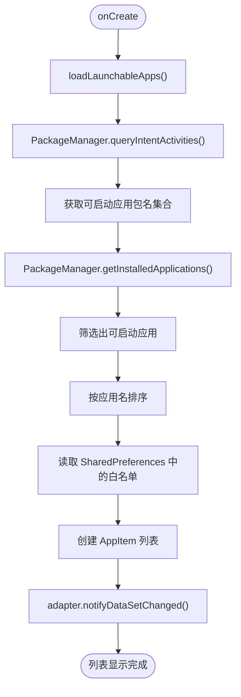
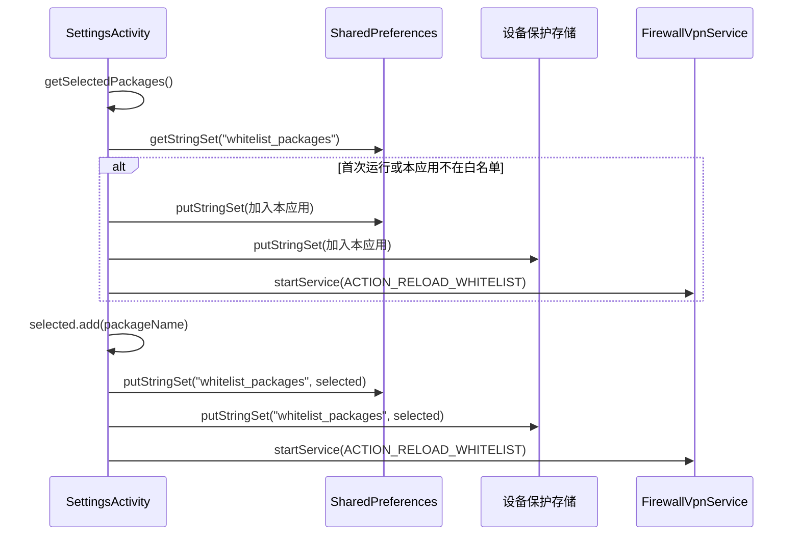
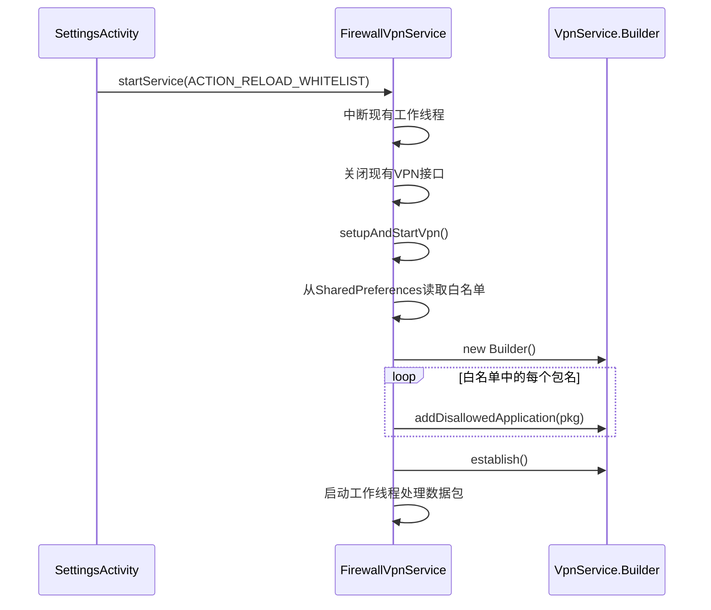
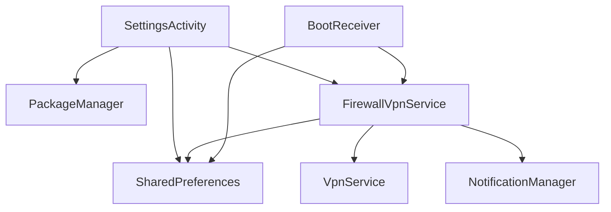

# 白名单应用管理

<cite>
**Referenced Files in This Document**   
- [SettingsActivity.kt](file://app/src/main/java/com/example/phonenet/SettingsActivity.kt)
- [FirewallVpnService.kt](file://app/src/main/java/com/example/phonenet/FirewallVpnService.kt)
- [VpnStateStore.kt](file://app/src/main/java/com/example/phonenet/VpnStateStore.kt)
- [AndroidManifest.xml](file://app/src/main/AndroidManifest.xml)
</cite>

## 目录
1. [简介](#简介)
2. [项目结构](#项目结构)
3. [核心组件](#核心组件)
4. [架构概览](#架构概览)
5. [详细组件分析](#详细组件分析)
6. [依赖分析](#依赖分析)
7. [性能考量](#性能考量)
8. [故障排除指南](#故障排除指南)
9. [结论](#结论)

## 简介
本文档详细阐述了名为“StopNet”的安卓应用中白名单应用管理功能的实现机制。该功能允许用户通过设置界面选择哪些应用可以访问网络，其余应用的网络访问将被防火墙拦截。文档重点解析了`SettingsActivity`如何加载可启动应用列表、利用`SharedPreferences`管理白名单状态、通过`FirewallVpnService`实现网络拦截，以及如何确保配置的即时生效和持久化存储。

## 项目结构
项目采用标准的Android项目结构，主要功能代码位于`app/src/main/java/com/example/phonenet/`目录下。核心组件包括`MainActivity`、`SettingsActivity`、`FirewallVpnService`等。资源文件（如布局和字符串）位于`res`目录。`AndroidManifest.xml`文件定义了应用的权限、组件和查询声明。

**Section sources**
- [SettingsActivity.kt](file://app/src/main/java/com/example/phonenet/SettingsActivity.kt)
- [FirewallVpnService.kt](file://app/src/main/java/com/example/phonenet/FirewallVpnService.kt)
- [AndroidManifest.xml](file://app/src/main/AndroidManifest.xml)

## 核心组件
核心功能由`SettingsActivity`和`FirewallVpnService`协同完成。`SettingsActivity`负责用户界面交互和白名单数据管理，而`FirewallVpnService`则利用Android的VpnService API在系统层面拦截网络流量。`VpnStateStore`作为单例对象，用于在应用内同步VPN服务的运行状态。

**Section sources**
- [SettingsActivity.kt](file://app/src/main/java/com/example/phonenet/SettingsActivity.kt#L19-L360)
- [FirewallVpnService.kt](file://app/src/main/java/com/example/phonenet/FirewallVpnService.kt#L15-L392)
- [VpnStateStore.kt](file://app/src/main/java/com/example/phonenet/VpnStateStore.kt#L4-L29)

## 架构概览
系统采用客户端-服务端模式。用户在`SettingsActivity`中进行配置，这些配置被持久化到`SharedPreferences`。当用户更改白名单或启动/停止VPN时，`SettingsActivity`会通过Intent与`FirewallVpnService`通信。服务接收到指令后，会重新建立VPN隧道，并根据最新的白名单配置调用`VpnService.Builder.addDisallowedApplication()`来阻止指定应用的网络访问。

```mermaid
graph TB
subgraph "用户界面"
SA[SettingsActivity]
RV[RecyclerView]
end
subgraph "数据存储"
SP[SharedPreferences]
DPS[设备保护存储]
end
subgraph "后台服务"
FVS[FirewallVpnService]
VS[VpnStateStore]
end
SA --> |加载应用列表| PackageManager
SA --> |读写配置| SP
SA --> |读写配置| DPS
SA --> |发送指令| FVS
FVS --> |读取白名单| SP
FVS --> |读取白名单| DPS
FVS --> |建立隧道| AndroidVPN
VS < --> |状态同步| SA
VS < --> |状态同步| FVS
```

**Diagram sources**
- [SettingsActivity.kt](file://app/src/main/java/com/example/phonenet/SettingsActivity.kt)
- [FirewallVpnService.kt](file://app/src/main/java/com/example/phonenet/FirewallVpnService.kt)
- [VpnStateStore.kt](file://app/src/main/java/com/example/phonenet/VpnStateStore.kt)

## 详细组件分析

### SettingsActivity 分析
`SettingsActivity`是白名单管理的入口。它在`onCreate`方法中初始化UI组件，并调用`loadLaunchableApps`方法来填充`RecyclerView`。

#### 应用列表加载与显示


**Diagram sources**
- [SettingsActivity.kt](file://app/src/main/java/com/example/phonenet/SettingsActivity.kt#L193-L210)

**Section sources**
- [SettingsActivity.kt](file://app/src/main/java/com/example/phonenet/SettingsActivity.kt#L193-L210)

#### 白名单持久化机制
`persistWhitelist`函数是白名单配置持久化的核心。它确保用户的每一次选择都能立即生效。



**Diagram sources**
- [SettingsActivity.kt](file://app/src/main/java/com/example/phonenet/SettingsActivity.kt#L237-L272)
- [FirewallVpnService.kt](file://app/src/main/java/com/example/phonenet/FirewallVpnService.kt#L20-L21)

**Section sources**
- [SettingsActivity.kt](file://app/src/main/java/com/example/phonenet/SettingsActivity.kt#L237-L272)

### FirewallVpnService 分析
`FirewallVpnService`继承自`VpnService`，是实现网络拦截的关键。

#### 防火墙规则重载流程
当接收到`ACTION_RELOAD_WHITELIST`广播时，服务会重建VPN隧道以应用新的白名单规则。



**Diagram sources**
- [FirewallVpnService.kt](file://app/src/main/java/com/example/phonenet/FirewallVpnService.kt#L45-L54)
- [FirewallVpnService.kt](file://app/src/main/java/com/example/phonenet/FirewallVpnService.kt#L285-L315)

**Section sources**
- [FirewallVpnService.kt](file://app/src/main/java/com/example/phonenet/FirewallVpnService.kt#L45-L54)
- [FirewallVpnService.kt](file://app/src/main/java/com/example/phonenet/FirewallVpnService.kt#L285-L315)

## 依赖分析
应用的正常运行依赖于Android系统的多个API和权限。`AndroidManifest.xml`中的`<queries>`标签声明了应用需要查询的可启动应用，替代了侵入性的`QUERY_ALL_PACKAGES`权限。`FirewallVpnService`需要`BIND_VPN_SERVICE`权限才能绑定。`BootReceiver`被声明为`directBootAware`，确保在设备启动后能立即恢复服务。



**Diagram sources**
- [AndroidManifest.xml](file://app/src/main/AndroidManifest.xml#L2-L20)
- [SettingsActivity.kt](file://app/src/main/java/com/example/phonenet/SettingsActivity.kt)
- [FirewallVpnService.kt](file://app/src/main/java/com/example/phonenet/FirewallVpnService.kt)

**Section sources**
- [AndroidManifest.xml](file://app/src/main/AndroidManifest.xml#L2-L20)

## 性能考量
- **应用列表加载**：`loadLaunchableApps`方法在主线程执行，对于应用数量极多的设备可能导致UI短暂卡顿。建议将此操作移至后台线程。
- **频繁重载**：每次勾选变化都触发`persistWhitelist`，进而导致VPN服务重载。虽然服务设计为可快速重启，但过于频繁的操作仍可能影响用户体验。可考虑添加防抖机制。
- **内存使用**：`VpnStateStore`使用`CopyOnWriteArrayList`存储监听器，适合读多写少的场景，能有效避免并发修改异常。

## 故障排除指南
- **问题：更改白名单后网络拦截未生效**
  - **检查点1**：确认`FirewallVpnService`正在运行。可在系统设置的“VPN”中查看。
  - **检查点2**：检查`persistWhitelist`函数是否被调用。可在代码中添加日志验证。
  - **检查点3**：确认`ACTION_RELOAD_WHITELIST`广播是否成功发送。检查`startForegroundService`是否抛出异常。
- **问题：应用在设备重启后未自动启动**
  - **检查点**：确认`BootReceiver`已正确注册，并且应用有权限在启动时运行。检查`AndroidManifest.xml`中的`BOOT_COMPLETED`权限。
- **问题：无法打开系统VPN设置**
  - **检查点**：`openSystemVpnSettings`方法使用了`try-catch`，失败时会静默处理。可移除`try-catch`以查看具体异常。

**Section sources**
- [SettingsActivity.kt](file://app/src/main/java/com/example/phonenet/SettingsActivity.kt#L237-L272)
- [FirewallVpnService.kt](file://app/src/main/java/com/example/phonenet/FirewallVpnService.kt#L45-L54)

## 结论
本文档全面解析了“StopNet”应用的白名单管理机制。通过`SettingsActivity`的UI交互、`SharedPreferences`的双存储策略、以及`FirewallVpnService`的实时拦截，实现了对设备网络访问的精细控制。该设计确保了本应用自身的网络畅通，并通过广播机制保证了配置的即时生效。未来可考虑优化应用列表加载的性能和减少不必要的服务重载，以进一步提升用户体验。