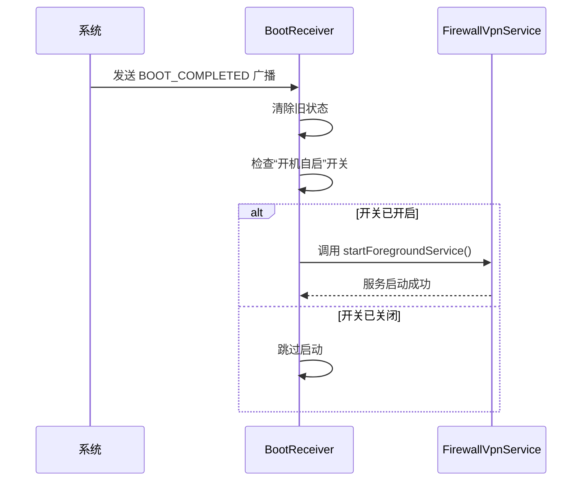
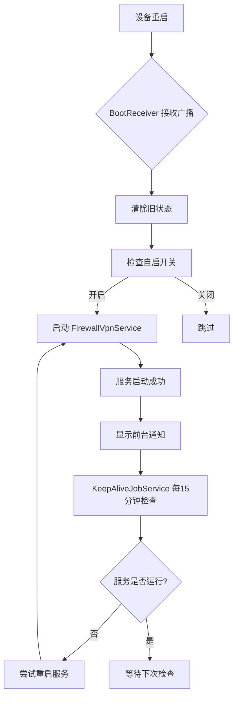

# 厂商适配与特殊设置

<cite>
**本文档引用文件**  
- [README.md](file://README.md)
- [BootReceiver.kt](file://app/src/main/java/com/example/phonenet/BootReceiver.kt)
- [KeepAliveJobService.kt](file://app/src/main/java/com/example/phonenet/KeepAliveJobService.kt)
- [AndroidManifest.xml](file://app/src/main/AndroidManifest.xml)
- [MainActivity.kt](file://app/src/main/java/com/example/phonenet/MainActivity.kt)
</cite>

## 目录
1. [引言](#引言)
2. [核心机制解析](#核心机制解析)
3. [通用配置原则](#通用配置原则)
4. [典型厂商设置指南](#典型厂商设置指南)
5. [验证方法](#验证方法)
6. [故障排查](#故障排查)
7. [总结](#总结)

## 引言
StopNet 是一款无需 Root 的手机网络管控工具，通过本地虚拟网络接口实现白名单联网控制。为确保应用在设备重启后能自动恢复管控状态，必须正确配置各手机厂商的后台保活与开机自启权限。不同厂商的定制系统（ROM）对后台应用管理策略差异较大，若未正确设置，可能导致 `BootReceiver` 无法接收开机广播，或 `KeepAliveJobService` 被系统强制终止，从而影响管控服务的持续运行。本文档基于项目 `README.md` 中详尽的 vivo 手机设置指南，系统化整理出通用配置原则及主流厂商的具体操作路径。

## 核心机制解析
StopNet 通过一系列 Android 系统机制确保服务的稳定运行和开机自启。

### 开机自启机制
`BootReceiver` 组件在 `AndroidManifest.xml` 中注册了多个开机相关广播，包括 `BOOT_COMPLETED`、`LOCKED_BOOT_COMPLETED` 和 `USER_UNLOCKED`。当设备启动时，系统会发送这些广播，`BootReceiver` 接收到后，会尝试启动 `FirewallVpnService` 以恢复网络管控。

**Diagram sources**
- [BootReceiver.kt](file://app/src/main/java/com/example/phonenet/BootReceiver.kt#L15-L45)
- [AndroidManifest.xml](file://app/src/main/AndroidManifest.xml#L80-L94)

### 后台保活机制
为防止服务被系统回收，StopNet 实现了多重保活策略。

1.  **前台服务 (Foreground Service)**：`FirewallVpnService` 在启动时会调用 `startForeground()`，显示一个常驻通知，向系统声明其正在执行重要任务，从而极大降低被杀死的概率。
2.  **JobScheduler 保活**：`KeepAliveJobService` 是一个周期性任务，每15分钟运行一次。它会检查 `FirewallVpnService` 是否应该运行，如果未运行则尝试重新启动。此任务被设置为 `persisted=true`，意味着设备重启后任务依然存在。
3.  **AlarmManager 重试**：针对 vivo 等限制严格的系统，`BootReceiver` 在收到开机广播后，会通过 `AlarmManager` 安排多次重试（10秒、30秒、60秒、120秒后），以应对系统延迟或后台限制。

**Diagram sources**
- [KeepAliveJobService.kt](file://app/src/main/java/com/example/phonenet/KeepAliveJobService.kt#L25-L50)
- [BootReceiver.kt](file://app/src/main/java/com/example/phonenet/BootReceiver.kt#L60-L85)

**Section sources**
- [BootReceiver.kt](file://app/src/main/java/com/example/phonenet/BootReceiver.kt)
- [KeepAliveJobService.kt](file://app/src/main/java/com/example/phonenet/KeepAliveJobService.kt)

## 通用配置原则
为确保 StopNet 在各类安卓设备上稳定运行，用户必须在系统设置中授予以下关键权限。这些设置是 `BootReceiver` 成功接收广播和 `KeepAliveJobService` 维持服务运行的前提。

### 必须开启的系统级权限
1.  **自启动 (Auto Start)**  
    允许应用在设备开机后自动启动。这是 `BootReceiver` 能够接收到 `BOOT_COMPLETED` 广播并启动 `FirewallVpnService` 的基础。若此权限被禁用，应用将无法实现开机自启。

2.  **后台高耗电 (Background Power Consumption)**  
    部分厂商（如 vivo）将此权限独立设置。允许应用在后台高耗电，可防止系统在锁屏或应用退至后台时，因省电策略而限制其网络和 CPU 资源，确保 `KeepAliveJobService` 能正常调度。

3.  **后台弹出界面 (Background Popup Window)**  
    允许应用在后台弹出界面。当 `BootReceiver` 尝试启动 `FirewallVpnService` 但 VPN 权限未授权时，应用需要拉起主界面引导用户授权。若此权限被禁用，后台拉起界面会失败，导致启动流程中断。

4.  **关联启动 (Associated Launch)**  
    允许应用被其他应用关联启动。虽然 StopNet 主要依赖开机广播，但此权限可作为额外的启动保障，防止因系统策略过于严格而导致自启失败。

5.  **电池优化豁免 (Ignore Battery Optimization)**  
    将应用设置为“不优化”或“允许后台运行”。这是防止系统后台管理机制（如 Doze 模式、App Standby）杀死 `FirewallVpnService` 和 `KeepAliveJobService` 的关键。若未豁免，服务可能在一段时间后被系统强制停止。

6.  **VPN 权限授予**  
    首次启动时，必须允许系统弹出的 VPN 连接请求。这是 `FirewallVpnService` 正常工作的必要条件。若未授权，服务无法建立虚拟网络接口，管控功能将失效。

7.  **应用内自启动开关**  
    在 StopNet 主界面，必须点击“允许自动启动”按钮，将其开启（显示为绿色）。此开关控制着 `BootReceiver` 内部的逻辑，即使系统层允许自启，若此开关关闭，`BootReceiver` 也会跳过启动流程。

**Section sources**
- [README.md](file://README.md#L82-L117)
- [MainActivity.kt](file://app/src/main/java/com/example/phonenet/MainActivity.kt#L374-L394)

## 典型厂商设置指南
以下是针对主流手机厂商的具体设置路径。由于不同系统版本可能存在差异，以下路径为常见路径，用户可根据实际情况在设置中搜索关键词查找。

### vivo 手机设置指南
vivo 手机对后台应用管理极为严格，需完成以下所有设置项。

1.  **自启动权限**  
    进入：设置 → 更多设置 → 权限管理 → 自启动 → 找到 StopNet → 开启开关。
2.  **后台高耗电**  
    进入：设置 → 电池 → 后台高耗电 → 找到 StopNet → 选择"允许"。
3.  **后台弹出界面**  
    进入：设置 → 更多设置 → 权限管理 → 权限 → 后台弹出界面 → 找到 StopNet → 开启权限。
4.  **关联启动**  
    进入：i管家 → 应用管理 → 权限管理 → 关联启动 → 找到 StopNet → 开启关联启动。
5.  **电池优化（关闭）**  
    进入：设置 → 电池 → 更多设置 → 电池优化 → 找到 StopNet → 选择"不优化"或"允许后台运行"。或在应用内点击"忽略电池优化"按钮。
6.  **应用内开启自启动开关**  
    打开 StopNet 主界面 → 点击"允许自动启动"按钮 → 确保显示为绿色。

### 华为手机设置指南
1.  **自启动**  
    进入：设置 → 应用 → 应用启动管理 → 搜索 StopNet → 关闭"自动管理" → 手动开启"允许自启动"。
2.  **电池优化**  
    进入：设置 → 电池 → 更多电池设置 → 智能保留后台应用 → 添加 StopNet。或进入：手机管家 → 权限管理 → 其他权限 → 忽略电池优化 → 找到 StopNet → 允许。
3.  **后台活动**  
    进入：手机管家 → 应用启动管理 → 找到 StopNet → 点击"手动管理" → 开启"允许后台活动"。

### 小米手机设置指南
1.  **自启动**  
    进入：设置 → 密码与安全 → 自启动 → 找到 StopNet → 开启开关。
2.  **电池优化**  
    进入：设置 → 应用设置 → 应用管理 → 找到 StopNet → 电池 → 选择"无限制"。
3.  **权限管理**  
    进入：安全中心 → 授权管理 → 应用权限管理 → 找到 StopNet → 权限访问设置 → 允许"显示在其他应用的上层"和"后台弹出界面"。

### OPPO/一加手机设置指南
1.  **自启动**  
    进入：设置 → 应用管理 → 权限管理 → 自启动管理 → 找到 StopNet → 开启。
2.  **电池优化**  
    进入：设置 → 电池 → 应用耗电管理 → 选择受保护应用 → 添加 StopNet。或进入：手机管家 → 权限隐私 → 自启动管理 → 找到 StopNet → 开启。
3.  **后台锁定**  
    进入：最近任务界面 → 找到 StopNet → 长按应用卡片 → 选择"锁定"。

### 三星手机设置指南
1.  **电池优化**  
    进入：设置 → 电池和设备维护 → 电池 → 应用电源管理 → 未监视的应用 → 添加 StopNet。
2.  **自启动**  
    三星系统通常默认允许自启动，但需确保在"应用电源管理"中未被限制。

**Section sources**
- [README.md](file://README.md#L82-L117)
- [MainActivity.kt](file://app/src/main/java/com/example/phonenet/MainActivity.kt#L374-L486)

## 验证方法
完成所有设置后，必须通过以下方法验证配置是否成功。

1.  **重启测试**  
    完成所有设置后，重启手机。解锁屏幕并等待10-30秒。
2.  **检查通知栏**  
    查看状态栏是否出现"StopNet 网络管控运行中"的通知。如果通知存在，说明 `FirewallVpnService` 已成功启动，开机自启和后台保活配置成功。
3.  **检查应用状态**  
    如果没有自动启动，打开 StopNet 应用。如果主界面的"启动管控"按钮显示为"停止管控"，说明服务已在后台运行，只是前台通知未及时显示。

**Section sources**
- [README.md](file://README.md#L118-L124)

## 故障排查
如果重启后服务未能自动启动，可按以下步骤排查。

### 使用 ADB 日志排查
1.  在开发者选项中开启"USB调试"。
2.  使用数据线连接手机与电脑。
3.  执行命令 `adb logcat | grep BootReceiver`，查看 `BootReceiver` 的日志输出。
    -   **日志显示 "VPN未授权"**：说明 `BootReceiver` 已成功接收广播并尝试启动服务，但 VPN 权限未被系统授权。请手动打开应用，重新授权 VPN。
    -   **日志显示 "启动服务失败"**：检查电池优化和后台高耗电设置是否已正确配置。
    -   **完全没有 `BootReceiver` 的日志**：说明 `BootReceiver` 未接收到开机广播，自启动权限未真正开启或被系统拦截。

### 常见问题
-   **应用内"允许自动启动"按钮为灰色**：确保已正确设置 PIN 码。
-   **系统设置中找不到相关选项**：不同系统版本路径可能不同，请在设置中搜索关键词，如"自启动"、"电池优化"、"后台管理"等。
-   **每次重启后都需要手动启动**：请逐一检查上述所有权限设置，特别是电池优化豁免和自启动权限。

**Section sources**
- [README.md](file://README.md#L125-L143)
- [BootReceiver.kt](file://app/src/main/java/com/example/phonenet/BootReceiver.kt)

## 总结
确保 StopNet 在各种定制 ROM 上稳定运行，关键在于正确配置厂商特定的后台保活与开机自启权限。用户必须系统性地完成自启动、后台高耗电、后台弹出界面、关联启动、电池优化豁免等核心权限的设置，并在应用内开启自启动开关。通过重启设备并检查通知栏状态进行验证，利用 `adb logcat` 工具进行日志排查，可以有效解决兼容性问题，实现开机自动恢复网络管控的目标。