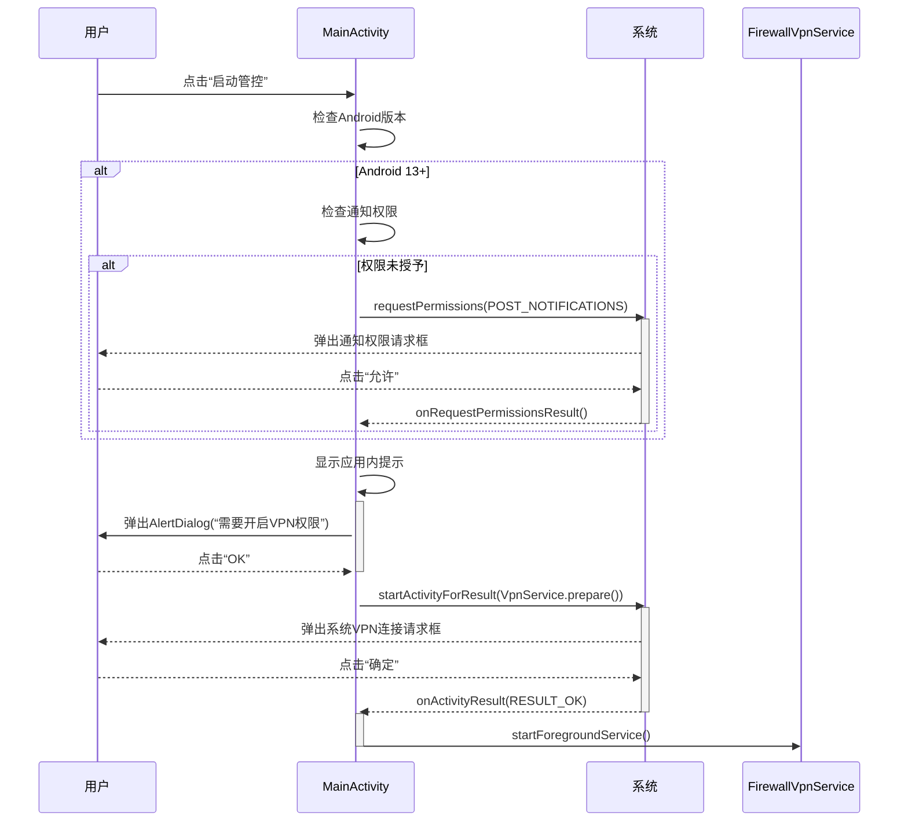

# 安装与权限配置

<cite>
**Referenced Files in This Document**   
- [README.md](file://README.md)
- [MainActivity.kt](file://app/src/main/java/com/example/phonenet/MainActivity.kt)
- [FirewallVpnService.kt](file://app/src/main/java/com/example/phonenet/FirewallVpnService.kt)
- [AndroidManifest.xml](file://app/src/main/AndroidManifest.xml)
- [VpnStateStore.kt](file://app/src/main/java/com/example/phonenet/VpnStateStore.kt)
- [strings.xml](file://app/src/main/res/values/strings.xml)
</cite>

## 目录
1. [安装与首次启动](#安装与首次启动)
2. [关键权限说明](#关键权限说明)
3. [权限请求流程](#权限请求流程)
4. [应用内权限触发](#应用内权限触发)
5. [常见问题与故障排除](#常见问题与故障排除)

## 安装与首次启动

安装 StopNet APK 后，首次启动应用将进入主界面。根据 `README.md` 中的说明，首次启动时必须完成关键权限的授权，这是确保网络管控功能正常工作的前提。

应用主界面由 `MainActivity.kt` 控制，其布局定义在 `activity_main.xml` 中。首次启动时，应用会根据启动来源（普通启动或开机广播启动）执行不同的初始化逻辑。若通过开机广播启动（`from_boot` 为 true），应用会自动尝试启动 VPN 服务并跳过 PIN 验证；若为普通启动，则会提示用户进行 PIN 验证（如果已设置）。

**Section sources**
- [README.md](file://README.md#L25-L35)
- [MainActivity.kt](file://app/src/main/java/com/example/phonenet/MainActivity.kt#L60-L85)

## 关键权限说明

StopNet 的正常运行依赖于两个核心权限：**VPN 连接权限**和**通知权限**（Android 13+）。这些权限的必要性在 `README.md` 的“权限说明”部分有明确阐述。

### VPN 连接权限

- **作用**: 用于建立本地虚拟网络接口，实现对设备所有网络流量的拦截和过滤。这是 StopNet 实现“白名单联网”功能的技术基础。
- **必要性**: 没有此权限，应用无法创建 VPN 服务，所有网络流量将不受管控，直接通过系统默认网络接口传输。
- **引用说明**: 根据 `README.md`，此权限是“用于进行网络管控”的必要条件。

### 通知权限 (Android 13+)

- **作用**: 用于在状态栏显示一个持续存在的前台服务通知。
- **必要性**: 从 Android 8.0 (O) 开始，后台服务受到严格限制。通过 `startForeground()` 方法将 `FirewallVpnService` 提升为前台服务，可以显著降低被系统回收的概率。在 Android 13 (API 33) 及以上版本，启动前台服务必须先获得 `POST_NOTIFICATIONS` 权限，否则 `startForeground()` 调用会失败，导致服务无法稳定运行。
- **引用说明**: 根据 `README.md`，此权限是“用于显示前台运行通知，保持稳定运行”的关键。

**Section sources**
- [README.md](file://README.md#L105-L111)
- [AndroidManifest.xml](file://app/src/main/AndroidManifest.xml#L10-L11)

## 权限请求流程

权限请求流程由 `MainActivity.kt` 中的业务逻辑驱动，主要涉及 `attemptStartVpnService()` 和 `startVpn()` 两个方法。

### 1. 通知权限请求 (Android 13+)

当用户尝试启动 VPN 服务时（无论是通过“开机自启”还是手动点击“启动管控”），应用会首先检查 Android 版本：
```kotlin
if (android.os.Build.VERSION.SDK_INT >= 33) {
    val granted = ContextCompat.checkSelfPermission(this, Manifest.permission.POST_NOTIFICATIONS) == PackageManager.PERMISSION_GRANTED
    if (!granted) {
        ActivityCompat.requestPermissions(this, arrayOf(Manifest.permission.POST_NOTIFICATIONS), REQUEST_NOTIF)
        return
    }
}
```
- **系统弹窗**: 如果权限未被授予，系统会弹出一个标准的权限请求对话框，询问用户是否允许 StopNet 发送通知。
- **用户操作**: 用户必须点击“允许”才能继续。如果用户点击“拒绝”，权限请求流程将中断，无法进入下一步的 VPN 授权。
- **后续处理**: 用户授权后，`onRequestPermissionsResult()` 回调会被触发，应用将继续执行 VPN 服务的启动逻辑。

### 2. VPN 连接权限请求

在确保通知权限（如需要）已授予后，应用会请求 VPN 权限：
```kotlin
val intent = VpnService.prepare(this)
if (intent != null) {
    AlertDialog.Builder(this)
        .setMessage(getString(R.string.vpn_permission_required))
        .setPositiveButton("OK") { _, _ ->
            startActivityForResult(intent, PREPARE_VPN_REQ)
        }
        .show()
}
```
- **应用内提示**: 应用首先会弹出一个 `AlertDialog`，内容来自 `strings.xml` 中的 `vpn_permission_required` 字符串（“需要开启 VPN 权限来进行网络管控”），告知用户即将进行的操作。
- **系统弹窗**: 用户点击“OK”后，系统会弹出一个由 Android 系统生成的“VPN 连接请求”对话框。该对话框会明确显示应用名称（StopNet）以及它将“监控所有网络流量”的权限。
- **用户操作**: 用户必须点击“确定”或“连接”来授权。这是最关键的一步，直接决定了 StopNet 是否能接管网络。
- **结果处理**: 授权结果通过 `onActivityResult()` 回调。如果用户授权成功（`resultCode == RESULT_OK`），应用将启动 `FirewallVpnService`。

**Diagram sources**
- [MainActivity.kt](file://app/src/main/java/com/example/phonenet/MainActivity.kt#L218-L246)
- [MainActivity.kt](file://app/src/main/java/com/example/phonenet/MainActivity.kt#L281-L325)
- [strings.xml](file://app/src/main/res/values/strings.xml#L2)



## 应用内权限触发

用户可以通过应用内的界面主动触发权限请求流程：

1.  **启动管控按钮**: 主界面的“启动管控”按钮（`btnToggleVpn`）是主要的触发点。点击此按钮会调用 `toggleVpn()` 方法，进而触发 `startVpn()` 流程，完整地执行上述权限请求步骤。
2.  **忽略电池优化按钮**: 主界面的“忽略电池优化”按钮（`btnIgnoreBattery`）会引导用户前往系统设置，手动允许 StopNet 忽略电池优化。这对于防止服务在后台被系统杀死至关重要。
3.  **开机自启动按钮**: “开机自启动”按钮（`btnAutoStart`）会尝试打开各手机厂商的自启动管理页面，引导用户手动开启自启动权限，确保设备重启后服务能自动恢复。

这些按钮的点击事件监听器在 `MainActivity.onCreate()` 中设置，确保了用户交互的即时响应。

**Section sources**
- [MainActivity.kt](file://app/src/main/java/com/example/phonenet/MainActivity.kt#L70-L73)
- [MainActivity.kt](file://app/src/main/java/com/example/phonenet/MainActivity.kt#L335-L340)
- [MainActivity.kt](file://app/src/main/java/com/example/phonenet/MainActivity.kt#L395-L400)

## 常见问题与故障排除

### 服务无法启动或不稳定

- **原因**: 最常见的原因是未正确授予 **VPN 权限** 或 **通知权限**（Android 13+）。
- **解决方案**: 重新启动应用，并严格按照上述流程，确保在系统弹窗中点击“允许”或“确定”。务必检查是否遗漏了任何一个权限请求。

### 前台服务通知未显示

- **原因**: `FirewallVpnService` 的 `startForegroundNotification()` 方法负责创建通知。如果此方法未被调用或调用失败，通知将不会出现。
- **解决方案**: 确保 `startForeground()` 被成功调用。这通常意味着 `startVpn()` 流程已成功完成，且 `FirewallVpnService.onStartCommand()` 已执行。如果通知消失，服务很可能已被系统回收。

### 开机自启失败

- **原因**: 不同手机厂商（如 vivo）对后台应用有严格的限制策略。
- **解决方案**: 参考 `README.md` 中的“vivo手机开机自启动设置指南”，在系统设置中完成“自启动权限”、“后台高耗电”、“电池优化”等所有相关设置。

**Section sources**
- [README.md](file://README.md#L130-L155)
- [FirewallVpnService.kt](file://app/src/main/java/com/example/phonenet/FirewallVpnService.kt#L319-L359)