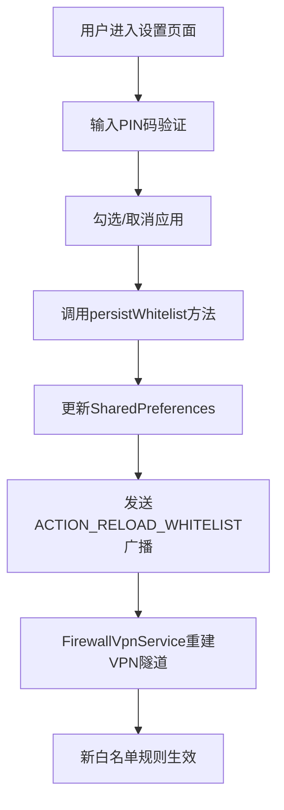
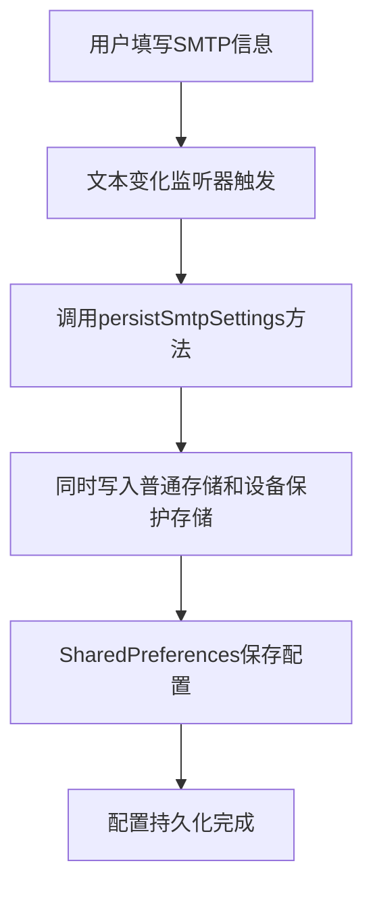
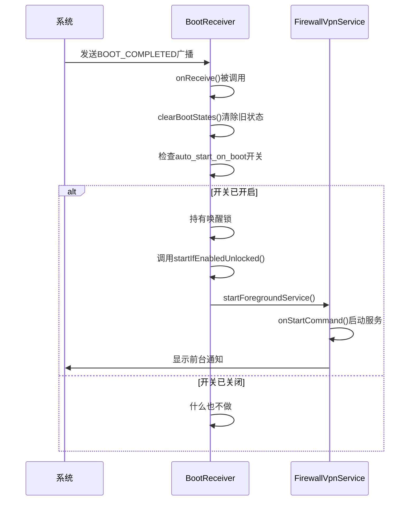
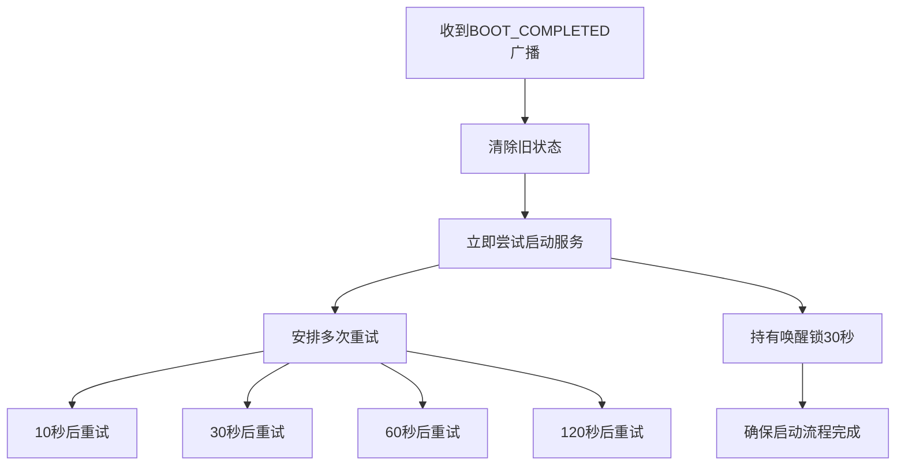

# 配置与部署指南

<cite>
**Referenced Files in This Document**   
- [README.md](file://README.md)
- [SettingsActivity.kt](file://app/src/main/java/com/example/phonenet/SettingsActivity.kt)
- [AndroidManifest.xml](file://app/src/main/AndroidManifest.xml)
- [FirewallVpnService.kt](file://app/src/main/java/com/example/phonenet/FirewallVpnService.kt)
- [BootReceiver.kt](file://app/src/main/java/com/example/phonenet/BootReceiver.kt)
</cite>

## 目录
1. [安装与权限授予](#安装与权限授予)
2. [首次配置流程](#首次配置流程)
3. [设置页面详细配置](#设置页面详细配置)
4. [特殊手机厂商设置指南](#特殊手机厂商设置指南)
5. [开机自启与后台运行机制](#开机自启与后台运行机制)
6. [故障排查与验证](#故障排查与验证)

## 安装与权限授予

在安装 StopNet 应用后，首次启动时需要授予必要的系统权限，以确保应用功能正常运行。这些权限是实现网络管控的基础，必须正确配置。

### VPN连接权限
应用启动后，系统会自动弹出“VPN连接”授权请求对话框。用户必须点击“确定”或“连接”按钮，允许 StopNet 建立虚拟专用网络。这是实现网络流量拦截和白名单控制的核心权限。如果拒绝此权限，应用将无法进行任何网络管控。

### Android 13+通知权限
对于运行 Android 13 及以上版本的设备，应用还需要请求“通知权限”。此权限用于在状态栏显示“StopNet 网络管控运行中”的前台服务通知。该通知是保持服务稳定运行的关键，可以防止系统在后台将应用进程杀死。用户应在系统弹出的权限请求中选择“允许”以授予此权限。

### 其他必要权限
根据应用功能，系统可能还会请求以下权限：
- **查询所有应用 (QUERY_ALL_PACKAGES)**：用于扫描并列出设备上所有可启动的应用，以便在白名单中进行选择。
- **网络访问 (INTERNET)**：仅用于发送 SMTP 测试邮件，不涉及用户上网数据的上传或代理。
- **开机广播 (RECEIVE_BOOT_COMPLETED)**：用于在设备重启后自动尝试启动网络管控服务。

**Section sources**
- [README.md](file://README.md#L25-L40)
- [AndroidManifest.xml](file://app/src/main/AndroidManifest.xml#L10-L15)

## 首次配置流程

完成权限授予后，用户需要进行首次配置，以确保应用能够按预期工作。此流程是确保应用功能完整性的关键步骤。

### 启动主界面
安装并打开 StopNet 应用后，用户将进入主界面。界面简洁，主要包含“启动管控”和“停止管控”两个按钮。首次进入时，应用尚未启动，因此“启动管控”按钮处于可点击状态。

### 进入设置页面
首次使用前，强烈建议用户先进入“设置”页面进行配置。点击主界面的“设置”按钮，系统会引导用户进行 PIN 码设置。

### 创建设置页面PIN码
为了防止设置被随意更改，设置页面受 PIN 码保护。首次进入时，系统会弹出“创建 PIN 码”对话框。用户需要输入两次相同的四位或六位数字作为 PIN 码。创建成功后，每次进入设置页面都必须输入此 PIN 码。如果忘记 PIN 码，唯一的解决方法是清除应用数据或卸载后重新安装，这将导致所有配置丢失。

**Section sources**
- [README.md](file://README.md#L35-L40)
- [SettingsActivity.kt](file://app/src/main/java/com/example/phonenet/SettingsActivity.kt#L151-L181)

## 设置页面详细配置

设置页面是 StopNet 的核心配置中心，用户可以在此进行所有关键设置。

### 配置白名单应用
白名单功能允许用户指定哪些应用可以联网。在设置页面的“白名单应用”列表中，用户可以勾选需要允许联网的应用（如学习类应用、支付应用等）。列表会自动显示设备上所有可启动的应用。**请注意，StopNet 自身的应用会自动被加入白名单并锁定，以防止自身网络被拦截导致服务中断。** 每当用户更改白名单选择时，应用会立即保存设置并通知后台服务重载白名单，使更改即时生效。

**Diagram sources**
- [SettingsActivity.kt](file://app/src/main/java/com/example/phonenet/SettingsActivity.kt#L237-L272)
- [FirewallVpnService.kt](file://app/src/main/java/com/example/phonenet/FirewallVpnService.kt#L100-L110)

### 填写SMTP服务器信息
用户可以选择配置 SMTP 邮件服务器，用于向家长邮箱发送“测试邮件”，以验证配置的有效性。在设置页面，需要填写以下信息：
- **主机 (Host)**：SMTP 服务器地址，如 `smtp.gmail.com`。
- **端口 (Port)**：根据安全协议自动变化。启用 SSL 时默认为 465，启用 TLS 时默认为 587。
- **用户名 (Username)**：登录 SMTP 服务器的邮箱地址。
- **密码 (Password)**：登录 SMTP 服务器的密码或应用专用密码。
- **发件人 (From)**：实际显示的发件人邮箱地址。

当用户在“主机”、“端口”等输入框中修改内容时，应用会实时自动保存这些配置到本地存储。SSL 和 TLS 选项互斥，选择 SSL 会自动关闭 TLS。

**Diagram sources**
- [SettingsActivity.kt](file://app/src/main/java/com/example/phonenet/SettingsActivity.kt#L275-L304)
- [SettingsActivity.kt](file://app/src/main/java/com/example/phonenet/SettingsActivity.kt#L100-L120)

### 开启开机自启
在设置页面，用户可以开启“开机自动启动”开关。此开关控制一个名为 `default_auto_start_vpn` 的布尔值，该值同时存储在普通共享偏好设置和设备保护存储中，以确保在设备加密状态下也能读取。开启后，应用将在设备重启后尝试自动恢复网络管控。

**Section sources**
- [SettingsActivity.kt](file://app/src/main/java/com/example/phonenet/SettingsActivity.kt#L50-L65)
- [SettingsActivity.kt](file://app/src/main/java/com/example/phonenet/SettingsActivity.kt#L237-L304)

## 特殊手机厂商设置指南

不同手机厂商的系统对后台应用有严格的限制策略，可能导致 StopNet 无法正常开机自启或在后台稳定运行。其中，vivo 手机的限制尤为严格，需要进行额外的系统级设置。

### vivo手机完整设置步骤
为确保 StopNet 在 vivo 手机上能够可靠地开机自启和后台运行，必须完成以下所有设置项：

1. **自启动权限**
   - 进入：设置 → 更多设置 → 权限管理 → 自启动
   - 找到 StopNet，开启自启动开关。

2. **后台高耗电**
   - 进入：设置 → 电池 → 后台高耗电
   - 找到 StopNet，选择“允许”。

3. **后台弹出界面**
   - 进入：设置 → 更多设置 → 权限管理 → 权限 → 后台弹出界面
   - 找到 StopNet，开启权限。

4. **关联启动**
   - 进入：i管家 → 应用管理 → 权限管理 → 关联启动
   - 找到 StopNet，开启关联启动。

5. **电池优化（关闭）**
   - 在应用内点击“忽略电池优化”按钮，或进入：设置 → 电池 → 更多设置 → 电池优化
   - 找到 StopNet，选择“不优化”或“允许后台运行”。

6. **VPN权限授予**
   - 首次启动时务必允许系统弹出的 VPN 连接请求。

7. **应用内开启自启动开关**
   - 打开 StopNet 主界面，点击“开机自启动”按钮，确保其显示为绿色（已开启）。

**Section sources**
- [README.md](file://README.md#L100-L143)

## 开机自启与后台运行机制

StopNet 采用多重机制来确保服务的稳定性和持久性，即使在应用被关闭或设备重启后也能恢复运行。

### BootReceiver广播接收器
`BootReceiver` 是一个关键的广播接收器，它监听设备启动完成 (`ACTION_BOOT_COMPLETED`)、用户解锁 (`ACTION_USER_UNLOCKED`) 等系统广播。当接收到这些广播时，它会检查用户是否开启了“开机自启”开关，如果开启，则尝试启动 `FirewallVpnService`。

**Diagram sources**
- [BootReceiver.kt](file://app/src/main/java/com/example/phonenet/BootReceiver.kt#L15-L75)
- [FirewallVpnService.kt](file://app/src/main/java/com/example/phonenet/FirewallVpnService.kt#L30-L50)

### 多重重试与唤醒锁
为了应对 vivo 等厂商系统的后台限制，`BootReceiver` 实现了智能的重试机制。在设备启动后，它不仅会立即尝试启动服务，还会通过 `AlarmManager` 安排在 10 秒、30 秒、60 秒和 120 秒后进行多次重试。此外，在启动过程中会短暂持有“唤醒锁”(Wake Lock)，防止 CPU 在关键启动流程中休眠。

**Diagram sources**
- [BootReceiver.kt](file://app/src/main/java/com/example/phonenet/BootReceiver.kt#L78-L110)
- [BootReceiver.kt](file://app/src/main/java/com/example/phonenet/BootReceiver.kt#L180-L200)

## 故障排查与验证

如果应用未能按预期工作，用户可以按照以下步骤进行排查和验证。

### 验证开机自启
完成所有设置后，重启手机并等待 30 秒。检查状态栏是否出现了“StopNet 网络管控运行中”的通知。如果出现，则说明开机自启成功。如果没有出现，应返回检查 vivo 手机的特殊设置是否全部完成。

### 检查VPN授权状态
如果服务启动失败，可能是因为 VPN 授权被撤销。用户可以在系统设置中检查 VPN 状态，或将 StopNet 设置为“始终开启”，并启用“无 VPN 不允许连接”选项，以防止授权被意外撤销。

### 查看系统日志
对于高级用户，可以通过 ADB 工具查看系统日志进行故障排查。使用 `adb logcat | grep BootReceiver` 命令可以过滤出与启动相关的日志，查看是否有“启动服务失败”或“VPN未授权”等错误信息。

**Section sources**
- [README.md](file://README.md#L120-L143)
- [BootReceiver.kt](file://app/src/main/java/com/example/phonenet/BootReceiver.kt#L15-L229)
- [FirewallVpnService.kt](file://app/src/main/java/com/example/phonenet/FirewallVpnService.kt#L300-L320)