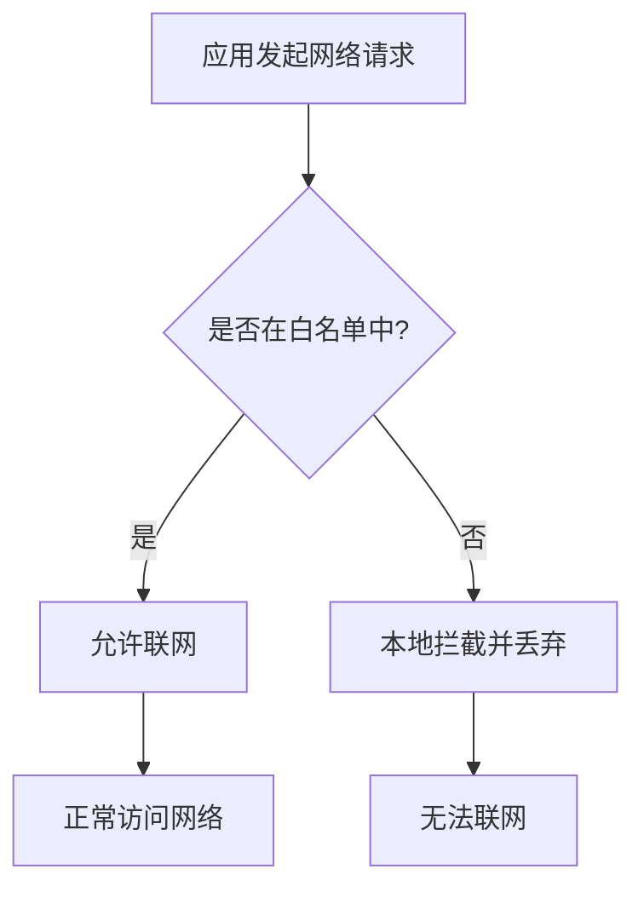
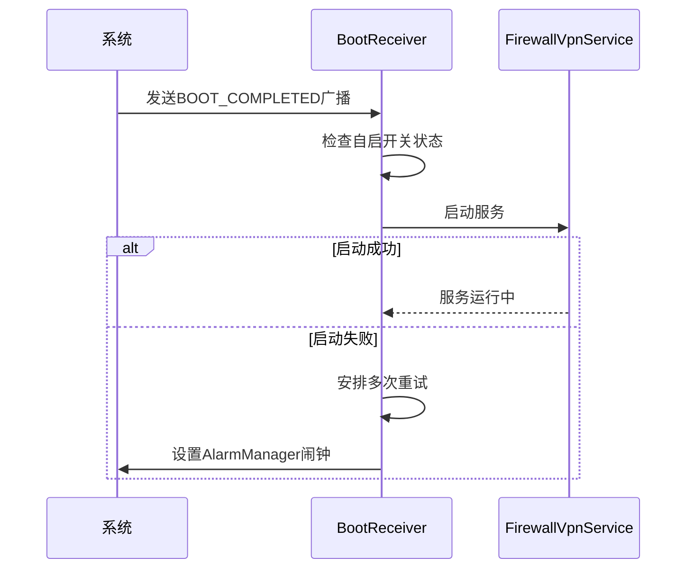
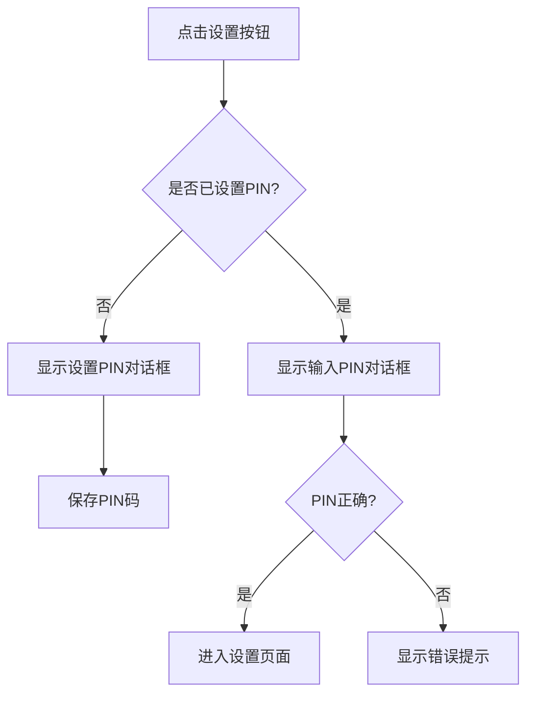
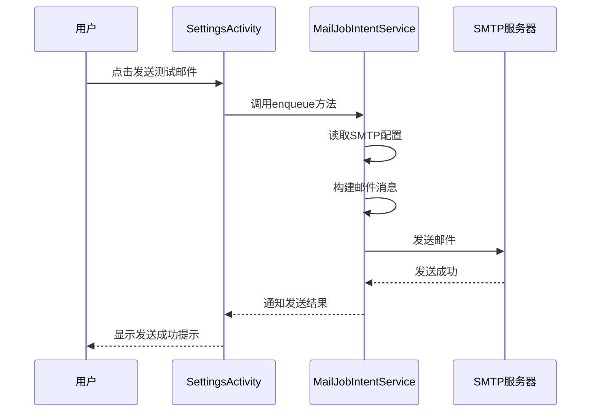
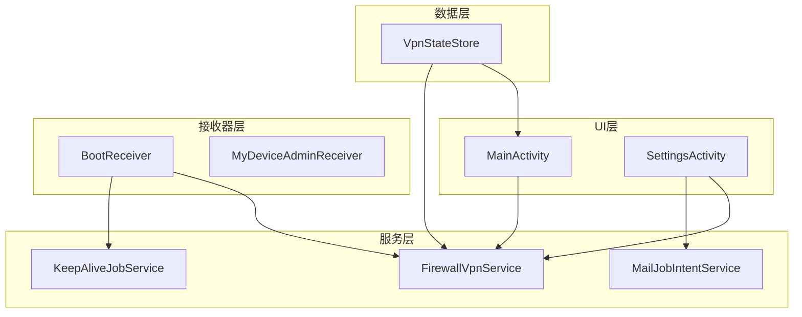
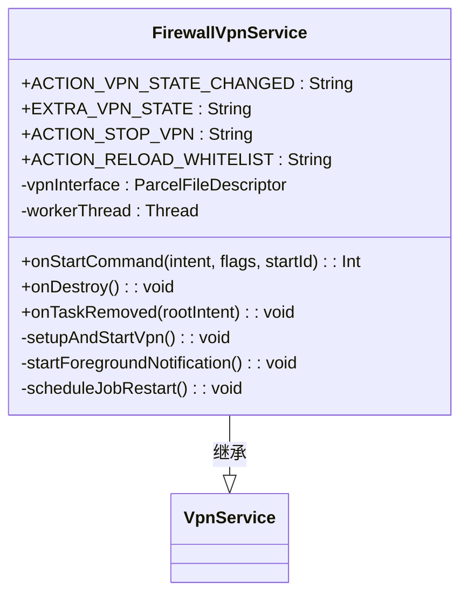
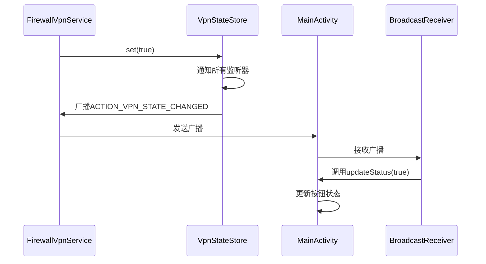
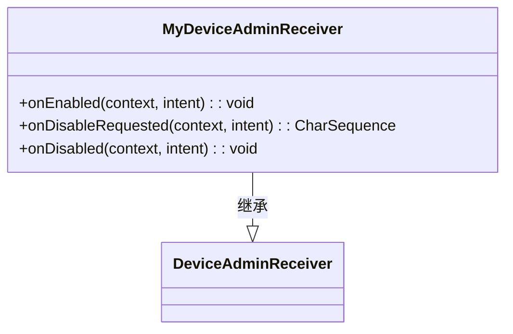

# 项目概述

<cite>
**本文档引用文件**  
- [README.md](file://README.md)
- [MainActivity.kt](file://app/src/main/java/com/example/phonenet/MainActivity.kt)
- [FirewallVpnService.kt](file://app/src/main/java/com/example/phonenet/FirewallVpnService.kt)
- [BootReceiver.kt](file://app/src/main/java/com/example/phonenet/BootReceiver.kt)
- [KeepAliveJobService.kt](file://app/src/main/java/com/example/phonenet/KeepAliveJobService.kt)
- [SettingsActivity.kt](file://app/src/main/java/com/example/phonenet/SettingsActivity.kt)
- [MailJobIntentService.kt](file://app/src/main/java/com/example/phonenet/mail/MailJobIntentService.kt)
- [VpnStateStore.kt](file://app/src/main/java/com/example/phonenet/VpnStateStore.kt)
- [MyDeviceAdminReceiver.kt](file://app/src/main/java/com/example/phonenet/admin/MyDeviceAdminReceiver.kt)
- [AndroidManifest.xml](file://app/src/main/AndroidManifest.xml)
- [device_admin_receiver.xml](file://app/src/main/res/xml/device_admin_receiver.xml)
- [strings.xml](file://app/src/main/res/values/strings.xml)
</cite>

## 目录
1. [项目简介](#项目简介)
2. [核心功能详解](#核心功能详解)
3. [技术架构与实现原理](#技术架构与实现原理)
4. [目标用户与使用场景](#目标用户与使用场景)
5. [安装与使用指南](#安装与使用指南)
6. [高级配置与技术背景](#高级配置与技术背景)
7. [隐私与安全特性](#隐私与安全特性)
8. [常见问题与故障排查](#常见问题与故障排查)
9. [项目技术定位与生态价值](#项目技术定位与生态价值)

## 项目简介

StopNet 是一款专为家长设计的手机网络管控工具，旨在通过基于VPN的白名单机制，实现对子女设备上网行为的有效管理。该应用无需Root权限，即可在Android设备上实现本地流量拦截，确保非白名单应用无法联网，从而帮助家长控制儿童使用手机的时间和范围。

项目采用轻量级设计，通过前台服务与多种保活机制保障服务稳定运行，同时提供PIN码保护、开机自启、SMTP测试邮件等实用功能。其核心优势在于无需获取系统最高权限，所有网络拦截操作均在本地完成，不上传、不代理用户流量，最大程度保护用户隐私。

StopNet适用于希望限制子女设备上网行为的家长群体，尤其适合管理学习专用设备或防止儿童沉迷网络。通过简洁直观的界面设计，用户可轻松设置允许联网的应用白名单，实现“只允许指定应用联网”的管控目标。

**Section sources**
- [README.md](file://README.md#L1-L30)

## 核心功能详解

### 基于VPN的白名单网络管控
StopNet的核心功能是通过Android系统的VpnService API创建虚拟网络接口，实现对设备所有网络流量的拦截与过滤。应用启动后，会建立一个本地VPN连接，将设备的所有网络请求重定向到自身处理。

在`FirewallVpnService.kt`中，通过`VpnService.Builder`配置虚拟网络，添加允许的IP地址和路由，同时使用`addDisallowedApplication()`方法将未在白名单中的应用加入禁止联网列表。当用户发起网络请求时，系统会先检查该应用是否在白名单中，若不在则直接丢弃数据包，从而实现断网效果。

**Diagram sources**
- [FirewallVpnService.kt](file://app/src/main/java/com/example/phonenet/FirewallVpnService.kt#L200-L250)

### 开机自启与后台保活
为确保设备重启后能自动恢复网络管控，StopNet实现了多层次的开机自启与后台保活机制。在`BootReceiver.kt`中，应用注册了多个系统广播接收器，包括`BOOT_COMPLETED`（设备启动完成）、`LOCKED_BOOT_COMPLETED`（锁定模式启动完成）和`USER_UNLOCKED`（用户解锁）等。

当接收到这些广播时，`BootReceiver`会检查用户是否开启了开机自启功能，若开启则尝试启动`FirewallVpnService`。为应对不同厂商ROM对后台应用的限制，系统还实现了多重保障：
- 使用`AlarmManager`安排精确闹钟，在设备启动后多个时间点尝试重启服务
- 通过`JobScheduler`创建周期性任务，每15分钟检查服务状态并尝试恢复
- 在`onTaskRemoved`中监听应用被清理事件，立即尝试自恢复

**Diagram sources**
- [BootReceiver.kt](file://app/src/main/java/com/example/phonenet/BootReceiver.kt#L15-L100)
- [KeepAliveJobService.kt](file://app/src/main/java/com/example/phonenet/KeepAliveJobService.kt#L15-L40)

### PIN码保护机制
为防止设置被随意更改，StopNet在设置页面实现了PIN码保护功能。首次进入设置时，用户需要创建4位以上的数字PIN码，后续每次进入设置都需要输入正确的PIN码进行验证。

在`SettingsActivity.kt`中，PIN码通过`SharedPreferences`进行存储和验证。应用采用双存储机制，将PIN码同时保存在普通存储和设备保护存储中，确保在设备加密状态下仍能正常访问。当用户尝试进入设置页面时，系统会弹出PIN码输入对话框，验证通过后方可进入。

**Diagram sources**
- [SettingsActivity.kt](file://app/src/main/java/com/example/phonenet/SettingsActivity.kt#L100-L150)

### SMTP测试邮件通知
StopNet支持配置SMTP邮件服务器，用于发送测试邮件以验证配置有效性。在`SettingsActivity.kt`的设置页面中，用户可以填写SMTP服务器地址、端口、用户名、密码和发件人邮箱等信息。

邮件发送功能由`MailJobIntentService.kt`实现，该服务继承自`JobIntentService`，可在后台安全地执行邮件发送任务。当用户点击"发送测试邮件"按钮时，系统会从`SharedPreferences`读取SMTP配置，构建邮件内容，并通过JavaMail API发送到指定的家长邮箱。

**Diagram sources**
- [SettingsActivity.kt](file://app/src/main/java/com/example/phonenet/SettingsActivity.kt#L250-L280)
- [MailJobIntentService.kt](file://app/src/main/java/com/example/phonenet/mail/MailJobIntentService.kt#L15-L60)

**Section sources**
- [README.md](file://README.md#L31-L60)
- [FirewallVpnService.kt](file://app/src/main/java/com/example/phonenet/FirewallVpnService.kt#L15-L392)
- [BootReceiver.kt](file://app/src/main/java/com/example/phonenet/BootReceiver.kt#L9-L228)
- [KeepAliveJobService.kt](file://app/src/main/java/com/example/phonenet/KeepAliveJobService.kt#L10-L70)
- [SettingsActivity.kt](file://app/src/main/java/com/example/phonenet/SettingsActivity.kt#L19-L360)
- [MailJobIntentService.kt](file://app/src/main/java/com/example/phonenet/mail/MailJobIntentService.kt#L14-L92)

## 技术架构与实现原理

### 整体架构设计
StopNet采用模块化设计，主要由以下几个核心组件构成：
- **MainActivity**：主界面，负责用户交互和状态显示
- **SettingsActivity**：设置界面，管理白名单、SMTP配置等
- **FirewallVpnService**：核心服务，实现VPN网络拦截
- **BootReceiver**：广播接收器，处理开机自启逻辑
- **KeepAliveJobService**：保活服务，确保服务持续运行
- **MailJobIntentService**：邮件服务，处理邮件发送任务

这些组件通过`AndroidManifest.xml`进行声明和配置，形成一个完整的应用架构。`VpnStateStore.kt`作为全局状态管理器，使用单例模式在各组件间同步VPN运行状态。

**Diagram sources**
- [AndroidManifest.xml](file://app/src/main/AndroidManifest.xml#L1-L112)
- [VpnStateStore.kt](file://app/src/main/java/com/example/phonenet/VpnStateStore.kt#L4-L29)

### 网络拦截实现原理
StopNet的网络拦截功能基于Android的VpnService API实现。`FirewallVpnService`继承自`VpnService`，通过`Builder`类配置虚拟网络参数：

1. **网络配置**：设置虚拟IP地址（10.0.0.2）和路由（0.0.0.0/0），将所有流量重定向到VPN接口
2. **白名单处理**：遍历用户选择的白名单应用，调用`addDisallowedApplication()`方法将非白名单应用加入禁止列表
3. **隧道建立**：调用`establish()`方法创建虚拟网络接口，返回`ParcelFileDescriptor`
4. **数据处理**：创建工作线程，通过`FileInputStream`读取虚拟接口的数据包，实现流量监控

在`setupAndStartVpn()`方法中，系统会从`SharedPreferences`读取白名单应用列表，并将其添加到VPN配置中。当设备重启或用户更改白名单时，服务会重新建立VPN隧道，确保配置即时生效。

**Diagram sources**
- [FirewallVpnService.kt](file://app/src/main/java/com/example/phonenet/FirewallVpnService.kt#L15-L392)

### 状态管理与通信机制
StopNet采用广播+全局状态管理的双重机制实现组件间通信。`VpnStateStore.kt`作为全局状态管理器，使用`CopyOnWriteArrayList`存储状态监听器，确保线程安全。

当`FirewallVpnService`的运行状态发生变化时，会通过以下流程通知UI组件：
1. 调用`VpnStateStore.set()`方法更新内存中的运行状态
2. 发送`ACTION_VPN_STATE_CHANGED`广播，通知所有注册的接收器
3. `MainActivity`中的`BroadcastReceiver`接收到广播后，调用`updateStatus()`更新界面

这种双重机制确保了状态同步的可靠性：即使广播接收失败，UI组件仍可通过`VpnStateStore.current()`获取最新状态。

**Diagram sources**
- [VpnStateStore.kt](file://app/src/main/java/com/example/phonenet/VpnStateStore.kt#L4-L29)
- [MainActivity.kt](file://app/src/main/java/com/example/phonenet/MainActivity.kt#L50-L80)
- [FirewallVpnService.kt](file://app/src/main/java/com/example/phonenet/FirewallVpnService.kt#L50-L80)

**Section sources**
- [FirewallVpnService.kt](file://app/src/main/java/com/example/phonenet/FirewallVpnService.kt#L15-L392)
- [MainActivity.kt](file://app/src/main/java/com/example/phonenet/MainActivity.kt#L17-L644)
- [VpnStateStore.kt](file://app/src/main/java/com/example/phonenet/VpnStateStore.kt#L4-L29)

## 目标用户与使用场景

### 目标用户群体
StopNet的主要目标用户是关心子女上网安全的家长群体。这类用户通常具有以下特征：
- 希望限制子女使用手机的时间和范围
- 担心子女沉迷网络游戏或社交媒体
- 需要确保学习设备只能访问必要的教育应用
- 对技术了解有限，需要简单易用的管控工具
- 重视隐私安全，不希望使用需要Root权限的监控软件

此外，该应用也适用于教育机构、企业IT管理员等需要对设备进行网络管控的场景。

### 典型使用场景
#### 场景一：限制儿童设备上网
家长为子女的手机安装StopNet，设置只允许学习类应用（如网课平台、作业辅导App）和必要应用（如支付App）联网。当子女尝试打开游戏或社交媒体应用时，会发现无法连接网络，从而达到限制娱乐应用使用的目的。

#### 场景二：管理学习专用设备
学校为学生发放的学习平板预装StopNet，设置只允许教育平台、电子书阅读器等学习相关应用联网。这样既能保证学生专注于学习，又能防止他们访问无关网站或下载游戏。

#### 场景三：临时网络管控
家长发现子女过度使用手机，可以临时启动StopNet，完全切断所有应用的网络连接，强制子女休息或进行其他活动。需要恢复网络时，只需点击"停止管控"即可。

#### 场景四：远程状态确认
家长配置SMTP邮件功能后，可以通过发送测试邮件来确认StopNet的配置是否正常工作。虽然当前版本不支持自动告警，但这一功能为未来扩展提供了基础。

**Section sources**
- [README.md](file://README.md#L1-L30)
- [README.md](file://README.md#L110-L143)

## 安装与使用指南

### 安装步骤
1. 下载并安装StopNet应用
2. 首次启动时，系统会请求VPN连接授权，点击"确定"允许
3. 对于Android 13及以上系统，还需允许通知权限，以显示前台运行通知
4. 进入主界面，准备进行设置

### 使用流程
1. **设置PIN码**：首次进入设置页面，需要创建4位以上的数字PIN码
2. **配置白名单**：在"白名单应用"中勾选允许联网的应用，如学习App、支付App等
3. **配置SMTP邮件（可选）**：填写家长邮箱和SMTP服务器参数，点击"发送测试邮件"验证配置
4. **设置开机自启（可选）**：打开"开机自动启动"开关，设备重启后将自动尝试恢复管控
5. **启动管控**：返回主界面，点击"启动管控"按钮
6. **停止管控**：需要临时恢复所有应用联网时，点击"停止管控"按钮

### 注意事项
- **联网影响范围**：开启管控后，除白名单外的所有应用都无法联网，包括浏览器、社交、游戏等
- **排他性**：系统同一时间只能开启一个VPN，若使用其他VPN/加速器，需停止其中之一
- **通知权限**：请保持通知开启，以保障前台服务的稳定运行
- **省电策略**：建议在系统设置中允许StopNet常驻运行，避免被电池优化策略终止
- **忘记PIN码**：若忘记PIN码，可清除应用数据或卸载后重新安装（会丢失配置）
- **开机自启兼容性**：不同厂商的系统对自启策略不同，可能需要在系统设置中额外允许

**Section sources**
- [README.md](file://README.md#L61-L109)

## 高级配置与技术背景

### 设备管理权限
StopNet支持启用设备管理权限，这为家长控制提供了更多可能性。在`MyDeviceAdminReceiver.kt`中，应用声明了多种设备管理策略：
- 限制密码设置
- 监控登录尝试
- 远程擦除数据
- 重置密码
- 强制锁定设备
- 密码过期策略

当用户启用设备管理权限后，可以在系统设置中看到StopNet作为设备管理员。特别值得注意的是，`onDisableRequested()`方法实现了在停用设备管理时发送提醒邮件的功能，帮助家长及时发现异常。

**Diagram sources**
- [MyDeviceAdminReceiver.kt](file://app/src/main/java/com/example/phonenet/admin/MyDeviceAdminReceiver.kt#L8-L32)
- [device_admin_receiver.xml](file://app/src/main/res/xml/device_admin_receiver.xml#L1-L10)

### 多层次保活策略
为应对Android系统对后台服务的限制，StopNet实现了多层次的保活策略：

1. **前台服务**：通过`startForeground()`显示持续通知，降低被系统回收的概率
2. **JobScheduler**：使用`JobScheduler`创建周期性任务，每15分钟检查服务状态
3. **AlarmManager**：利用`AlarmManager`设置精确闹钟，在关键时间点尝试重启服务
4. **onTaskRemoved**：重写`onTaskRemoved()`方法，在应用被清理时立即尝试自恢复
5. **多重重试**：在开机启动时安排多次重试，应对vivo等厂商的严格后台限制

这些策略共同作用，确保了网络管控服务的持续稳定运行。

### 设备加密状态处理
StopNet充分考虑了设备加密状态下的兼容性问题。在`setupAndStartVpn()`方法中，系统会检查用户是否已解锁设备：
- 若设备已解锁，使用普通`SharedPreferences`
- 若设备仍处于锁定状态，使用`createDeviceProtectedStorageContext()`获取设备保护存储上下文

这种设计确保了在设备重启后、用户解锁前的短暂时间内，应用仍能读取必要的配置信息，实现无缝的开机自启体验。

**Section sources**
- [MyDeviceAdminReceiver.kt](file://app/src/main/java/com/example/phonenet/admin/MyDeviceAdminReceiver.kt#L8-L32)
- [BootReceiver.kt](file://app/src/main/java/com/example/phonenet/BootReceiver.kt#L15-L228)
- [FirewallVpnService.kt](file://app/src/main/java/com/example/phonenet/FirewallVpnService.kt#L200-L250)

## 隐私与安全特性

### 本地流量拦截
StopNet的核心隐私保护特性在于所有网络拦截操作均在本地完成。与传统的代理型VPN不同，StopNet不会将用户流量转发到远程服务器，而是直接在设备本地进行处理。

当非白名单应用尝试联网时，系统会通过VpnService API直接丢弃其数据包，这些数据包永远不会离开设备。这种设计确保了用户的上网数据不会被收集、上传或记录，完全保护了用户的隐私。

### 无数据收集声明
根据`README.md`中的隐私说明，StopNet明确承诺：
- 不收集、不上传用户的上网数据
- 管控通过本地虚拟网络接口丢弃非白名单流量，不会外发流量
- SMTP功能仅在用户主动测试时发送测试邮件到指定邮箱

这些声明体现了项目对用户隐私的尊重和保护。

### 安全的配置存储
应用采用安全的配置存储机制：
- PIN码、SMTP密码等敏感信息通过`SharedPreferences`加密存储
- 使用设备保护存储（Device Protected Storage）确保在设备加密状态下的可用性
- SMTP配置中的密码由用户自行保存，建议使用专用邮箱或应用密码

**Section sources**
- [README.md](file://README.md#L110-L119)

## 常见问题与故障排查

### 常见问题解答
- **为什么网页/应用打不开？**  
  可能未加入白名单，请在设置页勾选该应用或暂时停止管控。

- **如何允许某个应用联网？**  
  打开设置页，在"白名单应用"中勾选该应用。

- **为什么需要通知权限？**  
  为了显示前台服务通知，提升稳定性，避免服务被系统终止。

- **与其他VPN是否兼容？**  
  不兼容，同一时间只能启用一个VPN。

- **开机自启不起作用怎么办？**  
  请检查系统的自启与后台限制设置，确保允许StopNet自启与常驻运行。

### vivo手机特殊设置
vivo手机对后台应用有严格限制，需要进行以下完整设置：
1. **自启动权限**：在权限管理中开启自启动
2. **后台高耗电**：在电池设置中允许后台高耗电
3. **后台弹出界面**：在权限管理中开启后台弹出界面
4. **关联启动**：在i管家中开启关联启动
5. **电池优化**：在电池设置中选择"不优化"
6. **VPN权限**：首次启动时务必允许VPN连接请求
7. **应用内开关**：在StopNet中开启"开机自启动"

**Section sources**
- [README.md](file://README.md#L120-L143)

## 项目技术定位与生态价值

StopNet在Android生态系统中填补了无需Root的家长控制工具这一空白。与需要系统权限的监控软件相比，它提供了更轻量、更隐私友好的解决方案。其技术定位体现在：
- **无需Root**：利用VpnService API实现功能，全设备通用
- **本地处理**：所有流量拦截在本地完成，不上传用户数据
- **简洁可控**：界面简单直观，核心功能一键操作
- **开源透明**：代码公开可审计，用户可自行编译验证

该项目的价值不仅在于提供了一个实用的家长控制工具，更在于展示了如何在不侵犯用户隐私的前提下，通过合法的Android API实现有效的设备管理。它为开发者提供了一个优秀的技术范例，证明了在尊重用户隐私和系统安全的前提下，依然可以构建出功能强大的应用。

**Section sources**
- [README.md](file://README.md#L1-L143)